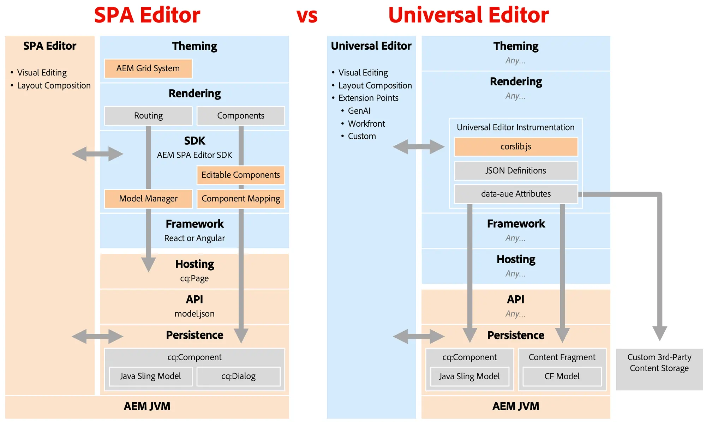

# Abandon de l’éditeur de SPA {#spa-editor-deprecation}

Bien que l’éditeur de SPA continue d’être pris en charge par Adobe, découvrez ce que son abandon signifie pour votre projet et les options dont vous disposez pour vos futurs projets.

## Résumé {#summary}

Adobe a abandonné l’éditeur de SPA avec la [version 6.5.23 d’AEM 6.5](/help/release-notes/release-notes.md#spa-editor), ce qui signifie qu’aucune autre amélioration ou mise à jour ne sera apportée à ses SDK. Adobe vous recommande d’utiliser l’[éditeur universel](/help/sites-developing/universal-editor/introduction.md) pour tout nouveau projet découplé afin de tirer parti des dernières innovations d’AEM.

## Détails de l’abandon {#details}

L’abandon de l’éditeur de SPA **ne signifie pas qu’il va être immédiatement supprimé**. Si vous possédez des implémentations existantes de celui-ci, **vous pouvez continuer à l’utiliser tant que vous en avez besoin.** Toutefois, gardez à l’esprit les implications suivantes de son abandon.

* À l’avenir, Adobe ne traitera que les problèmes de types P1 et P2 et les vulnérabilités de sécurité.
* Aucun autre développement, amélioration ou mise à jour ne seront apportés à ses SDK.

L’abandon signifie qu’aucune nouvelle fonctionnalité ne sera ajoutée aux SDK suivants.

* [Archétype de projet AEM](https://github.com/adobe/aem-project-archetype/)
* [AEM SPA Project Core](https://github.com/adobe/aem-spa-project-core)
* [AEM SPA Page Model Manager](https://github.com/adobe/aem-spa-page-model-manager)
* [AEM SPA Component Mapping](https://github.com/adobe/aem-spa-component-mapping)
* [Composants React modifiables de SPA d’AEM](https://github.com/adobe/aem-react-editable-components)
   * [Composants principaux AEM React](https://github.com/adobe/aem-react-core-wcm-components)
   * [Base des composants principaux AEM React](https://github.com/adobe/aem-react-core-wcm-components-base)
   * [SPA des composants principaux AEM React](https://github.com/adobe/aem-react-core-wcm-components-spa)
   * [Exemples de composants principaux AEM React](https://github.com/adobe/aem-react-core-wcm-components-examples)
* [AEM SPA Angular Editable Components](https://github.com/adobe/aem-angular-editable-components)
   * [Composants principaux AEM Angular](https://github.com/adobe/aem-angular-core-wcm-components)
   * [Base des composants principaux AEM Angular](https://github.com/adobe/aem-angular-core-wcm-components-base)
   * [SPA des composants principaux AEM Angular](https://github.com/adobe/aem-angular-core-wcm-components-spa)
   * [Exemples de composants principaux AEM Angular](https://github.com/adobe/aem-angular-core-wcm-components-examples)
* [AEM SPA Vue Editable Components](https://github.com/mavicellc/aem-vue-editable-components)

## Options de remplacement de l’éditeur de SPA {#alternatives}

L’option de remplacement la plus appropriée pour l’éditeur de SPA dépend de vos besoins pour vos projets.

* **[L’éditeur universel](/help/sites-developing/universal-editor/introduction.md)** constitue le meilleur choix de remplacement direct de l’éditeur de SPA.
   * L’éditeur universel est également un éditeur visuel et a été conçu spécifiquement pour les implémentations découplées, incorporant toute l’expérience d’Adobe à partir de l’éditeur de SPA.
   * L’éditeur universel a également été [publié pour AEM as a Cloud Service](https://experienceleague.adobe.com/fr/docs/experience-manager-cloud-service/content/implementing/developing/universal-editor/introduction) et prend donc en charge les cas d’utilisation AMS et On-Prem en plus de Cloud Services.
* **[L’éditeur de fragment de contenu](/help/sites-developing/universal-editor/introduction.md)** constitue une alternative pour celles et ceux qui préfèrent un éditeur basé sur des formulaires.
   * L’éditeur de fragment de contenu est plus adapté lorsque votre contenu est structuré sous forme de fragments de contenu plutôt que de pages.

Un contenu structuré avec des fragments de contenu n’exclut pas d’utiliser l’éditeur universel comme éditeur visuel, et les deux éditeurs peuvent être utilisés ensemble.

## Migrer vers l’éditeur universel {#migrate-ue}

L’éditeur universel offre de nombreux avantages, c’est pourquoi migrer vers celui-ci constitue une solution idéale pour de nouveaux projets.

* **Modification visuelle :** comme pour l’éditeur de SPA, les auteurs et les autrices peuvent modifier le contenu directement dans la prévisualisation et voir instantanément comment leurs modifications affectent l’expérience des visiteurs.
* **Préparation à l’avenir :** la feuille de route d’AEM donne la priorité à l’éditeur universel en tant qu’éditeur visuel. Son adoption garantit l’accès aux dernières innovations et améliorations.
* **Intégration plus simple :** aucun SDK spécifique à AEM n’est nécessaire pour utiliser l’éditeur universel, ce qui réduit le verrouillage de tech stack.
* **Utilisez votre propre application :** l’éditeur universel prend en charge n’importe quelle structure ou architecture web, ce qui permet l’adoption sans nécessiter de refactorisation complexe.
* **Extensibilité :** l’éditeur universel bénéficie d’un [framework d’extension robuste](https://experienceleague.adobe.com/fr/docs/experience-manager-cloud-service/content/implementing/developing/universal-editor/extending), qui inclut des intégrations à l’IA générative, Workfront, etc.

Il n’existe pas de chemin de migration direct de l’éditeur de SPA vers l’éditeur universel. Cela est dû à des différences fondamentales entre les deux technologies.

* L’éditeur universel ne réintègre pas de fonctionnalités telles que l’éditeur de modèles, le système de style ou la grille réactive.
   * Ces cas d’utilisation peuvent désormais être gérés plus efficacement avec des feuilles CSS et JS front-end allégées dans des projets Edge Delivery Services ou découplés.
* Étant donné que l’éditeur universel est un éditeur en tant que service, il n’autorise pas les personnes en charge de l’implémentation à injecter des éléments CSS ou JS dans les boîtes de dialogue des composants.
   * Cela permet d’éviter une conversion automatique des boîtes de dialogue de composants à partir de l’éditeur de page.
   * Cela concerne de nombreux domaines relatifs aux boîtes de dialogue, tels que les widgets personnalisés, la validation des champs, les règles d’affichage/de masquage et les personnalisations basées sur des modèles.

Compte tenu de ces différences techniques, Adobe recommande de :

* Conserver les sites existants avec l’éditeur de SPA tels quels, étant donné que la prise en charge se poursuit.
* Adopter l’éditeur universel pour tous les nouveaux développements, y compris les nouveaux sites, sections ou pages.

Garder à l’esprit que même s’il n’existe pas d’implémentation directe de certaines fonctionnalités de l’éditeur de SPA dans l’éditeur universel, il existe cependant de nouvelles façons de résoudre les mêmes problèmes en exploitant la nouvelle flexibilité de l’éditeur universel.

## Comparaison entre l’éditeur de SPA et l’éditeur universel {#spa-vs-ue}

L’éditeur universel offre beaucoup plus de liberté aux personnes chargées de l’implémentation des applications web, comme illustré dans ce diagramme.

|  | Éditeur de SPA | Éditeur universel |
|---|---|---|
| **Thème** | L’application doit implémenter la disposition avec la grille CSS d’AEM. | L’application peut utiliser n’importe quelle technique CSS moderne pour la disposition. |
| **Rendu** | L’application doit suivre la structure de routage de l’éditeur de SPA. | L’application peut être implémentée librement, sans règles ni modèles imposés à suivre. |
| **SDK** | L’implémentation doit strictement intégrer le SDK. | Au niveau de la création, l’application charge uniquement `corlib.js` et transmet les instructions à l’éditeur universel via des annotations HTML. |
| **Framework** | L’application doit utiliser une version prise en charge de React ou d’Angular. | L’application peut utiliser n’importe quel framework ou architecture. |
| **Hébergement** | L’application doit être hébergée sur un domaine AEM. | L’application peut être entièrement découplée et hébergée n’importe où. |
| **API** | L’application doit récupérer le contenu à partir de l’API `model.json`. | L’application peut utiliser n’importe quelle API, y compris des API personnalisées. |
| **Persistance** | L’éditeur de SPA prend uniquement en charge le contenu de page pour la modification visuelle. | L’éditeur universel prend en charge la modification visuelle des pages et des fragments de contenu de manière native. |
|  |  | L’éditeur universel peut être étendu pour modifier du contenu externe avec les mêmes fonctionnalités visuelles. |
|  | Les développeurs et les développeuses doivent déployer des modèles et des `cq:Dialog` Sling dans AEM. | Les développeurs et les développeuses n’ont besoin que de peu, voire d’aucune expérience avec AEM et n’ont pas besoin d’écrire de code Java. |
