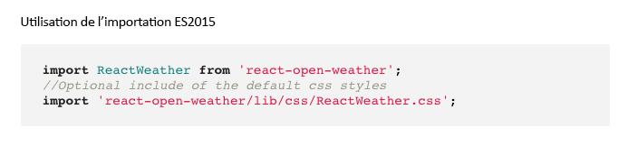
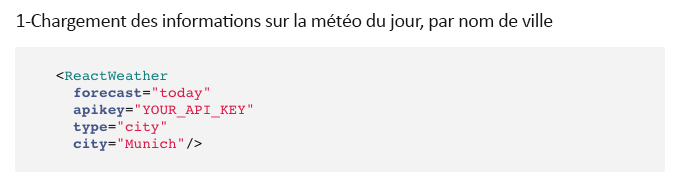

# Implémentation d’un composant de réaction pour SPA{#implementing-a-react-component-for-spa}

Les applications sur une seule page (SPA) peuvent améliorer considérablement l’expérience des utilisateurs de sites web. Le souhait des développeurs est de pouvoir créer des sites avec des structures SPA. Les auteurs, pour leur part, souhaitent modifier facilement du contenu dans AEM pour un site conçu à l’aide de telles structures.

La fonction de création d’application d’une seule page constitue une solution complète pour la prise en charge de ce type d’application dans AEM. Cet article présente un exemple d&#39;adaptation d&#39;un composant de réaction simple et existant pour travailler avec AEM SPA Editor.

>[!NOTE]
>
>L’éditeur SPA est la solution recommandée pour les projets qui nécessitent un rendu côté client SPA structure (par exemple, Réagir ou Angulaire).

## Présentation {#introduction}

Grâce au contrat simple et léger qui est requis par l&#39;AEM et établi entre le SPA et le rédacteur en chef de la SPA, prendre une application Javascript existante et l&#39;adapter pour l&#39;utiliser avec un  en  est une chose simple.

Cet article illustre l&#39;exemple de la composante météorologique sur l&#39;SPA d&#39;échantillon de Journal We.Retail.

Vous devez connaître la structure [d&#39;une application SPA pour AEM](/help/sites-developing/spa-getting-started-react.md) avant de lire cet article.

>[!CAUTION]
>Ce document utilise l&#39;[application de Journal We.Retail](https://github.com/Adobe-Marketing-Cloud/aem-sample-we-retail-journal) à des fins de démonstration uniquement. Ce dernier ne doit pas être utilisé dans le cadre d’un projet.
>
>Tout projet AEM doit exploiter l’[archétype de projet AEM](https://docs.adobe.com/content/help/fr-FR/experience-manager-core-components/using/developing/archetype/overview.html), qui prend en charge les projets SPA à l’aide de React ou d’Angular et exploite le SDK SPA.

## Composant météorologique {#the-weather-component}

Le composant météorologique se trouve dans le coin supérieur gauche de l&#39;application de Journal We.Retail. Il affiche la météo actuelle d’un emplacement défini, extrayant dynamiquement les données météorologiques.

### Utilisation du widget météorologique {#using-the-weather-widget}


Lors de la création de contenu du SPA dans l’éditeur de SPA, le composant météorologique s’affiche sous la forme de tout autre composant AEM, avec une barre d’outils complète, et il est modifiable.


La ville peut être mise à jour dans une boîte de dialogue comme tout autre composant AEM.


Le changement est persistant et le composant se met automatiquement à jour avec les nouvelles données météorologiques.


### Mise en oeuvre des composants météorologiques {#weather-component-implementation}

Le composant météorologique est en fait basé sur un composant React disponible au public, appelé [React Open Weather](https://www.npmjs.com/package/react-open-weather), qui a été adapté pour fonctionner comme un composant dans l&#39;application d&#39;exemple SPA de Journal We.Retail.

Voici quelques extraits de la documentation du MNP sur l&#39;utilisation du composant Réagir aux intempéries.

 

Vérification du code du composant météorologique personnalisé ( `Weather.js`) dans l&#39;application de Journal We.Retail :

* **Ligne 16** : Le widget Réagir au temps ouvert est chargé selon les besoins.
* **Ligne 46** : La  `MapTo` fonction associe ce composant Réagir à un composant AEM correspondant afin qu’il puisse être modifié dans SPA Editor.

* **Lignes 22 à 29** : La variable  `EditConfig` est définie, en vérifiant si la ville a été renseignée et en définissant la valeur si elle est vide.

* **Lignes 31 à 44** : Le composant Météo étend la  `Component` classe et fournit les données requises telles que définies dans la documentation sur l&#39;utilisation du MNP pour le composant Réagir à la météo ouverte et effectue le rendu du composant.

```javascript
/*~~~~~~~~~~~~~~~~~~~~~~~~~~~~~~~~~~~~~~~~~~~~~~~~~~~~~~~~~~~~~~~~~~~~~~~~~~~~~~
 ~ Copyright 2018 Adobe Systems Incorporated
 ~
 ~ Licensed under the Apache License, Version 2.0 (the "License");
 ~ you may not use this file except in compliance with the License.
 ~ You may obtain a copy of the License at
 ~
 ~     https://www.apache.org/licenses/LICENSE-2.0
 ~
 ~ Unless required by applicable law or agreed to in writing, software
 ~ distributed under the License is distributed on an "AS IS" BASIS,
 ~ WITHOUT WARRANTIES OR CONDITIONS OF ANY KIND, either express or implied.
 ~ See the License for the specific language governing permissions and
 ~ limitations under the License.
 ~~~~~~~~~~~~~~~~~~~~~~~~~~~~~~~~~~~~~~~~~~~~~~~~~~~~~~~~~~~~~~~~~~~~~~~~~~~~~*/
import React, {Component} from 'react';
import ReactWeather from 'react-open-weather';
import {MapTo} from '@adobe/aem-react-editable-components';

require('./Weather.css');

const WeatherEditConfig = {

    emptyLabel: 'Weather',

    isEmpty: function() {
        return !this.props || !this.props.cq_model || !this.props.cq_model.city || this.props.cq_model.city.trim().length < 1;
    }
};

class Weather extends Component {

    render() {
        let apiKey = "12345678901234567890";
        let city;

        if (this.props.cq_model) {
            city = this.props.cq_model.city;
            return <ReactWeather key={'react-weather' + Date.now()} forecast="today" apikey={apiKey} type="city" city={city} />
        }

        return null;
    }
}

MapTo('we-retail-journal/global/components/weather')(Weather, WeatherEditConfig);
```

Bien qu&#39;un composant principal doive déjà exister, le développeur frontal peut exploiter le composant Réagir à la météo ouverte dans le Journal We.Retail SPA avec très peu de codage.

## Étape suivante {#next-step}

Pour plus d&#39;informations sur le développement des SPA pour AEM, consultez l&#39;article [Développer des SPA pour l&#39;](/help/sites-developing/spa-architecture.md).
