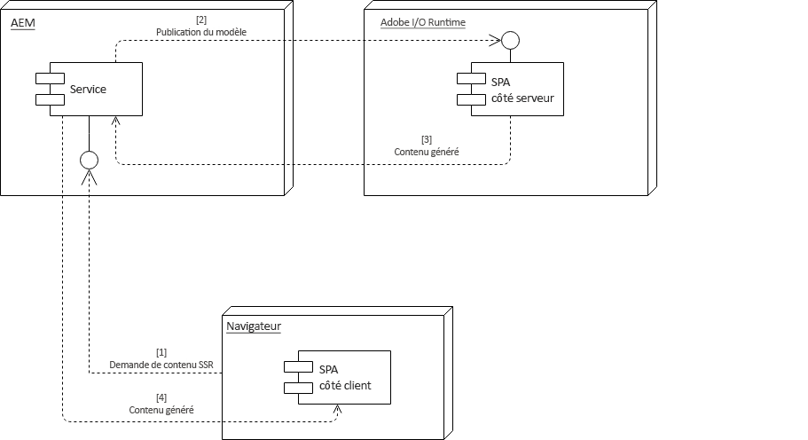

# SPA et rendu côté serveur {#spa-and-server-side-rendering}

>[!NOTE]
>
>L’éditeur SPA est la solution recommandée pour les projets qui nécessitent SPA rendu côté client basé sur la structure (par ex. Réaction ou Angular).

>[!NOTE]
>
>AEM version 6.5.1.0 ou ultérieure est requise pour utiliser les fonctions de rendu SPA côté serveur, comme décrit dans ce document.

## Présentation {#overview}

Les applications sur une seule page (SPA) peuvent offrir à l’utilisateur une expérience riche et dynamique qui réagit et se comporte de manière familière, souvent tout simplement comme une application native. [À cette fin, le client doit charger le contenu à l’avance, puis se charger de la lourde tâche consistant à gérer l’interaction utilisateur](/help/sites-developing/spa-walkthrough.md#how-does-a-spa-work), réduisant ainsi le volume de communication nécessaire entre le client et le serveur, ce qui rend l’application plus réactive.

Toutefois, cela peut entraîner des temps de chargement initiaux plus longs, en particulier si la SPA est volumineuse et riche en contenu. Pour optimiser les temps de chargement, une partie du contenu peut être rendue côté serveur. L’utilisation du rendu côté serveur (SSR) peut accélérer le chargement initial de la page, puis transmettre plus de rendu au client.

## Quand utiliser le rendu côté serveur {#when-to-use-ssr}

Le rendu côté serveur n’est pas requis pour tous les projets. Bien que AEM appuie pleinement la stratégie SSR JS pour SPA, l&#39;Adobe ne recommande pas de la mettre en oeuvre systématiquement pour chaque projet.

Lorsque vous décidez de mettre en œuvre le rendu côté serveur, vous devez d’abord estimer la complexité, les efforts et les coûts supplémentaires que ce rendu représente de manière réaliste pour le projet, y compris la maintenance à long terme. Une architecture SSR ne doit être choisie que lorsque la valeur ajoutée dépasse clairement les coûts estimés.

Le rendu côté serveur fournit habituellement une certaine valeur lorsque la réponse à l’une ou l’autre des questions suivantes est un « oui » clair :

* **SEO :** est-il toujours nécessaire d’utiliser le rendu côté serveur pour que votre site soit correctement indexé par les moteurs de recherche qui génèrent du trafic ? Gardez à l’esprit que les principaux robots de moteur de recherche évaluent désormais JS.
* **Vitesse de la page :** le rendu côté serveur améliore-t-il la vitesse de façon mesurable dans les environnements réels et ajoute-t-il à l’expérience globale de l’utilisateur ?

Adobe ne recommande la mise en œuvre du rendu côté serveur que si au moins l’une de ces deux questions reçoit une réponse « oui » claire pour votre projet. Les sections suivantes décrivent comment utiliser Adobe I/O Runtime.

## Adobe I/O Runtime {#adobe-i-o-runtime}

Si vous [êtes certain que votre projet nécessite la mise en œuvre du rendu côté serveur](/help/sites-developing/spa-ssr.md#when-to-use-ssr), la solution recommandée par Adobe est d’utiliser Adobe I/O Runtime.

Pour plus d’informations sur Adobe I/O Runtime, voir

* [https://www.adobe.io/apis/experienceplatform/runtime.html](https://www.adobe.io/apis/experienceplatform/runtime.html) – pour un aperçu du service
* [https://www.adobe.io/apis/experienceplatform/runtime/docs.html](https://www.adobe.io/apis/experienceplatform/runtime/docs.html) – pour obtenir une documentation détaillée sur la plateforme

Les sections suivantes décrivent comment Adobe I/O Runtime peut être utilisé afin d’implémenter la technologie du rendu côté serveur pour votre SPA dans deux modèles différents :

* [Flux de communication piloté par AEM](/help/sites-developing/spa-ssr.md#aem-driven-communication-flow)
* [Flux de communication piloté par Adobe I/O Runtime](/help/sites-developing/spa-ssr.md#adobe-i-o-runtime-driven-communication-flow)

>[!NOTE]
>
>Adobe recommande une instance Adobe I/O Runtime distincte pour chaque environnement AEM (création, publication, évaluation, etc.).

## Configuration du moteur de rendu distant {#remote-renderer-configuration}

AEM doit savoir à quel emplacement le contenu rendu distant peut être récupéré. Quel que soit [le modèle que vous choisissiez de mettre en œuvre pour le rendu côté serveur,](#adobe-i-o-runtime) vous devrez indiquer à AEM comment accéder à ce service de rendu distant.

Cela s’effectue via le **service RemoteContentRenderer – Configuration d’usine OSGi**. Recherchez la chaîne « RemoteContentRenderer » dans la console de configuration de la console web à `http://<host>:<port>/system/console/configMgr`.


Les champs suivants sont disponibles pour la configuration :

* **Modèle de chemin d’accès au contenu** : expression régulière afin de faire correspondre une partie du contenu, si nécessaire
* **URL**  du point de terminaison distant - URL du point de terminaison responsable de la génération du contenu
   * Utilisez le protocole HTTPS sécurisé si ce point d’entrée ne figure pas sur le réseau local.
* **En-têtes de requête supplémentaires** : en-têtes supplémentaires à ajouter à la requête envoyée au point d’entrée distant
   * Modèle : `key=value`
* **Délai d’expiration de la requête** : délai d’expiration de la requête d’hôte distant en millisecondes

>[!NOTE]
>
>Que vous choisissiez de mettre en œuvre le [flux de communication piloté par AEM](#aem-driven-communication-flow) ou le [flux de communication piloté par Adobe I/O Runtime](#adobe-i-o-runtime-driven-communication-flow), vous devez définir une configuration de moteur de rendu de contenu distant.
>
>Cette configuration doit également être définie si vous choisissez [d&#39;utiliser un serveur Node.js personnalisé.](#using-node-js)

>[!NOTE]
>
>Cette configuration exploite le [moteur de rendu de contenu distant](#remote-content-renderer), qui offre des options d’extension et de personnalisation supplémentaires.

## Flux de communication piloté par AEM {#aem-driven-communication-flow}

Avec le rendu côté serveur, le [workflow d’interaction des composants](/help/sites-developing/spa-overview.md#workflow) des SPA d’AEM inclut une phase au cours de laquelle le contenu initial de l’application est généré dans Adobe I/O Runtime.

1. Le navigateur demande le contenu du rendu côté serveur à AEM.

1. AEM publie le modèle dans Adobe I/O Runtime.

1. Adobe I/O Runtime renvoie le contenu généré.

1. AEM traite le code HTML renvoyé par Adobe I/O Runtime via le modèle HTL du composant de page de serveur principal.



## Flux de communication piloté par Adobe I/O Runtime {#adobe-i-o-runtime-driven-communication-flow}

La section précédente décrit l’implémentation standard et recommandée du rendu côté serveur dans le cadre des SPA dans AEM, AEM se chargeant du démarrage et du traitement du contenu.

Une autre solution consiste à mettre en œuvre le rendu côté serveur de sorte qu’Adobe I/O Runtime soit responsable du démarrage, ce qui inverse le flux de communication.

Les deux modèles sont valides et pris en charge par AEM. Toutefois, il faut tenir compte des avantages et des inconvénients de chaque modèle avant de mettre en œuvre un modèle particulier.

<table>
 <tbody>
  <tr>
   <th><strong>Démarrage</strong></th>
   <th><strong>Avantages</strong></th>
   <th><strong>Inconvénients</strong></th>
  </tr>
  <tr>
   <th><strong>Via AEM</strong><br /> </th>
   <td>
    <ul>
     <li>AEM gère les bibliothèques d’injection si nécessaire.</li>
     <li>Les ressources ne doivent être maintenues que dans AEM.<br /> </li>
    </ul> </td>
   <td>
    <ul>
     <li>Solution pouvant être peu connue des développeurs de SPA<br /> </li>
    </ul> </td>
  </tr>
  <tr>
   <th><strong>Via Adobe I/O Runtime<br /> </strong></th>
   <td>
    <ul>
     <li>Solution mieux connue des développeurs SPA<br /> </li>
    </ul> </td>
   <td>
    <ul>
     <li>Les ressources clientlib requises par l’application, telles que CSS et JavaScript, doivent être mises à disposition par le développeur AEM via la propriété <code><a href="/help/sites-developing/clientlibs.md#locating-a-client-library-folder-and-using-the-proxy-client-libraries-servlet">allowProxy</a></code>.<br /> </li>
     <li>Les ressources doivent être synchronisées entre AEM et Adobe I/O Runtime.<br /> </li>
     <li>Afin de permettre de créer la SPA, un serveur proxy pour Adobe I/O Runtime peut être nécessaire.</li>
    </ul> </td>
  </tr>
 </tbody>
</table>

## Planification du rendu côté serveur {#planning-for-ssr}

En règle générale, seule une partie d’une application doit être rendue côté serveur. L’exemple courant réside dans le contenu allant s’afficher au-dessus du pli lors du chargement initial de la page rendue côté serveur. Cela permet de gagner du temps en diffusant vers le contenu déjà rendu du client. Lorsque l’utilisateur interagit avec la SPA, le contenu supplémentaire est rendu par le client.

Lorsque vous envisagez d’implémenter le rendu côté serveur pour votre SPA, vous devez établir pour quelles parties de l’application ce rendu sera nécessaire.

## Développement d’une SPA avec le rendu côté serveur {#developing-an-spa-using-ssr}

Les composants SPA peuvent être rendus par le client (dans le navigateur) ou côté serveur. Lorsqu’ils sont rendus côté serveur, les propriétés du navigateur telles que la taille de fenêtre et l’emplacement ne sont pas présentes. Par conséquent, les composants SPA doivent être isomorphes, sans présumer de l’emplacement où ils seront rendus.

Pour tirer parti du rendu côté serveur, vous devez déployer votre code dans AEM et dans Adobe I/O Runtime, qui est responsable du rendu côté serveur. Le code sera majoritairement identique, mais les tâches spécifiques au serveur différeront.

## Rendu côté serveur pour les SPA dans AEM {#ssr-for-spas-in-aem}

Le rendu côté serveur pour les SPA dans AEM nécessite Adobe I/O Runtime, qui est appelée pour le rendu côté serveur du contenu d’application. Dans le fichier HTL de l’application, une ressource d’Adobe I/O Runtime est appelée pour procéder au rendu du contenu.

Tout comme AEM prend en charge les frameworks SPA Angular et React clé en main, le rendu côté serveur est également pris en charge pour les applications Angular et React. Pour plus d’informations, consultez la documentation NPM relative aux deux frameworks.

* Réagir : [https://github.com/adobe/aem-sample-we-retail-journal/blob/master/react-app/DEVELOPMENT.md#enabling-the-server-side-rendering-using-the-aem-page-component](https://github.com/adobe/aem-sample-we-retail-journal/blob/master/react-app/DEVELOPMENT.md#enabling-the-server-side-rendering-using-the-aem-page-component)
* Angular : [https://github.com/adobe/aem-sample-we-retail-journal/blob/master/react-app/DEVELOPMENT.md#enabling-the-server-side-rendering-using-the-aem-page-component](https://github.com/adobe/aem-sample-we-retail-journal/blob/master/react-app/DEVELOPMENT.md#enabling-the-server-side-rendering-using-the-aem-page-component)

Pour un exemple simpliste, reportez-vous à l&#39;[application de Journal We.Retail](https://github.com/Adobe-Marketing-Cloud/aem-sample-we-retail-journal). Il rend l’intégralité du côté serveur d’applications. Bien qu&#39;il ne s&#39;agisse pas d&#39;un exemple concret, il illustre bien ce qui est nécessaire pour mettre en oeuvre la RSS.

>[!CAUTION]
>
>L&#39;application de Journal [We.Retail](https://github.com/Adobe-Marketing-Cloud/aem-sample-we-retail-journal) n&#39;est utilisée qu&#39;à des fins de démonstration et utilise donc Node.js comme exemple simple au lieu du Adobe I/O Runtime recommandé. Cet exemple ne doit être utilisé pour aucun travail de projet.

>[!NOTE]
>
>Un projet AEM doit tirer parti de l’[archétype de projet AEM](https://docs.adobe.com/content/help/fr-FR/experience-manager-core-components/using/developing/archetype/overview.html), qui prend en charge les projets SPA à l’aide de React ou d’Angular et tire parti du SDK SPA.

## Utilisation de Node.js {#using-node-js}

Adobe I/O Runtime est la solution recommandée pour la mise en oeuvre de la technologie SSR pour SPA en AEM.

Pour les instances d’AEM prédéfinie, il est également possible d’implémenter une SSR à l’aide d’une instance personnalisée de Node.js de la même manière que décrit ci-dessus. Bien que cet aspect soit pris en charge par l’Adobe, il n’est pas recommandé.

>[!NOTE]
>
>Node.js n’est pas pris en charge pour les instances d’AEM hébergées par Adobe.

>[!NOTE]
>
>Si SSR doit être implémenté via Node.js, l’Adobe recommande une instance distincte de Node.js pour chaque environnement AEM (auteur, publication, étape, etc.).

## Moteur de rendu de contenu distant {#remote-content-renderer}

La configuration du [moteur de rendu de contenu distant](#remote-content-renderer-configuration) requise pour utiliser le rendu côté serveur avec votre SPA dans AEM exploite un service de rendu plus généralisé qui peut être étendu et personnalisé en fonction de vos besoins.

### RemoteContentRenderingService {#remotecontentrenderingservice}

`RemoteContentRenderingService` est un service OSGi permettant de récupérer le contenu rendu sur un serveur distant, par exemple à partir d’Adobe I/O. Le contenu envoyé au serveur distant est basé sur le paramètre de requête transmis.

`RemoteContentRenderingService` peut être injecté par inversion de dépendance dans un modèle Sling personnalisé ou un servlet lorsque des manipulations de contenu supplémentaires sont requises.

Ce service est utilisé en interne par le servlet [RemoteContentRendererRequestHandlerServlet](#remotecontentrendererrequesthandlerservlet).

### RemoteContentRendererRequestHandlerServlet {#remotecontentrendererrequesthandlerservlet}

Le servlet `RemoteContentRendererRequestHandlerServlet` peut être utilisé pour définir la configuration de la requête par programmation. `DefaultRemoteContentRendererRequestHandlerImpl`, l’implémentation du gestionnaire de requêtes par défaut fournie, vous permet de créer plusieurs configurations OSGi afin de mapper un emplacement dans la structure de contenu à un point d’entrée distant.

Pour ajouter un gestionnaire de requêtes personnalisé, implémentez l’interface de `RemoteContentRendererRequestHandler`. Veillez à définir la propriété du composant `Constants.SERVICE_RANKING` sur un nombre entier supérieur à 100, qui correspond au classement du servlet `DefaultRemoteContentRendererRequestHandlerImpl`.

```
@Component(immediate = true,
        service = RemoteContentRendererRequestHandler.class,
        property={
            Constants.SERVICE_RANKING +":Integer=1000"
        })
public class CustomRemoteContentRendererRequestHandlerImpl implements RemoteContentRendererRequestHandler {}
```

### Établir la configuration OSGi du gestionnaire par défaut {#configure-default-handler}

La configuration du gestionnaire par défaut doit être établie comme décrit dans la section [Configuration du moteur de rendu de contenu distant](#remote-content-renderer-configuration).

### Utilisation du moteur de rendu de contenu distant {#usage}

Pour qu’un servlet récupère et renvoie du contenu pouvant être injecté dans la page :

1. Assurez-vous que votre serveur distant est accessible.
1. Ajoutez l’un des fragments de code suivants au modèle HTML d’un composant AEM.
1. Vous pouvez éventuellement créer ou modifier les configurations OSGi.
1. Parcourir le contenu de votre site

En général, le modèle HTML d’un composant de page est le principal destinataire d’une telle fonctionnalité.

```
<sly data-sly-resource="${resource @ resourceType='cq/remote/content/renderer/request/handler'}" />
```

### Conditions requises {#requirements}

Les servlets tirent parti de l’exportateur de modèle Sling pour sérialiser les données du composant. Par défaut, les composants `com.adobe.cq.export.json.ContainerExporter` et `com.adobe.cq.export.json.ComponentExporter` sont pris en charge en tant qu’adaptateurs de modèle Sling. Si nécessaire, vous pouvez ajouter des classes auxquelles la requête doit être adaptée à l’aide du composant `RemoteContentRendererServlet` et en mettant le composant `RemoteContentRendererRequestHandler#getSlingModelAdapterClasses` en œuvre. Les classes supplémentaires doivent étendre le composant `ComponentExporter`.
