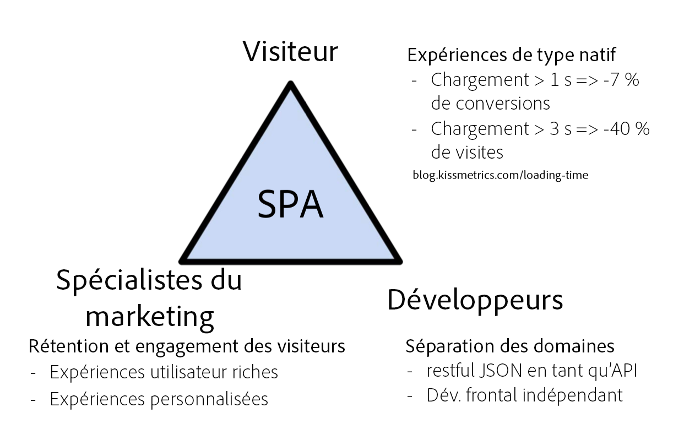
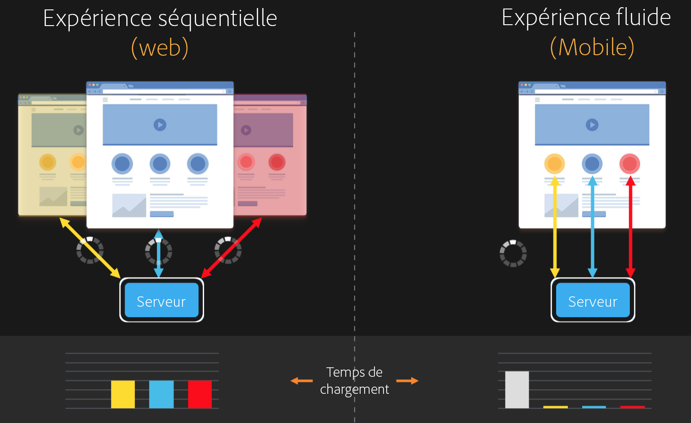
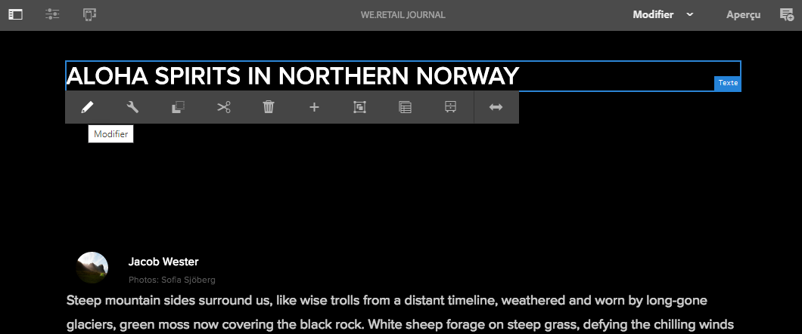
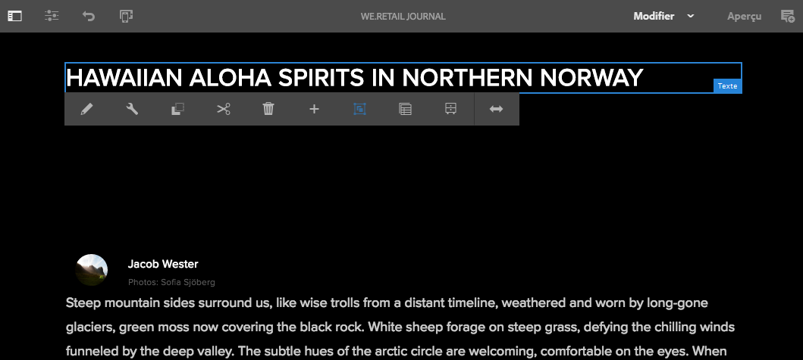
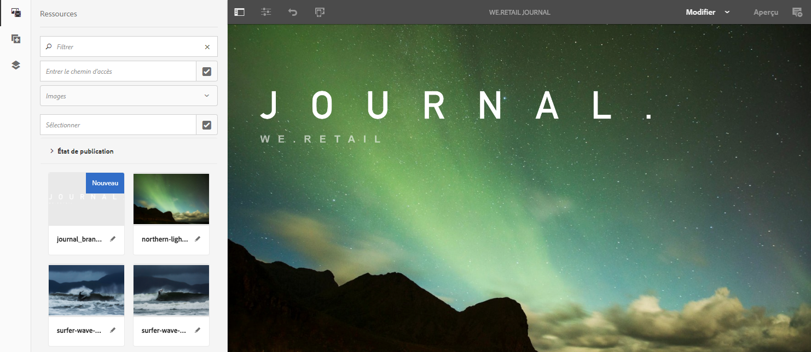
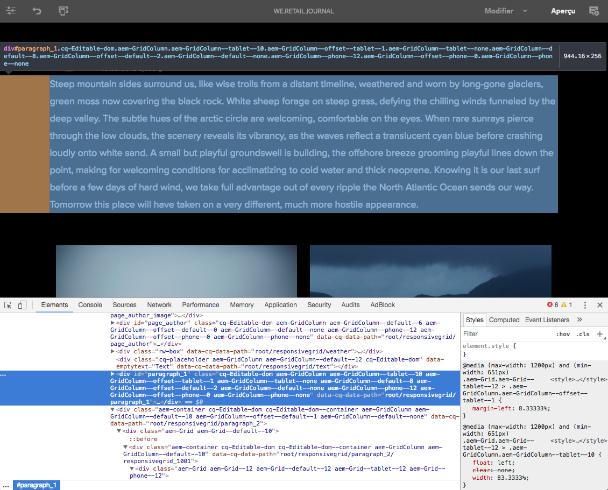

# Introduction et présentation des applications sur une seule page (SPA) {#spa-introduction-and-walkthrough}

Les applications sur une seule page (SPA) peuvent améliorer considérablement l’expérience des utilisateurs de sites web. Le souhait des développeurs est de pouvoir créer des sites avec des structures SPA. Les auteurs, pour leur part, souhaitent modifier facilement du contenu dans AEM pour un site conçu à l’aide de telles structures.

L’éditeur de SPA constitue une solution complète pour la prise en charge des SPA dans AEM. Cet article décrit l’utilisation d’une SPA élémentaire à des fins de création et indique comment cette utilisation est liée à l’éditeur de SPA AEM sous-jacent.

>[!NOTE]
>
>L’éditeur SPA est la solution recommandée pour les projets qui nécessitent un rendu côté client SPA structure (par exemple, Réagir ou Angulaire).

## Présentation {#introduction}

### Objectif de l’article {#article-objective}

Cet article présente les concepts de base des SPA, puis passe en revue l’éditeur de SPA en utilisant une SPA simple pour démontrer les fonctions de base de modification de contenu. Il détaille ensuite la construction de la page et indique comment la SPA est liée à l’éditeur de SPA AEM et interagit avec lui.

L’objectif de cette introduction et de cette présentation est de montrer aux développeurs AEM pourquoi les SPA sont pertinentes, comment elles fonctionnent, comment elles sont gérées par l’éditeur de SPA AEM et en quoi elles diffèrent d’une application AEM standard.

La procédure pas à pas est basée sur la fonctionnalité AEM standard et l&#39;exemple d&#39;application de Journal We.Retail. Les exigences suivantes doivent être respectées :

* [AEM version 6.4 avec Service Pack 2 ou plus récent](/help/release-notes/sp-release-notes.md)
* [Installez l&#39;exemple d&#39;application de Journal We.Retail disponible sur GitHub ici.](https://github.com/Adobe-Marketing-Cloud/aem-sample-we-retail-journal)

>[!CAUTION]
>
>Ce document utilise l&#39;[application de Journal We.Retail](https://github.com/Adobe-Marketing-Cloud/aem-sample-we-retail-journal) à des fins de démonstration uniquement. Ce dernier ne doit pas être utilisé dans le cadre d’un projet.
>
>Tout projet AEM doit exploiter l’[archétype de projet AEM](https://docs.adobe.com/content/help/fr-FR/experience-manager-core-components/using/developing/archetype/overview.html), qui prend en charge les projets SPA à l’aide de React ou d’Angular et exploite le SDK SPA.

### Qu’est-ce qu’une SPA ? {#what-is-a-spa}

Une application sur une seule page (SPA) diffère d’une page conventionnelle en cela qu’elle est rendue côté client et qu’elle est principalement pilotée par JavaScript, en utilisant les appels Ajax pour charger les données et mettre la page à jour dynamiquement. La plupart ou la totalité du contenu est récupérée une fois au chargement d’une seule page avec des ressources supplémentaires chargées de manière asynchrone, selon les besoins, en fonction de l’interaction de l’utilisateur avec la page.

Cela limite la nécessité d’actualiser la page et offre à l’utilisateur une expérience harmonieuse, rapide et rappelant davantage l’expérience d’une application native.

L’éditeur de SPA AEM permet aux développeurs front-end de créer des SPA qui peuvent être intégrées à un site AEM, ce qui permet aux créateurs de contenu de modifier le contenu SPA aussi facilement qu’un autre contenu AEM.

### Pourquoi une SPA ? {#why-a-spa}

Plus rapide, fluide et ressemblant davantage à une application native, une SPA, de par son fonctionnement, offre une expérience très attrayante, non seulement pour le visiteur de la page web, mais aussi pour les spécialistes du marketing et les développeurs.



**Visiteurs**

* Lorsqu’ils interagissent avec du contenu, les visiteurs souhaitent des expériences similaires à l’expérience d’une application native.
* Il existe des données claires indiquant que plus une page est rapide, plus une conversion est probable.

**Spécialistes du marketing**

* Les spécialistes du marketing veulent offrir des expériences riches et similaires à l’expérience d’une application native pour inciter les visiteurs à interagir pleinement avec le contenu.
* La personnalisation peut rendre ces expériences encore plus attrayantes.

**Développeurs**

* Les développeurs veulent une séparation nette entre les aspects liés au contenu et à la présentation.
* Une séparation nette rend le système plus extensible tout en autorisant un développement front-end indépendant.

### Comment fonctionne une SPA ? {#how-does-a-spa-work}

L&#39;idée Principale derrière une SPA est que les appels et la dépendance sur un serveur sont réduits afin de minimiser les retards causés par les appels serveur de sorte que le SPA s&#39;approche de la réactivité d&#39;une application native.

Sur une page web séquentielle traditionnelle, seules les données nécessaires à la page immédiate sont chargées. Cela signifie que lorsque le visiteur passe à une autre page, le serveur est appelé pour que les ressources supplémentaires soient mises à disposition. Des appels supplémentaires peuvent s’avérer nécessaires lorsque le visiteur interagit avec les éléments de la page. Ces appels multiples peuvent donner une impression de retard ou de lenteur, car la page doit rattraper les requêtes du visiteur.



Pour une expérience plus fluide, qui approche ce qu’un visiteur attend des applications mobiles natives, un SPA charge toutes les données nécessaires pour le visiteur au premier chargement. Bien que cette opération puisse nécessiter au début un peu plus de temps, elle élimine ensuite la nécessité d’appels supplémentaires au serveur.

En effectuant le rendu côté client, l’élément de page réagit plus rapidement et les interactions avec la page par le visiteur sont immédiates. Toute donnée supplémentaire qui peut être nécessaire est appelée de manière asynchrone afin d’optimiser la vitesse de la page.

>[!NOTE]
>
>Pour des détails techniques sur la façon dont SPA fonctionne en AEM, consultez l&#39;article [Prise en main de l&#39;SPA en ](/help/sites-developing/spa-getting-started-react.md).
>
>Pour un aperçu plus approfondi de la conception, de l&#39;architecture et du processus technique de SPA Editor, consultez l&#39;article [SPA Editor Overview](/help/sites-developing/spa-overview.md).

## Modification de contenu avec une SPA {#content-editing-experience-with-spa}

Lorsqu’un SPA est créé pour tirer parti de l’AEM Éditeur, l’auteur du contenu ne remarque aucune différence lors de la modification et de la création de contenu. Des fonctionnalités AEM communes sont disponibles et aucune modification du workflow du créateur n’est requise.

>[!NOTE]
>
>La procédure pas à pas est basée sur la fonctionnalité AEM standard et l&#39;exemple d&#39;application de Journal We.Retail. Les exigences suivantes doivent être respectées :
>
>* [AEM version 6.4 avec Service Pack 2](/help/release-notes/sp-release-notes.md)
>* [Installez l&#39;exemple d&#39;application de Journal We.Retail disponible sur GitHub ici.](https://github.com/Adobe-Marketing-Cloud/aem-sample-we-retail-journal)

>


1. Modifiez l&#39;application de Journal We.Retail dans AEM.

   `https://localhost:4502/editor.html/content/we-retail-journal/react.html`

   

1. Sélectionnez un composant d’en-tête et notez qu’une barre d’outils s’affiche comme pour tout autre composant. Sélectionnez **Modifier**.

   

1. Modifiez le contenu normalement dans AEM et notez que les modifications sont conservées.

   

   >[!NOTE]
   >Pour plus d’informations sur l’éditeur de texte en place et l’SPA, voir [SPA Editor Overview](spa-overview.md#requirements-limitations).

1. Utilisez l’explorateur de ressources pour faire glisser et déposer une nouvelle image dans un composant d’image.

   

1. La modification est conservée.

   

D’autres outils de création, tels que le glisser-déposer de composants supplémentaires sur la page, la réorganisation des composants et la modification de la mise en page, sont pris en charge comme dans toute application non SPA.

>[!NOTE]
>
>L’éditeur de SPA ne modifie pas le modèle objet de document (DOM) de l’application. La SPA elle-même est responsable du DOM.
>
>Pour découvrir le fonctionnement de cet aspect, passez à la section suivante de cet article, [Applications SPA et éditeur de SPA AEM](/help/sites-developing/spa-walkthrough.md#spa-apps-and-the-aem-spa-editor).

## Applications SPA et éditeur de SPA AEM {#spa-apps-and-the-aem-spa-editor}

L’expérience d’un SPA se comporte pour l’utilisateur final, puis l’inspection de la page SPA permet de mieux comprendre le fonctionnement d’une application SAP avec l’Éditeur de SPA dans l’.

### Utilisation d’une SPA {#using-an-spa-application}

1. Chargez l’application de Journal We.Retail sur le serveur de publication ou en utilisant l’option **Vue telle que Publiée** dans le menu **Informations sur la page** de l’éditeur de page.

   `/content/we-retail-journal/react.html`

   

   Notez la structure des pages, y compris la navigation vers les pages enfants, le widget météorologique et les articles.

1. Accédez à une page enfant à l’aide du menu et observez que la page se charge immédiatement sans qu’il faille procéder à une actualisation.

   

1. Ouvrez les outils de développement intégrés de votre navigateur et surveillez l’activité du réseau lorsque vous naviguez sur les pages enfants.

   

   Le trafic est très faible, car vous passez d’une page à l’autre dans l’application. La page n’est pas rechargée et seules les nouvelles images sont demandées.

   La SPA gère le contenu et le routage entièrement du côté client.

Aussi, si la page n’est pas rechargée lors de la navigation sur les pages enfants, comment est-elle chargée ?

La section suivante, [Chargement d&#39;une application SPA](/help/sites-developing/spa-walkthrough.md#loading-an-spa-application), approfondit la procédure de chargement du SPA et explique comment le contenu peut être chargé de façon synchrone et asynchrone.

### Chargement d’une SPA {#loading-an-spa-application}

1. Si ce n’est pas déjà fait, chargez l’application We.Retail Journal sur le serveur de publication ou à l’aide de l’option **Afficher comme publié(e)** du menu **Informations sur la page** de l’éditeur de page.

   `/content/we-retail-journal/react.html`

   

1. Utilisez l’outil intégré de votre navigateur pour afficher la source de la page.
1. Notez que le contenu de la source est extrêmement limité.

   ```
   <!DOCTYPE HTML>
   <html lang="en-CH">
       <head>
       <meta charset="UTF-8">
       <title>We.Retail Journal</title>
   
       <meta name="template" content="we-retail-react-template"/>
   
   <link rel="stylesheet" href="/etc.clientlibs/we-retail-journal/react/clientlibs/we-retail-journal-react.css" type="text/css">
   
   <link rel="stylesheet" href="/libs/wcm/foundation/components/page/responsive.css" type="text/css">
   
   </head>
       <body class="page basicpage">
   
   <div id="page"></div>
   
   <script type="text/javascript" src="/etc.clientlibs/we-retail-journal/react/clientlibs/we-retail-journal-react.js"></script>
   
       </body>
   </html>
   ```

   Le corps de la page ne renferme aucun contenu. Il est principalement composé de feuilles de style et d&#39;un appel à un script React, `we-retail-journal-react.js`.

   Ce script React est le Principal pilote de cette application et est responsable du rendu de tout le contenu.

1. Utilisez les outils intégrés de votre navigateur pour inspecter la page. Affichez le contenu du DOM entièrement chargé.

   

1. Accédez à l’onglet Réseau de l’Inspecteur et rechargez la page.

   Sans tenir compte des requêtes d’image, notez que les principales ressources chargées pour la page sont la page elle-même, le code CSS, le code JavaScript React, ses dépendances, ainsi que les données JSON de la page.

   

1. Chargez `react.model.json` dans un nouvel onglet.

   `/content/we-retail-journal/react.model.json`

   

   L’éditeur de SPA AEM exploite [AEM Content Services](/help/assets/content-fragments/content-fragments.md) pour diffuser l’intégralité du contenu de la page sous la forme d’un modèle JSON.

   En implémentant des interfaces spécifiques, les modèles Sling fournissent les informations nécessaires à la SPA. La diffusion des données JSON est déléguée vers le bas à chaque composant (de la page, au paragraphe, au composant, etc.).

   Chaque composant choisit ce qu’il expose et comment il est rendu (côté serveur avec HTL ou côté client avec React). Bien sûr, cet article se concentre sur le rendu côté client avec React.

1. Le modèle peut également regrouper les pages afin qu’elles soient chargées de manière synchrone, ce qui réduit le nombre de rechargements de page nécessaires.

   Dans l&#39;exemple du Journal We.Retail, les pages `home`, `blog` et `aboutus` sont chargées de manière synchrone, puisque les visiteurs visitent généralement toutes ces pages. Cependant, la page `weather` est chargée de manière asynchrone, les visiteurs étant moins susceptibles de la consulter.

   Ce comportement n’est pas obligatoire et est entièrement définissable.

   

1. Pour voir cette différence de comportement, rechargez la page  et effacez l’activité de réseau de l’Inspecteur. Accédez au blog et aux pages qui nous concernent dans le menu de la page et vérifiez qu&#39;aucune activité réseau n&#39;est signalée.

   Accédez à la page météo et voyez que `weather.model.json` est appelé de manière asynchrone.

   

### Interaction avec l’éditeur de SPA {#interaction-with-the-spa-editor}

En utilisant l&#39;exemple d&#39;application de Journal We.Retail, vous savez comment se comporte l&#39;application et comment elle est chargée lorsqu&#39;elle est publiée, en exploitant les services de contenu pour la diffusion de contenu JSON ainsi que le chargement asynchrone des ressources.

De plus, pour le créateur de contenu, la création de contenu à l’aide d’un éditeur de SPA est transparente dans AEM.

Dans la section suivante, nous allons examiner le contrat qui permet à l’éditeur de SPA de relier les composants de la SPA aux composants d’AEM et d’offrir cette expérience de modification transparente.

1. Chargez l&#39;application de Journal We.Retail dans l&#39;éditeur et passez en mode **Prévisualisation**.

   `https://localhost:4502/editor.html/content/we-retail-journal/react.html`

1. À l’aide des outils de développement intégrés de votre navigateur, inspectez le contenu de la page. À l’aide de l’outil de sélection, sélectionnez un composant modifiable sur la page et affichez le détail de l’élément.

   Notez que le composant possède un nouvel attribut de données `data-cq-data-path`.

   

   Par exemple :

   `data-cq-data-path="root/responsivegrid/paragraph_1`

   Ces chemins permettent de récupérer et d’associer l’objet de configuration de contexte de modification de chaque composant.

   Il s’agit du seul attribut de balisage nécessaire à l’éditeur pour reconnaître ce composant comme un composant modifiable dans la SPA. En fonction de cet attribut, l’éditeur de SPA détermine quelle configuration modifiable est associée au composant, de sorte que l’image, la barre d’outils correctes, etc., sont chargées.

   Certains noms de classe spécifiques sont également ajoutés en vue de marquer les espaces réservés, ainsi que pour la fonctionnalité de glisser-déposer des ressources.

   >[!NOTE]
   >
   >Il s’agit d’un changement de comportement des pages générées côté serveur dans AEM, où un élément `cq` est inséré pour chaque composant modifiable.
   >
   >
   >Cette approche dans SPA élimine la nécessité d’injecter des éléments personnalisés, en n’utilisant qu’un attribut de données supplémentaire, ce qui rend le balisage plus simple pour le développeur frontal.

## Étapes suivantes {#next-steps}

Maintenant que vous comprenez l’expérience de modification SPA dans AEM et savez comment une SPA est liée à l’éditeur de SPA, nous allons examiner de plus près la conception des SPA.

* [Prise en main des SPA dans ](/help/sites-developing/spa-getting-started-react.md) AEMmontre comment un SPA de base est créé pour fonctionner avec l’éditeur de SPA de base dans l’
* La section [Présentation de l’éditeur de SPA](/help/sites-developing/spa-overview.md) examine de plus près le modèle de communication entre AEM et la SPA.
* La section [Développement de SPA pour AEM](/help/sites-developing/spa-architecture.md) décrit comment impliquer les développeurs front-end dans le développement d’une SPA pour AEM et décrit de quelle manière les SPA interagissent avec l’architecture d’AEM.
