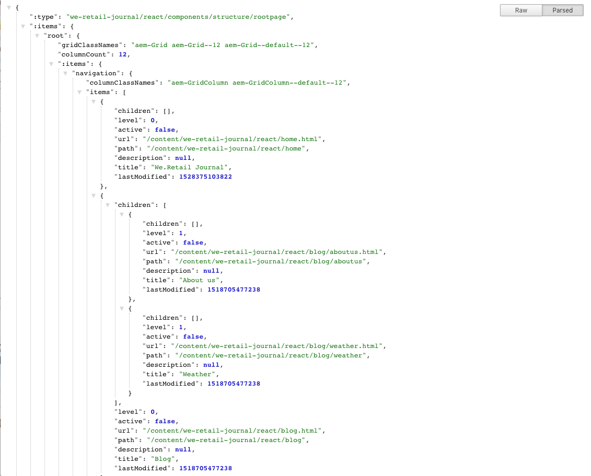

# Introduction et présentation des applications sur une seule page (SPA){#spa-introduction-and-walkthrough}

Les applications sur une seule page (SPA) peuvent améliorer considérablement l’expérience des utilisateurs de sites web. Le souhait des développeurs est de pouvoir créer des sites avec des structures SPA. Les auteurs, pour leur part, souhaitent modifier facilement du contenu dans AEM pour un site conçu à l’aide de telles structures.

L’éditeur de SPA constitue une solution complète pour la prise en charge des SPA dans AEM. Cet article décrit l’utilisation d’une SPA élémentaire à des fins de création et indique comment cette utilisation est liée à l’éditeur de SPA AEM sous-jacent.

>[!NOTE]
>
>L’éditeur de SPA est la solution recommandée pour les projets nécessitant un rendu côté client basé sur un framework de SPA (par exemple React ou Angular).

## Présentation {#introduction}

### Objectif de l’article {#article-objective}

Cet article présente les concepts de base des SPA, puis passe en revue l’éditeur de SPA en utilisant une SPA simple pour démontrer les fonctions de base de modification de contenu. Il détaille ensuite la construction de la page et indique comment la SPA est liée à l’éditeur de SPA AEM et interagit avec lui.

L’objectif de cette introduction et de cette présentation est de montrer aux développeurs AEM pourquoi les SPA sont pertinentes, comment elles fonctionnent, comment elles sont gérées par l’éditeur de SPA AEM et en quoi elles diffèrent d’une application AEM standard.

La présentation repose sur les fonctionnalités AEM standard et sur l’exemple d’application We.Retail Journal. Les exigences suivantes doivent être respectées :

* [AEM version 6.4 avec pack de services 2 ou version ultérieure](/help/release-notes/release-notes.md)
* [Installez l’exemple d’application We.Retail Journal disponible sur GitHub ici.](https://github.com/Adobe-Marketing-Cloud/aem-sample-we-retail-journal)

>[!CAUTION]
>
>Ce document n’utilise l’[exemple d’application Journal We.Retail](https://github.com/Adobe-Marketing-Cloud/aem-sample-we-retail-journal) qu’à des fins de démonstration. Ce dernier ne doit pas être utilisé dans le cadre d’un projet.
>
>Tout projet AEM doit exploiter l’[archétype de projet AEM](https://experienceleague.adobe.com/docs/experience-manager-core-components/using/developing/archetype/overview.html?lang=fr), qui prend en charge les projets SPA à l’aide de React ou d’Angular et utilise le SDK SPA.

### Qu’est-ce qu’une SPA ?  {#what-is-a-spa}

Une application sur une seule page (SPA) diffère d’une page conventionnelle en cela qu’elle est rendue côté client et qu’elle est principalement pilotée par JavaScript, en utilisant les appels Ajax pour charger les données et mettre la page à jour dynamiquement. La plupart ou la totalité du contenu est récupérée une fois au chargement d’une seule page avec des ressources supplémentaires chargées de manière asynchrone, selon les besoins, en fonction de l’interaction de l’utilisateur avec la page.

Cela limite la nécessité d’actualiser la page et offre à l’utilisateur une expérience harmonieuse, rapide et rappelant davantage l’expérience d’une application native.

L’éditeur de SPA AEM permet aux développeurs front-end de créer des SPA qui peuvent être intégrées à un site AEM, ce qui permet aux créateurs de contenu de modifier le contenu SPA aussi facilement qu’un autre contenu AEM.

### Pourquoi une SPA ?  {#why-a-spa}

Plus rapide, fluide et ressemblant davantage à une application native, une SPA, de par son fonctionnement, offre une expérience très attrayante, non seulement pour le visiteur de la page web, mais aussi pour les spécialistes du marketing et les développeurs.


**Visiteurs**

* Lorsqu’ils interagissent avec du contenu, les visiteurs souhaitent des expériences similaires à l’expérience d’une application native.
* Il existe des données claires indiquant que plus une page est rapide, plus une conversion est probable.

**Spécialistes du marketing**

* Les spécialistes du marketing veulent offrir des expériences riches et similaires à l’expérience d’une application native pour inciter les visiteurs à interagir pleinement avec le contenu.
* La personnalisation peut rendre ces expériences encore plus attrayantes.

**Équipe de développement**

* Les développeurs veulent une séparation nette entre les aspects liés au contenu et à la présentation.
* Une séparation nette rend le système plus extensible tout en autorisant un développement front-end indépendant.

### Comment fonctionne une SPA ?  {#how-does-a-spa-work}

L’idée principale sous-jacente à une SPA est que les appels à un serveur et la dépendance envers un serveur sont réduits afin de minimiser les retards liés aux appels du serveur, de sorte que la SPA s’approche de la réactivité d’une application native.

Sur une page web séquentielle traditionnelle, seules les données nécessaires à la page immédiate sont chargées. Cela signifie que lorsque le visiteur passe à une autre page, le serveur est appelé pour que les ressources supplémentaires soient mises à disposition. Des appels supplémentaires peuvent s’avérer nécessaires lorsque le visiteur interagit avec les éléments de la page. Ces appels multiples peuvent donner une impression de retard ou de lenteur, car la page doit rattraper les requêtes du visiteur.


Pour offrir une expérience plus fluide, qui s’approche de ce qu’un visiteur attend des applications mobiles natives, une SPA charge toutes les données nécessaires pour le visiteur au premier chargement. Bien que cette opération puisse nécessiter au début un peu plus de temps, elle élimine ensuite la nécessité d’appels supplémentaires au serveur.

Parce que le rendu est effectué côté client, les éléments de la page réagissent plus rapidement et les interactions du visiteur avec la page sont immédiates. Toutes les données supplémentaires qui peuvent être nécessaires sont appelées de manière asynchrone afin d’optimiser la vitesse de la page.

>[!NOTE]
>
>Pour plus d’informations sur le fonctionnement des SPA dans AEM, reportez-vous à l’article [Prise en main des SPA dans AEM](/help/sites-developing/spa-getting-started-react.md).
>
>Pour observer de plus près la conception, l’architecture et le workflow technique de l’éditeur de SPA, consultez l’article [Aperçu de l’éditeur de SPA](/help/sites-developing/spa-overview.md). 

## Expérience de modification de contenu avec une SPA {#content-editing-experience-with-spa}

Lorsqu’une SPA est créée pour exploiter l’éditeur de SPA d’AEM, le créateur de contenu ne remarque aucune différence lors de la modification et de la création de contenu. Des fonctionnalités AEM communes sont disponibles et aucune modification du workflow du créateur n’est requise.

>[!NOTE]
>
>La présentation repose sur les fonctionnalités AEM standard et sur l’exemple d’application We.Retail Journal. Les exigences suivantes doivent être respectées :
>
>* [AEM version 6.4 avec pack de services 2](/help/release-notes/release-notes.md)
>* [Installez l’exemple d’application We.Retail Journal disponible sur GitHub ici.](https://github.com/Adobe-Marketing-Cloud/aem-sample-we-retail-journal)
>


1. Modifiez l’application We.Retail Journal dans AEM.

   `https://localhost:4502/editor.html/content/we-retail-journal/react.html`

   

1. Sélectionnez un composant d’En-tête et notez qu’une barre d’outils s’affiche comme pour tout autre composant. Sélectionnez **Modifier**.

   

1. Modifiez le contenu comme d’habitude dans AEM et notez que les modifications sont conservées.

   

   >[!NOTE]
   >Consultez la section [Aperçu de l’éditeur de SPA](spa-overview.md#requirements-limitations) pour plus d’informations sur l’éditeur de texte et les SPA en place.

1. Utilisez l’explorateur de ressources pour faire glisser et déposer une nouvelle image dans un composant d’image.

   

1. La modification est conservée.

   

D’autres outils de création, tels que le glisser-déposer de composants supplémentaires sur la page, la réorganisation des composants et la modification de la mise en page, sont pris en charge comme dans toute application non SPA.

>[!NOTE]
>
>L’éditeur de SPA ne modifie pas le modèle objet de document (DOM) de l’application. La SPA elle-même est responsable du DOM.
>
>Pour découvrir le fonctionnement de cet aspect, passez à la section suivante de cet article, [Applications SPA et éditeur de SPA AEM](/help/sites-developing/spa-walkthrough.md#spa-apps-and-the-aem-spa-editor).

## Applications SPA et éditeur de SPA AEM {#spa-apps-and-the-aem-spa-editor}

Expérimenter le comportement d’une SPA pour l’utilisateur final puis inspecter la page SPA permet de mieux comprendre le fonctionnement d’une SPA avec l’éditeur de SPA dans AEM.

### Utilisation d’une SPA {#using-an-spa-application}

1. Chargez l’application We.Retail Journal sur le serveur de publication ou à l’aide de l’option **Afficher comme publié(e)** du menu **Informations sur la page** de l’éditeur de page.

   `/content/we-retail-journal/react.html`

   

   Notez la structure des pages, notamment la navigation vers les pages enfants, le widget Météo et les articles.

1. Accédez à une page enfant à l’aide du menu et observez que la page se charge immédiatement sans qu’il faille procéder à une actualisation.

   

1. Ouvrez les outils de développement intégrés de votre navigateur et surveillez l’activité du réseau lorsque vous naviguez sur les pages enfants.

   

   Le trafic est très faible, car vous passez d’une page à l’autre dans l’application. La page n’est pas rechargée et seules les nouvelles images sont demandées.

   La SPA gère le contenu et le routage entièrement du côté client.

Aussi, si la page n’est pas rechargée lors de la navigation sur les pages enfants, comment est-elle chargée ?

La section suivante, [Chargement d’une SPA](/help/sites-developing/spa-walkthrough.md#loading-an-spa-application), examine de plus près la procédure de chargement de la SPA et indique comment le contenu peut être chargé de façon synchrone et asynchrone.

### Chargement d’une SPA {#loading-an-spa-application}

1. Si ce n’est pas déjà fait, chargez l’application We.Retail Journal sur le serveur de publication ou à l’aide de l’option **Afficher comme publié(e)** du menu **Informations sur la page** de l’éditeur de page.

   `/content/we-retail-journal/react.html`

   

1. Utilisez l’outil intégré de votre navigateur pour afficher la source de la page.
1. Notez que le contenu de la source est extrêmement limité.

   ```
   <!DOCTYPE HTML>
   <html lang="en-CH">
       <head>
       <meta charset="UTF-8">
       <title>We.Retail Journal</title>
   
       <meta name="template" content="we-retail-react-template"/>
   
   <link rel="stylesheet" href="/etc.clientlibs/we-retail-journal/react/clientlibs/we-retail-journal-react.css" type="text/css">
   
   <link rel="stylesheet" href="/libs/wcm/foundation/components/page/responsive.css" type="text/css">
   
   </head>
       <body class="page basicpage">
   
   <div id="page"></div>
   
   <script type="text/javascript" src="/etc.clientlibs/we-retail-journal/react/clientlibs/we-retail-journal-react.js"></script>
   
       </body>
   </html>
   ```

   Le corps de la page ne renferme aucun contenu. Il est principalement composé de feuilles de style et d’un appel à un script React, `we-retail-journal-react.js`.

   Ce script React est le pilote principal de cette application et est responsable du rendu de tout le contenu.

1. Utilisez les outils intégrés de votre navigateur pour inspecter la page. Affichez le contenu du DOM entièrement chargé.

   

1. Accédez à l’onglet Réseau de l’Inspecteur et rechargez la page.

   Sans tenir compte des requêtes d’image, notez que les principales ressources chargées pour la page sont la page elle-même, le code CSS, le code JavaScript React, ses dépendances, ainsi que les données JSON de la page.

   

1. Chargez `react.model.json` dans un nouvel onglet.

   `/content/we-retail-journal/react.model.json`

   

   L’éditeur de SPA AEM exploite [AEM Content Services](/help/assets/content-fragments/content-fragments.md) pour diffuser l’intégralité du contenu de la page sous la forme d’un modèle JSON.

   En implémentant des interfaces spécifiques, les modèles Sling fournissent les informations nécessaires à la SPA. La diffusion des données JSON est déléguée vers le bas à chaque composant (de la page, au paragraphe, au composant, etc.).

   Chaque composant choisit les données qu’il expose et le mode de rendu de ces données (côté serveur avec HTL ou côté client avec React). Cet article porte bien entendu sur le rendu côté client avec React.

1. Le modèle peut également regrouper les pages afin qu’elles soient chargées de manière synchrone, ce qui réduit le nombre de rechargements de page nécessaires.

   Dans l’exemple de l’application We.Retail Journal, les pages `home`, `blog` et `aboutus` sont chargées de manière synchrone, car les visiteurs visitent généralement toutes ces pages. Cependant, la page `weather` est chargée de manière asynchrone, car les visiteurs sont moins susceptibles de la consulter.

   Ce comportement n’est pas obligatoire et est entièrement définissable.

   

1. Pour voir cette différence de comportement, rechargez la page et effacez l’activité de réseau de l’Inspecteur. Accédez au blog et aux pages qui nous intéressent dans le menu de page et vérifiez qu’aucune activité réseau n’est signalée.

   Accédez à la page de météo et constatez que `weather.model.json` est appelé de manière asynchrone.

   

### Interaction avec l’éditeur de SPA {#interaction-with-the-spa-editor}

L’exemple d’application de journal We.Retail montre clairement comment l’application se comporte et est chargée lorsqu’elle est publiée, en exploitant Content Services pour la diffusion de contenu JSON et le chargement asynchrone des ressources.

De plus, pour le créateur de contenu, la création de contenu à l’aide d’un éditeur de SPA est transparente dans AEM.

Dans la section suivante, nous allons examiner le contrat qui permet à l’éditeur de SPA de relier les composants de la SPA aux composants d’AEM et d’offrir cette expérience de modification transparente.

1. Chargez l’application We.Retail Journal dans l’éditeur et passez en mode **Aperçu**.

   `https://localhost:4502/editor.html/content/we-retail-journal/react.html`

1. À l’aide des outils de développement intégrés de votre navigateur, inspectez le contenu de la page. À l’aide de l’outil de sélection, sélectionnez un composant modifiable sur la page et affichez le détail de l’élément.

   Notez que le composant possède un nouvel attribut de données `data-cq-data-path`.

   

   Par exemple :

   `data-cq-data-path="root/responsivegrid/paragraph_1`

   Ce chemin d’accès permet de récupérer et d’associer l’objet de configuration de contexte de modification de chaque composant.

   Il s’agit du seul attribut de balisage nécessaire à l’éditeur pour reconnaître ce composant comme un composant modifiable dans la SPA. En fonction de cet attribut, l’éditeur de SPA détermine quelle configuration modifiable est associée au composant, de sorte que l’image, la barre d’outils correctes, etc., sont chargées.

   Certains noms de classe spécifiques sont également ajoutés en vue de marquer les espaces réservés, ainsi que pour la fonctionnalité de glisser-déposer des ressources.

   >[!NOTE]
   >
   >Ce comportement diffère de celui des pages générées côté serveur dans AEM, où un élément `cq` est inséré pour chaque composant modifiable.
   >
   >
   >Cette approche dans le SPA élimine la nécessité d’injecter des éléments personnalisés, en n’utilisant qu’un attribut de données supplémentaire, ce qui rend le balisage plus simple pour le développeur frontal.

## Étapes suivantes {#next-steps}

Maintenant que vous comprenez l’expérience de modification de SPA dans AEM et que vous savez comment une SPA est liée à l’éditeur de SPA, nous allons examiner de plus près la conception des SPA.

* La section [Prise en main des SPA dans AEM](/help/sites-developing/spa-getting-started-react.md) montre comment une SPA de base est créée pour fonctionner avec l’éditeur de SPA dans AEM.
* La section [Présentation de l’éditeur de SPA](/help/sites-developing/spa-overview.md) examine de plus près le modèle de communication entre AEM et la SPA.
* La section [Développement de SPA pour AEM](/help/sites-developing/spa-architecture.md) décrit comment impliquer les développeurs front-end dans le développement d’une SPA pour AEM et décrit de quelle manière les SPA interagissent avec l’architecture d’AEM.
