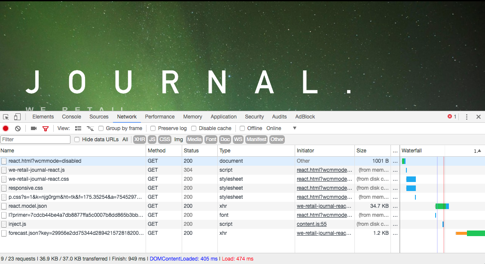

# Présentation et présentation des applications monopages{#spa-introduction-and-walkthrough}

Les applications d’une seule page (SPA) peuvent améliorer considérablement l’expérience des utilisateurs de sites web. Le souhait des développeurs est de pouvoir créer des sites avec des structures SPA. Les auteurs, pour leur part, souhaitent modifier facilement du contenu dans AEM pour un site conçu à l’aide de telles structures.

L’éditeur de SPA constitue une solution complète pour la prise en charge des SPA dans AEM. Cet article décrit l’utilisation d’une application d’application d’une seule page pour la création et explique comment elle se rapporte à l’éditeur d’applications d’une seule page sous-jacent d’AEM.

>[!NOTE]
>
>L’éditeur d’applications monopages est la solution recommandée pour les projets qui nécessitent un rendu côté client basé sur la structure d’applications monopages (par exemple, Réagir ou Angular).

## Présentation {#introduction}

### Objectif de l&#39;article {#article-objective}

Cet article présente les concepts de base des applications monopages avant de guider le lecteur dans une présentation pas à pas de l’éditeur d’applications monopages en utilisant une application d’application monopages simple pour démontrer l’édition de base du contenu. Il détaille ensuite la construction de la page et comment l’application SPA se rattache à l’éditeur SPA AEM et interagit avec lui.

L’objectif de cette introduction et de cette présentation est de montrer à un développeur AEM pourquoi les applications monopages sont pertinentes, comment elles fonctionnent généralement, comment l’éditeur d’applications monopages AEM gère les applications monopages et en quoi elles diffèrent d’une application AEM standard.

La procédure pas à pas est basée sur la fonctionnalité standard d’AEM et l’exemple d’application de Journal We.Retail. Les exigences suivantes doivent être respectées :

* [AEM version 6.4 avec Service Pack 2 ou version ultérieure
   ](/help/release-notes/sp-release-notes.md)
* [Installez l&#39;exemple d&#39;application de Journal We.Retail disponible sur GitHub ici.](https://github.com/Adobe-Marketing-Cloud/aem-sample-we-retail-journal)

>[!CAUTION]
>
>Ce document utilise l’application [de Journal](https://github.com/Adobe-Marketing-Cloud/aem-sample-we-retail-journal) We.Retail à des fins de démonstration uniquement. Il ne doit être utilisé pour aucun travail de projet.
>
>Tout projet AEM doit tirer parti de l’archétype [du projet](https://docs.adobe.com/content/help/en/experience-manager-core-components/using/developing/archetype/overview.html)AEM, qui prend en charge les projets d’application d’une seule page à l’aide de React ou d’Angular et exploite le SDK de l’application d’une seule page.

### Qu&#39;est-ce qu&#39;un APM ? {#what-is-a-spa}

Une application d’une seule page diffère d’une page conventionnelle en ce qu’elle est rendue côté client et qu’elle est principalement pilotée par JavaScript, en utilisant les appels Ajax pour charger des données et mettre à jour dynamiquement la page. La plupart ou la totalité du contenu est récupérée une fois au chargement d’une seule page avec des ressources supplémentaires chargées de manière asynchrone, selon les besoins, en fonction de l’interaction de l’utilisateur avec la page.

Cela réduit la nécessité d’actualiser les pages et offre à l’utilisateur une expérience transparente, rapide et qui ressemble davantage à une expérience d’application native.

L’éditeur d’applications monopages AEM permet aux développeurs frontaux de créer des applications monopages qui peuvent être intégrées à un site AEM, ce qui permet aux auteurs de contenu de modifier le contenu des applications monopages aussi facilement que tout autre contenu AEM.

### Pourquoi une ZPS ? {#why-a-spa}

En étant plus rapide, fluide et plus semblable à une application native, une application d’une seule page devient une expérience très attrayante non seulement pour le visiteur de la page Web, mais également pour les marketeurs et les développeurs en raison de la nature du fonctionnement des applications d’une seule page.


**Visiteurs**

* Les Visiteurs souhaitent des expériences de type natif lorsqu’ils interagissent avec du contenu.
* Il existe des données claires indiquant que plus une page est rapide, plus une conversion est probable.

**Marqueurs**

* Les marketeurs veulent offre des expériences riches et originales pour inciter les visiteurs à s&#39;engager pleinement dans le contenu.
* La personnalisation peut rendre ces expériences encore plus attrayantes.

**Développeurs**

* Les développeurs veulent une séparation nette des préoccupations entre le contenu et la présentation.
* Une séparation nette rend le système plus extensible et permet un développement frontal indépendant.

### Comment fonctionne une application d’une seule page ? {#how-does-a-spa-work}

L’idée principale d’une application d’une seule page est que les appels et la dépendance sur un serveur sont réduits afin de minimiser les retards causés par les appels au serveur, de sorte que l’application d’une seule page puisse se rapprocher de la réactivité d’une application native.

Dans une page Web séquentielle traditionnelle, seules les données nécessaires à la page immédiate sont chargées. Cela signifie que lorsque le visiteur passe à une autre page, le serveur est appelé pour les ressources supplémentaires. Des appels supplémentaires peuvent s’avérer nécessaires lorsque le visiteur interagit avec les éléments de la page. Ces appels multiples peuvent donner une impression de retard ou de retard car la page doit rattraper les demandes du visiteur.


Pour une expérience plus fluide, qui approche ce qu’un visiteur attend des applications mobiles natives, une application d’une seule page charge toutes les données nécessaires pour le visiteur au premier chargement. Bien que cette opération puisse prendre un peu plus de temps au début, elle élimine ensuite la nécessité d’appels de serveur supplémentaires.

En effectuant le rendu côté client, l’élément de page réagit plus rapidement et les interactions avec la page par le visiteur sont immédiates. Toute donnée supplémentaire qui peut être nécessaire est appelée de manière asynchrone afin d’optimiser la vitesse de la page.

>[!NOTE]
>
>Pour plus d’informations techniques sur le fonctionnement des applications monopages dans AEM, reportez-vous à l’article [Prise en main des applications monopages dans AEM](/help/sites-developing/spa-getting-started-react.md).
>
>Pour un aperçu plus approfondi de la conception, de l’architecture et du processus technique de l’éditeur d’applications monopages, consultez l’article Présentation [de l’éditeur d’](/help/sites-developing/spa-overview.md)applications monopages.

## Modification du contenu avec l’application d’une seule page {#content-editing-experience-with-spa}

Lorsqu’une application d’une seule page est créée pour tirer parti de l’éditeur d’applications d’une seule page, l’auteur du contenu ne remarque aucune différence lors de la modification et de la création de contenu. La fonctionnalité commune d’AEM est disponible et aucune modification du flux de travail de l’auteur n’est requise.

>[!NOTE]
>
>La procédure pas à pas est basée sur la fonctionnalité standard d’AEM et l’exemple d’application de Journal We.Retail. Les exigences suivantes doivent être respectées :
>
>* [AEM version 6.4 avec Service Pack 2](/help/release-notes/sp-release-notes.md)
>* [Installez l&#39;exemple d&#39;application de Journal We.Retail disponible sur GitHub ici.](https://github.com/Adobe-Marketing-Cloud/aem-sample-we-retail-journal)
>


1. Modifiez l’application de Journal We.Retail dans AEM.

   `https://localhost:4502/editor.html/content/we-retail-journal/react.html`

   

1. Sélectionnez un composant d’en-tête et notez qu’une barre d’outils s’affiche comme pour tout autre composant. Sélectionnez **Modifier**.

   

1. Modifiez le contenu normalement dans AEM et notez que les modifications sont conservées.

   

   >[!NOTE]
   >Pour plus d’informations sur l’éditeur de texte et les [SPA en place, consultez la section Présentation](spa-overview.md#requirements-limitations) de l’éditeur d’applications monopages (SPA).

1. Utilisez l’explorateur de ressources pour faire glisser une nouvelle image dans un composant d’image.

   

1. Le changement est maintenu.

   

D’autres outils de création, tels que le glisser-déposer de composants supplémentaires sur la page, la réorganisation des composants et la modification de la mise en page, sont pris en charge, comme dans toute application autre que SPA.

>[!NOTE]
>
>L’éditeur d’applications monopages ne modifie pas le DOM de l’application. L&#39;APS lui-même est responsable du DOM.
>
>Pour voir comment cela fonctionne, passez à la section suivante de cet article Applications [d’application d’une seule page et de l’éditeur](/help/sites-developing/spa-walkthrough.md#spa-apps-and-the-aem-spa-editor)d’application d’une seule page.

## Applications d’application d’une seule page et éditeur d’applications d’une seule page {#spa-apps-and-the-aem-spa-editor}

L’expérience de comportement d’une application d’une seule page pour l’utilisateur final, puis l’inspection de la page d’une application d’une seule page permettent de mieux comprendre comment une application SAP fonctionne avec l’éditeur d’applications d’une seule page dans AEM.

### Utilisation d’une application SPA {#using-an-spa-application}

1. Chargez l’application de Journal We.Retail sur le serveur de publication ou à l’aide de l’option **Vue as Published** (Publié **) dans le menu Informations** sur lapage de l’éditeur de page.

   `/content/we-retail-journal/react.html`

   

   Notez la structure des pages, y compris la navigation vers les pages enfants, le widget météorologique et les articles.

1. Accédez à une page enfant à l’aide du menu et voyez que la page se charge immédiatement sans qu’il faille procéder à une actualisation.

   

1. Ouvrez les outils de développement intégrés à votre navigateur et surveillez l’activité du réseau lorsque vous parcourez les pages enfants.

   

   Il y a très peu de trafic lorsque vous passez d’une page à l’autre dans l’application. La page n’est pas rechargée et seules les nouvelles images sont demandées.

   L’application d’une seule page gère le contenu et le routage entièrement du côté client.

Ainsi, si la page n’est pas rechargée lors de la navigation dans les pages enfants, comment est-elle chargée ?

La section suivante, [Chargement d’une application](/help/sites-developing/spa-walkthrough.md#loading-an-spa-application)d’application d’une seule page, approfondit les mécanismes de chargement de l’application d’une seule page et explique comment le contenu peut être chargé de façon synchrone et asynchrone.

### Chargement d’une application d’application d’une seule page {#loading-an-spa-application}

1. Si ce n’est pas déjà fait, chargez l’application de Journal We.Retail sur le serveur de publication ou à l’aide de la **Vue d’options Publié** dans le menu Informations **sur la** page de l’éditeur de page.

   `/content/we-retail-journal/react.html`

   

1. Utilisez l’outil intégré de votre navigateur pour vue la source de la page.
1. Notez que le contenu de la source est extrêmement limité.

   ```
   <!DOCTYPE HTML>
   <html lang="en-CH">
       <head>
       <meta charset="UTF-8">
       <title>We.Retail Journal</title>
   
       <meta name="template" content="we-retail-react-template"/>
   
   <link rel="stylesheet" href="/etc.clientlibs/we-retail-journal/react/clientlibs/we-retail-journal-react.css" type="text/css">
   
   <link rel="stylesheet" href="/libs/wcm/foundation/components/page/responsive.css" type="text/css">
   
   </head>
       <body class="page basicpage">
   
   <div id="page"></div>
   
   <script type="text/javascript" src="/etc.clientlibs/we-retail-journal/react/clientlibs/we-retail-journal-react.js"></script>
   
       </body>
   </html>
   ```

   La page ne contient aucun contenu dans son corps. Il est principalement composé de feuilles de style et d&#39;un appel à un script React `we-retail-journal-react.js`.

   Ce script React est le pilote principal de cette application et est responsable du rendu de tout le contenu.

1. Utilisez les outils intégrés de votre navigateur pour inspecter la page. Affichez le contenu du modèle DOM entièrement chargé.

   

1. Accédez à l&#39;onglet Réseau de l&#39;Inspecteur et rechargez la page.

   Ignorant les demandes d’image, notez que les ressources principales chargées pour la page sont la page elle-même, CSS, le code JavaScript de réaction, ses dépendances, ainsi que les données JSON de la page.

   

1. Chargez le `react.model.json` dans un nouvel onglet.

   `/content/we-retail-journal/react.model.json`

   

   L’éditeur d’applications d’une seule page utilise [AEM Content Services](/help/assets/content-fragments.md) pour diffuser l’intégralité du contenu de la page sous forme de modèle JSON.

   En implémentant des interfaces spécifiques, les modèles Sling fournissent les informations nécessaires à l’application d’une seule page. La diffusion des données JSON est déléguée vers le bas à chaque composant (de la page, au paragraphe, au composant, etc.).

   Chaque composant choisit ce qu’il expose et comment il est rendu (côté serveur avec HTL ou côté client avec React). Bien sûr, cet article se concentre sur le rendu côté client avec React.

1. Le modèle peut également regrouper les pages afin qu’elles soient chargées de manière synchrone, ce qui réduit le nombre de rechargements de page nécessaires.

   Dans l&#39;exemple du Journal We.Retail, les pages `home`, `blog`et `aboutus` les pages sont chargées de manière synchrone, car les visiteurs visitent généralement toutes ces pages. Cependant, la `weather` page est chargée de manière asynchrone, car les visiteurs sont moins susceptibles de la consulter.

   Ce comportement n’est pas obligatoire et est entièrement définissable.

   

1. Pour vue cette différence de comportement, rechargez la page et effacez l&#39;activité réseau de l&#39;inspecteur. Accédez au blog et aux pages qui nous concernent dans le menu de la page et vérifiez qu&#39;aucune activité réseau n&#39;est signalée.

   Accédez à la page Météo et vérifiez que l’ `weather.model.json` appel est asynchrone.

   

### Interaction avec l’éditeur d’applications monopages {#interaction-with-the-spa-editor}

En utilisant l&#39;exemple d&#39;application de Journal We.Retail, vous savez comment se comporte l&#39;application et comment elle est chargée lorsqu&#39;elle est publiée, en exploitant les services de contenu pour la diffusion de contenu JSON ainsi que le chargement asynchrone des ressources.

De plus, pour l’auteur de contenu, la création de contenu à l’aide d’un éditeur d’applications monopages est transparente dans AEM.

Dans la section suivante, nous allons explorer le contrat qui permet à l’éditeur d’applications monopages de relier les composants de l’application d’une seule page aux composants AEM et d’effectuer cette expérience de modification sans heurts.

1. Chargez l&#39;application de Journal We.Retail dans l&#39;éditeur et passez en mode **Prévisualisation** .

   `https://localhost:4502/editor.html/content/we-retail-journal/react.html`

1. A l’aide des outils de développement intégrés à votre navigateur, inspectez le contenu de la page. A l’aide de l’outil de sélection, sélectionnez un composant modifiable sur la page et vue le détail de l’élément.

   Notez que le composant possède un nouvel attribut de données `data-cq-data-path`.

   

   Par exemple

   `data-cq-data-path="root/responsivegrid/paragraph_1`

   Ces chemins permettent de récupérer et d’associer l’objet de configuration de contexte de modification de chaque composant.

   Il s’agit du seul attribut de balisage requis par l’éditeur pour reconnaître qu’il s’agit d’un composant modifiable dans l’application d’une seule page. En fonction de cet attribut, l’éditeur d’applications monopages détermine la configuration modifiable associée au composant, de sorte que le cadre, la barre d’outils, etc. appropriés soient définis. est chargé.

   Certains noms de classe spécifiques sont également ajoutés pour marquer les espaces réservés et pour la fonctionnalité de glisser-déposer des ressources.

   >[!NOTE]
   >
   >Il s’agit d’un changement de comportement par rapport aux pages générées côté serveur dans AEM, où un `cq` élément est inséré pour chaque composant modifiable.
   >
   >
   >Cette approche dans l’application d’une seule page permet d’éliminer la nécessité d’injecter des éléments personnalisés, en n’utilisant qu’un attribut de données supplémentaire, ce qui simplifie le balisage pour le développeur frontal.

## Étapes suivantes {#next-steps}

Maintenant que vous connaissez l’expérience de modification d’une application d’une seule page dans AEM et la relation entre une application d’une seule page et l’éditeur d’une application d’une seule page, approfondissez votre compréhension de la création d’une application d’une seule page.

* [Prise en main des applications monopages dans AEM](/help/sites-developing/spa-getting-started-react.md) montre comment une application monopage de base est créée pour fonctionner avec l’éditeur d’applications monopages dans AEM
* [Présentation](/help/sites-developing/spa-overview.md) de l’éditeur d’applications monopages (SPA) approfondit le modèle de communication entre AEM et l’application d’une seule page.
* [Le développement d’applications monopages pour AEM](/help/sites-developing/spa-architecture.md) décrit comment convaincre les développeurs frontaux de développer une application d’une seule page pour AEM, ainsi que comment les applications monopages interagissent avec l’architecture d’AEM.
