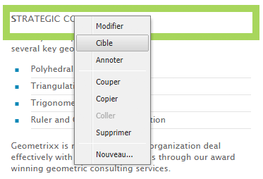
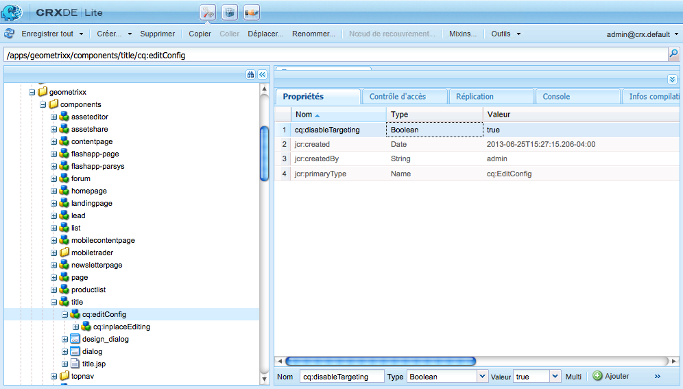
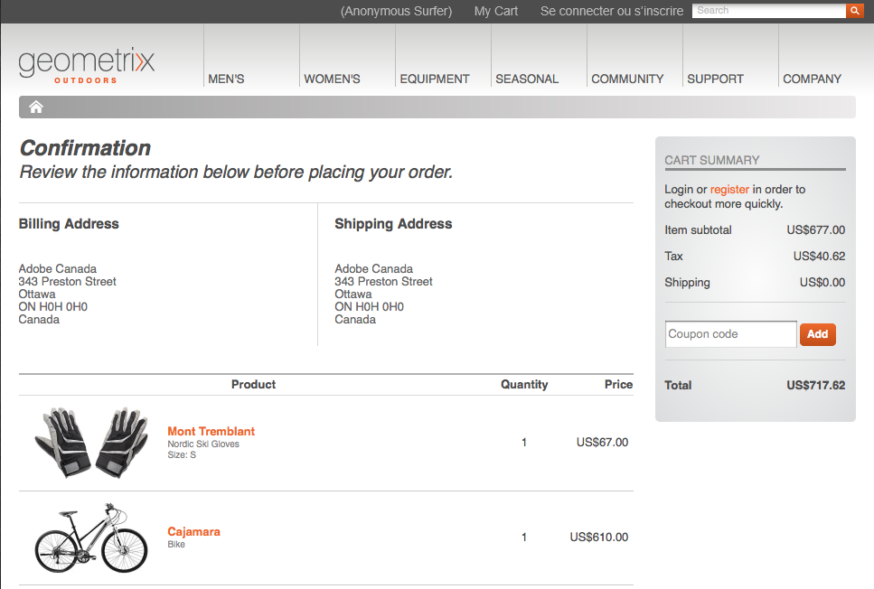

# Développement de composants pour du contenu ciblé{#developing-for-targeted-content}

Cette section traite du développement de composants à utiliser avec le ciblage de contenu.

* Pour plus d’informations sur la connexion à Adobe Target, voir [Intégration à Adobe Target](/help/sites-administering/target.md).
* Pour plus d’informations sur la création du contenu ciblé, voir [Création de contenu ciblé en mode Ciblage](/help/sites-authoring/content-targeting-touch.md).

>[!NOTE]
>
>Lorsque vous ciblez un composant dans le mode Auteur AEM, il effectue une série d’appels côté serveur vers Adobe Target afin d’enregistrer la campagne, de configurer des offres et de récupérer des segments Adobe Target (si cela est configuré). Aucun appel côté serveur n’est effectué depuis le mode Publication AEM vers Adobe Target.

## Activation du ciblage avec Adobe Target sur vos pages {#enabling-targeting-with-adobe-target-on-your-pages}

Pour utiliser des composants ciblés dans vos pages qui interagissent avec l’Adobe Target, incluez du code client spécifique dans l’élément &lt;head>.

### Section head {#the-head-section}

Ajoutez les deux blocs de code suivants à la section &lt;head> de votre page :

```xml
<!--/* Include Context Hub */-->
<sly data-sly-resource="${'contexthub' @ resourceType='granite/contexthub/components/contexthub'}"/>
```

```xml
<cq:include script="/libs/cq/cloudserviceconfigs/components/servicelibs/servicelibs.jsp"/>
```

Ce code ajoute les objets d’analyse JavaScript requis et charge les bibliothèques de service cloud associées au site web. For Target service, the libraries are loaded via `/libs/cq/analytics/components/testandtarget/headlibs.jsp`

Le jeu de bibliothèques chargé dépend du type de bibliothèque cliente cible (mbox.js ou at.js) utilisé dans la configuration de Target :

**Pour le type mbox.js par défaut**

```
<script type="text/javascript" src="/libs/cq/foundation/testandtarget/parameters.js"></script>
 <script type="text/javascript" src="/libs/cq/foundation/testandtarget/mbox.js"></script>
 <script type="text/javascript" src="/libs/cq/foundation/personalization/integrations/commons.js"></script>
 <script type="text/javascript" src="/libs/cq/foundation/testandtarget/util.js"></script>
 <script type="text/javascript" src="/libs/cq/foundation/testandtarget/init.js"></script>
```

**Pour le type mbox.js personnalisé**

```
<script type="text/javascript" src="/etc/cloudservices/testandtarget/<CLIENT-CODE>/_jcr_content/public/mbox.js"></script>
        <script type="text/javascript" src="/libs/cq/foundation/testandtarget/parameters.js"></script>
 <script type="text/javascript" src="/libs/cq/foundation/personalization/integrations/commons.js"></script>
 <script type="text/javascript" src="/libs/cq/foundation/testandtarget/util.js"></script>
 <script type="text/javascript" src="/libs/cq/foundation/testandtarget/init.js"></script>
```

**Pour at.js**

```
<script type="text/javascript" src="/libs/cq/foundation/testandtarget/parameters.js"></script>
 <script type="text/javascript" src="/libs/cq/foundation/testandtarget/atjs-integration.js"></script>
 <script type="text/javascript" src="/libs/cq/foundation/testandtarget/atjs.js"></script>
```

>[!NOTE]
>
>Seule la version de `at.js` livré avec le produit est prise en charge. La version du produit `at.js` expédié peut être obtenue en consultant le `at.js` fichier à l’emplacement suivant :
>
>**/libs/cq/testandtarget/clientlibs/testandtarget/atjs/source/at.js**.

**Pour le type at.js personnalisé**

```
<script type="text/javascript" src="/etc/cloudservices/testandtarget/<CLIENT-CODE>/_jcr_content/public/at.js"></script>
    <script type="text/javascript" src="/libs/cq/foundation/testandtarget/parameters.js"></script>
 <script type="text/javascript" src="/libs/cq/foundation/testandtarget/atjs-integration.js"></script>
```

The Target functionality on the client side is managed by the `CQ_Analytics.TestTarget` object. Par conséquent, la page contient du code init comme dans l’exemple suivant :

```
<script type="text/javascript">
            if ( !window.CQ_Analytics ) {
                window.CQ_Analytics = {};
            }
            if ( !CQ_Analytics.TestTarget ) {
                CQ_Analytics.TestTarget = {};
            }
            CQ_Analytics.TestTarget.clientCode = 'my_client_code';
        </script>
      ...

    <div class="cloudservice testandtarget">
  <script type="text/javascript">
  CQ_Analytics.TestTarget.maxProfileParams = 11;

  if (CQ_Analytics.CCM) {
   if (CQ_Analytics.CCM.areStoresInitialized) {
    CQ_Analytics.TestTarget.registerMboxUpdateCalls();
   } else {
    CQ_Analytics.CCM.addListener("storesinitialize", function (e) {
     CQ_Analytics.TestTarget.registerMboxUpdateCalls();
    });
   }
  } else {
   // client context not there, still register calls
   CQ_Analytics.TestTarget.registerMboxUpdateCalls();
  }
  </script>
 </div>
```

Le JSP ajoute les objets javascript d’analyse requis et les références aux bibliothèques JavaScript côté client. Le fichier testandtarget.js contient les fonctions mbox.js. Le code HTML généré par le script est similaire à l’exemple suivant :

```xml
<script type="text/javascript">
        if ( !window.CQ_Analytics ) {
            window.CQ_Analytics = {};
        }
        if ( !CQ_Analytics.TestTarget ) {
            CQ_Analytics.TestTarget = {};
        }
        CQ_Analytics.TestTarget.clientCode = 'MyClientCode';
</script>
<link rel="stylesheet" href="/etc/clientlibs/foundation/testandtarget/testandtarget.css" type="text/css">
<script type="text/javascript" src="/etc/clientlibs/foundation/testandtarget/testandtarget.js"></script>
<script type="text/javascript" src="/etc/clientlibs/foundation/testandtarget/init.js"></script>
```

#### Section du corps (début) {#the-body-section-start}

Ajoutez le code suivant immédiatement après la balise &lt;body> pour ajouter les fonctionnalités de contexte client à la page :

```xml
<cq:include path="clientcontext" resourceType="cq/personalization/components/clientcontext"/>
```

#### Section du corps (fin) {#the-body-section-end}

Ajoutez le code suivant juste avant la balise de fin &lt;/body> :

```xml
<cq:include path="cloudservices" resourceType="cq/cloudserviceconfigs/components/servicecomponents"/>
```

Le script JSP de ce composant génère des appels à l’API JavaScript de Cible et implémente d’autres configurations requises. Le code HTML généré par le script est similaire à l’exemple suivant :

```xml
<div class="servicecomponents cloudservices">
  <div class="cloudservice testandtarget">
    <script type="text/javascript">
      CQ_Analytics.TestTarget.maxProfileParams = 11;
      CQ_Analytics.CCM.addListener("storesinitialize", function(e) {
        CQ_Analytics.TestTarget.registerMboxUpdateCalls();
      });
    </script>
    <div id="cq-analytics-texthint" style="background:white; padding:0 10px; display:none;">
      <h3 class="cq-texthint-placeholder">Component clientcontext is missing or misplaced.</h3>
    </div>
    <script type="text/javascript">
      $CQ(function(){
      if( CQ_Analytics &&
          CQ_Analytics.ClientContextMgr &&
          !CQ_Analytics.ClientContextMgr.isConfigLoaded )
        {
          $CQ("#cq-analytics-texthint").show();
        }
      });
    </script>
  </div>
</div>
```

### Utilisation d’un fichier de bibliothèque Target personnalisé {#using-a-custom-target-library-file}

>[!NOTE]
>
>Si vous n’utilisez pas DTM ni un autre autre système marketing cible, vous pouvez utiliser des fichiers de bibliothèque cible personnalisés.

>[!NOTE]
>
>Par défaut, les mbox sont masquées ; la classe mboxDefault détermine ce comportement. En masquant les mbox, vous avez la garantie que les visiteurs ne verront pas le contenu par défaut avant qu’il soit remplacé. Cependant, ce masquage a une incidence sur les performances perçues.

Le fichier mbox.js par défaut utilisé pour créer des mbox se trouve à l’adresse /etc/clientlibs/foundation/testandtarget/mbox/source/mbox.js. Pour utiliser un fichier mbox.js client, ajoutez-le à la configuration cloud de Target. Pour être ajouté, le fichier mbox.js doit être disponible sur le système de fichiers.

For example, if you want to use the [Marketing Cloud ID service](https://docs.adobe.com/content/help/en/id-service/using/home.html) you need to download mbox.js so that it contains the correct value for the `imsOrgID` variable, which is based on your tenant. Cette variable est requise pour l’intégration au service Marketing Cloud ID. For information, see [Adobe Analytics as the Reporting Source for Adobe Target](https://docs.adobe.com/content/help/en/target/using/integrate/a4t/a4t.html) and [Before You Implement](https://docs.adobe.com/content/help/en/target/using/integrate/a4t/before-implement.html).

>[!NOTE]
>
>Si une mbox personnalisée est définie dans une configuration Target, tous les utilisateurs doivent posséder un accès en lecture à **/etc/cloudservices** sur les serveurs de publication. Sans cet accès, le chargement de fichiers mbox.js sur un site web de publication générera une erreur 404.

1. Go to the CQ **Tools** page and select **Cloud Services**. ([https://localhost:4502/libs/cq/core/content/tools/cloudservices.html](https://localhost:4502/libs/cq/core/content/tools/cloudservices.html))
1. Dans l’arborescence, sélectionnez Adobe Target et, dans la liste des configurations, double-cliquez sur votre configuration Target.
1. Sur la page de configuration, cliquez sur Modifier.
1. Pour la propriété Fichier mbox.js personnalisé, cliquez sur Parcourir et sélectionnez ensuite le fichier.
1. Pour appliquer les modifications, saisissez le mot de passe de votre compte Adobe Target, cliquez sur Reconnecter à Target, puis cliquez sur OK une fois la connexion réussie. Cliquez ensuite sur OK dans la boîte de dialogue Modifier le composant.

Votre configuration Target contient un fichier mbox.js personnalisé ; le [code requis dans la section head](/help/sites-developing/target.md#p-the-head-section-p) de votre page ajoute le fichier à la structure de la bibliothèque cliente au lieu d’une référence à la bibliothèque testandtarget.js.

## Désactivation de la commande Target pour les composants {#disabling-the-target-command-for-components}

La plupart des composants peuvent être convertis en composants ciblés à l’aide de la commande Target du menu contextuel.



Pour supprimer la commande Target du menu contextuel, ajoutez la propriété suivante au nœud cq:editConfig du composant :

* Nom : cq:disableTargeting
* Type : Booléen
* Valeur : True

Par exemple, pour désactiver le ciblage pour les composants de titre des pages du site de démonstration Geometrixx, ajoutez la propriété au noeud /apps/geometrixx/components/title/cq:editConfig.



## Envoi d’informations de confirmation de commande à Adobe Target {#sending-order-confirmation-information-to-adobe-target}

>[!NOTE]
>
>Si vous n’utilisez pas DTM, vous envoyez la confirmation de commande à Adobe Target.

Pour effectuer le suivi des performances de votre site web, envoyez les informations d’achat à Adobe Target depuis votre page de confirmation de commande (voir [Création d’une mbox orderConfirmPage](https://docs.adobe.com/content/help/en/dtm/implementing/target/configure-target/mboxes/order-confirmation-mbox.html) dans la documentation d’Adobe Target). Adobe Target identifie les données de mbox comme des données de confirmation de commande lorsque le nom de votre mbox est `orderConfirmPage` et utilise les noms de paramètres spécifiques suivants :

* productPurchasedId : liste des ID qui identifient les produits achetés.
* orderId : ID de la commande.
* orderTotal : montant total de l’achat.

Le code sur la page HTML rendue qui crée la mbox est semblable à celui illustré dans l’exemple suivant :

```xml
<script type="text/javascript">
     mboxCreate('orderConfirmPage',
     'productPurchasedId=product1 product2 product3',
     'orderId=order1234',
     'orderTotal=24.54');
</script>
```

Les valeurs de chaque paramètre sont différentes pour chaque commande. Par conséquent, vous avez besoin d’un composant qui génère le code en fonction des propriétés de l’achat. La [structure d’intégration eCommerce](/help/sites-administering/ecommerce.md) de CQ vous permet de réaliser une intégration dans votre catalogue de produits, et d’implémenter un panier d’achat et une page de passage en caisse.

L’exemple Geometrixx Outdoors affiche la page de confirmation suivante lorsqu’un visiteur achète des produits :



Le code suivant relatif au script JSP d’un composant accède aux propriétés du panier d’achat et imprime ensuite le code pour créer la mbox.

```java
<%--

  confirmationmbox component.

--%><%
%><%@include file="/libs/foundation/global.jsp"%><%
%><%@page session="false"
          import="com.adobe.cq.commerce.api.CommerceService,
                  com.adobe.cq.commerce.api.CommerceSession,
                  com.adobe.cq.commerce.common.PriceFilter,
                  com.adobe.cq.commerce.api.Product,
                  java.util.List, java.util.Iterator"%><%

/* obtain the CommerceSession object */
CommerceService commerceservice = resource.adaptTo(CommerceService.class);
CommerceSession session = commerceservice.login(slingRequest, slingResponse);

/* obtain the cart items */
List<CommerceSession.CartEntry> entries = session.getCartEntries();
Iterator<CommerceSession.CartEntry> cartiterator = entries.iterator();

/* iterate the items and get the product IDs */
String productIDs = new String();
while(cartiterator.hasNext()){
 CommerceSession.CartEntry entry = cartiterator.next();
 productIDs = productIDs + entry.getProduct().getSKU();
    if (cartiterator.hasNext()) productIDs = productIDs + ", ";
}

/* get the cart price and orderID */
String total = session.getCartPrice(new PriceFilter("CART", "PRE_TAX"));
String orderID = session.getOrderId();

%><div class="mboxDefault"></div>
<script type="text/javascript">
     mboxCreate('orderConfirmPage',
     'productPurchasedId=<%= productIDs %>',
     'orderId=<%= orderID %>',
     'orderTotal=<%= total %>');
</script>
```

Lorsque le composant est inclus dans la page de passage en caisse de l’exemple précédent, la source de la page comprend le script suivant qui crée la mbox :

```
<div class="mboxDefault"></div>
<script type="text/javascript">

     mboxCreate('orderConfirmPage',
     'productPurchasedId=47638-S, 46587',
     'orderId=d03cb015-c30f-4bae-ab12-1d62b4d105ca',
     'orderTotal=US$677.00');

</script>
```

## Présentation du composant Target {#understanding-the-target-component}

Le composant Target permet aux auteurs de créer des mbox dynamiques à partir de composants de contenu CQ (voir [Ciblage de contenu](/help/sites-authoring/content-targeting-touch.md)). Le composant Cible se trouve dans /libs/cq/personalization/components/cible.

Le script target.jsp accède aux propriétés de la page pour déterminer le moteur de ciblage à utiliser pour le composant, puis exécute le script approprié :

* Adobe Target : /libs/cq/personalization/components/target/engine_tnt.jsp
* [Adobe Target avec AT.JS](/help/sites-administering/target.md): /libs/cq/personalization/components/target/engine_atjs.jsp
* [Adobe Campaign](/help/sites-authoring/target-adobe-campaign.md): /libs/cq/personalization/components/target/engine_cq_campaign.jsp
* Règles côté client/ContextHub : /libs/cq/personalization/components/target/engine_cq.jsp

### Création de mbox {#the-creation-of-mboxes}

>[!NOTE]
>
>Par défaut, les mbox sont masquées ; la classe mboxDefault détermine ce comportement. En masquant les mbox, vous avez la garantie que les visiteurs ne verront pas le contenu par défaut avant qu’il soit remplacé. Cependant, ce masquage a une incidence sur les performances perçues.

Lorsque le ciblage du contenu est réalisé par Adobe Target, le script engine_tnt.jsp crée des mbox incluant le contenu de l’expérience ciblée :

* Adds a `div` element with the class of `mboxDefault`, as required by the Adobe Target API.

* Ajout du contenu de la mbox (le contenu de l’expérience ciblée) dans l’élément `div`.

Le JavaScript qui crée la mbox est inséré après l’élément div `mboxDefault` :

* Le nom, l’ID et l’emplacement de la mbox sont basés sur le chemin d’accès au référentiel du composant.
* Le script récupère les noms et valeurs du paramètre ClientContext.
* Des appels sont effectués vers les fonctions que le fichier mbox.js et d’autres bibliothèques clientes définissent pour créer des mbox.

#### Bibliothèques clientes pour le ciblage de contenu {#client-libraries-for-content-targeting}

Les catégories de bibliothèques clientes (clientlibs) disponibles sont les suivantes :

* testandtarget.mbox
* testandtarget.init
* testandtarget.util
* testandtarget.atjs
* testandtarget.atjs-integration
