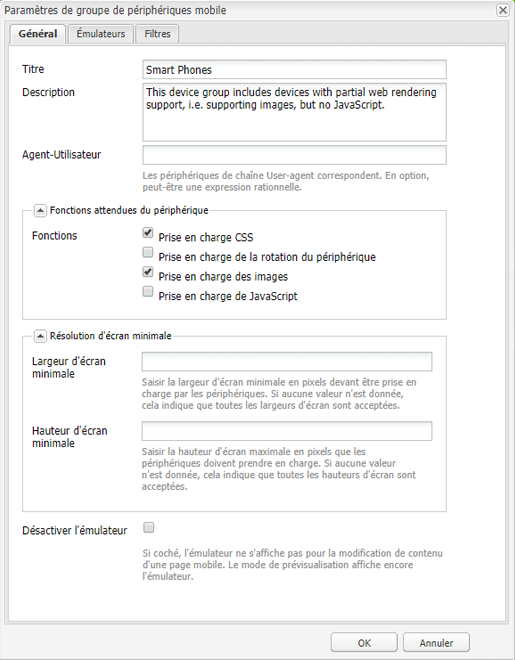
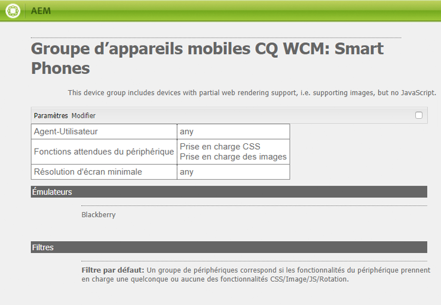
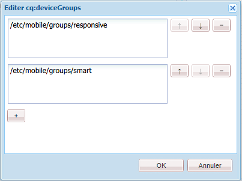
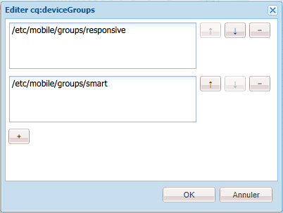
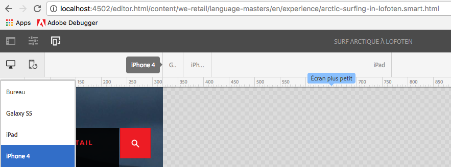

# Rendu de modèle adaptatif{#adaptive-template-rendering}

Le rendu de modèle adaptatif permet de gérer une page avec des variantes. Servant au départ à fournir diverses sorties HTML pour les appareils mobiles (par exemple, un téléphone multifonction ou un smartphone), cette fonctionnalité est utile si des expériences doivent être proposées sur divers appareils nécessitant un balisage ou une sortie HTML différents.

## Présentation {#overview}

Les modèles sont généralement créés autour d’une grille responsive. Les pages créées à partir de ces modèles sont entièrement responsive, s’adaptant automatiquement à la fenêtre de l’appareil du client. À l’aide de la barre d’outils de l’émulateur dans l’éditeur de pages, les auteurs peuvent cibler des dispositions sur des appareils spécifiques.

Il est également possible de configurer des modèles pour prendre en charge le rendu adaptatif. Lorsque les groupes d’appareils sont correctement configurés, la page est rendue avec un sélecteur différent dans l’URL lors de la sélection d’un appareil en mode émulateur. À l’aide d’un sélecteur, un rendu de page spécifique peut être appelé directement via l’URL.

N’oubliez pas ce qui suit lors de la configuration de vos groupes d’appareils :

* Chaque appareil doit appartenir à au moins un groupe d’appareils.
* Un appareil peut appartenir à plusieurs groupes d’appareils.
* Étant donné que les appareils peuvent appartenir à plusieurs groupes d’appareils, les sélecteurs peuvent être combinés.
* La combinaison de sélecteurs est évaluée de manière descendante car ils sont conservés dans le référentiel.

>[!NOTE]
>
>Le groupe d’appareils **Appareils sensibles** ne propose jamais de sélecteur, car les appareils reconnus comme prenant en charge le responsive design ne sont pas censés avoir besoin d’une disposition adaptative.

## Configuration {#configuration}

Les sélecteurs de rendu adaptatif peuvent être configurés pour les groupes d’appareils existants ou pour ceux [que vous avez vous-même créés.](/help/sites-developing/mobile.md#device-groups)

Dans cet exemple, nous allons configurer le groupe d’appareils existant **Smart Phones** pour qu’il dispose d’un sélecteur de rendu adaptatif dans le modèle **Experience Page** sur We.Retail.

1. Edit the device group that requires an adaptive selector in `http://localhost:4502/miscadmin#/etc/mobile/groups`

   Définissez l’option **Désactiver l’émulateur** et enregistrez.

   

1. Le sélecteur est disponible pour **Blackberry** et **iPhone 4** si le groupe d’appareils **Smart Phone** est ajouté au modèle et aux structures de page dans les étapes suivantes.

   

1. Dans CRX DE Lite, autorisez l’utilisation du groupe d’appareils sur votre modèle en l’ajoutant à la propriété de chaîne à valeurs multiples `cq:deviceGroups` sur la structure de votre modèle.

   `/conf/<your-site>/settings/wcm/templates/<your-template>/structure/jcr:content`

   Par exemple, si nous souhaitons ajouter le groupe d’appareils Smart Phone :

   `/conf/we-retail/settings/wcm/templates/experience-page/structure/jcr:content`

   

1. Using CRX DE Lite, allow the device group to be used on your site by adding it to the multi-value string property `cq:deviceGroups` on the structure of your site.

   `/content/<your-site>/jcr:content`

   Par exemple, pour autoriser le groupe d’appareils **Smart Phone** :

   `/content/we-retail/jcr:content`

   

À présent, lorsque vous utilisez l’[émulateur](/help/sites-authoring/responsive-layout.md#layout-definitions-device-emulation-and-breakpoints) dans l’éditeur de pages (par exemple pour [modifier la mise en page ](/help/sites-authoring/responsive-layout.md)) et que vous choisissez un appareil du groupe d’appareils configuré, la page est rendue avec un sélecteur dans l’URL.

In our example, when editing a page based on the **Experience Page** template, and choosing iPhone 4 in the emulator, the page is rendered including the selector as `arctic-surfing-in-lofoten.smart.html` instead of `arctic-surfing-in-lofoten.html`

La page peut également être appelée directement à l’aide de ce sélecteur.

