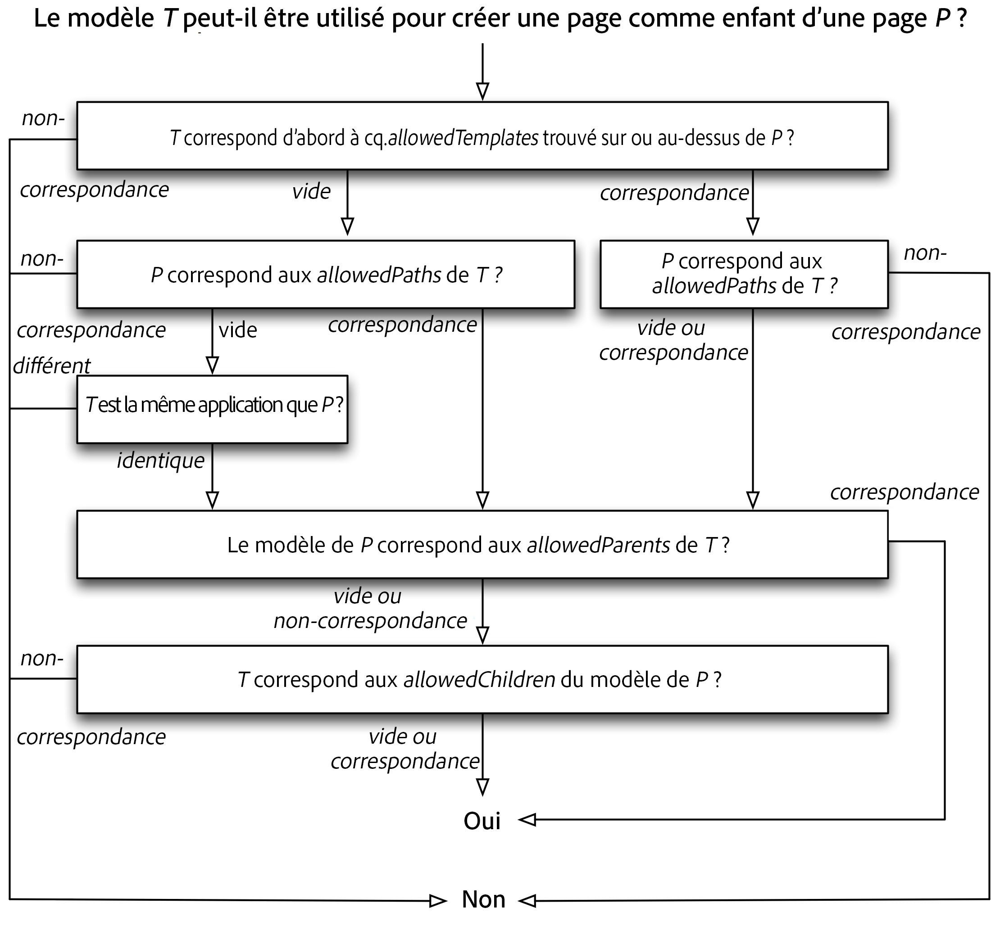

# Modèles{#templates}

Les modèles sont utilisés à divers endroits dans AEM :

* Lors de la [création d’une page, vous devez sélectionner un modèle](#templates-pages). C’est la base pour créer la page. Le modèle définit la structure de la page créée, le contenu initial et les [composants](/help/sites-authoring/default-components.md) qui peuvent être utilisés (propriétés de conception).

* Lorsque vous [créez un fragment de contenu, vous devez également sélectionner un modèle](#templates-content-fragments). Ce modèle définit la structure, les éléments initiaux et les variations.

Les modèles suivants sont décrits en détail :

* [Modèles de pages - Modifiables](/help/sites-developing/page-templates-editable.md)
* [Modèles de page - Statiques](/help/sites-developing/page-templates-static.md)
* [Modèles de fragment de contenu](/help/sites-developing/content-fragment-templates.md)
* [Rendu de modèle adaptatif](/help/sites-developing/templates-adaptive-rendering.md)

## Modèles - Pages {#templates-pages}

AEM propose désormais deux types de modèles de base pour la création de pages :

>[!NOTE]
>
>Lorsque vous utilisez un modèle pour [créer une page](/help/sites-authoring/managing-pages.md#creating-a-new-page), il n’y a pas de différence visible (dans la page de création) et aucune indication du type de modèle utilisé.

### Modèles modifiables {#editable-templates}

Les modèles modifiables sont maintenant considérés comme les meilleures pratiques pour le développement avec AEM.

Avantages des modèles modifiables :

* Peuvent être [créés](/help/sites-authoring/templates.md#creating-a-new-template-template-author) et [modifiés](/help/sites-authoring/templates.md#editing-a-template-structure-template-author) par vos auteurs.

* Sont proposés pour vous permettre de définir ce qui suit pour toutes les pages créées avec le modèle :

   * la structure
   * le contenu initial
   * les stratégies de contenu

* Une fois la nouvelle page créée, une connexion dynamique est maintenue entre la page et le modèle. Cela signifie que les modifications apportées à la structure du modèle sont répercutées sur les pages créées avec ce modèle (les modifications apportées au contenu initial ne le sont pas).
* Utilisent des stratégies de contenu (modifiés à partir de l’éditeur de modèles) pour conserver les propriétés de conception (n’utilise pas le mode Conception dans l’éditeur de page).
* Are stored under `/conf`
* Consultez [Modèles modifiables](/help/sites-developing/page-templates-editable.md) pour plus d’informations. 

>[!NOTE]
>
>An AEM Community Article is available explaining how to develop an Experience Manager site with Editable Templates, see [Creating an Adobe Experience Manager 6.5 website using Editable Templates](https://helpx.adobe.com/experience-manager/using/first_aem64_website.html).

### Modèles statiques {#static-templates}

Les modèles statiques :

* Doivent être définis et configurés par vos développeurs.
* Il s&#39;agissait du système de modèle d&#39;AEM d&#39;origine et a été disponible pour de nombreuses versions.
* Un modèle statique est une hiérarchie de nœuds qui a la même structure que la page à créer, mais sans contenu réel.
* Sont copiés pour créer la nouvelle page, aucune connexion dynamique n’existe après cela.
* Utilisez le [mode Conception](/help/sites-authoring/default-components-designmode.md) pour conserver les propriétés de conception.
* Are stored under `/apps`
* Consultez [Modèles statiques](/help/sites-developing/page-templates-static.md) pour plus d’informations.

>[!NOTE]
>
>À l&#39;AEM 6.5, l&#39;utilisation de modèles statiques n&#39;est pas considérée comme une bonne pratique. Privilégiez les modèles modifiables à la place.
>
>[Les outils de modernisation](modernization-tools.md) des AEM peuvent vous aider à migrer des modèles statiques aux modèles modifiables.

### Disponibilité des modèles {#template-availability}

>[!CAUTION]
>
>aem offre plusieurs propriétés pour contrôler les modèles autorisés sous **Sites**. Cependant, leur combinaison peut conduire à des règles très complexes, difficiles à suivre et à gérer.
>
>Par conséquent, l’Adobe vous recommande de début simple en définissant :
>
>* uniquement la `cq:allowedTemplates` propriété
   >
   >
* uniquement sur la racine du site
>
>
For an example, see We.Retail: `/content/we-retail/jcr:content`
>
>Les propriétés `allowedPaths`, `allowedParents`et `allowedChildren` peuvent également être placées sur les modèles pour définir des règles plus élaborées. Cependant, dans la mesure du possible, il est *beaucoup* plus simple de définir d&#39;autres `cq:allowedTemplates` propriétés sur des sous-sections du site si des restrictions supplémentaires s&#39;imposent pour les modèles autorisés.
>
>Un autre avantage est que les `cq:allowedTemplates` propriétés peuvent être mises à jour par un auteur dans l’onglet **Avancé** des Propriétés **de la** page. Les autres propriétés de modèle ne peuvent pas être mises à jour à l’aide de l’interface utilisateur (standard). Il faudrait donc qu’un développeur conserve les règles et qu’un déploiement du code soit effectué pour chaque modification.

Lors de la création d’une page dans l’interface admin du site, la liste des modèles disponibles dépend de l’emplacement de la nouvelle page et des restrictions de positionnement spécifiées dans chaque modèle.

Les propriétés suivantes déterminent si un modèle `T` peut être utilisé pour qu’une nouvelle page soit placée en tant qu’enfant de la page `P`. Chacune de ces propriétés est une chaîne à valeurs multiples contenant zéro ou plusieurs expressions régulières utilisées pour la correspondance avec les chemins :

* The `cq:allowedTemplates` property of the `jcr:content` subnode of `P` or an ancestor of `P`.

* La `allowedPaths` propriété de `T`.

* La `allowedParents` propriété de `T`.

* The `allowedChildren` property of the template of `P`.

L’évaluation fonctionne comme suit :

* The first non-empty `cq:allowedTemplates` property found while ascending the page hierarchy starting with `P` is matched against the path of `T`. Si aucune des valeurs ne correspond, `T`est rejeté.

* If `T` has a non-empty `allowedPaths` property, but none of the values match the path of `P`, `T` is rejected.

* If both of the above properties are either empty or non-existent, `T` is rejected unless it belongs to the same application as `P`. `T` appartient à la même application que `P` si et seulement si le nom du deuxième niveau du chemin de `T` est identique à celui du deuxième niveau du chemin de `P`. For example, the template `/apps/geometrixx/templates/foo` belongs to the same application as the page `/content/geometrixx`.

* If `T` has an non-empty `allowedParents` property, but none of the values match the path of `P`, `T` is rejected.

* If the template of `P` has a non-empty `allowedChildren` property, but none of the values match the path of `T`, `T` is rejected.

* Dans tous les autres cas, `T`est autorisé.

Le diagramme suivant illustre le processus d’évaluation de modèle :

#### Limitation des modèles utilisés dans les pages enfants {#limiting-templates-used-in-child-pages}

To limit what templates can be used to create child pages under a given page, use the `cq:allowedTemplates` property of `jcr:content` node of the page to specify the list of templates to be allowed as child pages. Each value in the list must be an absolute path to a template for an allowed child page, for example `/apps/geometrixx/templates/contentpage`.

You can use the `cq:allowedTemplates` property on the template&#39;s  `jcr:content` node to have this configuration applied to all newly created pages that use this template.

Si vous souhaitez ajouter d’autres contraintes, par exemple concernant la hiérarchie des modèles, vous pouvez appliquer les propriétés `allowedParents/allowedChildren` sur le modèle. Vous pouvez ensuite spécifier explicitement que les pages créées à partir d’un modèle T doivent être des parents/enfants de pages créées à partir d’un modèle T.

## Modèles - Fragments de contenu {#templates-content-fragments}

Voir [Modèles de fragment de contenu](/help/sites-developing/content-fragment-templates.md) pour plus d’informations.
