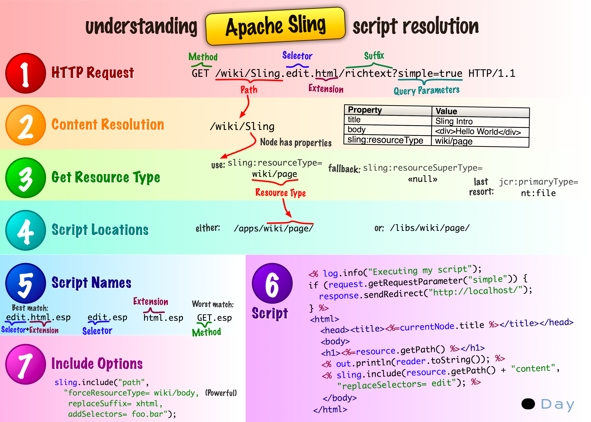
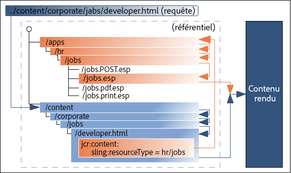

# Concepts de base d’AEM {#aem-core-concepts}

>[!NOTE]
>
>Avant d’étudier les concepts de base d’AEM, Adobe vous recommande de suivre le tutoriel WKND dans le document [Prise en main du développement de sites AEM](/help/sites-developing/getting-started.md) pour un aperçu du processus de développement AEM et une introduction aux concepts clés.

## Pré-requis pour développer sur AEM {#prerequisites-for-developing-on-aem}

Vous aurez besoin des compétences suivantes pour développer sur AEM :

* Une connaissance élémentaire des techniques d’application web, y compris :

   * le cycle de requête-réponse (XMLHttpRequest/XMLHttpResponse)
   * HTML
   * CSS
   * JavaScript

* Une connaissance pratique d’Experience Server (CRX), y compris Content Explorer
* Pour développer dans l’IU classique, connaissances rudimentaires de JSP (JavaServer Pages), notamment comprendre et savoir modifier des exemples JSP simples.

Il est également recommandé de lire et de suivre les [Recommandations et bonnes pratiques](/help/sites-developing/dev-guidelines-bestpractices.md).

## Référentiel de contenu Java {#java-content-repository}

La norme Java Content Repository (JCR), [JSR 283](https://docs.adobe.com/content/docs/en/spec/jcr/2.0/index.html), spécifie un moyen, indépendant du fournisseur et de l’implémentation, d’accéder au contenu d’un référentiel de contenu à un niveau granulaire et de manière bidirectionnelle.

Les spécifications sont gérées par Adobe Research (Suisse) AG.

Le module [JCR API 2.0](https://docs.adobe.com/docs/en/spec/javax.jcr/javadocs/jcr-2.0/index.html), javax.jcr.&amp;ast; est utilisée pour l’accès direct et la manipulation du contenu du référentiel.

## Experience Server (CRX) et Jackrabbit {#experience-server-crx-and-jackrabbit}

Experience Server fournit des services Experience sur lesquels AEM est basé et qui peuvent servir à créer des applications personnalisées. Il intègre le référentiel de contenu basé sur Jackrabbit.

[Apache Jackrabbit](https://jackrabbit.apache.org/) est une implémentation open source entièrement conforme de l’API JCR 2.0.

## Traitement de requête Sling {#sling-request-processing}

### Introduction à Sling {#introduction-to-sling}

AEM repose sur [Sling ](https://sling.apache.org/site/index.html), un framework d’application web basé sur des principes REST. Il facilite le développement d’applications orientées contenu. Sling utilise un référentiel JCR, tel que Apache Jackrabbit, ou dans le cas d’AEM, le référentiel de contenu CRX, comme magasin de données. The Apache Software Foundation a contribué au développement de Sling. Plus d’informations sont disponibles sur Apache.

Avec Sling, le type de contenu à diffuser n’est pas la première considération en matière de traitement. Il s’agit plutôt de savoir si l’URL se résout en un objet de contenu pour lequel un script peut ensuite être identifié afin d’effectuer le rendu. Les auteurs de contenu web bénéficient ainsi d’un excellent support pour créer des pages facilement personnalisables selon leurs besoins.

Les avantages liés à cette flexibilité sont évidents dans les applications comportant un vaste éventail d’éléments de contenu différents ou dans les cas où des pages facilement personnalisables sont nécessaires. En particulier, lors de la mise en œuvre d’un système de gestion de contenu web comme celui de la solution AEM.

See [Discover Sling in 15 minutes](https://sling.apache.org/documentation/getting-started/discover-sling-in-15-minutes.html) for the first steps for developing with Sling.

Le schéma suivant explique la résolution du script sling : il montre comment passer de la requête HTTP au nœud de contenu, du nœud de contenu au type de ressource, du type de ressource au script, ainsi que les variables de script sont disponibles.



Le schéma suivant décrit tous les paramètres de requête invisibles, mais puissants, que vous pouvez utiliser avec SlingPostServlet, le gestionnaire par défaut pour toutes les requêtes POST. Ce dernier offre des options infinies pour créer, modifier, supprimer, copier et déplacer des nœuds dans le référentiel.


### Sling est centré sur le contenu {#sling-is-content-centric}

Sling est *centré sur le contenu*. Cela signifie que le traitement est axé sur le contenu au moment où chaque requête (HTTP) est mappée avec le contenu sous la forme d’une ressource JCR (un nœud de référentiel) :

* la première cible est la ressource (nœud JCR) contenant le contenu
* ensuite, la représentation, ou script, est localisée à partir des propriétés de ressource en combinaison avec certaines parties de la requête (par exemple des sélecteurs et/ou l’extension)

### Sling RESTful {#restful-sling}

En raison de son approche centrée sur le contenu, Sling implémente un serveur orienté REST et propose ainsi un nouveau concept dans les frameworks d’applications web. Les avantages sont les suivants :

* très bon niveau RESTful, pas seulement en surface ; les ressources et les représentations sont correctement modélisées dans le serveur
* supprime un ou plusieurs modèles de données

   * auparavant, les éléments suivants étaient nécessaires : structure d’URL, objets métier, schéma de base de données ;
   * ils sont désormais réduits à : URL = ressource = structure JCR

### Décomposition d’URL {#url-decomposition}

Dans Sling, le traitement est piloté par l’URL de la requête de l’utilisateur. C’est l’URL qui définit le contenu à afficher par les scripts appropriés. Pour ce faire, les informations sont extraites de l’URL.

Si nous analysons l’URL suivante :

```xml
https://myhost/tools/spy.printable.a4.html/a/b?x=12
```

Nous pouvons la décomposer comme suit :

| protocol | host | content path | selector(s) | extension |  | suffix |  | param(s) |
|---|---|---|---|---|---|---|---|---|
| https:// | myhost | outils/espion | .printable.a4. | html | / | a/b | ? | x=12 |

**protocole** HTTP

**nom d’hôte** du site Web.

**chemin d’accès** au contenu spécifiant le contenu à rendre. Est utilisé en combinaison avec l’extension. Dans cet exemple, on obtient tools/spy.html.

**sélecteur(s)** utilisé(s) pour d’autres méthodes de rendu du contenu ; dans cet exemple, une version compatible avec les imprimantes au format A4.

**format de contenu de l&#39;extension** ; spécifie également le script à utiliser pour le rendu.

**suffixe** Peut être utilisé pour spécifier des informations supplémentaires.

**param(s)** Tout paramètre requis pour le contenu dynamique.

#### De l’URL au contenu et aux scripts {#from-url-to-content-and-scripts}

Selon ces principes :

* le mappage utilise le chemin d’accès au contenu extrait de la requête pour localiser la ressource
* lorsque la ressource appropriée est localisée, le type de ressource sling est extrait et utilisé pour localiser le script à appliquer pour le rendu du contenu

La figure ci-dessous illustre le mécanisme (décrit plus en détail dans les sections suivantes).



With Sling, you specify which script renders a certain entity (by setting the `sling:resourceType` property in the JCR node). Ce mécanisme offre plus de liberté que celui selon lequel le script accède aux entités de données (comme le ferait une instruction SQL dans un script PHP) puisqu’une ressource peut avoir plusieurs rendus.

#### Mappage des requêtes avec les ressources {#mapping-requests-to-resources}

La requête est décomposée et les informations nécessaires sont extraites. Une recherche de la ressource demandée (nœud de contenu) est effectuée dans le référentiel :

* first Sling checks whether a node exists at the location specified in the request; e.g. `../content/corporate/jobs/developer.html`
* if no node is found, the extension is dropped and the search repeated; e.g. `../content/corporate/jobs/developer`
* si aucun nœud n’est trouvé, Sling retourne le code http 404 (Not Found).

Sling permet également à des éléments autres que des nœuds JCR d’être des ressources, mais il s’agit là d’une fonctionnalité avancée.

### Localisation du script {#locating-the-script}

Lorsque la ressource appropriée (nœud de contenu) est localisée, le **type de ressource sling** est extrait. C’est un chemin qui localise le script à utiliser pour le rendu du contenu.

The path specified by the `sling:resourceType` can be either:

* absolu
* relative, à un paramètre de configuration

   Les chemins relatifs sont recommandés par Adobe, car ils augmentent la portabilité.

All Sling scripts are stored in subfolders of either `/apps` or `/libs`, which will be searched in this order (see [Customizing Components and Other Elements](/help/sites-developing/dev-guidelines-bestpractices.md#customizing-components-and-other-elements)).

Autres points à noter sont :

* si la méthode (GET, POST) est requise, elle est indiquée en majuscules selon la spécification HTTP, par ex. jobs.POST.esp (voir ci-dessous)
* divers moteurs de script sont pris en charge :

   * `.esp, .ecma`: Pages ECMAScript (JavaScript) (exécution côté serveur)
   * `.jsp`: Pages Java Server (exécution côté serveur)
   * `.java`: Compilateur Java Servlet (exécution côté serveur)
   * `.jst`: Modèles JavaScript (exécution côté client)

The list of script engines supported by the given instance of AEM are listed on the Felix Management Console ( `http://<host>:<port>/system/console/slingscripting`).

En outre, Apache Sling prend en charge l’intégration avec d’autres moteurs de script répandus (par exemple, Groovy, JRuby, Freemarker) et offre un moyen d’intégrer de nouveaux moteurs de script.

Using the above example, if the `sling:resourceType` is `hr/jobs` then for:

* Requêtes GET/HEAD et URL se terminant par .html (types de requête par défaut, format par défaut)

   Le script sera /apps/hr/jobs/jobs.esp; la dernière section de sling:resourceType forme le nom de fichier.

* Requêtes POST (tous les types de requête, à l’exception de GET/HEAD, le nom de la méthode doit être en majuscules)

   POST sera utilisé dans le nom du script.

   Le script sera `/apps/hr/jobs/jobs.POST.esp`écrit.

* URL dans d’autres formats, ne se terminant pas par .html

   Par exemple `../content/corporate/jobs/developer.pdf`

   Le script sera `/apps/hr/jobs/jobs.pdf.esp`; le suffixe est ajouté au nom du script.

* URL avec sélecteurs

   Les sélecteurs peuvent être utilisés pour afficher le même contenu dans un autre format. Par exemple une version imprimable, un flux rss ou un résumé.

   Si nous regardons une version adaptée à l&#39;imprimante dans laquelle le sélecteur peut être *imprimé*; comme dans `../content/corporate/jobs/developer.print.html`

   Le script sera `/apps/hr/jobs/jobs.print.esp`; le sélecteur est ajouté au nom du script.

* Si aucun sling:resourceType a été défini alors :

   * le chemin d’accès au contenu est utilisé pour rechercher un script correspondant (si ResourceTypeProvider basé sur un chemin est actif).

      For example, the script for `../content/corporate/jobs/developer.html` would generate a search in `/apps/content/corporate/jobs/`.

   * le type de nœud principal est utilisé.

* Si aucun script n’est trouvé, le script par défaut est utilisé.

   Le rendu par défaut est actuellement pris en charge sous la forme de texte brut (.txt), HTML (.html) et JSON (.json) qui répertorie toutes les propriétés du nœud (correctement mises en forme). Le rendu par défaut pour l’extension .res, ou les requêtes sans extension de requête, consiste à spouler la ressource (si possible).
* Pour la gestion des erreurs http (codes 403 ou 404), Sling recherche un script dans :

   * l’emplacement /apps/sling/servlet/errorhandler pour [scripts personnalisés](/help/sites-developing/customizing-errorhandler-pages.md)
   * ou l’emplacement des scripts standard /libs/sling/servlet/errorhandler/403.esp ou 404.esp respectivement.

Si plusieurs scripts s’appliquent pour une requête donnée, celui avec la meilleure correspondance est sélectionné. Plus une correspondance est spécifique, mieux c’est. En d’autres termes, plus le sélecteur correspond meilleur est le résultat, quelle que soit l’extension de requête ou la correspondance de nom de méthode.

For example, consider a request to access the resource
`/content/corporate/jobs/developer.print.a4.html`
of type
`sling:resourceType="hr/jobs"`

En supposant que les scripts suivants sont présents dans l’emplacement correct :

1. `GET.esp`
1. `jobs.esp`
1. `html.esp`
1. `print.esp`
1. `print.html.esp`
1. `print/a4.esp`
1. `print/a4/html.esp`
1. `print/a4.html.esp`

L’ordre de préférence serait (8) - (7) - (6) - (5) - (4) - (3) - (2) - (1).

En plus des types de ressources (principalement définis par la propriété `sling:resourceType`), il existe également le super type de ressource. This is generally indicated by the `sling:resourceSuperType` property. Ces super types sont aussi pris en compte lors de la recherche d’un script. Les super types de ressources présentent l’avantage de former une hiérarchie de ressources où le type de ressource par défaut `sling/servlet/default` (utilisé par les servlets par défaut) est effectivement la racine.

Le super type de ressource d’une ressource peut être défini de deux manières :

* by the `sling:resourceSuperType` property of the resource.
* by the `sling:resourceSuperType` property of the node to which the `sling:resourceType` points.

Par exemple :

* /

   * a
   * b

      * sling:resourceSuperType = a
   * c

      * sling:resourceSuperType = b
   * x

      * sling:resourceType = c
   * y

      * sling:resourceType = c
      * sling:resourceSuperType = a


Hiérarchie de types de :

* `/x`
   * sont celles du `[ c, b, a, <default>]`
* while for `/y`
   * la hiérarchie est `[ c, a, <default>]`

This is because `/y` has the `sling:resourceSuperType` property whereas `/x` does not and therefore its supertype is taken from its resource type.

#### Les scrips Sling ne peuvent pas être appelés directement {#sling-scripts-cannot-be-called-directly}

Dans Sling, les scripts ne peuvent pas être appelés directement car cela est contraire au strict concept d’un serveur REST. Sinon, vous mélangeriez les ressources et les représentations.

Si vous appelez la représentation (le script) directement, vous masquez la ressource dans le script, donc le framework (Sling) ne peut plus la détecter. Ainsi, vous perdez certaines fonctionnalités :

* le traitement automatique des méthodes http autres que GET, y compris :

   * les méthodes POST, PUT, DELETE qui sont gérées avec une implémentation par défaut de Sling
   * the `POST.jsp` script in your sling:resourceType location

* l’architecture du code perd de son intégrité et de sa structure qui sont primordiales dans les développements à grande échelle

### API Sling {#sling-api}

Elle utilise le module API Sling org.apache.sling.Bibliothèques &amp;amp ; ast ; et de balises.

### Référencement d’éléments existants avec sling:include {#referencing-existing-elements-using-sling-include}

En dernier lieu, il faut considérer la nécessité de référencer les éléments existants dans les scripts.

More complex scripts (aggregating scripts) might need to access multiple resources (for example navigation, sidebar, footer, elements of a list) and do so by including the *resource*.

Pour ce faire, vous pouvez utiliser la commande sling:include(&quot;/&lt;chemin>/&lt;ressource>&quot;). Cela inclut effectivement la définition de la ressource référencée, comme dans l’instruction suivante qui fait référence à une définition existante pour le rendu des images :

```xml
%><sling:include resourceType="geometrixx/components/image/img"/><%
```

## OSGI {#osgi}

OSGi désigne une architecture permettant de développer et de déployer des applications et des bibliothèques modulaires (également connu sous le nom de Dynamic Module System for Java). Les conteneurs OSGi vous permettent de décomposer votre application en modules distincts (des fichiers jar contenant des méta-informations supplémentaires appelés « bundles » dans le jargon OSGi) et de gérer les interdépendances qui existent entre eux avec :

* des services mis en œuvre dans le conteneur
* un contrat entre le conteneur et votre application

Ces services et contrats forment une architecture permettant à des éléments distincts de se détecter dynamiquement pour la collaboration.

Le framework OSGi offre ensuite le chargement/déchargement dynamique, la configuration et le contrôle de ces bundles, sans nécessiter de redémarrage.

>[!NOTE]
>
>Full information on OSGi technology can be found at the [OSGi website](https://www.osgi.org).
>
>En particulier, la page Basic Education (formation de base) contient un ensemble de présentations et de tutoriels.

Cette architecture vous permet d’étendre Sling en lui ajoutant des modules spécifiques aux applications. Sling, et donc CQ5, utilise l’implémentation [Apache Felix](https://felix.apache.org/) d’OSGI (Open Services Gateway Initiative) et est basé sur les spécifications OSGi Service Platform Release 4, Version 4.2. Ce sont deux ensembles de bundles OSGi exécutés dans un framework OSGi.

Cette extension permet d’appliquer les actions suivantes à l’un des modules dans votre installation :

* installation
* démarrage
* arrêt
* mise à jour
* désinstallation
* voir l’état actuel
* accéder à des informations plus détaillées (par exemple, nom symbolique, version, emplacement, etc.) pour des bundles en particulier

Pour plus d’informations, reportez-vous à [Console web](/help/sites-deploying/web-console.md), [Configuration OSGI](/help/sites-deploying/configuring-osgi.md) et [Paramètres de configuration OSGi](/help/sites-deploying/osgi-configuration-settings.md).

## Objets de développement dans l’environnement AEM {#development-objects-in-the-aem-environment}

Les éléments suivants présentent un intérêt pour le développement :

**Élément** Un élément est soit un noeud, soit une propriété.

Pour plus d’informations sur la manipulation des objets Item, reportez-vous aux [Javadocs](https://docs.adobe.com/docs/en/spec/javax.jcr/javadocs/jcr-2.0/javax/jcr/Item.html) de l’interface javax.jcr.Item.

**Noeud (et leurs propriétés)** Les noeuds et leurs propriétés sont définis dans la spécification JCR API 2.0 (JSR 283). Ils stockent le contenu, les définitions d’objets, les scripts de rendu et d’autres données.

Les nœuds définissent la structure du contenu et leurs propriétés stockent le contenu réel et les métadonnées.

Les nœuds de contenu pilotent le rendu. Sling récupère le nœud de contenu de la requête entrante. La propriété sling:resourceType de ce nœud pointe vers le composant de rendu Sling à utiliser.

Un nœud, qui est un nom JCR, est également appelé « ressource » dans l’environnement Sling.

Par exemple, pour obtenir les propriétés du nœud actif, vous pouvez utiliser le code suivant dans votre script :

`PropertyIterator properties = currentNode.getProperties();`

Avec currentNode comme objet de noeud actif.

Pour plus d’informations sur la manipulation des objets Node, reportez-vous aux [Javadocs](https://docs.adobe.com/docs/en/spec/javax.jcr/javadocs/jcr-2.0/javax/jcr/Node.html).

**Widget** Dans AEM, toutes les entrées utilisateur sont gérées par des widgets. Ceux-ci sont souvent utilisés pour contrôler la modification d’un contenu.

Les boîtes de dialogue sont construites en combinant des Widgets.

AEM a été développé à partir de la bibliothèque de widgets ExtJS.

**Boîte de dialogue** Une boîte de dialogue est un type spécial de widget.

Pour modifier le contenu, AEM utilise des boîtes de dialogue définies par le développeur de l’application. Celles-ci combinent une série de widgets pour présenter à l’utilisateur tous les champs et toutes les actions nécessaires pour modifier le contenu associé.

Les boîtes de dialogue servent également à modifier les métadonnées et sont utilisées par divers outils d’administration.

**Composant** Un composant logiciel est un élément système offrant un service ou un événement prédéfini et capable de communiquer avec d&#39;autres composants.

Dans AEM, un composant est souvent utilisé pour effectuer le rendu du contenu d’une ressource. Lorsque la ressource est une page, le composant chargé de son rendu est appelé « composant de niveau supérieur » ou « composant de page ». Cependant, un composant n’effectue pas nécessairement le rendu de contenu, ni n’est lié à une ressource spécifique. Par exemple, un composant de navigation affiche des informations sur plusieurs ressources.

La définition d’un composant comprend :

* le code utilisé pour le rendu du contenu
* une boîte de dialogue pour la saisie utilisateur et la configuration du contenu résultant.

**Modèle** Un modèle est la base d&#39;un type de page spécifique. Lors de la création d’une page dans l’onglet Sites web, l’utilisateur doit sélectionner un modèle. La nouvelle page est ensuite créée en copiant ce modèle.

Un modèle est une hiérarchie de nœuds qui a la même structure que la page à créer, mais sans contenu réel.

Il définit le composant de page utilisé pour afficher la page et le contenu par défaut (contenu principal de premier niveau). Le contenu définit la façon dont il est rendu car AEM est centré sur le contenu.

**Composant de page (composant de niveau supérieur)** Composant à utiliser pour générer la page.

**Page** A est une &#39;instance&#39; d&#39;un modèle.

Une page comporte un nœud de hiérarchie de type cq:Page et un nœud de contenu de type cq:PageContent. La propriété sling:resourceType du nœud de contenu pointe vers le composant de page utilisé pour le rendu de la page.

Par exemple, pour obtenir le nom de la page active, vous pouvez utiliser le code suivant dans votre script :

S`tring pageName = currentPage.getName();`

Avec currentPage comme objet de page actif. Pour plus d’informations sur la manipulation des objets Page, reportez-vous aux [Javadocs](https://helpx.adobe.com/fr/experience-manager/6-5/sites/developing/using/reference-materials/javadoc/com/day/cq/wcm/api/Page.html).

**Gestionnaire** de pages Le gestionnaire de pages est une interface qui fournit des méthodes pour les opérations au niveau de la page.

Par exemple, pour obtenir la page de contenu d’une ressource, vous pouvez utiliser le code suivant dans votre script :

Page myPage = pageManager.getContainingPage(myResource);

Avec pageManager en tant qu’objet gestionnaire de pages et myResource en tant qu’objet de ressource. Pour plus d’informations sur les méthodes fournies par le gestionnaire de page, reportez-vous aux [Javadocs](https://helpx.adobe.com/fr/experience-manager/6-5/sites/developing/using/reference-materials/javadoc/com/day/cq/wcm/api/PageManager.html).

## Structure dans le référentiel {#structure-within-the-repository}

La liste suivante donne un aperçu de la structure que vous verrez dans le référentiel.

>[!CAUTION]
>
>Les modifications apportées à cette structure, ou aux fichiers qu’elle contient, doivent l’être prudemment.
>
>Des changements sont nécessaires lors du développement, mais il faut toutefois bien comprendre les conséquences de tout changement apporté.

>[!CAUTION]
>
>Vous ne devez rien modifier dans le chemin `/libs`. For configuration and other changes copy the item from `/libs` to `/apps` and make any changes within `/apps`.

* `/apps`

    Application connexe qui inclut des définitions de composants spécifiques à votre site web. Les composants que vous développez peuvent être basés sur les composants prêts à l’emploi disponibles dans `/libs/foundation/components`.

* `/content`

   Contenu créé pour votre site Web.

* `/etc`

* `/home`

   Informations sur l’utilisateur et le groupe.

* `/libs`

    Bibliothèques et définitions appartenant au noyau d’AEM. The sub-folders in `/libs` represent the out of the box AEM features as for example search or replication. The content in `/libs` should not be modified as it affects the way AEM works. Features specific to your website should be developed under `/apps` (see [Customizing Components and Other Elements](/help/sites-developing/dev-guidelines-bestpractices.md#customizing-components-and-other-elements)).

* `/tmp`

   Espace de travail temporaire.

* `/var`

   / Fichiers qui évoluent et sont mis à jour par le système, tels que les journaux d’audit, les statistiques, la gestion des événements. The sub-folder `/var/classes` contains the java servlets in source and compiled forms that have been generated from the components scripts.

## Environnements {#environments}

Avec AEM, un environnement de production se compose souvent de deux types d’instances différents : [une instance de création et une instance de publication](/help/sites-deploying/deploy.md#author-and-publish-installs).

## Le dispatcher {#the-dispatcher}

Le dispatcher est un outil Adobe qui sert à la mise en cache et/ou l’équilibrage de charge. Plus d’informations sont disponibles sous [le dispatcher](https://helpx.adobe.com/experience-manager/dispatcher/user-guide.html).

## FileVault (système de révision de code source) {#filevault-source-revision-system}

FileVault fournit à votre référentiel JCR des fonctions de mappage du système de fichiers et de gestion des versions. Il permet de gérer des projets de développement AEM avec une prise en charge complète du stockage et de la gestion du code de projet, du contenu, des configurations, etc. dans des systèmes de gestion de versions standard (par exemple, Subversion).

Consultez la documentation [FileVault](/help/sites-developing/ht-vlttool.md) pour plus d’informations.

## Workflows {#workflows}

Votre contenu est souvent soumis à des processus organisationnels, y compris des étapes telles que l’approbation et la validation par différents participants. Ces processus peuvent être représentés comme des workflows [définis et développés dans AEM](/help/sites-developing/workflows-models.md), puis appliqués aux pages de contenu [appropriées](/help/sites-administering/workflows.md) ou [actifs numériques](/help/assets/assets-workflow.md), selon les besoins.

Le moteur de workflow sert à gérer l’implémentation de vos workflows et leur application ultérieure sur votre contenu.

## Gestion multisite {#multi-site-management}

Multi Site Manager (MSM) permet de gérer facilement plusieurs sites web partageant du contenu commun. MSM vous permet de définir des relations entre les sites afin que les modifications de contenu d’un site soient automatiquement répliquées sur d’autres sites.

Par exemple, les sites web sont souvent proposés dans plusieurs langues à l’intention d’un public international. Lorsque le nombre de sites dans la même langue est faible (trois à cinq), un processus manuel de synchronisation du contenu entre les sites est possible. Cependant, dès que le nombre de sites augmente ou si plusieurs langues sont concernées, il est plus efficace d’automatiser le processus.

* Gérer efficacement différentes versions de langue d’un site web.
* Mettre à jour automatiquement un ou plusieurs sites d’après un seul site source :

   * Appliquer une structure de base commune et utiliser du contenu commun sur plusieurs sites.
   * Maximiser l’utilisation des ressources disponibles.
   * Uniformiser l’aspect de plusieurs sites.
   * Concentrer les efforts sur la gestion de contenu qui diffère entre les sites.

Pour plus d’informations, voir [Multi Site Manager](/help/sites-administering/msm.md).