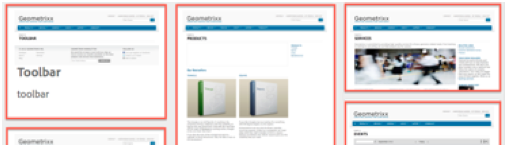

# Concepts de l’interface utilisateur tactile de Adobe Experience Manager{#concepts-of-the-aem-touch-enabled-ui}

Adobe Experience Manager (AEM) comprend une interface utilisateur tactile avec [responsive design](/help/sites-authoring/responsive-layout.md) pour l’environnement de création conçu pour fonctionner sur les périphériques tactiles et de bureau.

>[!NOTE]
>
>L’IU tactile est l’IU standard d’AEM. L’IU classique est devenue obsolète avec AEM 6.4.

L’interface utilisateur tactile se compose des éléments suivants :

* L’en-tête de la suite qui :
   * affiche le logo,
   * fournit un lien vers la navigation globale,
   * Fournit un lien vers d’autres actions génériques, telles que Rechercher, Aide, Solutions Experience Cloud, Notifications et Paramètres utilisateur.
* Le rail de gauche (affiché lorsque cela s’avère nécessaire et pouvant être masqué) qui peut afficher les options suivantes :
   * Chronologie
   * Références
   * Filtres
* L’en-tête de navigation, qui est à nouveau contextuel et peut afficher :
   * Indique la console que vous utilisez actuellement, ou votre emplacement, ou les deux, dans cette console.
   * Sélection du rail de gauche
   * Chemin de navigation
   * Accès aux actions **Créer** appropriées
   * Affichage des sélections
* La zone de contenu qui :
   * Répertorie les éléments de contenu (qu’il s’agisse de pages, de ressources, de publications de forum, etc.)
   * Peut être formaté selon les besoins, par exemple, colonne, carte ou liste
   * utilise la technologie responsive design (l’affichage est redimensionné automatiquement en fonction de la taille de l’appareil et/ou de la fenêtre),
   * Utilise le défilement infini (plus de pagination, tous les éléments sont répertoriés dans une seule fenêtre).


>[!NOTE]
>
>Presque toutes les fonctionnalités d’AEM ont été transférées vers l’interface utilisateur tactile. Cependant, dans certains cas, la fonctionnalité revient à l’IU classique. Voir [État des fonctionnalités de l’interface utilisateur tactile](/help/release-notes/touch-ui-features-status.md) pour plus d’informations.

L’interface utilisateur tactile a été conçue par Adobe pour assurer la cohérence de l’expérience utilisateur sur plusieurs produits. Elle est basée sur :

* **IU Coral** (CUI) une mise en oeuvre du style visuel de l’Adobe pour l’interface utilisateur tactile. L’IU Coral fournit tout ce dont votre produit, projet ou application web a besoin pour adopter le style visuel de l’IU.
* **IU Granite** Les composants sont créés avec l’interface utilisateur Coral.

Les principes de base de l’interface utilisateur tactile sont les suivants :

* Mobile d’abord (en gardant à l’esprit le bureau)
* Responsive design
* Affichage contextuel
* Réutilisable
* Inclure la documentation de référence incorporée
* Inclure des tests incorporés
* Une conception de bas en haut pour garantir que ces principes sont appliqués à chaque élément et composant

Pour une présentation plus détaillée de la structure de l’interface utilisateur tactile, voir [Structure de l’IU tactile AEM](/help/sites-developing/touch-ui-structure.md).

## Pile technologique AEM {#aem-technology-stack}

AEM utilise la plateforme Granite comme base et la plateforme Granite inclut, entre autres, le référentiel de contenu Java™.


## Granite {#granite}

Granite est la pile Open Web de l’Adobe, qui fournit divers composants, notamment :

* Lanceur d’applications
* une structure OSGi dans laquelle tout est déployé ;
* Plusieurs services de compendium OSGi pour prendre en charge la création d’applications
* Une structure de journalisation complète fournissant diverses API de journalisation
* Implémentation du référentiel CRX de la spécification API JCR
* Structure web Apache Sling
* Parties supplémentaires du produit CRX actuel

>[!NOTE]
>
>Granite est exécuté en tant que projet de développement ouvert au sein de l’Adobe : des contributions au code, aux discussions et aux problèmes sont apportées à l’ensemble de l’entreprise.
>
>Cependant, Granite est **not** un projet open source. Il est fortement basé sur plusieurs projets open source (Apache Sling, Felix, Jackrabbit, et Lucene en particulier), mais l&#39;Adobe trace une ligne claire entre ce qui est public et ce qui est interne.

## IU Granite {#granite-ui}

La plateforme d’ingénierie Granite fournit également une structure d’interface utilisateur de base. Les principaux objectifs sont les suivants :

* Fournir des widgets d’IU détaillés
* Mettez en oeuvre les concepts de l’interface utilisateur et illustrez les bonnes pratiques (rendu de listes longues, filtrage par listes, CRUD d’objet, assistants CUD, etc.).
* Fournir une interface utilisateur d’administration extensible basée sur des modules externes

Ils respectent les exigences suivantes :

* Respecter &quot;le mobile d&#39;abord&quot;
* Être extensible
* Soyez facile à remplacer


GraniteUI.pdf

[Obtenir le fichier](assets/graniteui.pdf)
L’IU Granite :

* Utilise l’architecture RESTful de Sling
* Mise en oeuvre de bibliothèques de composants destinées à la création d’applications web centrées sur le contenu
* Fournit des widgets d’IU détaillés
* Fournit une interface utilisateur normalisée par défaut.
* Extensible
* Il est conçu pour les appareils mobiles et de bureau (respecte d’abord le mobile).
* Peut être utilisé dans n’importe quelle plateforme/produit/projet basé sur Granite ; par exemple, AEM


* [Composants de base de l’IU Granite](#granite-ui-foundation-components)
Cette bibliothèque de composants de base peut être utilisée ou étendue par d’autres bibliothèques.
* [Composants d’administration de l’IU Granite](#granite-ui-administration-components)

### Côté client et côté serveur {#client-side-vs-server-side}

La communication client-serveur dans l’interface utilisateur Granite se compose d’hypertexte, et non d’objets. Il n’est donc pas nécessaire que le client comprenne la logique commerciale.

* Le serveur enrichit le HTML de données sémantiques
* Le client enrichit l&#39;hypertexte avec hypermédia (interaction)


#### Côté client {#client-side}

Cela utilise une extension du vocabulaire de HTML, à condition que l’auteur puisse exprimer son intention de créer une application web interactive. Il s’agit d’une approche similaire à la [WAI-ARIA](https://www.w3.org/TR/wai-aria/) et [microformats](https://microformats.org/).

Il se compose principalement d’un ensemble de modèles d’interaction (par exemple, l’envoi asynchrone d’un formulaire) interprétés par des codes JS et CSS, exécutés côté client. Le rôle du côté client est d’améliorer le balisage (fourni comme support hypermédia par le serveur) pour l’interactivité.

Le côté client est indépendant de toute technologie de serveur. Tant que le serveur fournit le balisage approprié, le côté client peut remplir son rôle.

Actuellement, les codes JS et CSS sont fournis en tant que Granite. [clientlibs](/help/sites-developing/clientlibs.md) sous la catégorie :

`granite.ui.foundation and granite.ui.foundation.admin`

Elles sont distribuées dans le cadre du package de contenu :

`granite.ui.content`

#### Côté serveur {#server-side}

Il est formé par une collection de composants Sling qui permettent à l’auteur de *composer* une application web rapide. Le développeur développe des composants, l’auteur les assemble pour en faire une application web. Le rôle du côté serveur consiste à attribuer au client l’abordage hypermédia (balisage).

Actuellement, les composants se trouvent dans le référentiel Granite :

`/libs/granite/ui/components/foundation`

Il est distribué dans le cadre du package de contenu :

`granite.ui.content`

### Différences avec l’IU classique {#differences-with-the-classic-ui}

Il est aussi intéressant d’examiner les différences entre l’IU Granite et ExtJS (utilisé pour l’IU classique) :

<table>
 <tbody>
  <tr>
   <td><strong>ExtJS</strong></td>
   <td><strong>IU Granite</strong></td>
  </tr>
  <tr>
   <td>Appel de procédure à distance<br /> </td>
   <td>Transitions d’état</td>
  </tr>
  <tr>
   <td>Objets de transfert de données</td>
   <td>Hypermédia</td>
  </tr>
  <tr>
   <td>Le client connaît les paramètres internes du serveur.</td>
   <td>Le client ne connaît pas les informations internes.</td>
  </tr>
  <tr>
   <td>« Client lourd »</td>
   <td>« Client léger »</td>
  </tr>
  <tr>
   <td>Bibliothèques clientes spécialisées</td>
   <td>Bibliothèques client universelles</td>
  </tr>
 </tbody>
</table>

### Composants de base de l’IU Granite {#granite-ui-foundation-components}

La variable [Composants de base de l’IU Granite](https://developer.adobe.com/experience-manager/reference-materials/6-5/granite-ui/api/jcr_root/libs/granite/ui/index.html) fournissent les blocs de création de base nécessaires à la création de n’importe quelle interface utilisateur. Ils incluent, entre autres :

* Bouton
* Lien hypertexte
* Avatar de l’utilisateur

Les composants de base se trouvent sous :

`/libs/granite/ui/components/foundation`

Cette bibliothèque contient un composant d’IU Granite pour chaque élément Coral. Un composant est piloté par le contenu, sa configuration résidant dans le référentiel. Cela permet de composer une application IU Granite sans écrire manuellement de balises HTML.

Objectif :

* Modèle de composant des éléments HTML
* Composition du composant
* Test automatique des unités et des fonctionnalités

Mise en œuvre :

* Composition et configuration basées sur un référentiel
* Utilisation des fonctionnalités de test fournies par la plateforme Granite
* Modèle JSP

Cette bibliothèque de composants de base peut être utilisée ou étendue par d’autres bibliothèques.

### ExtJS et composants d’IU Granite correspondants {#extjs-and-corresponding-granite-ui-components}

Lors de la mise à niveau du code ExtJS pour utiliser l’interface utilisateur Granite, la liste suivante fournit un aperçu pratique des xtypes ExtJS et des types de noeuds avec leurs types de ressources d’interface utilisateur Granite équivalents.

| **ExtJS xtype** | **Type de ressource de l’IU Granite** |
|---|---|
| `button` | `granite/ui/components/foundation/form/button` |
| `checkbox` | `granite/ui/components/foundation/form/checkbox` |
| `componentstyles` | `cq/gui/components/authoring/dialog/componentstyles` |
| `cqinclude` | `granite/ui/components/foundation/include` |
| `datetime` | `granite/ui/components/foundation/form/datepicker` |
| `dialogfieldset` | `granite/ui/components/foundation/form/fieldset` |
| `hidden` | `granite/ui/components/foundation/form/hidden` |
| `html5smartfile, html5smartimage` | `granite/ui/components/foundation/form/fileupload` |
| `multifield` | `granite/ui/components/foundation/form/multifield` |
| `numberfield` | `granite/ui/components/foundation/form/numberfield` |
| `pathfield, paragraphreference` | `granite/ui/components/foundation/form/pathbrowser` |
| `selection` | `granite/ui/components/foundation/form/select` |
| `sizefield` | `cq/gui/components/authoring/dialog/sizefield` |
| `tags` | `granite/ui/components/foundation/form/autocomplete``cq/gui/components/common/datasources/tags` |
| `textarea` | `granite/ui/components/foundation/form/textarea` |
| `textfield` | `granite/ui/components/foundation/form/textfield` |

| **Type de nœud** | **Type de ressource de l’IU Granite** |
|---|---|
| `cq:WidgetCollection` | `granite/ui/components/foundation/container` |
| `cq:TabPanel` | `granite/ui/components/foundation/container``granite/ui/components/foundation/layouts/tabs` |
| `cq:panel` | `granite/ui/components/foundation/container` |

### Composants d’administration de l’IU Granite {#granite-ui-administration-components}

Les [composants d’administration de l’IU Granite](https://developer.adobe.com/experience-manager/reference-materials/6-5/granite-ui/api/jcr_root/libs/granite/ui/index.html) dépendent des composants de base pour fournir les éléments génériques que toute application d’administration peut implémenter. Il s’agit, entre autres :

* Barre de navigation globale
* Rail (squelette)
* Panneau de recherche

Objectif :

* Apparence unifiée pour les applications d’administration
* RAD pour les applications d’administration

Mise en œuvre :

* Composants prédéfinis utilisant les composants de base
* Les composants peuvent être personnalisés

## IU Coral {#coral-ui}

CoralUI.pdf

[Obtenir le fichier](assets/coralui.pdf)
L’IU Coral (CUI) est une implémentation du style visuel de l’Adobe pour l’IU tactile conçue pour assurer la cohérence de l’expérience utilisateur sur plusieurs produits. L’interface utilisateur Coral fournit tout ce dont vous avez besoin pour adopter le style visuel utilisé dans l’environnement de création.

>[!CAUTION]
>
>L’interface utilisateur Coral est une bibliothèque d’interface utilisateur mise à la disposition des clients AEM pour qu’ils puissent créer des applications et des interfaces web dans les limites de leur utilisation sous licence du produit.
>
>L’utilisation de l’IU Coral est autorisée uniquement dans les cas suivants :
>
>
>* Lorsqu’il a été expédié et regroupé avec AEM.
>* À utiliser lors de l’extension de l’interface utilisateur existante de l’environnement de création.
>* Documents marketing, publicités et présentations Adobe.
>* Interface utilisateur des applications de marque Adobe (la police ne doit pas être facilement disponible pour d’autres utilisations).
>* Avec des personnalisations mineures.
>
>L’utilisation de l’IU Coral doit être évitée dans :
>
>* Documents et autres éléments non liés à l’Adobe.
>* Environnements de création de contenu (où les éléments précédents peuvent être générés par d’autres personnes).
>* Applications/composants/pages web qui ne sont pas clairement connectés à Adobe.
>

L’IU Coral est un ensemble de composantes de base destinées au développement d’applications web.


Conçu pour être modulaire dès le départ, chaque module forme une couche distincte en fonction de son rôle principal. Bien que les calques aient été conçus pour se soutenir les uns les autres, ils peuvent également être utilisés indépendamment si nécessaire. Cela permet de mettre en oeuvre l’expérience utilisateur de Coral dans n’importe quel environnement compatible avec les HTMLS.

Avec l’interface utilisateur Coral, il n’est pas obligatoire d’utiliser un modèle de développement et/ou une plateforme spécifique. L’objectif principal de Coral est de fournir un balisage HTML5 unifié et propre, indépendamment de la méthode réelle utilisée pour émettre ce balisage. Il peut être utilisé pour le rendu côté client ou côté serveur, les modèles, JSP, PHP ou même les applications RIA Flash Adobe, pour n’en citer que quelques-unes.

### Éléments de HTML - Calque de balisage {#html-elements-the-markup-layer}

Les éléments de HTML offrent un aspect commun à tous les éléments de l’interface utilisateur de base (y compris la barre de navigation, les boutons, le menu, le rail, etc.).

Au niveau le plus élémentaire, un élément de HTML est une balise de HTML avec un nom de classe dédié. Les éléments plus complexes peuvent être composés de plusieurs balises, imbriquées les unes dans les autres (d’une manière spécifique).

Le code CSS est utilisé pour définir l’apparence réelle. Pour permettre de personnaliser facilement l’apparence (par exemple, dans le cas d’une valorisation de marque), les valeurs de style réelles sont déclarées en tant que variables qui sont développées par la variable [MOINS](https://lesscss.org/) pré-processeur pendant l’exécution.

Objectif :

* Fournir des éléments d’interface utilisateur de base avec une apparence commune
* Fournir le système de grille par défaut

Mise en œuvre :

* Balises de HTML avec styles inspirés de [Bootstrap](https://twitter.github.com/bootstrap/)
* Les classes sont définies dans les fichiers LESS.
* Les icônes sont définies comme des sprites de police.

Par exemple, le balisage suivant :

```xml
<button class="btn btn-large btn-primary" type="button">Large button</button>
<button class="btn btn-large" type="button">Large button</button>
```

s’affiche sous la forme :


L’apparence est définie dans un fichier LESS et liée à un élément par un nom de classe dédié (l’extrait suivant a été raccourci dans un souci de concision) :

```xml
.btn {
    font-size: @baseFontSize;
    line-height: @baseLineHeight;
    .buttonBackground(@btnBackground,
                                @btnBackgroundHighlight,
                                @grayDark, 0 1px 1px rgba(255,255,255,.75));
```

Les valeurs réelles sont définies dans un fichier de variables LESS (l’extrait suivant a été raccourci dans un souci de concision) :

```xml
@btnBackgroundHighlight: darken(@white, 10%);
@btnPrimaryBackgroundHighlight: spin(@btnPrimaryBackground, 20%);
@baseFontSize: 17px;
@baseFontFamily: @sansFontFamily;
```

### Modules externes d’éléments {#element-plugins}

La plupart des éléments de HTML doivent présenter un comportement dynamique, tel que l’ouverture et la fermeture des menus contextuels. Il s’agit du rôle des modules externes d’élément, qui exécutent de telles tâches en manipulant le DOM à l’aide de JavaScript.

Un module externe est soit :

* Conçu pour fonctionner sur un élément DOM spécifique. Par exemple, un module externe de boîte de dialogue s’attend à trouver `DIV class=dialog`.
* Générique par nature. Par exemple, un gestionnaire de mises en page fournit la disposition pour toute liste d’éléments `DIV` ou `LI`.

Le comportement du module externe peut être personnalisé avec des paramètres, en effectuant l’une des opérations suivantes :

* Transmission des paramètres avec un appel JavaScript
* Utilisation d’attributs `data-*` dédiés liés au balisage HTML

Bien que le développeur puisse choisir la méthode la mieux adaptée à chaque module externe, le principe de base consiste à utiliser les éléments suivants :

* Des attributs `data-*` pour les options relatives à la mise en page HTML. Par exemple, pour spécifier le nombre de colonnes
* Options/classes API pour les fonctionnalités liées aux données. Par exemple, construire la liste des éléments à afficher

Le même concept est utilisé pour implémenter la validation de formulaire. Pour un élément qui doit être validé, vous devez spécifier le formulaire de saisie requis sous la forme d’un attribut `data-*` personnalisé. Cet attribut est ensuite utilisé comme option pour un module externe de validation.

>[!NOTE]
>
>La validation de formulaire native au format HTML5 doit être utilisée lorsque cela s’avère possible et/ou s’il y a une volonté de l’enrichir.

Objectif :

* Fournir un comportement dynamique pour les éléments de HTML
* Fournir des mises en page personnalisées non possibles avec du code CSS pur
* Validation de formulaire
* Exécution d’une manipulation DOM avancée

Mise en œuvre :

* Module externe jQuery, lié à des éléments DOM spécifiques
* Utilisation d’attributs `data-*` pour personnaliser le comportement

Extrait de l’exemple de balisage (notez les options spécifiées sous la forme d’attributs data-&#42;) :

```xml
<ul data-column-width="220" data-layout="card" class="cards">
  <li class="item">
    <div class="thumbnail">
      
      <div class="caption">
        <h4>Toolbar</h4>
          <p><small>toolbar</small><br></p>
      </div>
    </div>
  </li>
  <li class="item">
    <div class="thumbnail">
      
      <div class="caption">
        <h4>Toolbar</h4>
        <p><small>toolbar</small><br></p>
      </div>
    </div>
  </li>
```

Appel au module externe jQuery :

```
$('.cards').cardlayout ();
```

Vous pouvez ainsi :



La variable `cardLayout` Le module externe met en forme l’objet `UL` en fonction de leurs hauteurs respectives et en tenant également compte de la largeur du parent.

### Widgets d’éléments de HTML {#html-elements-widgets}

Un widget combine un ou plusieurs éléments de base avec un module externe JavaScript pour former des éléments d’IU de &quot;niveau supérieur&quot;. Elles peuvent implémenter un comportement plus complexe, ainsi qu’un aspect plus complexe que celui qu’un seul élément peut fournir. Le sélecteur de balises et les widgets de rail constituent deux bons exemples.

Un widget peut se déclencher et écouter des événements personnalisés pour coopérer avec d’autres widgets sur la page. Certains widgets sont des widgets jQuery natifs qui utilisent les éléments de HTML Coral.

Objectif :

* Mise en oeuvre d’éléments d’interface utilisateur de niveau supérieur présentant un comportement complexe
* Déclenchement et gestion des événements

Mise en œuvre :

* Module externe jQuery + balisage de HTML
* Peut utiliser des modèles côté client/serveur

Voici un exemple de balisage :

```
<input type="text" name="tags" placeholder="Tags" class="tagManager"/>
```

L’appel au module externe jQuery (avec options) :

```
$(".tagManager").tagsManager({
        prefilled: ["Pisa", "Rome"] })
```

Le module externe émet un balisage de HTML (ce balisage utilise des éléments de base, qui peuvent utiliser d’autres modules externes en interne) :

```
<span>Pisa</code>
<a title="Removing tag" tagidtoremove="0"
   id="myRemover_0" class="myTagRemover" href="#">x</a></code>

<span id="myTag_1" class="myTag"><span>Rome</code>
<a title="Removing tag" tagidtoremove="1"
   id="myRemover_1" class="myTagRemover" href="#">x</a></code>

<input type="text" data-original-title="" class="input-medium tagManager"
       placeholder="Tags" name="tags" data-provide="typeahead" data-items="6"
       autocomplete="off">
```

Vous pouvez ainsi :


### Bibliothèque utilitaire {#utility-library}

Cette bibliothèque est une collection de modules externes et/ou de fonctions d’assistance JavaScript qui sont les suivants :

* Interface utilisateur indépendante
* Toutefois indispensable pour créer des applications web complètes

Il s’agit notamment de la gestion XSS et du bus d’événements.

Bien que les modules externes et les widgets des éléments de HTML puissent dépendre des fonctionnalités fournies par la bibliothèque d’utilitaires, celle-ci ne peut pas avoir de dépendance stricte vis-à-vis des éléments ou des widgets eux-mêmes.

Objectif :

* Fourniture de fonctionnalités communes
* Mise en oeuvre du bus d’événements
* Modèles côté client
* XSS

Mise en œuvre :

* Modules externes jQuery ou modules JavaScript compatibles AMD
