# Structure de l’interface utilisateur tactile d’AEM{#structure-of-the-aem-touch-enabled-ui}

L’interface utilisateur tactile d’AEM s’accompagne de plusieurs principes sous-jacents et se compose d’une série d’éléments clés :

## Consoles {#consoles}

### Redimensionnement et mise en page de base {#basic-layout-and-resizing}

L’interface utilisateur convient à la fois aux appareils mobiles et aux ordinateurs de bureau. Cependant, au lieu de créer deux styles distincts, Adobe a décidé d’utiliser un seul style qui fonctionne pour tous les écrans et terminaux.

Tous les modules utilisent la même disposition de base. Dans AEM, cela se traduit visuellement comme suit :

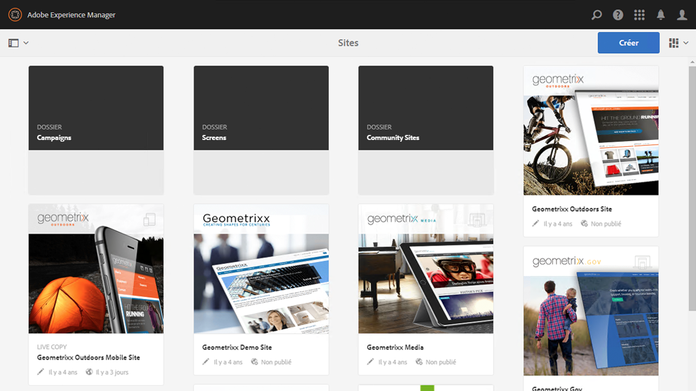

La disposition adhère au style Responsive Design et s’adapte à la taille de l’appareil ou de la fenêtre que vous utilisez.

Par exemple, si la résolution passe sous 1 024 pixels (comme c’est le cas sur un appareil mobile), l’affichage est adapté en conséquence :

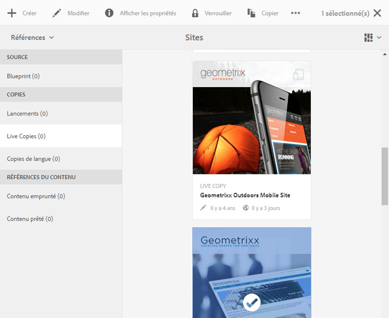

### Barre d’en-tête {#header-bar}

La barre d’en-tête affiche des éléments globaux, parmi lesquels :

* Le logo et le produit ou la solution spécifique en cours d’utilisation ; pour AEM, cela constitue également un lien vers la navigation globale
* Rechercher
* Une icône pour accéder aux ressources d’aide
* Une icône pour accéder à d’autres solutions
* Un indicateur pour les alertes et éléments de boîte de réception en attente (ainsi que la possibilité d’y accéder)
* L’icône de l’utilisateur, ainsi qu’un lien vers la gestion de votre profil

### Barre d’outils {#toolbar}

Le contenu de cette barre varie en fonction de l’emplacement. Elle affiche des outils permettant de contrôler la vue ou des ressources dans la page ci-dessous. La barre d’outils est propre au produit, mais elle contient des éléments communs.

Quel que soit l’emplacement, la barre d’outils affiche les actions actuellement disponibles :

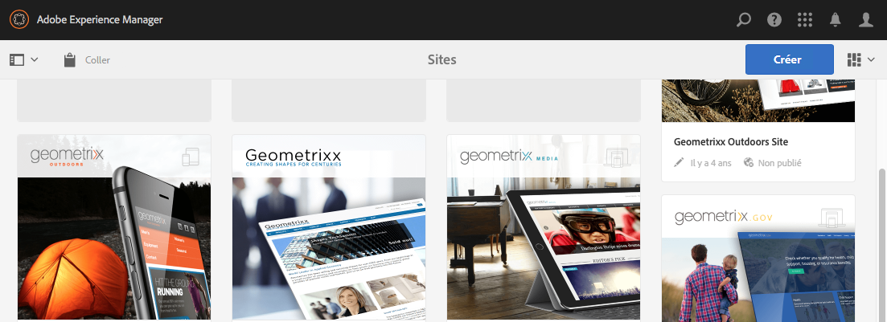

Le contenu dépend également du fait qu’une ressource est sélectionnée ou non :

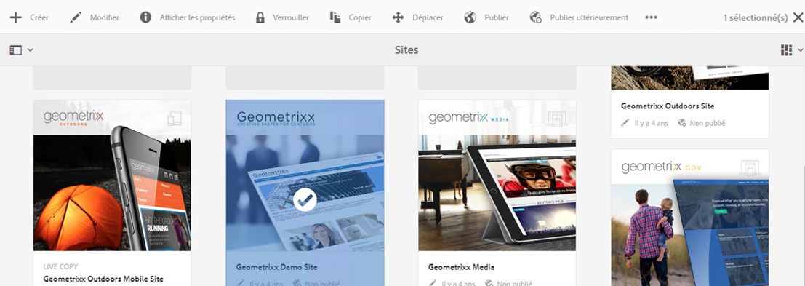

### Rail de gauche {#left-rail}

Le rail de gauche peut être ouvert/masqué suivant les besoins afin d’afficher les éléments suivants :

* **Chronologie**
* **Références**
* **Filtrer**

La valeur par défaut est **Contenu uniquement** (rail masqué).

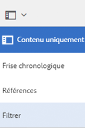

## Création de pages {#page-authoring}

Lors de la création de pages, les zones structurelles sont les suivantes.

### Cadre de contenu {#content-frame}

Le rendu du contenu de la page est effectué dans le cadre de contenu. Ce cadre de contenu est totalement indépendant de l’éditeur, afin de garantir l’absence de conflits dus à CSS ou JavaScript.

Le cadre de contenu se situe dans la partie droite de la fenêtre, sous la barre d’outils.

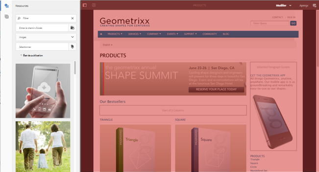

### Cadre d’éditeur {#editor-frame}

Le cadre d’éditeur exécute les fonctions d’édition.

Le cadre d’éditeur est un conteneur pour l’ensemble des *éléments de création de pages*. Il se situe au-dessus du cadre de contenu et comprend les éléments suivants :

* Barre d’outils supérieure
* Panneau latéral
* Toutes les incrustations
* Tout autre élément de création de pages ; la barre d’outils des composants, par exemple

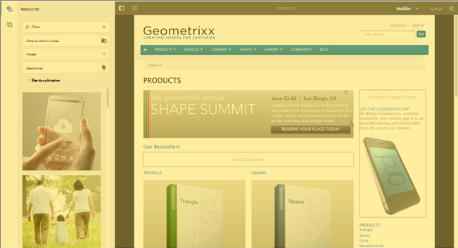

### Panneau latéral {#side-panel}

Ce panneau contient deux onglets par défaut pour vous permettre de sélectionner des ressources et des composants ; vous pouvez les faire glisser sur la page.

Par défaut, le panneau latéral est masqué. Lorsqu’il est sélectionné, soit il est affiché sur le côté gauche, soit il recouvre l’intégralité de la fenêtre (lorsque la largeur de la fenêtre est inférieure à 1 024 pixels ; sur un appareil mobile, par exemple).

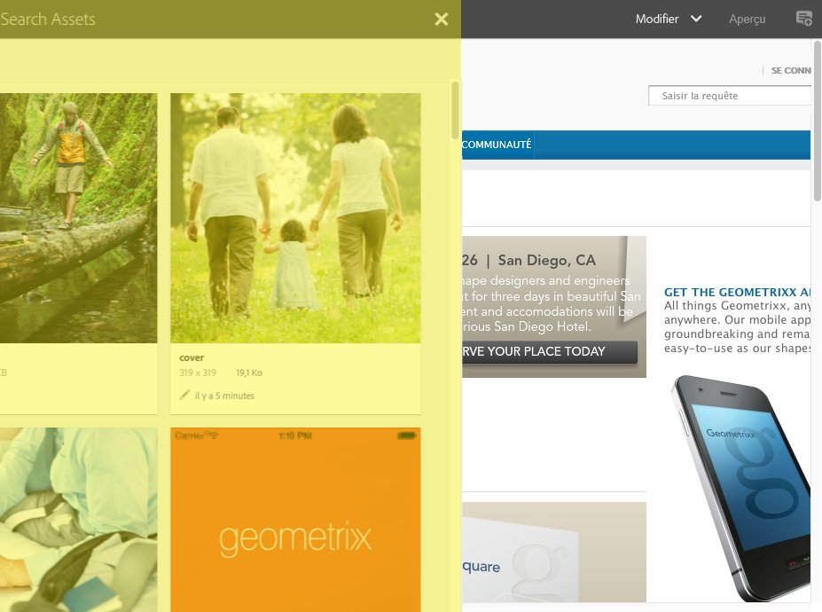

### Panneau latéral – Ressources {#side-panel-assets}

L’onglet Ressources vous permet de faire votre choix parmi un éventail de ressources. Vous pouvez également effectuer un filtrage sur un terme spécifique ou bien sélectionner un groupe.

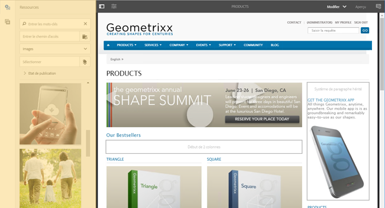

### Panneau latéral – Groupes de ressources {#side-panel-asset-groups}

L’onglet Ressources comprend un menu déroulant que vous pouvez utiliser pour sélectionner les groupes de ressources spécifiques.

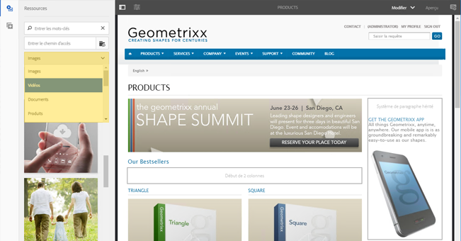

### Panneau latéral – Composants {#side-panel-components}

L’onglet Composants vous propose un éventail de composants à sélectionner. Vous pouvez également effectuer un filtrage sur un terme spécifique ou bien sélectionner un groupe.

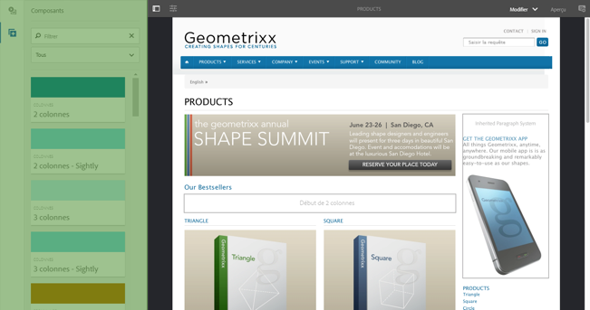

### Recouvrements {#overlays}

Ces recouvrements recouvrent le cadre de contenu et sont utilisés par les [calques](#layer) pour appliquer le mécanisme d’interaction (de manière complètement transparente) avec les composants et leur contenu.

Les recouvrements résident dans le cadre d’éditeur (avec tous les autres éléments de création de pages) même si, en fait, ils recouvrent les composants appropriés dans le cadre de contenu.

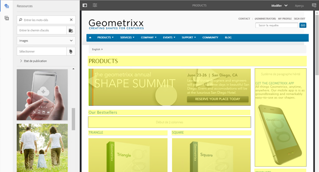

### Calque {#layer}

Un calque est un groupe indépendant de fonctionnalités pouvant être activées pour :

* fournir une vue différente de la page ;
* vous permettre de manipuler une page et/ou d’interagir avec celle-ci.

Les calques fournissent des fonctionnalités sophistiquées pour toute la page, par opposition aux actions spécifiques sur un composant individuel.

AEM s’accompagne de plusieurs calques qui sont déjà implémentés pour la création de pages. Il s’agit notamment des calques d’édition, de prévisualisation et d’annotation.

>[!NOTE]
>
>Les calques constituent une puissante solution qui affecte la manière dont l’utilisateur affiche le contenu de la page et interagit avec celui-ci. Lorsque vous développez vos propres calques, vous devez veiller à ce qu’ils soient effacés lorsque vous les quittez.

### Sélecteur de calques  {#layer-switcher}

Le sélecteur de calques vous permet de choisir le calque à utiliser. Lorsqu’il est fermé, il indique le calque en cours d’utilisation.

Le sélecteur de calques se présente sous la forme d’un menu déroulant dans la barre d’outils (dans la partie supérieure de la fenêtre, à l’intérieur du cadre d’éditeur).

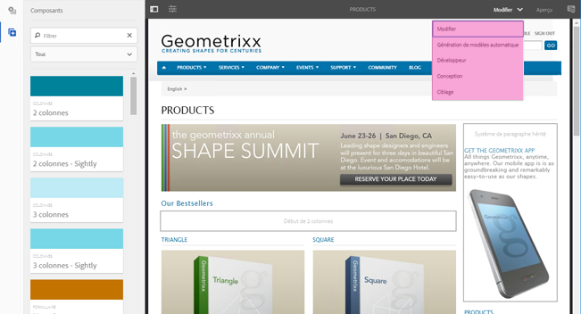

### Barre d’outils des composants {#component-toolbar}

Lorsque vous cliquez sur une instance d’un composant (simple clic ou double-clic lent), sa barre d’outils est affichée. Cette barre d’outils contient les actions (par exemple, copier, coller, ouvrir l’éditeur) qui sont disponibles pour l’instance du composant (Modifiable) sur la page.

En fonction de l’espace disponible, les barres d’outils de composant sont placées dans le coin supérieur, ou inférieur, droit du composant approprié.

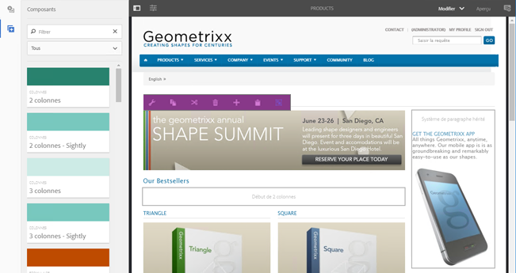

## Informations supplémentaires {#further-information}

Pour plus d&#39;informations sur les concepts relatifs à l&#39;interface utilisateur tactile, consultez l&#39;article [Concepts de l&#39;interface utilisateur tactile AEM](/help/sites-developing/touch-ui-concepts.md).

Pour plus d’informations techniques, voir la [documentation JS set](https://helpx.adobe.com/fr/experience-manager/6-5/sites/developing/using/reference-materials/jsdoc/ui-touch/editor-core/index.html) pour l’éditeur de page tactile.

