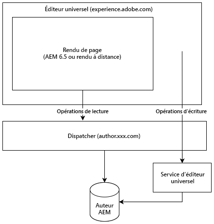

# Éditeur universel {#universal-editor}

Découvrez la flexibilité de l’éditeur universel et comment il peut vous aider à alimenter vos expériences découplées à l’aide d’AEM 6.5.

## Vue d’ensemble {#overview}

L’éditeur universel est un éditeur visuel polyvalent qui fait partie d’Adobe Experience Manager Sites. Il permet aux auteurs d’effectuer une modification ce que vous voyez est ce que vous obtenez (WYSIWYG) de n’importe quelle expérience découplée.

* Les auteurs bénéficient de la flexibilité de l’éditeur universel, car il prend en charge la même modification visuelle cohérente pour toutes les formes de contenu découplé AEM.
* Les développeurs bénéficient de la polyvalence de l’éditeur universel, car il prend également en charge le vrai découplage de l’implémentation. Il permet aux développeurs d’utiliser quasiment n’importe quel framework ou architecture de leur choix, sans imposer de contraintes de SDK ou de technologie.

Veuillez consulter la [documentation d’AEM as a Cloud Service sur l’éditeur universel](https://experienceleague.adobe.com/fr/docs/experience-manager-cloud-service/content/implementing/developing/universal-editor/introduction) pour plus d’informations.

## Architecture {#architecture}

L’éditeur universel est un service qui fonctionne en tandem avec AEM pour créer du contenu en mode découplé.

* L’éditeur universel est hébergé sur `https://experience.adobe.com/#/aem/editor/canvas` et peut modifier les pages rendues par AEM 6.5.
* La page AEM est lue par l’éditeur universel via le Dispatcher à partir de l’instance d’auteur AEM.
* Le service d’éditeur universel, qui s’exécute sur le même hôte que le Dispatcher, réécrit les modifications dans l’instance d’auteur AEM.



## Conditions requises {#requirements}

L’éditeur universel est pris en charge par :

* AEM 6.5
   * L’hébergement sur site et AMS est pris en charge.
* [AEM 6.5 LTS](https://experienceleague.adobe.com/fr/docs/experience-manager-65-lts/content/implementing/developing/headless/universal-editor/introduction)
   * L’hébergement sur site et AMS est pris en charge.
* [AEM as a Cloud Service](https://experienceleague.adobe.com/fr/docs/experience-manager-cloud-service/content/implementing/developing/universal-editor/introduction)

Ce document se concentre sur la prise en charge d’AEM 6.5 avec l’éditeur universel. Pour utiliser l’éditeur universel avec AEM 6.5, vous devez disposer des éléments suivants :

* AEM 6.5 avec pack de services 23 ou version ultérieure
   * Les Service Packs 21 et 22 sont également pris en charge avec [a feature pack.](https://experience.adobe.com/#/downloads/content/software-distribution/en/aem.html?package=/content/software-distribution/en/details.html/content/dam/aem/public/cq-6.5.21-universal-editor-1.0.0.zip).
* Dispatcher correctement configuré

## Configuration {#setup}

Pour tester l’éditeur universel, vous devez effectuer les opérations suivantes :

1. [Configurez un service d’éditeur universel local.](#set-up-ue)
1. [Ajustez votre Dispatcher pour autoriser le service d’éditeur universel.](#update-dispatcher)

Une fois la configuration terminée, vous pouvez [instrumenter vos applications pour utiliser l’éditeur universel.](#instrumentation)

### Configuration des services {#configure-services}

L’éditeur universel exploite plusieurs packages pour lesquels une configuration supplémentaire est nécessaire.

#### Définissez l’attribut SameSite pour le cookie `login-token`. {#samesite-attribute}

1. Ouvrez Configuration Manager.
   * `http://<host>:<port>/system/console/configMgr`
1. Recherchez **Gestionnaire d’authentification de jeton Granite Adobe** dans la liste, puis cliquez sur **Modifier les valeurs de configuration**.
1. Dans la boîte de dialogue, remplacez l’attribut **SameSite pour le cookie du jeton de connexion** (`token.samesite.cookie.attr`) par `Partitioned`.
1. Cliquez sur **Enregistrer**.

#### Supprimez l’option X-Frame des en-têtes `SAMEORIGIN`. {#sameorigin}

1. Ouvrez Configuration Manager.
   * `http://<host>:<port>/system/console/configMgr`
1. Localisez le **Servlet principal Apache Sling** dans la liste, puis cliquez sur **Modifier les valeurs de configuration**.
1. Supprimez la valeur `X-Frame-Options=SAMEORIGIN` de l’attribut **En-têtes de réponse supplémentaires** (`sling.additional.response.headers`) s’il existe.
1. Cliquez sur **Enregistrer**.

#### Configurez le gestionnaire d’authentification des paramètres de requête Granite Adobe. {#query-parameter}

1. Ouvrez Configuration Manager.
   * `http://<host>:<port>/system/console/configMgr`
1. Recherchez **Gestionnaire d’authentification des paramètres de requête Granite Adobe** dans la liste, puis cliquez sur **Modifier les valeurs de configuration**.
1. Dans le champ **Chemin d’accès** (`path`), ajoutez des `/` à activer.
   * Une valeur vide désactive le gestionnaire d’authentification.
1. Cliquez sur **Enregistrer**.

#### Définissez pour quels chemins d’accès au contenu ou `sling:resourceTypes` l’éditeur universel doit être ouvert. {#paths}

1. Ouvrez Configuration Manager.
   * `http://<host>:<port>/system/console/configMgr`
1. Recherchez **Service d’URL de l’éditeur universel** dans la liste, puis cliquez sur **Modifier les valeurs de configuration**.
1. Définissez pour quels chemins d’accès au contenu ou `sling:resourceTypes` l’éditeur universel doit être ouvert.
   * Dans le champ **Mappage d’ouverture de l’éditeur universel** indiquez les chemins d’accès pour lesquels l’éditeur universel est ouvert.
   * Dans le champ **Sling:resourceTypes qui doit être ouvert par l’éditeur universel**, fournissez une liste de ressources ouvertes directement par l’éditeur universel.
1. Cliquez sur **Enregistrer**.
1. Vérifiez votre [configuration de l’externaliseur](/help/sites-developing/externalizer.md) et assurez-vous au minimum que les environnements local, de création et de publication sont définis comme dans l’exemple suivant.

   ```text
   "local $[env:AEM_EXTERNALIZER_LOCAL;default=http://localhost:4502]",
   "author $[env:AEM_EXTERNALIZER_AUTHOR;default=http://localhost:4502]",
   "publish $[env:AEM_EXTERNALIZER_PUBLISH;default=http://localhost:4503]"
   ```

Une fois ces étapes de configuration terminées, AEM ouvre l’éditeur universel pour les pages dans l’ordre suivant.

1. AEM vérifie les mappages sous `Universal Editor Opening Mapping` et si le contenu se trouve sous l’un des chemins définis à cet endroit, l’éditeur universel s’ouvre pour lui.
1. Pour le contenu ne se trouvant pas sous les chemins définis dans `Universal Editor Opening Mapping`, AEM vérifie si le `resourceType` du contenu correspond à ceux définis dans **Sling:resourceTypes qui doivent être ouverts par l’éditeur universel** et si le contenu correspond à l’un de ces types, l’éditeur universel est ouvert pour lui à l’`${author}${path}.html`.
1. Sinon, AEM ouvre l’éditeur de page.

Les variables suivantes sont disponibles pour définir vos mappages sous `Universal Editor Opening Mapping`.

* `path` : chemin d’accès au contenu de la ressource à ouvrir
* `localhost` : entrée du service Externalizer pour les `localhost` sans schéma, par exemple `localhost:4502`
* `author` : entrée du service Externalizer pour l’auteur sans schéma, par exemple `localhost:4502`
* `publish` : entrée du service Externalizer pour la publication sans schéma, par exemple `localhost:4503`
* `preview` : entrée du service Externalizer pour la prévisualisation sans schéma, par exemple `localhost:4504`
* `env` : `prod`, `stage`, `dev` en fonction des modes d’exécution Sling définis
* `token` : jeton de requête requis pour le `QueryTokenAuthenticationHandler`

Exemples de mappages :

* Ouvrez toutes les pages sous `/content/foo` dans l’auteur AEM :
   * `/content/foo:${author}${path}.html?login-token=${token}`
   * Cela entraîne l’ouverture de `https://localhost:4502/content/foo/x.html?login-token=<token>`
* Ouvrez toutes les pages sous `/content/bar` sur un serveur NextJS distant, en fournissant toutes les variables comme informations
   * `/content/bar:nextjs.server${path}?env=${env}&author=https://${author}&publish=https://${publish}&login-token=${token}`
   * Cela entraîne l’ouverture de `https://nextjs.server/content/bar/x?env=prod&author=https://localhost:4502&publish=https://localhost:4503&login-token=<token>`

### Configuration du service d’éditeur universel {#set-up-ue}

Une fois AEM mis à jour et configuré, vous pouvez configurer un service d’éditeur universel local pour votre propre développement et vos propres tests locaux.

1. Installez Node.js version >=20.
1. Téléchargez et décompressez le dernier service d’éditeur universel à partir de [Distribution logicielle](https://experienceleague.adobe.com/r/docs/experience-cloud/software-distribution/home).
1. Configurez le service d’éditeur universel via des variables d’environnement ou un fichier `.env`.
   * [Voir la documentation sur l’éditeur universel d’AEM as a Cloud Service pour plus d’informations.](https://experienceleague.adobe.com/fr/docs/experience-manager-cloud-service/content/implementing/developing/universal-editor/local-dev#setting-up-service)
   * Notez que vous devrez peut-être utiliser l’option `UES_MAPPING` si une réécriture IP interne est requise.
1. Exécutez `universal-editor-service.cjs`.

### Mettre à jour le Dispatcher {#update-dispatcher}

Avec AEM configuré et un service d’éditeur universel local en cours d’exécution, vous devez autoriser un proxy inverse pour le nouveau service [dans le Dispatcher.](https://experienceleague.adobe.com/fr/docs/experience-manager-dispatcher/using/dispatcher)

1. Ajustez le fichier vhost de l’instance de création pour inclure un proxy inverse.

   ```html
   <IfModule mod_proxy.c>
    ProxyPass "/universal-editor" "http://localhost:8080"
    ProxyPassReverse "/universal-editor" "http://localhost:8080"
   </IfModule>
   ```

   >[!NOTE]
   >
   >Le port par défaut est le port 8080. Si vous avez modifié ce paramètre à l’aide du paramètre `UES_PORT` dans [votre fichier `.env`,](https://experienceleague.adobe.com/fr/docs/experience-manager-cloud-service/content/implementing/developing/universal-editor/local-dev#setting-up-service) vous devez ajuster la valeur du port ici en conséquence.

1. Redémarrez Apache.

## Instrumenter Votre Application {#instrumentation}

Avec AEM mis à jour et un service d’éditeur universel local en cours d’exécution, vous pouvez commencer à modifier le contenu découplé à l’aide de l’éditeur universel.

Cependant, votre application doit être instrumentée pour tirer parti de l’éditeur universel. Cela implique d’inclure des balises méta pour indiquer à l’éditeur comment et où conserver le contenu. Les détails de cette instrumentation sont disponibles dans la [documentation de l’éditeur universel pour AEM as a Cloud Service.](https://experienceleague.adobe.com/fr/docs/experience-manager-cloud-service/content/implementing/developing/universal-editor/getting-started#instrument-page).

Notez que lorsque vous suivez la documentation pour l’éditeur universel avec AEM as a Cloud Service, les modifications ci-dessous s’appliquent lors de son utilisation avec AEM 6.5.

* Le protocole dans la balise meta doit être `aem65` au lieu de `aem`.

  ```html
  <meta name="urn:adobe:aue:system:aemconnection" content={`aem65:${getAuthorHost()}`}/>
  ```

* Le point d’entrée du service de l’éditeur universel doit être annoncé par le biais d’une balise meta .

  ```html
  <meta name="urn:adobe:aue:config:service" content={`${getAuthorHost()}/universal-editor`}/>
  ```

* Dans la section `plugins` de la définition des composants, `aem65` doit être utilisé à la place de `aem`.

>[!TIP]
>
>Pour obtenir un guide complet destiné aux développeurs et développeuses qui commencent à utiliser l’éditeur universel, consultez le document [Présentation de l’éditeur universel pour les développeurs et développeuses AEM](https://experienceleague.adobe.com/fr/docs/experience-manager-cloud-service/content/implementing/developing/universal-editor/developer-overview) dans la documentation d’AEM as a Cloud Service, tout en gardant à l’esprit les modifications nécessaires pour la prise en charge d’AEM 6.5, comme mentionné dans cette section.

## Différences entre AEM 6.5 et AEM as a Cloud Service {#differences}

L’éditeur universel d’AEM 6.5 fonctionne globalement de la même manière que dans AEM as a Cloud Service, y compris pour l’interface utilisateur et une grande partie de la configuration. Il y a cependant des différences à noter.

* L’éditeur universel d’ 6.5 prend uniquement en charge le cas d’utilisation découplé.
* La configuration de l’éditeur universel varie légèrement pour 6.5 ([comme décrit](#setup) dans le document actuel).
* L’éditeur universel dans la version 6.5 utilise un sélecteur de ressources et un sélecteur de fragments de contenu différents d’AEM as a Cloud Service.
