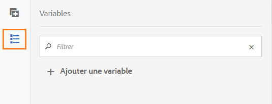
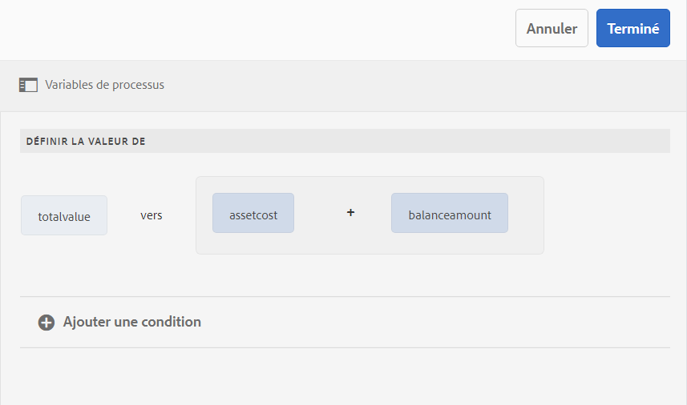
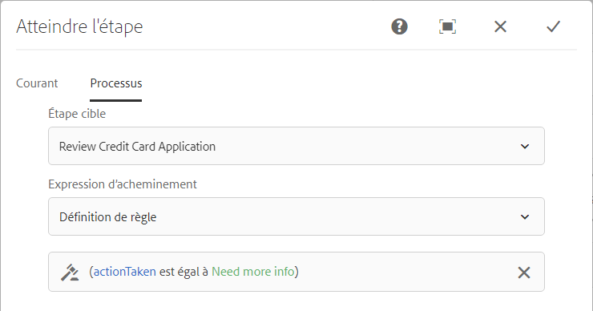

# Variables dans les workflows AEM{#variables-in-aem-workflows}

Une variable dans un modèle de processus est un moyen de stocker une valeur en fonction de son type de données. Vous pouvez ensuite utiliser le nom de la variable dans n’importe quelle étape du processus pour récupérer la valeur stockée dans la variable. Vous pouvez également utiliser des noms de variable pour définir des expressions pour prendre des décisions routages.

Dans AEM modèles de processus, vous pouvez :

* [Créez une ](/help/sites-developing/using-variables-in-aem-workflows.md#create-a-variable) variable d’un type de données en fonction du type d’informations que vous souhaitez y stocker.
* [Définissez une valeur pour la ](/help/sites-developing/using-variables-in-aem-workflows.md#set-a-variable) variable à l’aide de l’étape de flux de travail Définir la variable.
* [Utilisez la ](/help/sites-developing/using-variables-in-aem-workflows.md#use-a-variable) variable OR Split and Goto AEM workflow étapes pour définir une expression pour prendre des décisions de routage. Vous pouvez également utiliser des variables dans toutes les étapes du processus AEM Forms.

La vidéo suivante montre comment créer, définir et utiliser des variables dans AEM modèles de processus :

>[!VIDEO](https://helpx.adobe.com/content/dam/help/en/experience-manager/6-5/forms/using/usevariables_example.mp4)

Les variables sont une extension de l&#39;interface [MetaDataMap](https://helpx.adobe.com/experience-manager/6-5/sites/developing/using/reference-materials/javadoc/com/adobe/granite/workflow/metadata/MetaDataMap.html). Vous pouvez utiliser [MetaDataMap](https://helpx.adobe.com/experience-manager/6-5/sites/developing/using/reference-materials/javadoc/com/adobe/granite/workflow/metadata/MetaDataMap.html) dans ECMAScript pour accéder aux métadonnées enregistrées à l’aide de variables.

## Créer une variable {#create-a-variable}

Vous pouvez créer des variables à l’aide de la section Variables disponible dans le panneau latéral du modèle de flux de travail. AEM variables de processus prennent en charge les types de données suivants :

* **Types** de données primitifs : Long, Doublon, Boolean, Date et String
* **Types** de données complexes :  [](https://docs.oracle.com/javase/8/docs/api/org/w3c/dom/Document.html) XMLet  [JSON](https://static.javadoc.io/com.google.code.gson/gson/2.3/com/google/gson/JsonObject.html)

>[!NOTE]
>
>Les workflows ne prennent en charge que le format ISO8601 pour les variables de type Date.

Pour d&#39;autres types de données complexes disponibles dans les workflows AEM Forms, voir [Variables dans les workflows AEM Forms](/help/forms/using/variable-in-aem-workflows.md).  Utilisez le type de données ArrayList pour créer des collections de variables. Vous pouvez créer une variable ArrayList pour tous les types de données primitifs et complexes. Par exemple, créez une variable ArrayList et sélectionnez String comme sous-type pour stocker plusieurs valeurs de chaîne à l’aide de la variable.

Pour créer une variable, procédez comme suit :

1. Sur une instance AEM, accédez à Outils > Processus > Modèles.
1. Appuyez sur **[!UICONTROL Créer]** et spécifiez le titre et un nom facultatif pour le modèle de processus. Sélectionnez le modèle et appuyez sur **[!UICONTROL Modifier]**.
1. Appuyez sur l’icône de variables disponible dans le panneau latéral du modèle de processus et appuyez sur **[!UICONTROL Ajouter la variable]**.

   

1. Dans la boîte de dialogue Ajouter une variable, spécifiez le nom et sélectionnez le type de la variable.
1. Sélectionnez le type de données dans la liste déroulante **[!UICONTROL Type]** et spécifiez les valeurs suivantes :

   * Type de données primitif : indiquez une valeur par défaut facultative pour la variable.
   * JSON ou XML - Spécifiez un chemin d’accès facultatif au schéma JSON ou XML. Le système valide le chemin d’accès au schéma lors du mappage et du stockage des propriétés disponibles dans ce schéma sur une autre variable.
   * Modèle de données de formulaire : indiquez un chemin d’accès au modèle de données de formulaire.
   * ArrayList : spécifiez un sous-type pour la collection.

1. Spécifiez une description facultative pour la variable et appuyez sur  pour enregistrer les modifications. La variable s’affiche dans la liste disponible dans le volet de gauche.

Lorsque vous créez des variables, prenez en compte les bonnes pratiques suivantes :

* Créez autant de variables qu’un processus le requiert. Toutefois, pour conserver les ressources de base de données, utilisez le nombre minimum de variables requises et réutilisez les variables dès que possible.
* Les variables sont sensibles à la casse. Assurez-vous de référencer des variables en utilisant le même cas dans votre flux de travail.
* Evitez d’utiliser des caractères spéciaux dans le nom de la variable

## Définir une variable {#set-a-variable}

Vous pouvez utiliser l’étape Définir la variable pour définir la valeur d’une variable et définir l’ordre dans lequel les valeurs sont définies. La variable est définie dans l’ordre dans lequel les mappages de variables sont répertoriés à l’étape set variable.

Les modifications apportées aux valeurs de variable affectent uniquement l’instance du processus dans lequel la modification se produit. Par exemple, lorsqu’un processus est lancé et que des données variables sont modifiées, les modifications affectent uniquement cette instance du processus. Les modifications n’affectent pas les autres instances du processus qui ont été lancées précédemment ou qui sont lancées ultérieurement.

En fonction du type de données de la variable, vous pouvez utiliser les options suivantes pour définir la valeur d’une variable :

* **Littéral :** utilisez cette option lorsque vous connaissez la valeur exacte à spécifier.
* **Expression :** utilisez l’option lorsque la valeur à utiliser est calculée en fonction d’une expression. L’expression est créée dans l’éditeur d’expressions fourni.
* **Notation de point JSON :** utilisez l’option pour récupérer une valeur d’une variable de type JSON ou FDM.
* **XPATH :** utilisez l’option pour récupérer une valeur d’une variable de type XML.
* **Relatif à la charge :** utilisez l’option lorsque la valeur à enregistrer dans la variable est disponible à un chemin relatif à la charge utile.
* **Chemin absolu :** utilisez l’option lorsque la valeur à enregistrer dans la variable est disponible à un chemin absolu.

Vous pouvez également mettre à jour des éléments spécifiques d’une variable de type JSON ou XML à l’aide de la notation JSON DOT ou XPATH.

### Mappage des Ajoutes entre les variables {#add-mapping-between-variables}

Exécutez les étapes suivantes pour ajouter un mappage entre les variables :

1. Sur la page de modification du processus, appuyez sur l’icône Etapes disponible dans le panneau latéral du modèle de processus.
1. Faites glisser l’étape **Définir la variable** vers l’éditeur de flux de travaux, appuyez sur l’étape et sélectionnez  (Configurer).
1. Dans la boîte de dialogue Définir la variable, sélectionnez **[!UICONTROL Mappage]** > **[!UICONTROL Mappage d’Ajoute]**.
1. Dans la section **Map Variable**, sélectionnez la variable à stocker, sélectionnez le mode de mappage et spécifiez une valeur à stocker dans la variable. Les modes de mappage varient en fonction du type de variable.
1. Faites correspondre davantage de variables pour créer une expression significative. Appuyez sur  (Enregistrer) pour enregistrer les modifications.

### Exemple 1 : Requête d’une variable XML pour définir la valeur d’une variable de chaîne {#example-query-an-xml-variable-to-set-value-for-a-string-variable}

Sélectionnez une variable de type XML pour stocker un fichier XML. Requête la variable XML pour définir la valeur d’une variable de chaîne pour la propriété disponible dans le fichier XML. Utilisez **Spécifier XPATH pour le champ de variable XML** pour définir la propriété à stocker dans la variable de chaîne.

Dans cet exemple, sélectionnez une variable XML **formdata** pour stocker le fichier **cc-app.xml**. Requête la variable **formdata** pour définir la valeur de la variable de chaîne **email** afin de stocker la valeur de la propriété **emailAddress** disponible dans le fichier **cc-app.xml**.

>[!VIDEO](https://helpx.adobe.com/content/dam/help/en/experience-manager/6-5/forms/using/set_variable_example1.mp4 "Définir la valeur d’une variable")

### Exemple 2 : Utiliser une expression pour stocker la valeur en fonction d&#39;autres variables {#example2}

Utilisez une expression pour calculer la somme des variables et stocker le résultat dans une variable.

Dans cet exemple, utilisez l’éditeur d’expressions pour définir une expression afin de calculer la somme des variables **assetcost** et **balanceamount** et de stocker le résultat dans une variable **totalvalue**.

>[!VIDEO](https://helpx.adobe.com/content/dam/help/en/experience-manager/6-5/forms/using/variables_expression.mp4)

## Utiliser l’éditeur d’expressions {#use-expression-editor}

Vous utilisez également les expressions pour calculer la valeur d’une variable au moment de l’exécution. Les variables fournissent un éditeur d’expressions pour définir les expressions.

Utilisez l’éditeur d’expressions pour :

* Définissez la valeur des variables à l’aide d’autres variables de processus, nombres ou expressions mathématiques.
* Utiliser des variables de processus, une chaîne, un nombre ou une expression dans une expression mathématique
* Ajoutez des conditions pour définir les valeurs des variables.
* Ajouter des opérateurs entre les conditions.



Il est basé sur l’éditeur de règles de formulaires adaptatifs avec les modifications suivantes. Éditeur de règles dans les variables :

* Ne prend pas en charge les fonctions.
* Ne fournit pas d’interface utilisateur au résumé des règles de vue
* N&#39;a pas d&#39;éditeur de code.
* Ne prend pas en charge l’activation et la désactivation de la valeur d’un objet.
* Ne prend pas en charge la définition de la propriété d’un objet.
* Ne prend pas en charge l’appel d’un service Web.

Pour plus d’informations, voir [éditeur de règles de formulaires adaptatifs](/help/forms/using/rule-editor.md).

## Utiliser une variable {#use-a-variable}

Vous pouvez utiliser des variables pour récupérer les entrées et les sorties ou enregistrer le résultat d’une étape. L’éditeur de flux de travaux fournit deux types d’étapes de flux de travaux :

* Procédure de flux de travaux avec prise en charge des variables
* Procédure de flux de travaux sans prise en charge des variables

### Étapes de flux de travail avec prise en charge des variables {#workflow-steps-with-support-for-variables}

L’étape Atteindre, OU Fractionner, et toutes les étapes du processus AEM Forms prennent en charge les variables.

#### OU Étape de fractionnement {#or-split-step}

La Division OU divise le processus et une seule branche est active par la suite. Cette étape vous permet d’ajouter des chemins de traitement conditionnels dans le workflow. Vous ajoutez des étapes de workflow à chaque branche selon vos besoins.

Vous pouvez définir l&#39;expression d&#39;routage d&#39;une branche à l&#39;aide d&#39;une définition de règle, d&#39;un script ECMA ou d&#39;un script externe.

Vous pouvez utiliser des variables pour définir l’expression d’routage à l’aide de l’éditeur d’expressions. Pour plus d’informations sur l’utilisation des expressions d’routage pour l’étape de fractionnement OU, voir [OU fractionnée étape](/help/sites-developing/workflows-step-ref.md#or-split).

Dans cet exemple, avant de définir l’expression de l’routage, utilisez [exemple 2](/help/sites-developing/using-variables-in-aem-workflows.md#example2) pour définir la valeur de la variable **totalvalue**. La branche 1 est principale si la valeur de la variable **totalvalue** est supérieure à 50000. De même, vous pouvez définir une règle pour rendre la branche 2 principale si la valeur de la variable **totalvalue** est inférieure à 50000.

>[!VIDEO](https://helpx.adobe.com/content/dam/help/en/experience-manager/6-5/forms/using/variables_orsplit_example.mp4)

De même, sélectionnez un chemin d’accès au script externe ou spécifiez le script ECMA pour les expressions routages afin d’évaluer la branche principale. Appuyez sur **[!UICONTROL Renommer la branche]** pour spécifier un autre nom pour la branche.

Pour plus d’exemples, voir [Création d’un modèle de processus](/help/forms/using/aem-forms-workflow.md#create-a-workflow-model).

#### Atteindre l’étape {#go-to-step}

L&#39;**Étape d&#39;accès** permet de spécifier l&#39;étape suivante du modèle de flux de travail à exécuter, en fonction du résultat d&#39;une expression de routage.

Tout comme l’étape de fractionnement OU, vous pouvez définir l’expression d’routage de l’étape Goto à l’aide d’une définition de règle, d’un script ECMA ou d’un script externe.

Vous pouvez utiliser des variables pour définir l’expression d’routage à l’aide de l’éditeur d’expressions. Pour plus d’informations sur l’utilisation des expressions d’routage pour l’étape de destination, voir [Étape de destination](/help/sites-developing/workflows-step-ref.md#goto-step).



Dans cet exemple, l’étape Goto spécifie la demande de carte de crédit Revoir comme étape suivante si la valeur de la variable **action prise** est égale à **Besoin de plus d’informations**.

Pour plus d’exemples sur l’utilisation de la définition de règle dans l’étape Goto, voir [Simulation d’une boucle For](/help/sites-developing/workflows-step-ref.md#simulateforloop).

#### Etapes de flux de travaux centrées sur le processus Forms {#forms-workflow-centric-workflow-steps}

Toutes les étapes du processus AEM Forms prennent en charge les variables. Pour plus d’informations, voir [Processus centré sur Forms sur OSGi](/help/forms/using/aem-forms-workflow-step-reference.md).

### Étapes de flux de travail sans prise en charge des variables {#workflow-steps-without-support-for-variables}

Vous pouvez utiliser l&#39;interface [MetaDataMap](https://helpx.adobe.com/experience-manager/6-5/sites/developing/using/reference-materials/javadoc/com/adobe/granite/workflow/metadata/MetaDataMap.html) pour accéder à des variables dans les étapes de processus qui ne prennent pas en charge les variables.

#### Récupérer la valeur de variable {#retrieve-the-variable-value}

Utilisez les API suivantes dans le script ECMA pour récupérer les valeurs des variables existantes en fonction du type de données :

| Type de données variable | API |
|---|---|
| Primitif (long, Doublon, booléen, date et chaîne) | workItem.getWorkflowData().getMetaDataMap().get(variableName, type) |
| XML | Packages.org.w3c.dom.Document xmlObject = workItem.getWorkflowData().getMetaDataMap().get(variableName, Packages.org.w3c.dom.Document.class); |
| JSON | Packages.com.google.gson.JsonObject jsonObject = workItem.getWorkflowData().getMetaDataMap().get(variableName, Packages.com.google.gson.JsonObject.class); |

Pour plus d’informations sur les API pour d’autres types de données de variables complexes disponibles dans les workflows AEM Forms, voir [Variables dans les workflows AEM Forms](/help/forms/using/variable-in-aem-workflows.md).

**Exemple**

Récupérez la valeur du type de données de chaîne à l’aide de l’API suivante :

```
workItem.getWorkflowData().getMetaDataMap().get(accname, Packages.java.lang.String)
```

#### Mettre à jour la valeur de la variable {#update-the-variable-value}

Utilisez l’API suivante dans le script ECMA pour mettre à jour la valeur d’une variable :

```
workItem.getWorkflowData().getMetaDataMap().put(variableName, value)
```

**Exemple**

```
workItem.getWorkflowData().getMetaDataMap().put(salary, 50000)
```

met à jour la valeur de la variable **salaire** sur 50000.

### Définir les variables pour appeler les workflows {#apiinvokeworkflow}

Vous pouvez utiliser une API pour définir des variables et les transmettre pour appeler des instances de processus.

[workflowSession.](https://helpx.adobe.com/experience-manager/6-5/sites/developing/using/reference-materials/javadoc/com/adobe/granite/workflow/WorkflowSession.html#startWorkflow-com.adobe.granite.workflow.model.WorkflowModel-com.adobe.granite.workflow.exec.WorkflowData-java.util.Map-) startWorkflows utilise le modèle, wfData et metaData comme arguments. Utilisez MetaDataMap pour définir la valeur de la variable.

Dans cette API, la variable **variableName** est définie sur **value** à l’aide de metaData.put(variableName, value);

```java
import com.adobe.granite.workflow.model.WorkflowModel;
import com.adobe.granite.workflow.metadata.MetaDataMap;
import com.adobe.aemfd.docmanager.Document;

/*Assume that you already have a workflowSession and modelId along with the payloadType and payload*/
WorkflowData wfData = workflowSession.newWorkflowData(payloadType, payload);
MetaDataMap metaData = wfData.getMetaDataMap();
metaData.put(variableName, value); //Create a variable "variableName" in your workflow model
WorkflowModel model = workflowSession.getModel(modelId);
workflowSession.startWorkflow(model, wfData, metaData);
```

## Modifier une variable {#edit-a-variable}

1. Sur la page Modifier le processus, appuyez sur l’icône Variables disponible dans le panneau latéral du modèle de processus. La section Variables du volet gauche affiche toutes les variables existantes.
1. Appuyez sur l’icône  (Modifier) située en regard du nom de variable que vous souhaitez modifier.
1. Modifiez les informations de la variable et appuyez sur  pour enregistrer les modifications. Vous ne pouvez pas modifier les champs **[!UICONTROL Nom]** et **[!UICONTROL Type]** pour une variable.

## Supprimer une variable {#delete-a-variable}

Avant de supprimer la variable, supprimez toutes les références de la variable du processus. Assurez-vous que la variable n’est pas utilisée dans le processus.

Pour supprimer une variable, procédez comme suit :

1. Sur la page Modifier le processus, appuyez sur l’icône Variables disponible dans le panneau latéral du modèle de processus. La section Variables du volet gauche affiche toutes les variables existantes.
1. Appuyez sur l’icône Supprimer en regard du nom de variable que vous souhaitez supprimer.
1. Appuyez sur  pour confirmer et supprimer la variable.

