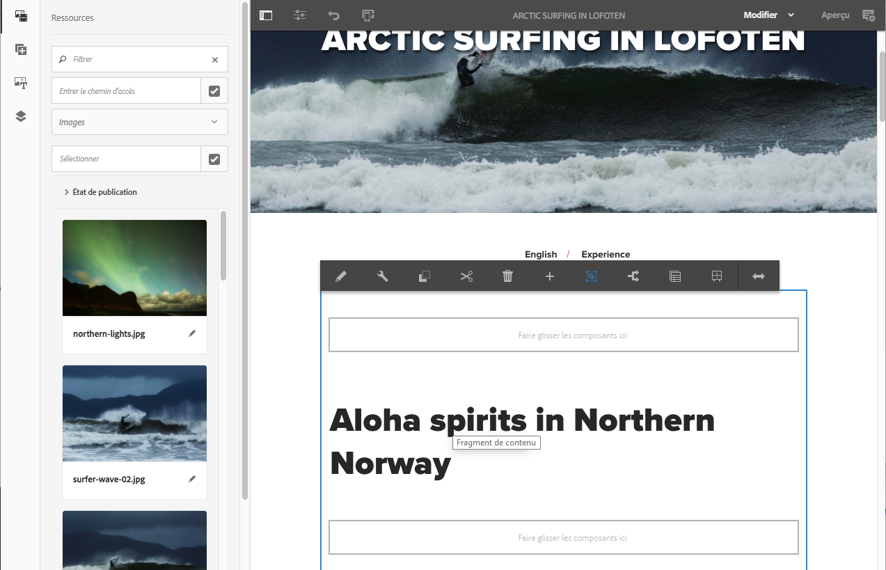

# Test des fragments de contenu dans We.Retail{#trying-out-content-fragments-in-we-retail}

Les fragments de contenu vous permettent de créer du contenu compatible avec tous les canaux, ainsi que des variantes (éventuellement spécifiques aux canaux). **We.Retail** (comme disponible dans une instance prête à l’emploi d’AEM) fournit le fragment **Arctic Surfing in Lofoten** en tant qu’exemple de base. On peut en tirer les enseignements suivants :

* Les fragments de contenu Adobe Experience Manager (AEM) sont [créés et gérés en tant que ressources indépendantes de la page](/help/assets/content-fragments/content-fragments.md). Ils vous permettent de créer du contenu compatible avec tous les canaux, ainsi que des variations (éventuellement spécifiques aux canaux). 

   * See [Where to Find Content Fragment assets in We.Retail](#where-to-find-content-fragments-in-we-retail)

* Vous pouvez ensuite [utiliser ces fragments et leurs variantes lors de la création](/help/sites-authoring/content-fragments.md) de vos pages de contenu.

   * See [Where Content Fragments are Used in We.Retail](#where-content-fragments-are-used-in-we-retail)

Pour consulter la documentation complète traitant de la création, de la gestion, de l’utilisation et du développement de fragments de contenu :

* See [Further Information](#further-information)

>[!NOTE]
>
>Les **fragments de contenu** et les **[fragments d’expérience](/help/sites-authoring/experience-fragments.md)**représentent deux fonctions distinctes d’AEM :
>
>* Les **fragments de contenu** sont des contenus éditoriaux, composés essentiellement de texte et des images associées. Il s’agit exclusivement de contenu, sans aucun élément de conception ni de mise en page.
>* Les **fragments d’expérience** désignent un contenu parfaitement mis en page : un fragment de page web.
>
>
Les fragments d’expérience peuvent être composés de contenu sous la forme de fragments de contenu, mais pas l’inverse.

## Emplacement des fragments de contenu dans We.Retail {#where-to-find-content-fragments-in-we-retail}

There are several sample content fragments in We.Retail; navigate via **Assets**, **Files**, **We.Retail**, **English**, **Experiences**.

Vous y trouverez notamment **Arctic Surfing in Lofoten**, un fragment auquel sont associées des ressources visuelles :

* Navigate via **Assets**, **Files**, **We.Retail**, **English**, **Experiences**, **Artic Surfing in Lofoten**:

   * [http://localhost:4502/assets.html/content/dam/we-retail/en/experiences/arctic-surfing-in-lofoten](http://localhost:4502/assets.html/content/dam/we-retail/en/experiences/arctic-surfing-in-lofoten)

Vous pouvez sélectionner et modifier le fragment **Arctic Surfing in Lofoten** :

* [http://localhost:4502/editor.html/content/dam/we-retail/en/experiences/arctic-surfing-in-lofoten/arctic-surfing-in-lofoten](http://localhost:4502/editor.html/content/dam/we-retail/en/experiences/arctic-surfing-in-lofoten/arctic-surfing-in-lofoten)

Vous pouvez [modifier et gérer](/help/assets/content-fragments/content-fragments.md) votre fragment à l’aide des onglets (panneau de gauche) :

<!--  ASSET does not exist-->

* **[Variations](/help/assets/content-fragments/content-fragments-variations.md)**, y compris[Texte (Markdown)](/help/assets/content-fragments/content-fragments-markdown.md)
* **[Contenu associé](/help/assets/content-fragments/content-fragments-assoc-content.md)**
* **[Métadonnées](/help/assets/content-fragments/content-fragments-metadata.md)**

## Où les fragments de contenu sont-ils utilisés dans We.Retail ?{#where-content-fragments-are-used-in-we-retail}

Pour illustrer la [création de pages avec un fragment de contenu](/help/sites-authoring/content-fragments.md), plusieurs échantillons de page sont proposés, par exemple, à l’emplacement suivant :

* [http://localhost:4502/sites.html/content/we-retail/language-masters/en/experience](http://localhost:4502/sites.html/content/we-retail/language-masters/en/experience)

For example, the **Arctic Surfing in Lofoten** content fragment is referenced in the Sites page:

* Navigate via **Sites**, **We.Retail**, **Language Masters**, **English**, **Experience**. Ouvrez ensuite le fragment **Arctic Surfing in Lofoten** en vue de le modifier :

   * [http://localhost:4502/editor.html/content/we-retail/language-masters/en/experience/arctic-surfing-in-lofoten.html](http://localhost:4502/editor.html/content/we-retail/language-masters/en/experience/arctic-surfing-in-lofoten.html)

## Informations supplémentaires {#further-information}

Pour plus d’informations, voir :

* [Utilisation de fragments de contenu](/help/assets/content-fragments/content-fragments.md)

   * Découvrez comment créer, modifier et gérer vos ressources Fragment de contenu.

* [Création de page à partir de fragments de contenu](/help/sites-authoring/content-fragments.md)

   * Utilisez votre fragment de contenu lors de la création d’une page.

* [Développement de composants AEM pour les fragments de contenu](/help/sites-developing/components-content-fragments.md)

   * Présentation des composants pour les fragments de contenu.

* [Développement et extension de fragments de contenu](/help/sites-developing/customizing-content-fragments.md)

   * Les informations de cette section vous aident à développer et à étendre des fragments de contenu.

