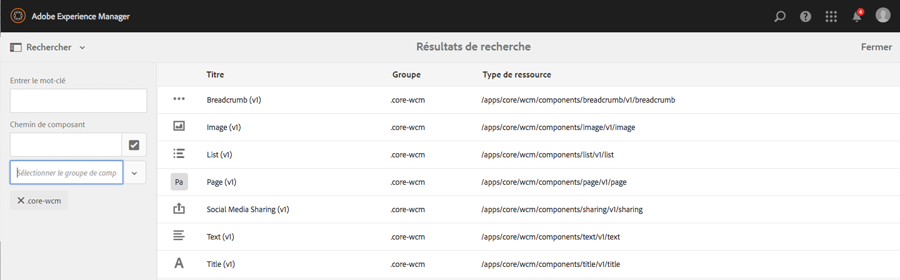
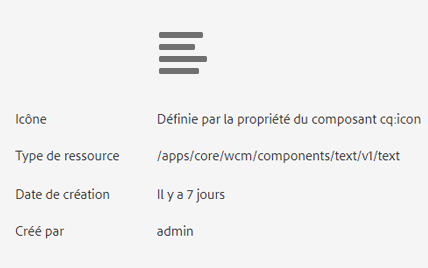

# Test des composants principaux dans We.Retail{#trying-out-core-components-in-we-retail}

Les composants principaux sont des composants souples et modernes offrant une grande facilité d’extensibilité et permettant une intégration aisée dans vos projets. Plusieurs principes de conception majeurs ont présidé à l’élaboration des composants principaux : HTL, composants utillisables immédiatement, configurabilité, contrôle de version, extensibilité… We.Retail repose sur des composants principaux.

## Test {#trying-it-out}

1. Démarrez AEM avec l’échantillon de contenu We.Retail, puis ouvrez la [Console Composants](/help/sites-authoring/default-components-console.md).

   **Navigation globale -> Outils -> Composants**

1. L’ouverture du rail dans la console Composants vous permet de filtrer un groupe de composants spécifiques. Les composants principaux sont disponibles aux emplacements suivants :

   * `.core-wcm`: Composants principaux standard
   * `.core-wcm-form`: Composants principaux d’envoi de formulaire

   Choose `.core-wcm`.

   

1. Notez que tous les composants principaux sont nommés **v1** pour indiquer qu’il s’agit de la première version. Des versions seront publiées régulièrement. Elles seront compatibles avec la version d’AEM et permettront une mise à niveau aisée, de sorte que vous puissiez tirer parti des fonctionnalités les plus récentes.
1. Cliquez sur **Texte (v1)**.

   Voir que le **type de ressource** du composant est `/apps/core/wcm/components/text/v1/text`. Les composants principaux se trouvent sous `/apps/core/wcm/components` et sont versionnés par composant.

   

1. Cliquez sur l’onglet **Documentation** afin d’afficher la documentation du développeur pour le composant.

   

1. Revenez à la console de composants. Effectuez un filtrage sur le groupe **We.Retail** et sélectionnez ensuite le composant **Texte**.
1. Vous pouvez voir que le **Type de ressource** pointe vers un composant comme prévu sous `/apps/weretail`, mais que le **Super type de ressource** renvoie au composant principal `/apps/core/wcm/components/text/v1/text`.

   

1. Cliquez sur l&#39;onglet **Utilisation en direct** pour savoir sur quelles pages ce composant est actuellement utilisé. Cliquez sur la première **page de remerciement** pour modifier la page.

   

1. Sur la page de remerciement, sélectionnez le composant de texte puis, dans le menu d’édition du composant, cliquez sur l’icône Annuler l’héritage.

   [We.Retail présente une structure de site globalisée](/help/sites-developing/we-retail-globalized-site-structure.md) dans laquelle le contenu est envoyé à partir de gabarits de langue vers des [copies en direct au moyen d’un mécanisme connu sous le nom d’héritage](/help/sites-administering/msm.md). C’est la raison pour laquelle l’héritage doit être annulé afin d’autoriser un utilisateur à modifier manuellement du texte.

   

1. Cliquez sur **Oui** pour confirmer l’annulation.

   

1. Une fois que vous avez annulé l’héritage et sélectionné les composants de texte, bien d’autres options sont disponibles. Cliquez sur** Modifier**.

   

1. À présent, vous pouvez voir les options d’édition qui sont disponibles pour le composant de texte.

   

1. Dans le menu **Informations sur la page**, sélectionnez **Éditer le modèle**.
1. Dans l’éditeur de modèles de la page, cliquez sur l’icône **Stratégie** du composant de texte dans le **Conteneur de mises en page** de la page.

   

1. Les composants principaux permettent à un auteur de modèles de configurer les propriétés mises à la disposition des auteurs de pages. Il s’agit notamment de fonctions telles que les sources de collage autorisées, les options de mise en forme, les styles de paragraphe disponibles, etc.

   Ces boîtes de dialogue de conception sont disponibles pour de nombreux composants principaux et fonctionnent de concert avec l’éditeur de modèles. Une fois activées, elles sont mises à la disposition de l’auteur par le biais des éditeurs de composants.

   

## Informations supplémentaires {#further-information}

Pour plus d’informations sur les composants principaux, consultez le document de création [Composants principaux](https://docs.adobe.com/content/help/fr-FR/experience-manager-core-components/using/introduction.html), afin d’obtenir un aperçu des fonctionnalités des composants principaux, et le document de développement [Développement de composants principaux](https://helpx.adobe.com/experience-manager/core-components/using/developing.html) pour une présentation technique.

Vous pouvez également effectuer des recherches approfondies sur les [modèles modifiables](/help/sites-developing/we-retail-editable-templates.md). Pour plus d&#39;informations sur les modèles modifiables, consultez le document de création [Création de modèles de page](/help/sites-authoring/templates.md) ou la page du document du développeur [Modèles - modifiables](/help/sites-developing/page-templates-editable.md).
