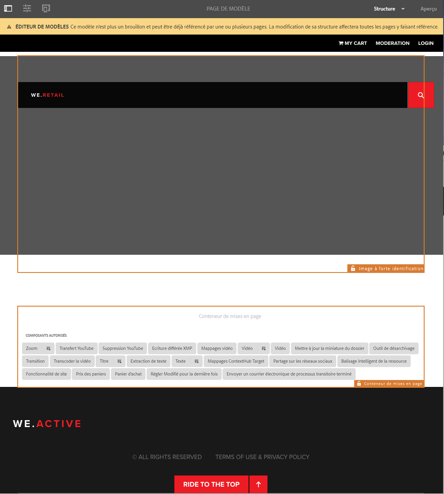
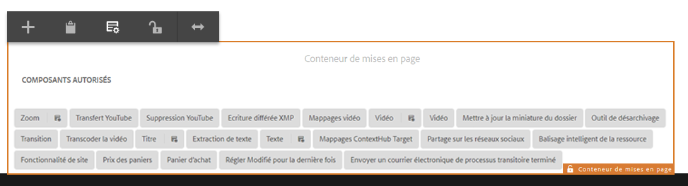
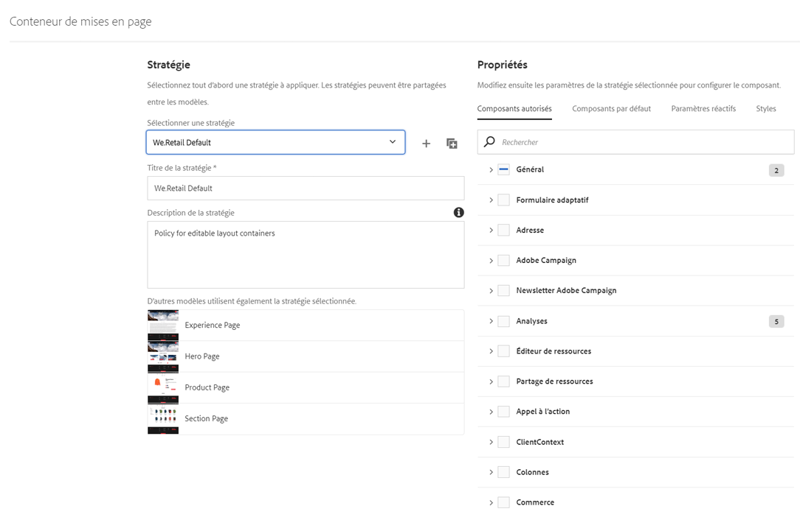
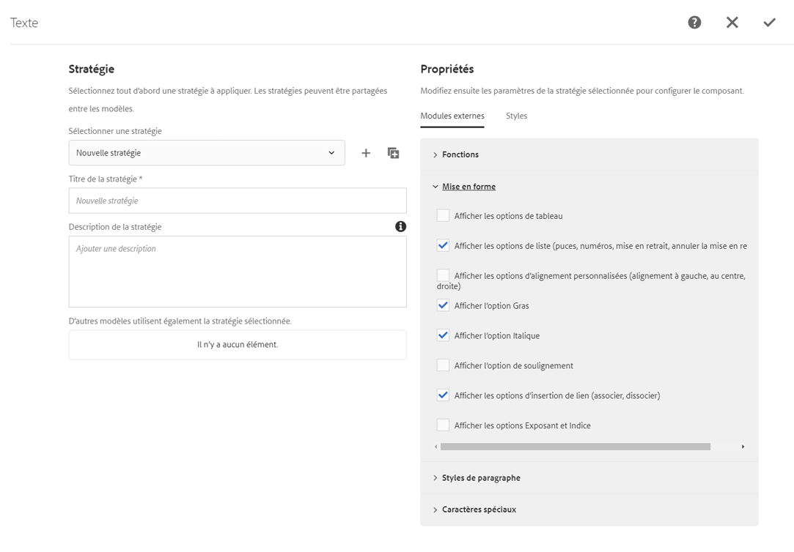

# Test des modèles modifiables dans We.Retail{#trying-out-editable-templates-in-we-retail}

Avec les modèles modifiables, la création et la gestion des modèles ne sont plus une tâche réservée aux développeurs. Un type d’utilisateur avancé, appelé auteur de modèles, peut désormais créer des modèles. L’équipe de développement doit encore configurer l’environnement, créer des bibliothèques clientes et créer les composants à utiliser. Cependant, une fois ces bases en place, l’auteur de modèles peut créer et configurer des modèles sans projet de développement.

Toutes les pages de We.Retail sont basées sur des modèles modifiables, ce qui permet aux non-développeurs d’adapter et de personnaliser les modèles.

## Essayer de le faire {#trying-it-out}

1. Modifiez la page Matériel de la branche principale de langue.

   http://localhost:4502/editor.html/content/we-retail/language-masters/en/equipment.html

1. Le sélecteur de mode ne propose plus de mode Conception. Toutes les pages de We.Retail sont basées sur des modèles modifiables et pour modifier la conception de modèles modifiables, elles doivent être modifiées dans l’éditeur de modèles.
1. Dans le menu **Informations sur la page**, sélectionnez **Éditer le modèle**.
1. Vous êtes en train de modifier le modèle Page principale.

   Le mode Structure de la page permet de modifier la structure du modèle. Cela inclut, par exemple, les composants autorisés dans le conteneur de mises en page.

   

1. Configurez les stratégies du conteneur de mises en page pour définir les composants autorisés dans le conteneur.

   Les stratégies sont l’équivalent des configurations de conception.

   

1. Dans la boîte de dialogue de conception du conteneur de mises en page, vous pouvez :

   * Sélectionner une stratégie existante ou créer une stratégie pour le conteneur
   * Sélectionner les composants autorisés dans le conteneur
   * Définition des composants par défaut à placer lorsqu’une ressource est glissée sur le conteneur

   

1. De retour dans l’éditeur de modèles, vous pouvez modifier la stratégie du composant de texte dans le conteneur de mises en page.

   Vous pouvez ainsi :

   * Sélectionner une stratégie existante ou créer une stratégie pour le conteneur
   * Définissez les fonctionnalités disponibles pour l’auteur de page lors de l’utilisation de ce composant, telles que

      * Sources de collage autorisées
      * Options de mise en forme
      * Styles de paragraphe autorisés
      * Caractères spéciaux autorisés

   De nombreux composants basés sur les composants principaux permettent de configurer des options au niveau du composant par le biais de modèles modifiables, ce qui évite aux développeurs de devoir les personnaliser.

   

1. De retour dans l’éditeur de modèles, vous pouvez utiliser le sélecteur de mode pour passer à **Contenu initial** pour définir le contenu requis sur la page.

   **Disposition** Le mode peut être utilisé tel quel sur une page normale pour définir la mise en page du modèle.

## Informations supplémentaires {#more-information}

Pour plus d’informations, voir le document de création [Création de modèles de page](/help/sites-authoring/templates.md) ou la page du document de développement [Modèles - Modifiables](/help/sites-developing/page-templates-editable.md) pour obtenir des détails techniques complets sur les modèles modifiables.

Vous pouvez également vous renseigner sur les [composants principaux](/help/sites-developing/we-retail-core-components.md). Consultez le document de création de [Composants principaux](https://experienceleague.adobe.com/docs/experience-manager-core-components/using/introduction.html?lang=fr) pour obtenir un aperçu des fonctionnalités des composants principaux ou [Développement de composants principaux](https://helpx.adobe.com/fr/experience-manager/core-components/using/developing.html) pour une présentation technique.
