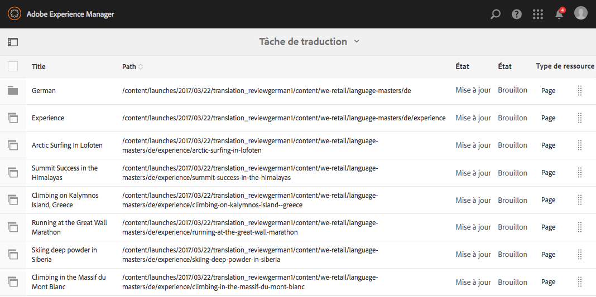

# Test de la structure de site globalisée dans We.Retail{#trying-out-the-globalized-site-structure-in-we-retail}

We.Retail a été conçu avec une structure de site globalisée qui offre des gabarits de langue pouvant être copiés de manière dynamique (Lice Copy) sur des sites web spécifiques à un pays. Tous les éléments sont configurés en standard pour vous permettre d’expérimenter cette structure et les fonctionnalités de traduction intégrées.

## Test {#trying-it-out}

1. Ouvrez la console Sites à partir de **Navigation globale -> Sites**.
1. Basculez en mode Colonnes (le cas échéant) et sélectionnez We.Retail. Notez l&#39;exemple de structure de pays avec la Suisse, les Etats-Unis, la France, etc., au côté des Principal linguistiques.

   

1. Sélectionnez Suisse et observez les racines relatives aux langues de ce pays. Comme vous pouvez le constater, il n’y a pas encore de contenu sous ces racines.

   

1. Basculez vers le mode Liste. Vous pouvez remarquer que les copies linguistiques pour les pays sont toutes des Live Copies.

   

1. Revenez en mode Colonnes et cliquez sur le gabarit de langue pour afficher les racines du gabarit de langue avec du contenu. Notez que le contenu est disponible uniquement pour la langue anglaise.

   We.Retail ne s’accompagne pas de contenu traduit, mais la structure et la configuration sont en place pour vous permettre de faire la démonstration des services de traduction.

   

1. Le gabarit de langue Anglais étant ouvert, ouvrez le rail **Références** dans la console Sites et sélectionnez ensuite **Copies de langue**.

   

1. Cochez la case en regard de **Copies de langue** pour sélectionner toutes les copies de langue. Dans la section **Màj des copies de langue** du rail, sélectionnez l’option **Créer un projet de traduction**. Attribuez un nom au projet et cliquez ensuite sur **Mettre à jour**.

   

1. Un projet est créé pour chacune des traductions. Pour les afficher, sélectionnez **Navigation -> Projets**.

   

1. Cliquez sur Allemand pour afficher les détails du projet de traduction. Notez que l’état indiqué est **Brouillon**. Pour commencer la traduction avec le service de traduction de Microsoft, cliquez sur le chevron en regard du titre **Tâche de traduction**, puis sélectionnez **Démarrer**.

   

1. Le projet de traduction commence. Cliquez sur les points de suspension au bas de la carte Tâche de traduction pour afficher des détails. Les pages dont l’état est **Prêt pour la révision** ont déjà été traduites par le service de traduction.

   

1. Si vous sélectionnez l’une des pages dans la liste et ensuite **Aperçu dans Sites** dans la barre d’outils, la page traduite s’ouvre dans l’éditeur de page.

   

>[!NOTE]
>
>Cette procédure vous a présenté l’intégration au système de traduction automatique de Microsoft. La [Structure d’intégration de traduction AEM](/help/sites-administering/translation.md) vous permet d’intégrer de nombreux services de traduction standard afin d’orchestrer la traduction d’AEM.

## Informations supplémentaires {#further-information}

Pour plus d&#39;informations, consultez le document de création [Traduction de contenu pour les sites multilingues](/help/sites-administering/translation.md) pour obtenir des détails techniques complets.
