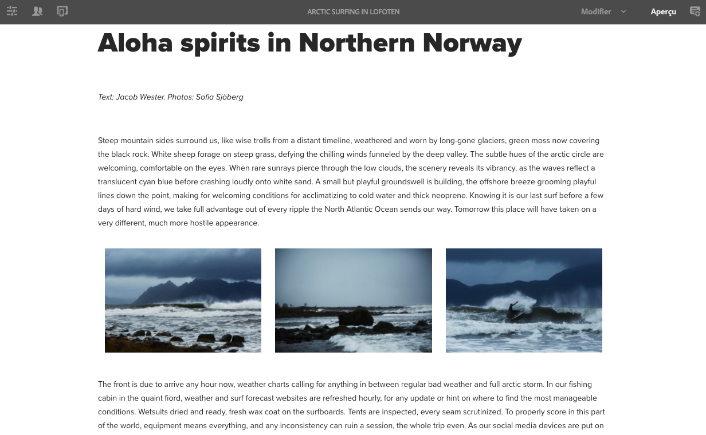
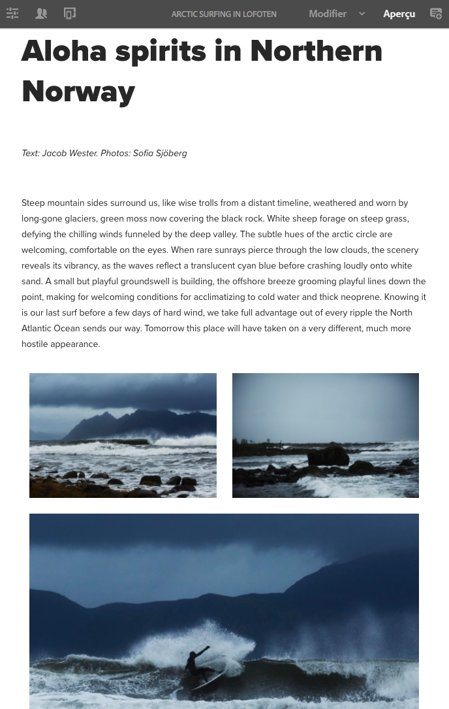
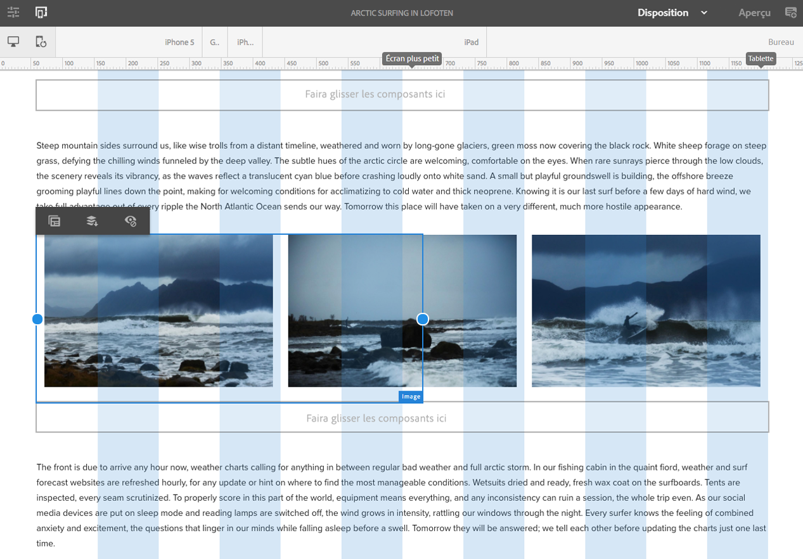
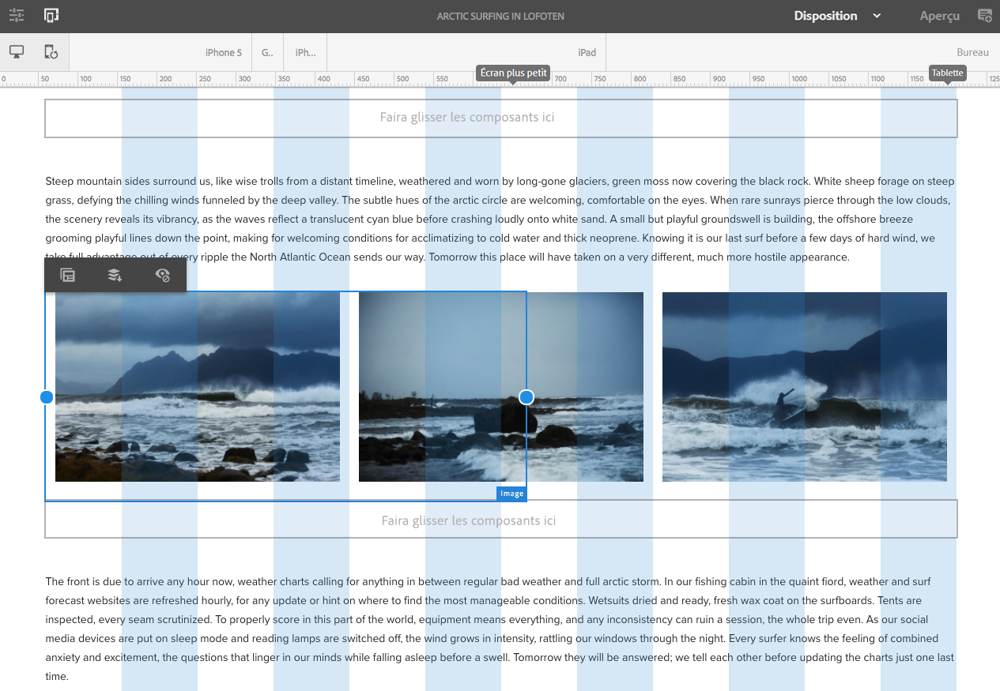

# Test d’une mise en page en responsive design dans We.Retail{#trying-out-responsive-layout-in-we-retail}

Toutes les pages Web.Retail utilisent le composant Conteneur de mise en page pour implémenter une conception adaptée. Le conteneur offre un système de paragraphe qui permet de positionner des composants sur une grille réactive. Cette grille peut réorganiser la mise en page en fonction de l’appareil/de la taille de fenêtre et du format. Le composant est utilisé conjointement avec le mode **Mise en page** dans l’éditeur de page, ce qui vous permet de créer et de modifier votre mise en page adaptée en fonction du périphérique.

## Test {#trying-it-out}

1. Modifiez la page Arctic Surfing dans la section Experiences de la branche master de langue.

   http://localhost:4502/editor.html/content/we-retail/language-masters/en/experience/arctic-surfing-in-lofoten.html

1. Passez à **Aperçu** pour voir la page telle qu’elle serait affichée pour un internaute. Faites défiler vers le bas pour accéder au contenu de l’article *Aloha spirits in Norther Norway*.

   

1. Redimensionnez la fenêtre de votre navigateur et observez la mise en page s’adapter dynamiquement au redimensionnement.

   

1. Passez en mode Mise en page. La barre d’outils de l’émulateur est automatiquement affichée et vous permet de planifier votre mise en page par appareil ciblé.

   La sélection d’un composant affiche des options de flottement et de masquage dans le menu d’édition, ainsi que des poignées de redimensionnement pour le composant.

   

1. En saisissant et en faisant glisser la poignée de redimensionnement du composant, la grille de mise en page s’affiche automatiquement pour vous assister lors du redimensionnement.

   

## Informations supplémentaires {#further-information}

Pour plus d’informations, consultez le document de création [Mise en page réactive](/help/sites-authoring/responsive-layout.md) ou le document administrateur [Configuration du Conteneur de mise en page et du mode de mise en page](/help/sites-administering/configuring-responsive-layout.md) pour obtenir des informations techniques complètes.
