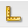
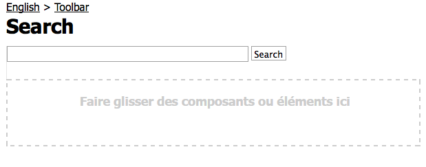

# Création d’un site web riche en fonctionnalités (JSP){#create-a-fully-featured-website-jsp}

>[!NOTE]
>
>Cet article vous explique comment créer un site web à l’aide de JSP et basé sur l’interface utilisateur (IU) classique. Adobe vous recommande de tirer parti des technologies AEM les plus récentes pour vos sites web. Vous en trouverez une description détaillée dans l’article [Prise en main du développement d’AEM Sites](/help/sites-developing/getting-started.md).

Ce tutoriel vous permet de créer un site web riche en fonctionnalités avec Adobe Experience Manager (AEM). Le site web sera architecturé autour d’un site web générique et s’adressera principalement aux développeurs web. Toute la phase de développement s’effectuera dans un environnement de création.

Ce tutoriel vous explique comment :

1. Installer AEM.
1. Accéder à CRXDE Lite (l’environnement de développement).
1. Installer la structure du projet dans CRXDE Lite.
1. Créer le modèle, le composant et les scripts utilisés comme base pour la création de pages de contenu.
1. Créer la page racine de votre site web et ensuite les pages de contenu.
1. Créer les composants suivants en vue de les utiliser sur vos pages :

   * Navigation supérieure
   * Liste des enfants
   * Logo
   * Image
   * Texte-Image
   * Rechercher

1. Inclure différents composants Foundation.

Une fois toutes les étapes exécutées, vos pages se présentent comme suit :


**Téléchargement du résultat final**

Pour suivre le tutoriel plutôt que d’effectuer les exercices, téléchargez le fichier website-1.0.zip. Il s’agit d’un module de contenu AEM comprenant les résultats de ce tutoriel. Utilisez [Package Manager](/help/sites-administering/package-manager.md) pour installer le module sur votre instance de création.

**REMARQUE** : L’installation de ce module écrase toutes les ressources de votre instance de création que vous avez créées à l’aide de ce tutoriel.

Package de contenu du site Web

[Obtenir le fichier](assets/website-1_0.zip)

## Installation d’Adobe Experience Manager {#installing-adobe-experience-manager}

To install an AEM instance for developing your website, follow the instructions for setting up a [deployment environment with author and publish instances](/help/sites-deploying/deploy.md#author-and-publish-installs), or perform a [generic installation](/help/sites-deploying/deploy.md#default-local-install). Dans le cadre de l’installation générique, vous devez télécharger un fichier JAR Quickstart AEM, placer le fichier license.properties dans le même répertoire que le fichier JAR et ensuite double-cliquer sur le fichier JAR.

Après avoir installé AEM, accédez à l’environnement de développement CRXDE Lite en cliquant sur le lien CRXDE Lite sur la page d’accueil :


>[!NOTE]
>
>The URL of CRXDE Lite for an AEM authoring instance that is installed locally using the default port is [https://localhost:4502/crx/de/](https://localhost:4502/crx/de/).

### Installation de la structure du projet dans CRXDE Lite {#setting-up-the-project-structure-in-crxde-lite}

Utilisez CRXDE Lite pour créer la structure d’application mywebsite dans le référentiel :

1. In the tree on the left side of CRXDE Lite, right-click the **`/apps`** folder and click **Create** > **Create** **Folder**. Dans la boîte de dialogue **Créer un dossier**, indiquez `mywebsite` comme nom de dossier, puis cliquez sur **OK**.
1. Right-click the **`/apps/mywebsite`** folder and click **Create** > **Create Folder**. Dans la boîte de dialogue **Créer un dossier**, indiquez `components` comme nom de dossier, puis cliquez sur **OK**.
1. Right-click the **`/apps/mywebsite`** folder and click **Create** > **Create Folder**. Dans la boîte de dialogue **Créer un dossier**, indiquez `templates` comme nom de dossier, puis cliquez sur **OK**.

   La structure de l’arborescence doit maintenant se présenter comme suit :

   

1. Cliquez sur **Enregistrer tout**.

### Configuration de la conception {#setting-up-the-design}

Dans cette section, vous allez créer la conception de votre application à l’aide de l’outil Designer. Cette conception fournit des ressources d’image et CSS pour votre site web.

>[!NOTE]
>
>Cliquez sur le lien ci-dessous pour télécharger mywebsite.zip. L’archive contient le fichier static.css et les fichiers image nécessaires à votre conception.

Exemple de fichier et d’images static.css

[Obtenir le fichier](assets/mywebsite.zip)

1. Sur la page d’accueil d’AEM, cliquez sur **Outils**. ([https://localhost:4502/libs/cq/core/content/welcome.html](https://localhost:4502/libs/cq/core/content/welcome.html))

   

1. In the folder tree, select the **Designs** folder and then click **New** > **New Page**. Type `mywebsite` as the title and click **Create**.

1. Si l’élément mywebsite n’apparaît pas dans le tableau, actualisez l’arborescence ou le tableau.

1. [A l’aide de l’accès WebDAV](/help/sites-administering/webdav-access.md) à l’URL à l’adresse https://localhost:4502, copiez l’exemple de `static.css` fichier et `images` dossier du fichier mysite.zip téléchargé dans le `/etc/designs/mywebsite` dossier.

   

### Création du script, du composant et du modèle contentpage {#creating-the-contentpage-template-component-and-script}

Dans cette section, vous allez créer les éléments suivants :

* Le modèle contentpage qui sera utilisé pour créer des pages de contenu dans l’exemple de site web
* Le composant contentpage qui sera utilisé pour effectuer le rendu des pages de contenu
* Le script contentpage

#### Création du modèle contentpage {#creating-the-contentpage-template}

Créez un modèle à utiliser comme base des pages web de votre site.

Un modèle définit le contenu par défaut d’une nouvelle page. Les sites web complexes peuvent utiliser plusieurs modèles pour créer différents types de pages. Dans le cadre de cet exercice, toutes les pages sont basées sur un modèle simple.

1. In the folder tree of CRXDE Lite, right-click `/apps/mywebsite/templates` and click **Create** > **Create Template**.

1. Dans la boîte de dialogue Créer un modèle, entrez les valeurs ci-dessous et cliquez ensuite sur **Suivant** :

   * **Libellé** : contentpage
   * **Titre** : My Website Content Page Template (Modèle de page de contenu de mon site web)
   * **Description** : This is my Website Content Page Template (Il s’agit du modèle de page de contenu de mon site web)
   * **Type de ressource :** monsite Web/composants/contentpage

   Utilisez la valeur par défaut pour la propriété Classement.

   

   Le type de ressource identifie le composant qui effectue le rendu de la page. In this case, all pages created using the contentpage template are rendered by the `mywebsite/components/contentpage` component.

1. To specify the paths of the pages that can use this template, click the plus button and type `/content(/.*)?` in the text box that appears. Cliquez ensuite sur **Suivant**.

   

   The value of the allowed path property is a *regular expression.* Les pages dont le chemin d’accès correspond à l’expression peuvent utiliser le modèle. In this is case the regular expression matches the path of the **/content** folder and all subpages.

   When an author creates a page below /content, the **contentpage** template appears in a list of available templates to use.

1. Cliquez sur **Suivant** dans les panneaux **Parents autorisés** et **Enfants autorisés**, puis cliquez sur **OK**. Dans CRXDE Lite, cliquez sur **Enregistrer tout**.

   

#### Création du composant contentpage {#creating-the-contentpage-component}

Créez le *composant* qui définit le contenu et effectue le rendu des pages qui utilisent le modèle contentpage. L’emplacement du composant doit correspondre à la valeur de la propriété Type de ressource du modèle contentpage.

1. In CRXDE Lite, right-click `/apps/mywebsite/components` and click **Create** > **Component**.
1. In the **Create Component** dialog, type the following property values:

   * **Libellé** : contentpage
   * **Titre** : My Website Content Page Component (Composant de page de contenu de mon site web)
   * **Description** : This is My Website Content Page Component (Il s’agit du composant de page de contenu de mon site web)

   

   The location of the new component is `/apps/mywebsite/components/contentpage`. This path corresponds with the resource type of the contentpage template (minus the initial **`/apps/`** part of the path).

   Cette correspondance connecte le modèle au composant. Elle est essentielle pour le bon fonctionnement du site web.

1. Click **Next** until the Allowed Children panel of the dialog appears, and then click **OK**. Dans CRXDE Lite, cliquez sur **Enregistrer tout**.

   La structure se présente désormais comme suit :

   

#### Développement du script du composant contentpage {#developing-the-contentpage-component-script}

Ajoutez le code au script contentpage.jsp pour définir le contenu de la page.

1. In CRXDE Lite, open the file `contentpage.jsp` in `/apps/mywebsite/components/contentpage`. Le fichier contient le code suivant par défaut :

   ```java
   <%--
   
     My Website Content Page Component component.
   
     This is My Website Content Page Component.
   
   --%><%
   %><%@include file="/libs/foundation/global.jsp"%><%
   %><%@page session="false" %><%
   %><%
       /* TODO add you code here */
   %>
   ```

1. Copiez le code ci-dessous et collez-le dans contentpage.jsp après le code par défaut :

   ```java
   <%@ page language="java" contentType="text/html; charset=ISO-8859-1"
       pageEncoding="ISO-8859-1"%>
   <!DOCTYPE html PUBLIC "-//W3C//DTD HTML 4.01 Transitional//EN"
   "https://www.w3.org/TR/html4/loose.dtd">
   <html>
   <head>
   <meta http-equiv="Content-Type" content="text/html; charset=ISO-8859-1">
   <title>My title</title>
   </head>
   <body>
   <div>My body</div>
   </body>
   </html>
   ```

1. Cliquez sur **Enregistrer tout** pour enregistrer vos modifications.

### Création de votre page de site web et des pages de contenu {#creating-your-website-page-and-content-pages}

Dans cette section, vous créez les pages suivantes qui utilisent toutes le modèle contentpage : Mon site Web, en anglais, Produits, Services et Clients.

1. On the AEM Welcome page ([https://localhost:4502/libs/cq/core/content/welcome.html](https://localhost:4502/libs/cq/core/content/welcome.html)), click Websites.

   

1. In the folder tree, select the **Websites** folder and then click **New** > **New Page**.
1. Dans la fenêtre **Créer une page**, saisissez les informations suivantes :

   * Titre: `My Website`
   * Nom (name) : `mywebsite`
   * Sélectionnez l’événement `My Website Content Page Template`

   

1. Cliquez sur **Créer**. In the folder tree, select the **/Websites/My Website** page and click **New** > **New Page**.
1. Dans la boîte de dialogue Créer une page, entrez les valeurs de propriété ci-dessous et cliquez ensuite sur Créer :

   * Titre : Anglais
   * Nom : en
   * Sélectionnez My Website Content Page Template (Modèle de page de contenu de mon site web).

1. In the folder tree, select the **/Websites/My Website/English** page and click **New**> **New Page**.
1. Dans la boîte de dialogue **Créer une page**, entrez les valeurs de propriété ci-dessous et cliquez ensuite sur **Créer** :

   * Titre : Produits
   * Sélectionnez My Website Content Page Template (Modèle de page de contenu de mon site web).

1. In the folder tree, select the **/Websites/My Website/English** page and click **New** > **New Page**.
1. Dans la boîte de dialogue **Créer une page**, entrez les valeurs de propriété ci-dessous et cliquez ensuite sur **Créer** :

   * Titre : Services
   * Sélectionnez My Website Content Page Template (Modèle de page de contenu de mon site web).

1. In the folder tree, select the **/Websites/My Website/English** page and click **New** > **New Page**.
1. Dans la boîte de dialogue **Créer une page**, entrez les valeurs de propriété ci-dessous et cliquez ensuite sur **Créer** :

   * Titre : Clients
   * Sélectionnez My Website Content Page Template (Modèle de page de contenu de mon site web).

   La structure se présente comme suit :

   

1. To link your pages to the mywebsite design, in CRXDE Lite, select the `/content/mywebsite/en/jcr:content` node. Sur l’onglet Propriétés, entrez les valeurs suivantes pour une nouvelle propriété, puis cliquez sur Ajouter :

   * Nom : cq:designPath
   * Type : Chaîne
   * Valeur : /etc/designs/mywebsite

   

1. In a new wb browser tab or window, open [https://localhost:4502/content/mywebsite/en/products.html](https://localhost:4502/content/mywebsite/en/products.html) to see the Products page:

   

### Amélioration du script contentpage {#enhancing-the-contentpage-script}

Cette section décrit la procédure d’amélioration du script contentpage en utilisant des scripts de composant Foundation AEM et en rédigeant vos propres scripts.

La page **Products** se présente comme suit :


#### Utilisation des scripts de page Foundation {#using-the-foundation-page-scripts}

Au cours de cet exercice, vous allez configurer votre composant pagecontent afin que son supertype corresponde au composant Page AEM. Les composants héritant des fonctionnalités de leur supertype, votre contenu de page hérite des scripts et des propriétés du composant Page.

Par exemple, dans le code JSP de votre composant, vous pouvez référencer les scripts fournis par le composant supertype comme s’ils étaient inclus dans votre composant.

1. In CRXDE Lite, add a property to the `/apps/mywebsite/components/contentpage` node.

   1. Select the `/apps/mywebsite/components/contentpage` node.
   1. Au bas de l’onglet Propriétés, saisissez les valeurs de propriété suivantes, puis cliquez sur Ajouter :

      * **Nom :** sling:resourceSuperType
      * **Type :** Chaîne
      * **Valeur :** fondation/composants/page
   1. Cliquez sur Enregistrer tout.


1. Open the `contentpage.jsp` file under `/apps/mywebsite/components/contentpage` and replace the existing code with the following code:

   ```xml
   <%@include file="/libs/foundation/global.jsp"%><%
   %><%@page session="false" contentType="text/html; charset=utf-8" %><%
   %><!DOCTYPE HTML PUBLIC "-//W3C//DTD HTML 4.01//EN" "https://www.w3.org/TR/html4/strict.dtd">
   <html>
   <cq:include script="head.jsp"/>
   <cq:include script="body.jsp"/>
   </html>
   ```

1. Enregistrez vos modifications.
1. Dans votre navigateur, rechargez la page Products. Elle se présente comme suit :

   

   Ouvrez la source de la page pour afficher les éléments JavaScript et HTML générés par les scripts head.jsp et body.jsp Le fragment de script suivant ouvre le sidekick lors de l’ouverture de la page :

   ```java
   CQ.WCM.launchSidekick("/content/mywebsite/en/products",
               {propsDialog: "/libs/foundation/components/page/dialog",
                  locked: false locked: false
                });
   ```

#### Utilisation de vos propres scripts {#using-your-own-scripts}

Dans cette section, vous allez créer plusieurs scripts qui génèrent, chacun, une partie du corps de la page. Vous allez ensuite créer le fichier body.jsp dans le composant pagecontent pour remplacer le fichier body.jsp du composant Page AEM. Dans votre fichier body.jsp, vous allez inclure les scripts qui génèrent les différentes parties du corps de la page.

**Conseil** : Lorsqu’un composant inclut un fichier ayant le même nom et le même emplacement relatif qu’un fichier du supertype du composant, il est qualifié de *recouvrement*.

1. In CRXDE Lite, create the file `left.jsp` under `/apps/mywebsite/components/contentpage`:

   1. Right-click the node `/apps/mywebsite/components/contentpage`, then select **Create **then **Create File**.

   1. In the window, type `left.jsp` as the **Name** and click **OK**.

1. Modifiez le fichier `left.jsp` pour supprimer le contenu existant et le remplacer par le code suivant :

   ```java
   <%@include file="/libs/foundation/global.jsp"%><%
   %><div class="left">
   <div>logo</div>
   <div>newslist</div>
   <div>search</div>
   </div>
   ```

1. Enregistrez les modifications.
1. In CRXDE Lite, create the file `center.jsp` under `/apps/mywebsite/components/contentpage`:

   1. Right-click the node `/apps/mywebsite/components/contentpage`, select **Create**, then **Create File**.

   1. Dans la boîte de dialogue, indiquez `center.jsp` dans le champ **Nom**, puis cliquez sur **OK**.

1. Edit the file `center.jsp` to remove the existing content and replace it with the following code:

   ```java
   <%@include file="/libs/foundation/global.jsp"%><%
   %><div class="center">
   <div>trail</div>
   <div>title</div>
   <div>parsys</div>
   </div>
   ```

1. Enregistrez les modifications.
1. In CRXDE Lite, create the file `right.jsp` under `/apps/mywebsite/components/contentpage`:

   1. Right-click the node `/apps/mywebsite/components/contentpage`, select **Create**, then **Create File**.

   1. Dans la boîte de dialogue, indiquez `right.jsp` dans le champ **Nom**, puis cliquez sur **OK**.

1. Modifiez le fichier `right.jsp` pour supprimer le contenu existant et le remplacer par le code suivant :

   ```java
   <%@include file="/libs/foundation/global.jsp"%><%
   %><div class="right">
   <div>iparsys</div>
   </div>
   ```

1. Enregistrez les modifications.
1. In CRXDE Lite, create the file `body.jsp` under `/apps/mywebsite/components/contentpage`:
1. Modifiez le fichier `body.jsp` pour supprimer le contenu existant et le remplacer par le code suivant :

   ```java
   <%@include file="/libs/foundation/global.jsp"%><%
   %><body>
   <div id="CQ">
   <div class="topnav">topnav</div>
   <div class="content">
   <cq:include script="left.jsp" />
   <cq:include script="center.jsp" />
   <cq:include script="right.jsp" />
   </div>
   <div class="footer">
   <div class="toolbar">toolbar</div>
   </div>
   </div>
   </body>
   ```

1. Enregistrez les modifications.
1. Dans votre navigateur, rechargez la page Products. Elle se présente comme suit :

   

### Création d’un composant de navigation supérieure {#creating-the-top-navigation-component}

Dans cette section, vous allez créer un composant qui affiche des liens vers toutes les pages de niveau supérieur du site web afin de faciliter la navigation. Le contenu de ce composant apparaît en haut de toutes les pages qui sont créées à l’aide du modèle contentpage.

Dans la première version du composant de navigation supérieure (topnav), les éléments de navigation étaient des liens texte uniquement. Dans la deuxième version, vous implémentez le composant topnav avec des liens de navigation d’image.

Votre navigation supérieure se présente alors comme suit :


#### Création d’un composant de navigation supérieure {#creating-the-top-navigation-component-1}

1. In CRXDE Lite, right-click `/apps/mywebsite/components`, select **Create**, then **Create Component**.
1. Dans la fenêtre **Créer un composant**, saisissez les informations suivantes :

   * **Libellé**: `topnav`

   * **Titre**: `My Top Navigation Component`

   * **Description**: `This is My Top Navigation Component`

1. Cliquez sur **Suivant** jusqu’à ce que vous accédiez à la dernière fenêtre. Cliquez alors sur **OK**. Enregistrez vos modifications.

#### Création du script de navigation supérieure avec des liens textuels {#creating-the-top-navigation-script-with-textual-links}

Ajoutez le script de rendu à topnav pour générer des liens textuels vers les pages enfants :

1. In CRXDE Lite, open the file `topnav.jsp` under `/apps/mywebsite/components/topnav`.
1. Remplacez le code qui s’y trouve en copiant et en collant le code suivant :

   ```xml
   <%@include file="/libs/foundation/global.jsp"%><%
   %><%@ page import="java.util.Iterator,
           com.day.text.Text,
           com.day.cq.wcm.api.PageFilter, com.day.cq.wcm.api.Page" %><%
       /* get starting point of navigation */
       Page navRootPage = currentPage.getAbsoluteParent(2);
       if (navRootPage == null && currentPage != null) {
       navRootPage = currentPage;
       }
       if (navRootPage != null) {
           Iterator<Page> children = navRootPage.listChildren(new PageFilter(request));
           while (children.hasNext()) {
               Page child = children.next();
               %><a href="<%= child.getPath() %>.html"><%=child.getTitle() %></a><%
           }
       }
   %>
   ```

#### Intégration de la navigation supérieure (topnav) dans le composant contentpage {#including-top-navigation-in-the-contentpage-component}

Pour inclure topnav dans votre composant contentpage, procédez comme suit :

1. In CRXDE Lite, open the `body.jsp` under `/apps/mywebsite/components/contentpage`and replace:

   ```xml
   <div class="topnav">topnav</div>
   ```

   par :

   ```xml
   <cq:include path="topnav" resourceType="mywebsite/components/topnav" />
   ```

1. Enregistrez les modifications.
1. Dans votre navigateur, rechargez la page Products. La navigation supérieure se présente alors comme suit :

   

#### Amélioration de pages avec des sous-titres {#enhancing-pages-with-subtitles}

Le composant Page définit les propriétés qui vous permettent de fournir des sous-titres pour les pages. Ajoutez des sous-titres qui fournissent des informations sur le contenu de la page.

1. In your browser, open the **Products** page.
1. On the Sidekick **Page** tab, click **Page Properties**.
1. On the Basic tab of the dialog, expand **More Titles and Description,** and for the **Subtitle** property, type **what we do**. Cliquez sur **OK**.
1. Repeat the previous steps to add the subtitle **about our services** to the **Services** page.
1. Repeat the previous steps to add the subtitle **the trust we earn** to the **Customers** page.

   **Conseil** : Dans CRXDE Lite, sélectionnez le nœud /content/mywebsite/en/products/jcr:content pour voir que la propriété Sous-titre a été ajoutée.

#### Amélioration de la navigation supérieure à l’aide de liens d’image {#enhance-top-navigation-by-using-image-links}

Améliorez le script de rendu du composant topnav afin d’utiliser des liens d’image plutôt que des hyperliens pour les commandes de navigation. L’image contient le titre et le sous-titre de la cible du lien.

Cet exercice [illustre le traitement d’une requête Sling](/help/sites-developing/the-basics.md#sling-request-processing). Le script topnav.jsp est modifié de manière à appeler un script qui génère, de manière dynamique, des images à utiliser pour les liens de navigation. Au cours de cet exercice, Sling analyse l’URL des fichiers sources de l’image afin de déterminer le script à utiliser pour effectuer le rendu des images.

Par exemple, la source du lien de l’image vers la page Produits peut être https://localhost:4502/content/mywebsite/en/products.navimage.png. Sling analyse cette URL pour déterminer le type de ressource et le script à utiliser pour effectuer le rendu de la ressource :

1. Sling determines the path of the resource to be `/content/mwebysite/en/products.png.`
1. Sling matches this path with the `/content/mywebsite/en/products` node.
1. Sling determines the `sling:resourceType` of this node to be `mywebsite/components/contentpage`.

1. Sling identifie, dans ce composant, le script qui correspond le mieux au sélecteur d’URL (`navimage`) et à l’extension de nom de fichier ( `png`).

Dans le cadre de cet exercice, Sling fait correspondre ces URL au script /apps/mywebsite/components/contentpage/navimage.png.java que vous créez.

1. En CRXDE Lite, ouvrez le `topnav.jsp` sous `/apps/mywebsite/components/topnav.`Localisez le contenu de l’élément d’ancrage (ligne 14) :

   ```xml
   <%=child.getTitle() %>
   ```

1. Remplacez le contenu d’ancrage par le code suivant :

   ```xml
   " src="<%= child.getPath() %>.navimage.png">
   ```

1. Enregistrez les modifications.
1. Right-click the `/apps/mywebsite/components/contentpage` node and click **Create** > **Create File**.
1. Dans la fenêtre **Créer un fichier**, dans le champ **Nom**, saisissez `navimage.png.java`.

   L&#39;extension de nom de fichier .java indique à Sling que la prise en charge Java de script Apache Sling doit être utilisée pour compiler le script et créer une servlet.

1. Copiez le code suivant dans `navimage.png.java.`Le code étend la classe AbstractImageServlet :

   * [AbstractImageServlet](https://helpx.adobe.com/experience-manager/6-5/sites/developing/using/reference-materials/javadoc/com/day/cq/wcm/commons/AbstractImageServlet.html) crée un objet ImageContext qui stocke les propriétés de la ressource actuelle.
   * La page parent de la ressource est extraite de l’objet ImageContext. Le titre et le sous-titre de la page sont ensuite obtenus.
   * [ImageHelper](https://helpx.adobe.com/experience-manager/6-5/sites/developing/using/reference-materials/javadoc/com/day/cq/commons/ImageHelper.html) est utilisé pour générer l’image depuis le fichier navimage_bg.jpg de la conception du site, le titre de la page et le sous-titre de la page.

   ```java
   package apps.mywebsite.components.contentpage;
   
   import java.awt.Color;
   import java.awt.Paint;
   import java.awt.geom.Rectangle2D;
   
   import java.io.IOException;
   import javax.jcr.RepositoryException;
   
   import com.day.cq.wcm.api.Page;
   import com.day.cq.wcm.api.PageManager;
   import com.day.cq.wcm.api.components.Component;
   import com.day.cq.wcm.api.designer.Designer;
   
   import com.day.cq.commons.SlingRepositoryException;
   import com.day.cq.wcm.commons.WCMUtils;
   import com.day.cq.wcm.commons.AbstractImageServlet;
   import com.day.cq.commons.ImageHelper;
   
   import com.day.image.Font;
   import com.day.image.Layer;
   
   import org.apache.sling.api.SlingHttpServletRequest;
   import org.apache.sling.api.SlingHttpServletResponse;
   import org.apache.sling.api.resource.Resource;
   import org.apache.sling.api.servlets.SlingSafeMethodsServlet;
   
   /**
     * Renders the navigation image
     */
   public class navimage_png extends AbstractImageServlet {
   
         protected Layer createLayer(ImageContext ctx)
                throws RepositoryException, IOException {
            PageManager pageManager = ctx.resolver.adaptTo(PageManager.class);
            Page currentPage = pageManager.getContainingPage(ctx.resource);
   
            /* constants for image appearance */
            int scale = 6;
            int paddingX = 24;
            int paddingY = 24;
            Color bgColor = new Color(0x004a565c, true);
   
            /* obtain the page title */
            String title = currentPage.getTitle();
            if (title == null) {
                title = currentPage.getName();
            }
   
            /* format the title text */
            title = title.toUpperCase();
            Paint titleColor = Color.WHITE;
            Font titleFont = new Font("Myriad Pro", 10 * scale, Font.BOLD);
            int titleBase = 10 * scale;
   
            /* obtain and format the page subtitle */
            String subtitle = currentPage.getProperties().get("subtitle", "");
            Paint subtitleColor = new Color(0xffa9afb1, true);
            Font subTitleFont = new Font("Tahoma", 7);
            int subTitleBase = 20;
   
            /* create a layer that contains the background image from the mywebsite design */
            Designer dg = ctx.resolver.adaptTo(Designer.class);
            String imgPath = new String(dg.getDesignPath(currentPage)+"/images/navimage_bg.jpg");
            Layer bg = ImageHelper.createLayer(ctx.resolver.resolve(imgPath));
   
            /* draw the title text (4 times bigger) */
            Rectangle2D titleExtent = titleFont.getTextExtent(0, 0, 0, 0, title, Font.ALIGN_LEFT, 0, 0);
            Rectangle2D subtitleExtent = subTitleFont.getTextExtent(0, 0, 0, 0, subtitle, Font.ALIGN_LEFT, 0, 0);
   
            /* ensure subtitleExtent is wide enough */
            if ( subtitle.length() > 0 ) {
                int titleWidth = (int)titleExtent.getWidth() / scale;
                if ( subtitleExtent.getWidth() > titleWidth && subtitleExtent.getWidth() + 2 * paddingX >
    bg.getWidth() ) {
                    int charWidth = (int)subtitleExtent.getWidth() / subtitle.length();
                    int maxWidth = (bg.getWidth() > titleWidth + 2  * paddingX ? bg.getWidth() - 2 * paddingX : titleWidth);
                    int len = (maxWidth - ( 2 * charWidth) ) / charWidth;
                    subtitle = subtitle.substring(0, len) + "...";
                    subtitleExtent = subTitleFont.getTextExtent(0, 0, 0, 0, subtitle, Font.ALIGN_LEFT, 0, 0);
                }
            }
            int width = Math.max((int) titleExtent.getWidth(), (int) subtitleExtent.getWidth());
           /* create the text layer */
            Layer text = new Layer(width, (int) titleExtent.getHeight() + 40, new Color(0x01ffffff, true));
            text.setPaint(titleColor);
            text.drawText(0, titleBase, 0, 0, title, titleFont, Font.ALIGN_LEFT | Font.ALIGN_BASE, 0, 0);
            text.resize(text.getWidth() / scale, text.getHeight() / scale);
            text.setX(0);
            text.setY(0);
   
            if (subtitle.length() > 0) {
                /* draw the subtitle normal sized */
                text.setPaint(subtitleColor);
                text.drawText(0, subTitleBase, 0, 0, subtitle, subTitleFont, Font.ALIGN_LEFT | Font.ALIGN_BASE, 0, 0);
            }
   
            /* merge the image and text layers */
            text.setY(paddingY);
            text.setX(paddingX);
            text.setBackgroundColor(bgColor);
   
            int bgWidth = bg.getWidth();
            if ( text.getWidth() + 2 * paddingX > bgWidth ) {
                bgWidth = text.getWidth() + 2 * paddingX;
                bg.resize(bgWidth, bg.getHeight());
            }
            bg.merge(text);
   
            return bg;
        }
    }
   ```

1. Enregistrez les modifications.
1. Dans votre navigateur, rechargez la page Products. La navigation supérieure se présente désormais comme suit :

   

### Création d’un composant Liste des enfants (listchildren){#creating-the-list-children-component}

Créez le composant listchildren qui génère une liste de liens de page contenant le titre, la description et la date des pages (les pages du produit, par exemple). Les liens ciblent les pages enfants de la page en cours, ou d’une page racine, qui est spécifiée dans la boîte de dialogue du composant.


#### Création de pages de produits {#creating-product-pages}

Créez deux pages situées sous la page Produits. Pour chaque page décrivant deux produits spécifiques, vous définissez un titre, une description et une date.

1. Dans l’arborescence de la page Sites web, sélectionnez l’élément Websites/My Website/English/Products, puis cliquez sur Nouveau > Nouvelle page.
1. Dans la boîte de dialogue, entrez les valeurs de propriété ci-dessous et cliquez ensuite sur Créer :

   * Titre : Product 1.
   * Nom : product1.
   * Sélectionnez My Website Content Page Template (Modèle de page de contenu de mon site web).

1. Créez une autre page sous Products à l’aide des valeurs de propriété suivantes :

   * Titre : Product 2
   * Nom : product2
   * Sélectionnez My Website Content Page Template (Modèle de page de contenu de mon site web).

1. Dans CRXDE Lite, définissez une description et une date pour la page Product 1 :

   1. Select the `/content/mywebsite/en/products/product1/jcr:content` node.
   1. Dans l’onglet **Propriétés**, entrez les valeurs suivantes :

      * Nom : `jcr:description`
      * Type : `String`
      * Valeur : `This is a description of the Product 1!.`
   1. Cliquez sur **Ajouter**.
   1. Dans l’onglet **Propriétés**, créez une autre propriété à l’aide des valeurs suivantes :

      * Nom : date
      * Type : Chaîne
      * Valeur : 14/02/2008
      * Cliquez sur Ajouter.
   1. Cliquez sur Enregistrer tout.


1. Dans CRXDE Lite, définissez une description et une date pour la page Product 2 :

   1. Sélectionnez le noeud /content/mysite/fr/products/product2/jcr:content.
   1. Dans l’onglet **Propriétés**, entrez les valeurs suivantes :

      * Nom : jcr:description
      * Type : Chaîne
      * Valeur : Voici une description du produit 2 ! .
   1. Cliquez sur **Ajouter**.
   1. Dans les mêmes zones de texte, remplacez les valeurs précédentes par les valeurs suivantes :

      * Nom : date
      * Type : Chaîne
      * Valeur : 11/05/2012
      * Cliquez sur Ajouter.
   1. Cliquez sur Enregistrer tout.


#### Création d’un composant Liste des enfants (listchildren) {#creating-the-list-children-component-1}

Pour créer le composant listchildren, procédez comme suit :

1. In CRXDE Lite, right-click `/apps/mywebsite/components`, select **Create**, then **Create Component**.
1. Dans la boîte de dialogue, entrez les valeurs de propriété ci-dessous et cliquez ensuite sur Suivant :

   * Libellé : listchildren.
   * Titre : Composant Mes Listchildren.
   * Description : Voici le composant My Listchildren.

1. Continuez à cliquer sur Suivant jusqu’à ce que le panneau Enfants autorisés s’affiche. Cliquez ensuite sur OK.

#### Création du script Liste des enfants {#creating-the-list-children-script}

Développez le script pour le composant listchildren.

1. In CRXDE Lite, open the file `listchildren.jsp` under `/apps/mywebsite/components/listchildren`.
1. Remplacez le code par défaut par le code suivant :

   ```xml
   <%@include file="/libs/foundation/global.jsp"%><%
   %><%@ page import="java.util.Iterator,
            com.day.cq.wcm.api.PageFilter"%><%
        /* Create a new Page object using the path of the current page */
         String listroot = properties.get("listroot", currentPage.getPath());
        Page rootPage = pageManager.getPage(listroot);
        /* iterate through the child pages and gather properties */
        if (rootPage != null) {
            Iterator<Page> children = rootPage.listChildren(new PageFilter(request));
            while (children.hasNext()) {
                Page child = children.next();
                String title = child.getTitle() == null ? child.getName() : child.getTitle();
                String date = child.getProperties().get("date","");
                %><div class="item">
                <a href="<%= child.getPath() %>.html"><b><%= title %></b></a>
                <span><%= date %></code><br>
                <%= child.getProperties().get("jcr:description","") %><br>
                </div><%
            }
        }
    %>
   ```

1. Enregistrez les modifications.

#### Création de la boîte de dialogue Liste des enfants {#creating-the-list-children-dialog}

Créez la boîte de dialogue utilisée pour configurer les propriétés du composant listchildren.

1. Créez le nœud de boîte de dialogue sous le composant listchildren :

   1. In CRXDE Lite, right-click the `/apps/mywebsite/components/listchildren`node and click **Create** > **Create Dialog**.

   1. Dans la boîte de dialogue, entrez les valeurs de propriété ci-dessous et cliquez ensuite sur OK.

      * **Libellé**: `dialog`

      * **Titre**: `Edit Component` et cliquez sur **OK**.

   

   Avec les propriétés suivantes :

   

1. Select the `/apps/mywebsite/components/listchildren/dialog/items/items/tab1` node.
1. In the Properties tab, change the value of the **title** property to `List Children`

   

1. Sélectionnez le nœud tab1, cliquez sur Créer > Créer un nœud, entrez les valeurs de propriété suivantes, puis cliquez sur OK :

   * Nom : items
   * Type : cq:WidgetCollection

   

1. Créez un nœud sous le nœud des éléments à l’aide des valeurs de propriété suivantes :

   * Nom : listroot
   * Type : cq:Widget

   

1. Ajoutez les propriétés du noeud listroot pour le configurer en tant que champ de texte. Chaque ligne du tableau suivant représente une propriété. Lorsque vous avez terminé, cliquez sur Enregistrer tout.

   | Nom | Type | Valeur |
   |---|---|---|
   | fieldLabel | Chaîne | Chemin d’accès de la liste racine |
   | name | Chaîne | ./listroot |
   | xtype | Chaîne | textfield |

   

#### Insertion de la liste des enfants dans le composant contentpage {#including-list-children-in-the-contentpage-component}

Pour inclure le composant listchildren dans votre composant contentpage, procédez comme suit :

1. In CRXDE Lite, open the file `left.jsp` under `/apps/mywebsite/components/contentpage` and locate the following code (line 4):

   ```xml
   <div>newslist</div>
   ```

1. Remplacez ce code par le code suivant :

   ```xml
   <cq:include path="newslist" resourceType="mywebsite/components/listchildren" />
   ```

1. Enregistrez les modifications.

#### Affichage de la liste des enfants dans une page {#viewing-list-children-in-a-page}

Pour afficher toutes les opérations de ce composant, vous pouvez consulter la page Products :

* lorsque la page parent (« Chemin d’accès de la liste racine ») n’est pas définie ;
* lorsque la page parent (« Chemin d’accès de la liste racine ») est définie.

1. Dans votre navigateur, rechargez la page Products. Le composant listchildren se présente comme suit :

   

1. 

1. As Path of list root, enter: `/content/mywebsite/en`. Cliquez sur OK. Le composant listchildren figurant sur votre page se présente désormais comme suit :

   

### Création du composant logo {#creating-the-logo-component}

Créez un composant qui affiche le logo de la société et qui fournit un lien vers la page d’accueil du site. Ce composant comporte une boîte de dialogue en mode Création, de sorte que les valeurs de propriété soient stockées dans la conception du site (/etc/designs/mywebsite) :

* Les valeurs de propriété s’appliquent à toutes les instances du composant qui sont ajoutées aux pages utilisant la conception.
* Les propriétés peuvent être configurées à l’aide de n’importe quelle instance du composant qui se trouve sur une page qui utilise la conception.

Votre boîte de dialogue en mode Création contient des propriétés permettant de définir l’image et le chemin d’accès du lien. Le composant logo sera placé dans le coin supérieur gauche de toutes les pages du site web.

Il s’affichera comme suit :


>[!NOTE]
>
>Adobe Experience Manager provides a more full-featured logo component ( `/libs/foundation/components/logo`).

#### Création de nœud de composant Logo {#creating-the-logo-component-node}

Pour créer le composant Logo, procédez comme suit :

1. Dans CRXDE Lite, cliquez avec le bouton droit de la souris sur /apps/mywebsite/components, puis sélectionnez **Créer** et **Créer un composant**.
1. Dans la boîte de dialogue Créer un composant, entrez les valeurs de propriété ci-dessous et cliquez ensuite sur Suivant :

   * Libellé: `logo`.
   * Titre: `My Logo Component`.
   * Description: `This is My Logo Component`.

1. Cliquez sur Suivant jusqu’à ce que vous accédiez au dernier panneau de la boîte de dialogue, puis cliquez sur **OK**.

#### Création du script Logo {#creating-the-logo-script}

Cette section explique comment créer le script pour afficher l’image du logo avec un lien vers la page d’accueil.

1. In CRXDE Lite, open the file `logo.jsp` under `/apps/mywebsite/components/logo`.
1. Le code suivant crée le lien vers la page d’accueil du site et ajoute une référence à l’image du logo. Copy the code to `logo.jsp`:

   ```xml
   <%@include file="/libs/foundation/global.jsp"%><%
   %><%@ page import="com.day.text.Text,
                      com.day.cq.wcm.foundation.Image,
                      com.day.cq.commons.Doctype" %><%
       /* obtain the path for home */
       long absParent = currentStyle.get("absParent", 2L);
       String home = Text.getAbsoluteParent(currentPage.getPath(), (int) absParent);
       /* obtain the image */
       Resource res = currentStyle.getDefiningResource("imageReference");
       if (res == null) {
           res = currentStyle.getDefiningResource("image");
       }
       /* if no image use text link, otherwise draw the image */
       %>
   <a href="<%= home %>.html"><%
       if (res == null) {
           %>Home<%
       } else {
           Image img = new Image(res);
           img.setItemName(Image.NN_FILE, "image");
           img.setItemName(Image.PN_REFERENCE, "imageReference");
           img.setSelector("img");
           img.setDoctype(Doctype.fromRequest(request));
           img.setAlt("Home");
           img.draw(out);
       }
       %></a>
   ```

1. Enregistrez les modifications.

#### Création de la boîte de dialogue de conception du logo {#creating-the-logo-design-dialog}

Créez la boîte de dialogue pour configurer votre composant Logo en mode Création. Design-mode dialog nodes must be named `design_dialog`.

1. Créez le nœud de boîte de dialogue sous le composant Logo :

   1. Right-click the `/apps/mywebsite/components/logo` node and click **Create** > **Create Dialog**.

   1. Saisissez les valeurs de propriété ci-dessous, puis cliquez sur OK :

      * **Libellé :** `design_dialog`

      * **Titre:** `Logo (Design)`

1. Cliquez avec le bouton droit de la souris sur le nœud tab1 dans la branche design_dialog et cliquez ensuite sur Supprimer. Cliquez sur Enregistrer tout.
1. Under the `design_dialog/items/items`node, create a new node named `img` of type `cq:Widget`. Ajoutez les propriétés suivantes, puis cliquez sur Enregistrer tout :

   | Nom | Type | Valeur |
   |---|---|---|
   | fileNameParameter | Chaîne | ./imageName |
   | fileReferenceParameter | Chaîne | ./imageReference |
   | name | Chaîne | ./image |
   | titre | Chaîne | Image |
   | xtype | Chaîne | html5smartimage |

   

#### Création du script de rendu de logo {#creating-the-logo-render-script}

Créez le script qui récupère l’image du logo et l’écrit sur la page.

1. Cliquez avec le bouton droit de la souris sur le nœud du composant Logo, puis cliquez sur Créer > Créer un fichier pour créer le fichier de script nommé img.GET.java.
1. Ouvrez le fichier, copiez-y le code suivant, puis cliquez sur Enregistrer tout :

```java
package apps.mywebsite.components.logo;

import java.io.IOException;
import java.io.InputStream;

import javax.jcr.RepositoryException;
import javax.jcr.Property;
import javax.servlet.http.HttpServletResponse;

import com.day.cq.wcm.foundation.Image;
import com.day.cq.wcm.commons.RequestHelper;
import com.day.cq.wcm.commons.WCMUtils;
import com.day.cq.wcm.commons.AbstractImageServlet;
import com.day.cq.commons.SlingRepositoryException;
import com.day.image.Layer;
import org.apache.commons.io.IOUtils;
import org.apache.sling.api.SlingHttpServletRequest;
import org.apache.sling.api.SlingHttpServletResponse;
import org.apache.sling.api.resource.Resource;
import org.apache.sling.api.resource.ValueMap;
import org.apache.sling.api.servlets.SlingSafeMethodsServlet;

/**
 * Renders an image
 */
public class img_GET extends AbstractImageServlet {

    protected Layer createLayer(ImageContext c)
            throws RepositoryException, IOException {
        /* don't create the layer yet. handle everything later */
        return null;
    }

    protected void writeLayer(SlingHttpServletRequest req,
                              SlingHttpServletResponse resp,
                              ImageContext c, Layer layer)
            throws IOException, RepositoryException {

        Image image = new Image(c.resource);
        image.setItemName(Image.NN_FILE, "image");
        image.setItemName(Image.PN_REFERENCE, "imageReference");
        if (!image.hasContent()) {
            resp.sendError(HttpServletResponse.SC_NOT_FOUND);
            return;
        }
        /* get pure layer */
        layer = image.getLayer(false, false, false);

        /* do not re-encode layer, just spool */
        Property data = image.getData();
        InputStream in = data.getStream();
        resp.setContentLength((int) data.getLength());
        String contentType = image.getMimeType();
        if (contentType.equals("application/octet-stream")) {
            contentType=c.requestImageType;
        }
        resp.setContentType(contentType);
        IOUtils.copy(in, resp.getOutputStream());
        in.close();

        resp.flushBuffer();
    }
}
```

#### Ajout du composant Logo au composant contentpage {#adding-the-logo-component-to-the-contentpage-component}

1. Dans CRXDE Lite, ouvrez le `left.jsp` sous `/apps/mywebsite/components/contentpage file` et recherchez la ligne de code suivante :

   ```xml
   <div>logo</div>
   ```

1. Remplacez ce code par la ligne de code suivante :

   ```xml
   <cq:include path="logo" resourceType="mywebsite/components/logo" />
   ```

1. Enregistrez les modifications.
1. Dans votre navigateur, rechargez la page Products. Le logo se présente comme suit, même si, pour le moment, il n’affiche que le lien sous-jacent :

   

#### Définition de l’image du logo dans une page {#setting-the-logo-image-in-a-page}

Cette section explique comment définir une image en tant que logo à l’aide de la boîte de dialogue en mode Création.

1. Ouvrez la page Produits dans votre navigateur, puis cliquez sur le bouton Conception au bas du sidekick pour passer en mode Création.

   

1. Dans la barre de conception du logo, cliquez sur Modifier pour utiliser la boîte de dialogue afin de modifier les paramètres du composant Logo.
1. Dans la boîte de dialogue, cliquez dans le panneau de l’onglet Image, recherchez l’image logo.png que vous avez extraite du fichier mywebsite.zip, puis cliquez sur OK.

   

1. Cliquez sur le triangle dans la barre de titre du sidekick pour revenir au mode Édition.

   

1. Dans CRXDE Lite, accédez au nœud suivant pour afficher les valeurs de propriété stockées :

   `/etc/designs/mywebsite/jcr:content/contentpage/logo`

### Insertion du composant Chemin de navigation {#including-the-breadcrumb-component}

Cette section vous explique comment inclure le composant Chemin de navigation, qui est l’un des composants de base.

1. In CRXDE Lite, browse to `/apps/mywebsite/components/contentpage`, open the file `center.jsp` and replace:

   ```java
   <div>trail</div>
   ```

   par :

   ```xml
   <cq:include path="trail" resourceType="foundation/components/breadcrumb" />
   ```

1. Enregistrez les modifications.
1. Dans votre navigateur, rechargez la page **Products 1**. Le composant de chemin de navigation se présente comme suit :

   

### Insertion du composant Titre {#including-the-title-component}

Cette section vous explique comment inclure le composant Titre, qui est l’un des composants de base.

1. In CRXDE Lite, browse to `/apps/mywebsite/components/contentpage`, open the file `center.jsp` and replace:

   ```xml
   <div>title</div>
   ```

   par :

   ```xml
   <cq:include path="title" resourceType="foundation/components/title" />
   ```

1. Enregistrez les modifications.
1. Dans votre navigateur, rechargez la page Products. Le composant Titre se présente comme suit :

   

   **Remarque** : Vous pouvez définir un autre titre, ainsi que le type et la taille, en mode d’édition.

### Insertion du composant Système de paragraphes {#including-the-paragraph-system-component}

Le système de paragraphes (parsys) constitue une partie importante d’un site web, dans la mesure où il gère une liste de paragraphes. Il permet aux auteurs d’ajouter des composants de paragraphe à la page et fournit la structure.

Ajoutez le composant parsys (l’un des composants de base) à votre composant contentpage.

1. In CRXDE Lite, browse to `/apps/mywebsite/components/contentpage`, open the file `center.jsp` and locate the following line of code:

   ```xml
   <div>parsys</div>
   ```

1. Remplacez cette ligne de code par le code suivant, puis enregistrez les modifications :

   ```xml
   <cq:include path="par" resourceType="foundation/components/parsys" />
   ```

1. Dans votre navigateur, actualisez la page Products. Elle contient à présent le composant parsys, qui se présente comme suit :

   

### Création du composant Image {#creating-the-image-component}

Créez un composant qui affiche une image dans le système de paragraphes. Pour gagner du temps, le composant Image est créé sous la forme d’une copie du composant Logo avec quelques modifications au niveau des propriétés.

>[!NOTE]
>
>Adobe Experience Manager provides a more full-featured image component ( `/libs/foundation/components/image`).

#### Création du composant Image {#creating-the-image-component-1}

1. Right click the `/apps/mywebsite/components/logo` node and click Copy.
1. Right-click the `/apps/mywebsite/components` node and click Paste.
1. Right-click the `Copy of logo` node, click Rename, delete the existing text and type `image`.

1. Sélectionnez le nœud du composant `image` et modifiez les valeurs de propriété suivantes :

   * `jcr:title:` Composant Mon image.
   * `jcr:description`: Voici le composant My Image Component.

1. Ajoutez une propriété au nœud `image` avec les valeurs de propriété suivantes :

   * Nom : componentGroup
   * Type : Chaîne
   * Valeur : MyWebsite

1. Below the `image` node, rename the `design_dialog` node to `dialog`.

1. Rename `logo.jsp` to `image.jsp.`

1. Ouvrez img.GET.java et définissez le module sur `apps.mywebsite.components.image`.


#### Création du script Image {#creating-the-image-script}

Cette section explique comment créer le script Image.

1. Ouvrez `/apps/mywebsite/components/image/` `image.jsp`
1. Remplacez le code existant par le code suivant, puis enregistrez les modifications :

   ```xml
   <%@include file="/libs/foundation/global.jsp"%><%
   %><%@ page import="com.day.cq.commons.Doctype,
                       com.day.cq.wcm.foundation.Image,
                       com.day.cq.wcm.api.components.DropTarget,
                       com.day.cq.wcm.api.components.EditConfig,
                       com.day.cq.wcm.commons.WCMUtils" %><%
    /* global.jsp provides access to the current resource through the resource object */
           Image img = new Image(resource);
           img.setItemName(Image.NN_FILE, "image");
           img.setItemName(Image.PN_REFERENCE, "imageReference");
           img.setSelector("img");
           img.setDoctype(Doctype.fromRequest(request));
           img.setAlt("Home");
           img.draw(out); %>
   ```

1. Enregistrez les modifications.

#### Création du nœud cq:editConfig de l’image {#creating-the-image-cq-editconfig-node}

Le type de nœud `cq:editConfig` vous permet de configurer certains comportements de composants lorsque vous modifiez leurs propriétés.

Dans cette section, vous allez utiliser un nœud cq:editConfig pour faire glisser des ressources du Content Finder vers votre composant Image.

1. Dans CRXDE Lite, sous le nœud /apps/mywebsite/components/image, créez un nœud comme suit :

   * Nom : cq:editConfig.
   * Type : cq:EditConfig.

1. Sous le nœud cq:editConfig, créez un nœud comme suit :

   * Nom : cq:dropTargets.
   * Type : cq:DropTargetConfig.

1. Sous le nœud cq:dropTargets, créez un nœud comme suit :

   * Nom : image.
   * Type : nt:unstructured.

1. Dans CRXDE, définissez les propriétés comme suit :

| Nom | Type | Valeur |
|---|---|---|
| d’accepter ; | Chaîne | image/(gif | jpeg | png) |
| groupes ; | Chaîne | media |
| propertyName | Chaîne | ./imageReference |


#### Ajout de l’icône {#adding-the-icon}

Dans cette section, vous allez ajouter l’icône qui doit apparaître en regard du composant Image lorsqu’il est répertorié dans le sidekick :

1. In CRXDE Lite, right-click the file `/libs/foundation/components/image/icon.png` and select **Copy.**
1. Right-click the node `/apps/mywebsite/components/image` and click **Paste**, then click **Save All**.

#### Utilisation du composant Image {#using-the-image-component}

Dans cette section, vous allez afficher la page **Products** et ajouter votre composant Image au système de paragraphes.

1. Dans votre navigateur, rechargez la page **Products **. 
1. Dans le sidekick, cliquez sur l’icône du **mode Création**.
1. Cliquez sur le bouton Modifier pour modifier la boîte de dialogue de conception du système de paragraphes.
1. Une liste de **Composants autorisés** est affichée dans la boîte de dialogue ; accédez à **MyWebsite**, sélectionnez **My Image Component** (Mon composant Image), puis cliquez sur **OK**.
1. Revenez au **mode d’édition**.
1. Double-cliquez sur le cadre du système de paragraphes (**Faire glisser des composants ou éléments ici**). Les sélecteurs **Insérer un nouveau composant** et **Sidekick** se présentent comme suit :

   

### Insertion du composant Barre d’outils {#including-the-toolbar-component}

Cette section vous explique comment inclure le composant Barre d’outils, qui est l’un des composants de base.

Vous disposez de plusieurs options, aussi bien en mode d’édition qu’en mode de création.

1. In CRXDE Lite, navigate to `/apps/mywebsite/components/contentpage`, open the `body.jsp` file and locate the following code:

   ```java
   <div class="toolbar">toolbar</div>
   ```

1. Remplacez ce code par le code suivant, puis enregistrez les modifications :

   ```java
   <cq:include path="toolbar" resourceType="foundation/components/toolbar"/>
   ```

1. Dans l’arborescence de la page AEM Websites, sélectionnez Websites/My Website/English, puis cliquez sur Nouveau > Nouvelle page. Indiquez les valeurs de propriété ci-dessous, puis cliquez sur Créer :

   * Titre : Barre d’outils
   * Sélectionnez My Website Content Page Template (Modèle de page de contenu de mon site web).

1. Dans la liste des pages, cliquez avec le bouton droit de la souris sur la page Barre d’outils, puis cliquez sur Propriétés. Sélectionnez Masquer dans la navigation, puis cliquez sur OK.

   L’option Masquer dans la navigation empêche l’affichage de la page dans des composants de navigation, tels que topnav et listchildren.

1. Créez les pages suivantes sous la barre d’outils :

   * Contacts
   * Commentaires
   * Connexion
   * Rechercher

1. Dans votre navigateur, rechargez la page Products. Elle se présente comme suit :

   

### Création du composant Recherche {#creating-the-search-component}

Dans cette section, vous allez créer un composant permettant de rechercher du contenu sur le site web. Ce composant de recherche peut être placé dans le système de paragraphes de n’importe quelle page (sur une page de résultats de recherche spécialisée, par exemple).

Votre zone de saisie des termes de recherche se présentera comme suit sur la page **English** :


#### Création du composant Recherche {#creating-the-search-component-1}

1. In CRXDE Lite, right-click `/apps/mywebsite/components`, select **Create**, then **Create Component**.
1. Utilisez la boîte de dialogue pour configurer le composant :

   1. Sur le premier panneau, spécifiez les valeurs de propriété suivantes :

      * Libellé : rechercher
      * Titre : Mon composant de recherche
      * Description : Ceci est mon composant de recherche
      * Groupe : MonSite Web
   1. Cliquez sur suivant, puis à nouveau sur Suivant.
   1. On the Allowed Parents panel, click the + button and type `*/parsys`.
   1. Cliquez sur Next, puis sur OK.


1. Cliquez sur Enregistrer tout.
1. Copiez les nœuds suivants et collez-les dans le nœud apps/mywebsite/components/search :

   * `/libs/foundation/components/search/dialog`
   * `` `/libs/foundation/components/search/i18n`

   * `/libs/foundation/components/search/icon.png`

1. Cliquez sur Enregistrer tout.

#### Création du script de recherche {#creating-the-search-script}

Cette section décrit comment créer le script de recherche :

1. Open the `/apps/mywebsite/components/search/search.jsp` file.
1. Copiez le code suivant dans `search.jsp` :

   ```java
   <%@ page import="com.day.cq.wcm.foundation.Search,com.day.cq.tagging.TagManager" %>
   <%@include file="/libs/foundation/global.jsp" %><%
   %><cq:setContentBundle/><%
       Search search = new Search(slingRequest);
   
       String searchIn = (String) properties.get("searchIn");
       String requestSearchPath = request.getParameter("path");
       if (searchIn != null) {
           /* only allow the "path" request parameter to be used if it
            is within the searchIn path configured */
           if (requestSearchPath != null && requestSearchPath.startsWith(searchIn)) {
               search.setSearchIn(requestSearchPath);
           } else {
               search.setSearchIn(searchIn);
           }
       } else if (requestSearchPath != null) {
           search.setSearchIn(requestSearchPath);
       }
   
       pageContext.setAttribute("search", search);
       TagManager tm = resourceResolver.adaptTo(TagManager.class);
   %><c:set var="trends" value="${search.trends}"/><%
   %><center>
     <form action="${currentPage.path}.html">
       <input size="41" maxlength="2048" name="q" value="${fn:escapeXml(search.query)}"/>
       <input value="<fmt:message key="searchButtonText"/>" type="submit" />
     </form>
   </center>
   <br/>
   <c:set var="result" value="${search.result}"/>
   <c:choose>
     <c:when test="${empty result && empty search.query}">
     </c:when>
     <c:when test="${empty result.hits}">
       <c:if test="${result.spellcheck != null}">
         <p><fmt:message key="spellcheckText"/> <a href="<c:url value="${currentPage.path}.html"><c:param name="q" value="${result.spellcheck}"/></c:url>"><b><c:out value="${result.spellcheck}"/></b></a></p>
       </c:if>
       <fmt:message key="noResultsText">
         <fmt:param value="${fn:escapeXml(search.query)}"/>
       </fmt:message>
     </c:when>
     <c:otherwise>
       <p class="searchmeta">Results ${result.startIndex + 1} - ${result.startIndex + fn:length(result.hits)} of ${result.totalMatches} for <b>${fn:escapeXml(search.query)}</b>. (${result.executionTime} seconds)</p>
      <br/>
   
     <div class="searchresults">
       <div class="results">
         <c:forEach var="hit" items="${result.hits}" varStatus="status">
           <div class="hit">
           <a href="${hit.URL}">${hit.title}</a>
           <div class="excerpt">${hit.excerpt}</div>
          <div class="hiturl"> ${hit.URL}<c:if test="${!empty hit.properties['cq:lastModified']}"> - <c:catch><fmt:formatDate value="${hit.properties['cq:lastModified'].time}" dateStyle="medium"/></c:catch></c:if> - <a href="${hit.similarURL}"><fmt:message key="similarPagesText"/></a>
           </div></div>
         </c:forEach>
       </div>
         <br/>
   
        <div class="searchRight">
             <c:if test="${fn:length(trends.queries) > 0}">
                 <p><fmt:message key="searchTrendsText"/></p>
                 <div class="searchTrends">
                     <c:forEach var="query" items="${trends.queries}">
                         <a href="<c:url value="${currentPage.path}.html"><c:param name="q" value="${query.query}"/></c:url>"><span style="font-size:${query.size}px"><c:out value="${query.query}"/></code></a>
                     </c:forEach>
                 </div>
             </c:if>
             <c:if test="${result.facets.languages.containsHit}">
                 <p>Languages</p>
                 <c:forEach var="bucket" items="${result.facets.languages.buckets}">
                     <c:set var="bucketValue" value="${bucket.value}"/>
                     <c:set var="label" value='<%= new java.util.Locale((String) pageContext.getAttribute("bucketValue")).getDisplayLanguage(request.getLocale()) %>'/>
                     <c:choose>
                         <c:when test="${param.language != null}">${label} (${bucket.count}) - <a href="<cq:requestURL><cq:removeParam name="language"/></cq:requestURL>">remove filter</a></c:when>
                         <c:otherwise><a title="filter results" href="<cq:requestURL><cq:addParam name="language" value="${bucket.value}"/></cq:requestURL>">${label} (${bucket.count})</a></c:otherwise>
                     </c:choose><br/>
                 </c:forEach>
             </c:if>
             <c:if test="${result.facets.tags.containsHit}">
                 <p>Tags</p>
                 <c:forEach var="bucket" items="${result.facets.tags.buckets}">
                     <c:set var="bucketValue" value="${bucket.value}"/>
                     <c:set var="tag" value="<%= tm.resolve((String) pageContext.getAttribute("bucketValue")) %>"/>
                     <c:if test="${tag != null}">
                         <c:set var="label" value="${tag.title}"/>
                         <c:choose>
                             <c:when test="<%= request.getParameter("tag") != null && java.util.Arrays.asList(request.getParameterValues("tag")).contains(pageContext.getAttribute("bucketValue")) %>">${label} (${bucket.count}) - <a href="<cq:requestURL><cq:removeParam name="tag" value="${bucket.value}"/></cq:requestURL>">remove filter</a></c:when>
                             <c:otherwise><a title="filter results" href="<cq:requestURL><cq:addParam name="tag" value="${bucket.value}"/></cq:requestURL>">${label} (${bucket.count})</a></c:otherwise>
                         </c:choose><br/>
                     </c:if>
                 </c:forEach>
             </c:if>
             <c:if test="${result.facets.mimeTypes.containsHit}">
                 <jsp:useBean id="fileTypes" class="com.day.cq.wcm.foundation.FileTypes"/>
                 <p>File types</p>
                 <c:forEach var="bucket" items="${result.facets.mimeTypes.buckets}">
                     <c:set var="bucketValue" value="${bucket.value}"/>
                     <c:set var="label" value="${fileTypes[bucket.value]}"/>
                     <c:choose>
                         <c:when test="<%= request.getParameter("mimeType") != null && java.util.Arrays.asList(request.getParameterValues("mimeType")).contains(pageContext.getAttribute("bucketValue")) %>">${label} (${bucket.count}) - <a href="<cq:requestURL><cq:removeParam name="mimeType" value="${bucket.value}"/></cq:requestURL>">remove filter</a></c:when>
                         <c:otherwise><a title="filter results" href="<cq:requestURL><cq:addParam name="mimeType" value="${bucket.value}"/></cq:requestURL>">${label} (${bucket.count})</a></c:otherwise>
                     </c:choose><br/>
                 </c:forEach>
             </c:if>
             <c:if test="${result.facets.lastModified.containsHit}">
                 <p>Last Modified</p>
                 <c:forEach var="bucket" items="${result.facets.lastModified.buckets}">
                     <c:choose>
                         <c:when test="${param.from == bucket.from && param.to == bucket.to}">${bucket.value} (${bucket.count}) - <a href="<cq:requestURL><cq:removeParam name="from"/><cq:removeParam name="to"/></cq:requestURL>">remove filter</a></c:when>
                         <c:otherwise><a title="filter results" href="<cq:requestURL><cq:removeParam name="from"/><cq:removeParam name="to"/><c:if test="${bucket.from != null}"><cq:addParam name="from" value="${bucket.from}"/></c:if><c:if test="${bucket.to != null}"><cq:addParam name="to" value="${bucket.to}"/></c:if></cq:requestURL>">${bucket.value} (${bucket.count})</a></c:otherwise>
                     </c:choose><br/>
                 </c:forEach>
             </c:if>
   
         <c:if test="${fn:length(search.relatedQueries) > 0}">
   
          <br/><br/><div class="related">
           <fmt:message key="relatedSearchesText"/>
           <c:forEach var="rq" items="${search.relatedQueries}">
               <a href="${currentPage.path}.html?q=${rq}"><c:out value="${rq}"/></a>
           </c:forEach></div>
         </c:if>
         </div>
   
         <c:if test="${fn:length(result.resultPages) > 1}">
           <div class="pagination">
               <fmt:message key="resultPagesText"/>
           <c:if test="${result.previousPage != null}">
             <a href="${result.previousPage.URL}"><fmt:message key="previousText"/></a>
           </c:if>
           <c:forEach var="page" items="${result.resultPages}">
             <c:choose>
               <c:when test="${page.currentPage}">${page.index + 1}</c:when>
               <c:otherwise>
                 <a href="${page.URL}">${page.index + 1}</a>
               </c:otherwise>
             </c:choose>
           </c:forEach>
           <c:if test="${result.nextPage != null}">
             <a href="${result.nextPage.URL}"><fmt:message key="nextText"/></a>
           </c:if>
           </div>
         </c:if>
         </div>
   
     </c:otherwise>
   </c:choose>
   ```

1. Enregistrez les modifications.

#### Insertion d’une zone de recherche dans le composant contentpage {#including-a-search-box-in-the-contentpage-component}

Pour inclure une zone de saisie des termes de recherche dans la partie gauche du composant contentpage, procédez comme suit :

1. In CRXDE Lite, open the file `left.jsp` under `/apps/mywebsite/components/contentpage` and locate the following code (line 2):

   ```xml
   %><div class="left">
   ```

1. Insérez le code suivant **avant** cette ligne :

   ```java
   %><%@ page import="com.day.text.Text"%><%
   %><% String docroot = currentDesign.getPath();
   String home = Text.getAbsoluteParent(currentPage.getPath(), 2);%><%
   ```

1. Recherchez la ligne de code suivante :

   ```xml
   <div>search</div>
   ```

1. Remplacez ce code par le code suivant, puis enregistrez les modifications :

   ```java
   <div class="form_1">
        <form class="geo" action="<%= home %>/toolbar/search.html" id="form" >
             <p>
                  <input class="geo" type="text" name="q"><br>
                  <a href="<%= home %>/toolbar/search.html" class="link_1">advanced search</a>
             </p>
        </form>
   </div>
   ```

1. Dans votre navigateur, rechargez la page Products. Le composant Recherche se présente comme suit :

   

#### Insertion du composant Recherche dans la page de recherche {#including-the-search-component-in-the-search-page}

Dans cette section, vous allez ajouter votre composant Recherche au système de paragraphes.

1. Dans votre navigateur, ouvrez la page Rechercher.
1. Dans le sidekick, cliquez sur l’icône du mode Création.
1. Dans le bloc Conception de paragraphe (sous le titre Recherche), cliquez sur Modifier.
1. In the dialog, scroll down to the  **My Websites** group, select **My Search Component** and click **OK**.
1. Dans le sidekick, cliquez sur le triangle pour revenir au mode d’édition.
1. Faites glisser Mon composant Recherche depuis le sidekick vers le cadre du système de paragraphes (parsys). Elle se présente comme suit :

   

1. Accédez à la page Produits. Recherchez des clients dans la zone de recherche et appuyez ensuite sur Entrée. Vous êtes alors redirigé vers la page de recherche. Basculez en mode Aperçu : le résultat ressemble à ceci :

   

### Insertion du composant Iparsys {#including-the-iparsys-component}

Cette section vous explique comment inclure le composant Système de paragraphes hérité (iparsys), qui est l’un des composants de base. Ce composant vous permet de créer une structure de paragraphes sur une page parent et de faire en sorte que les pages enfants héritent des paragraphes.

Pour ce composant, vous pouvez définir plusieurs paramètres tant en mode de création qu’en mode d’édition.

1. In CRXDE Lite, navigate to `/apps/mywebsite/components/contentpage`, open the file `right.jsp` and replace:

   ```java
   <div>iparsys</div>
   ```

   par :

   ```java
   <cq:include path="rightpar" resourceType="foundation/components/iparsys" />
   ```

1. Enregistrez les modifications.
1. Dans votre navigateur, rechargez la page** Produits**. La page entière se présente comme suit :

   
