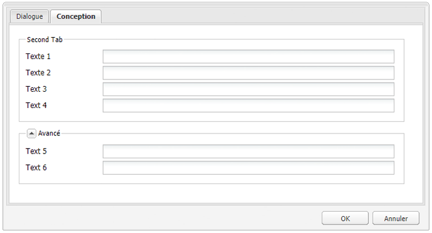
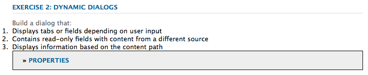
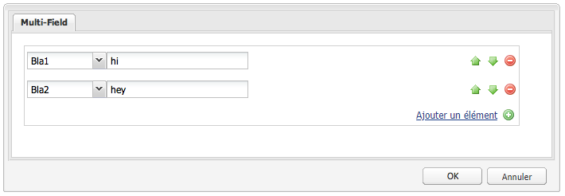

# Utilisation et extension de widgets (IU classique){#using-and-extending-widgets-classic-ui}

>[!NOTE]
>
>Cette page décrit l’utilisation de widgets dans l’interface utilisateur classique, qui a été abandonnée dans AEM 6.4.
>
>Adobe vous recommande d’utiliser l’[IU tactile](/help/sites-developing/touch-ui-concepts.md) moderne basée sur l’[IU Coral](/help/sites-developing/touch-ui-concepts.md#coral-ui) et l’[IU Granite](/help/sites-developing/touch-ui-concepts.md#granite-ui-foundation-components).

L’interface web d’Adobe Experience Manager utilise AJAX et d’autres technologies modernes intégrées dans les navigateurs pour activer l’édition tel écran tel écrit (WYSIWYG) et permettre aux auteurs de mettre en forme le contenu directement sur la page web.

Adobe Experience Manager (AEM) utilise la bibliothèque de widgets [ExtJS](https://www.sencha.com/), laquelle fournit des éléments d’interface utilisateur particulièrement soignés compatibles avec les principaux navigateurs du marché et permettent de créer des interfaces utilisateur dignes des ordinateurs de bureau.

Ces widgets sont inclus dans AEM et, en plus d’être utilisés par AEM, ils peuvent l’être par tout site web créé à l’aide de cette solution.

Pour consulter la liste complète de tous les widgets disponibles dans AEM, vous pouvez vous reporter à la [documentation API des widgets](https://helpx.adobe.com/experience-manager/6-5/sites/developing/using/reference-materials/widgets-api/index.html) ou à la [liste des xtypes existants](/help/sites-developing/xtypes.md). En outre, de nombreux exemples montrant comment utiliser la structure ExtJS sont disponibles sur le site de [Sencha](https://www.sencha.com/products/extjs/examples/), le propriétaire de la structure.

Cette page vous livre quelques pistes concernant l’utilisation et l’extension des widgets. Elle vous explique, tout d’abord, comment [inclure du code côté client dans une page](#including-the-client-sided-code-in-a-page). Elle présente ensuite quelques exemples de composants qui ont été créés pour illustrer des scénarios d’utilisation et d’extension de base. Ces composants sont disponibles dans le module **Utilisation de widgets ExtJS** sur **Package Share**.

Ce module contient des exemples des éléments suivants :

* [Boîtes de dialogue de base](#basic-dialogs) constituées de widgets prêts à l’emploi.
* [Boîtes de dialogue dynamiques](#dynamic-dialogs) créées avec des widgets prêts à l’emploi et la logique JavaScript personnalisée.
* Boîtes de dialogue basées sur des [widgets personnalisés](#custom-widgets).
* Un [panneau Arborescence](#tree-overview) qui affiche une arborescence JCR sous un chemin d’accès donné.
* Un [panneau Grille](#grid-overview) qui affiche des données sous la forme d’un tableau.

>[!NOTE]
>
>L’IU classique d’Adobe Experience Manager repose sur [ExtJS 3.4.0](https://extjs.cachefly.net/ext-3.4.0/docs/).

## Insertion du code côté client dans une page {#including-the-client-sided-code-in-a-page}

Le code javascript et la feuille de style côté client doivent être placés dans une bibliothèque cliente.

Pour créer une bibliothèque cliente, procédez comme suit :

1. Créez un noeud sous `/apps/<project>` avec les propriétés suivantes :

   * name=&quot;clientlib&quot;
   * jcr:mixinTypes=&quot;[mix:lockable]&quot;
   * jcr:primaryType=&quot;cq:ClientLibraryFolder&quot;
   * sling:resourceType=&quot;widgets/clientlib&quot;
   * catégories=&quot;[&lt;nom de la catégorie>]&quot;
   * dépendances=&quot;[cq.widgets]&quot;

   `Note: <category-name> is the name of the custom library (e.g. "cq.extjstraining") and is used to include the library on the page.`

1. Ci-dessous `clientlib` créez les dossiers `css` et `js` (nt:folder).

1. Ci-dessous `clientlib` créez les fichiers `css.txt` et `js.txt` (nt:files). Ces fichiers .txt répertorient les fichiers qui sont inclus dans la bibliothèque.

1. Modifier `js.txt` : il doit être début avec &quot; `#base=js`&quot; suivi de la liste des fichiers qui seront agrégés par le service de bibliothèque client CQ, par exemple :

   ```
   #base=js
    components.js
    exercises.js
    CustomWidget.js
    CustomBrowseField.js
    InsertTextPlugin.js
   ```

1. Modifier `css.txt` : il doit être début avec &quot; `#base=css`&quot; suivi de la liste des fichiers qui seront agrégés par le service de bibliothèque client CQ, par exemple :

   ```
   #base=css
    components.css
   ```

1. Sous le dossier `js`, placez les fichiers JavaScript appartenant à la bibliothèque.

1. Sous le dossier `css`, placez les fichiers `.css` et les ressources utilisées par les fichiers CSS (ex. `my_icon.png`).

>[!NOTE]
>
>La gestion des feuilles de style décrites précédemment est facultative.

Pour inclure la bibliothèque cliente dans le fichier jsp du composant de page :

* pour inclure à la fois le code javascript et les feuilles de style :
   `<ui:includeClientLib categories="<category-name1>, <category-name2>, ..."/>`
où 
`<category-nameX>` est le nom de la bibliothèque côté client.

* pour inclure uniquement le code javascript :
   `<ui:includeClientLib js="<category-name>"/>`

Pour plus d’informations, consultez la description de la balise [&lt;ui:includeClientLib>](/help/sites-developing/taglib.md#lt-ui-includeclientlib).

Dans certains cas, une bibliothèque cliente ne doit être disponible que dans le mode de création et doit être exclue du mode de publication. Vous pouvez y parvenir comme suit :

```xml
    if (WCMMode.fromRequest(request) != WCMMode.DISABLED) {
        %><ui:includeClientLib categories="cq.collab.blog"/><%
    }
```

### Prise en main des exemples {#getting-started-with-the-samples}

Pour suivre les didacticiels de cette page, installez le package **Utilisation des widgets ExtJS** dans une instance d&#39;AEM locale et créez un exemple de page dans laquelle les composants seront inclus. Pour ce faire :

1. Dans votre instance AEM, téléchargez le package **Utilisation des widgets ExtJS (v01)** depuis Package Share et installez le package. Il crée le projet `extjstraining` ci-dessous `/apps` dans le référentiel.
1. Incluez la bibliothèque cliente contenant les scripts (js) et la feuille de style (css) dans la balise head de la page geometrixx jsp, car vous allez inclure les exemples de composants dans une nouvelle page de la branche **Geometrixx** :
dans **CRXDE Lite** ouvrez le fichier `/apps/geometrixx/components/page/headlibs.jsp` et ajoutez la catégorie `cq.extjstraining` à la balise `<ui:includeClientLib>` existante comme suit :
   `%><ui:includeClientLib categories="apps.geometrixx-main, cq.extjstraining"/><%`
1. Créez une nouvelle page dans la branche **Geometrixx** située sous `/content/geometrixx/en/products` et appelez-la **à l’aide des widgets ExtJS**.
1. Passez en mode Création et ajoutez tous les composants du groupe appelé **Utilisation des widgets ExtJS** à la conception de Geometrixx.
1. Revenir en mode d’édition : les composants du groupe **Utilisation des widgets ExtJS** sont disponibles dans le Sidekick.

>[!NOTE]
>
>Les exemples de cette page sont basés sur l’échantillon de contenu Geometrixx. Celui-ci n’est plus fourni avec AEM et a été remplacé par We.Retail. Voir le document [Implémentation de référence We.Retail](/help/sites-developing/we-retail.md#we-retail-geometrixx) pour savoir comment télécharger et installer le Geometrixx.

### Boîtes de dialogue de base {#basic-dialogs}

Les boîtes de dialogue sont généralement utilisées pour modifier du contenu. Cependant, elles peuvent également afficher simplement des informations. Pour afficher une boîte de dialogue complète, une méthode simple consiste à accéder à sa représentation au format json. Pour ce faire, faites pointer le navigateur vers :

`https://localhost:4502/<path-to-dialog>.-1.json`

Le premier composant du groupe **Utilisation des widgets ExtJS** dans le sidekick se nomme **1. Éléments de base de boîte de dialogue**. Il comprend quatre boîtes de dialogue de base qui sont constituées de widgets prêts à l’emploi, sans logique JavaScript personnalisée. Les boîtes de dialogue sont stockées sous `/apps/extjstraining/components/dialogbasics`. Les boîtes de dialogue de base sont les suivantes :

* Boîte de dialogue complète (nœud `full`) : elle affiche une fenêtre avec 3 onglets ayant chacun 2 champs de texte.
* Boîte de dialogue à un seul panneau (nœud `singlepanel`) : elle affiche une fenêtre avec 1 seul onglet comprenant 2 champs de texte.
* Boîte de dialogue à plusieurs panneaux (nœud `multipanel`) : l’affichage est identique à celui de la boîte de dialogue complète, mais la construction est différente.
* Boîte de dialogue de conception (nœud `design`) : elle affiche une fenêtre avec 2 onglets. Le premier onglet contient un champ de texte, un menu déroulant et une zone de texte réductible. Le deuxième onglet comprend un jeu de champs avec 4 champs de texte et un jeu de champs réductible avec 2 champs de texte.

Insérez le composant **1. Éléments de base de boîte de dialogue** dans l’exemple de page :

1. Ajoutez le composant **1. Composant de base de la boîte de dialogue** à la page d’exemple à partir de l’onglet **Utilisation des widgets ExtJS** dans le **Sidekick**.
1. Le composant affiche un titre, du texte et un lien **PROPRIÉTÉS** : cliquez sur le lien pour afficher les propriétés du paragraphe qui sont stockées dans le référentiel. Cliquez à nouveau sur le lien pour masquer les propriétés.

Le composant se présente sous la forme suivante :


#### Exemple 1 : Boîte de dialogue complète {#example-full-dialog}

La boîte de dialogue **Complète** affiche une fenêtre avec trois onglets ayant chacun deux champs de texte. Il s’agit de la boîte de dialogue par défaut du composant **Éléments de base de boîte de dialogue**. Ses caractéristiques sont les suivantes :

* Est défini par un noeud : type de noeud = `cq:Dialog`, xtype = ` [dialog](/help/sites-developing/xtypes.md#dialog)`.
* Affiche 3 onglets (type de noeud = `cq:Panel`).
* Chaque onglet comporte 2 champs de texte (type de noeud = `cq:Widget`, xtype = ` [textfield](/help/sites-developing/xtypes.md#textfield)`).
* Est défini par le noeud :
   `/apps/extjstraining/components/dialogbasics/full`
* Est rendu au format JSON en demandant :
   `https://localhost:4502/apps/extjstraining/components/dialogbasics/full.-1.json`

La boîte de dialogue se présente comme suit :


#### Exemple 2 : Boîte de dialogue à un seul panneau {#example-single-panel-dialog}

La boîte de dialogue **à un seul panneau** affiche une fenêtre avec un seul onglet comprenant deux champs de texte. Ses caractéristiques sont les suivantes :

* Affiche 1 onglet (type de noeud = `cq:Dialog`, xtype = ` [panel](/help/sites-developing/xtypes.md#panel)`)
* L’onglet comporte 2 champs de texte (type de noeud = `cq:Widget`, xtype = ` [textfield](/help/sites-developing/xtypes.md#textfield)`)
* Est défini par le noeud :
   `/apps/extjstraining/components/dialogbasics/singlepanel`
* Est rendu au format json en demandant :
   `https://localhost:4502/apps/extjstraining/components/dialogbasics/singlepanel.-1.json`
* L’avantage de cette boîte de dialogue est de nécessiter moins de configuration que la **Boîte de dialogue complète**.
* Utilisation recommandée : boîtes de dialogue simples affichant des informations ou ne comportant que quelques champs.

Pour utiliser la boîte de dialogue à un seul panneau, procédez comme suit :

1. Remplacez la boîte de dialogue du composant **Éléments de base de boîte de dialogue** par la boîte de dialogue **à un seul panneau** :
   1. Dans **CRXDE Lite**, supprimez le noeud : `/apps/extjstraining/components/dialogbasics/dialog`
   1. Cliquez sur **Enregistrer tout** pour enregistrer les modifications.
   1. Copiez le noeud : `/apps/extjstraining/components/dialogbasics/singlepanel`
   1. Collez le noeud copié ci-dessous : `/apps/extjstraining/components/dialogbasics`
   1. Sélectionnez le noeud : `/apps/extjstraining/components/dialogbasics/Copy of singlepanel`et renommez-la `dialog`.
1. Modifiez le composant. La boîte de dialogue s’affiche alors comme suit :


#### Exemple 3 : Boîte de dialogue à plusieurs panneaux {#example-multi-panel-dialog}

Dans le cas de la boîte de dialogue **à plusieurs panneaux**, l’affichage est identique à celui de la boîte de dialogue **complète**, mais la construction est différente. Ses caractéristiques sont les suivantes :

* Est défini par un noeud (type de noeud = `cq:Dialog`, xtype = ` [tabpanel](/help/sites-developing/xtypes.md#tabpanel)`).
* Affiche 3 onglets (type de noeud = `cq:Panel`).
* Chaque onglet comporte 2 champs de texte (type de noeud = `cq:Widget`, xtype = ` [textfield](/help/sites-developing/xtypes.md#textfield)`).
* Est défini par le noeud :
   `/apps/extjstraining/components/dialogbasics/multipanel`
* Est rendu au format json en demandant :
   `https://localhost:4502/apps/extjstraining/components/dialogbasics/multipanel.-1.json`
* Par rapport à la **Boîte de dialogue complète**, elle présente une structure simplifiée.
* Utilisation recommandée : boîtes de dialogues à plusieurs onglets.

Pour utiliser la boîte de dialogue Panneau multiple :

1. Remplacez la boîte de dialogue du composant **Dialog Basics** par la boîte de dialogue **Multi Panel** :
suivez les étapes décrites pour l&#39;[Exemple 2 : Boîte de dialogue d’un seul panneau](#example-single-panel-dialog)
1. Modifiez le composant. La boîte de dialogue s’affiche alors comme suit :


#### Exemple 4 : Format Riche {#example-rich-dialog}

La boîte de dialogue **Riche** affiche une fenêtre avec deux onglets. Le premier onglet contient un champ de texte, un menu déroulant et une zone de texte réductible. Le deuxième onglet comprend un jeu de champs avec quatre champs de texte et un jeu de champs réductible avec deux champs de texte. Ses caractéristiques sont les suivantes :

* Est défini par un noeud (type de noeud = `cq:Dialog`, xtype = ` [dialog](/help/sites-developing/xtypes.md#dialog)`).
* Affiche 2 onglets (type de noeud = `cq:Panel`).
* Le premier onglet comporte un widget ` [dialogfieldset](/help/sites-developing/xtypes.md#dialogfieldset)` avec un widget ` [textfield](/help/sites-developing/xtypes.md#textfield)` et un widget ` [selection](/help/sites-developing/xtypes.md#selection)` avec 3 options, et un ` [dialogfieldset](/help/sites-developing/xtypes.md#dialogfieldset)` réductible avec un widget ` [textarea](/help/sites-developing/xtypes.md#textarea)`.
* Le second onglet comporte un widget ` [dialogfieldset](/help/sites-developing/xtypes.md#dialogfieldset)` avec 4 widgets ` [textfield](/help/sites-developing/xtypes.md#textfield)` et un `dialogfieldset` réductible avec 2 widgets ` [textfield](/help/sites-developing/xtypes.md#textfield)`.
* Est défini par le noeud :
   `/apps/extjstraining/components/dialogbasics/rich`
* Est rendu au format json en demandant :
   `https://localhost:4502/apps/extjstraining/components/dialogbasics/rich.-1.json`

Pour utiliser la boîte de dialogue **Riche**, procédez comme suit :

1. Remplacez la boîte de dialogue du composant **Dialog Basics** par la boîte de dialogue **Rich** :
suivez les étapes décrites pour l&#39;[Exemple 2 : Boîte de dialogue d’un seul panneau](#example-single-panel-dialog)
1. Modifiez le composant. La boîte de dialogue s’affiche alors comme suit :

 

### Boîtes de dialogue dynamiques {#dynamic-dialogs}

Le deuxième composant du groupe **Utilisation des widgets ExtJS** dans le sidekick se nomme **2. Boîtes de dialogue dynamiques**. Il comprend trois boîtes de dialogue dynamiques qui sont constituées de widgets prêts à l’emploi, **avec une logique JavaScript personnalisée**. Les boîtes de dialogue sont stockées sous `/apps/extjstraining/components/dynamicdialogs`. Les boîtes de dialogue dynamiques sont les suivantes :

* Boîte de dialogue Switch Tabs (nœud `switchtabs`) : elle affiche une fenêtre avec deux onglets. Le premier onglet comprend trois cases d’option : lorsqu’une option est sélectionnée, l’onglet correspondant est affiché. Le deuxième onglet comprend deux champs de texte.
* Boîte de dialogue  (nœud (`arbitrary`arbitrary) : elle affiche une fenêtre avec un seul onglet. Cet onglet se compose d’une zone permettant de déposer ou de télécharger une ressource, ainsi que d’une section affichant des informations sur la page et sur la ressource, le cas échéant.
* la boîte de dialogue Basculer les champs ( `togglefield` noeud) : il affiche une fenêtre avec un onglet. Cet onglet comprend une case à cocher : lorsque cette case est cochée, un jeu de champs composé de deux champs de texte est affiché.

Pour inclure le **2. Boîtes de dialogue dynamiques** dans l’exemple de page :

1. Ajoutez le composant **2. Boîtes de dialogue dynamiques** à l’exemple de page à partir de l’onglet **Utilisation des widgets ExtJS** dans le **sidekick**.
1. Le composant affiche un titre, du texte et un lien **PROPRIÉTÉS** : cliquez sur ce lien pour afficher les propriétés du paragraphe qui sont stockées dans le référentiel. Cliquez à nouveau pour masquer les propriétés.

Le composant se présente sous la forme suivante :



#### Exemple 1 : Boîte de dialogue Switch Tabs {#example-switch-tabs-dialog}

La boîte de dialogue **Switch Tabs** affiche une fenêtre avec deux onglets. Le premier onglet comprend trois cases d’option : lorsqu’une option est sélectionnée, l’onglet correspondant est affiché. Le deuxième onglet comprend deux champs de texte.

Ses caractéristiques principales sont les suivantes :

* Est défini par un noeud (type de noeud = `cq:Dialog`, xtype = ` [dialog](/help/sites-developing/xtypes.md#dialog)`).
* Elle affiche 2 onglets (type de nœud = `cq:Panel`) : 1 onglet de sélection, le deuxième onglet dépend de la sélection effectuée dans le premier onglet (3 options).
* Comporte 3 onglets facultatifs (type de noeud = `cq:Panel`), chacun d’eux possède 2 champs de texte (type de noeud = `cq:Widget`, xtype = ` [textfield](/help/sites-developing/xtypes.md#textfield)`). Un seul onglet facultatif est affiché à la fois.
* Est défini par le noeud `switchtabs` à :
   `/apps/extjstraining/components/dynamicdialogs/switchtabs`
* Est rendu au format json en demandant :
   `https://localhost:4502/apps/extjstraining/components/dynamicdialogs/switchtabs.-1.json`

Cette logique est implémentée par le biais d’écouteurs d’événements et de code JavaScript comme suit :

* Le noeud dialog a un écouteur &quot; `beforeshow`&quot; qui masque tous les onglets facultatifs avant que la boîte de dialogue ne s’affiche :
   `beforeshow="function(dialog){Ejst.x2.manageTabs(dialog.items.get(0));}"`

   `dialog.items.get(0)` obtient le panneau de tabulation qui contient le panneau de sélection et les 3 panneaux facultatifs.
* L&#39;objet `Ejst.x2` est défini dans le fichier `exercises.js` à l&#39;adresse suivante :
   `/apps/extjstraining/clientlib/js/exercises.js`
* Dans la méthode `Ejst.x2.manageTabs()`, comme la valeur de `index` est -1, tous les onglets facultatifs sont masqués (i passe de 1 à 3).
* L’onglet de sélection comprend deux écouteurs : un qui affiche l&#39;onglet sélectionné lors du chargement de la boîte de dialogue (&quot; `loadcontent`&quot; événement) et un qui affiche l&#39;onglet sélectionné lors de la modification de la sélection (&quot; `selectionchanged`&quot; événement) :
   `loadcontent="function(field,rec,path){Ejst.x2.showTab(field);}"`

   `selectionchanged="function(field,value){Ejst.x2.showTab(field);}"`
* Dans la méthode `Ejst.x2.showTab()` :
   `field.findParentByType('tabpanel')` obtient le panneau de tabulation qui contient tous les onglets ( `field` représente le widget de sélection).
   `field.getValue()` obtient la valeur de la sélection, par exemple : tab2
   `Ejst.x2.manageTabs()` affiche l’onglet sélectionné.
* Chaque onglet facultatif comporte un écouteur qui masque l&#39;onglet sur le événement &quot; `render`&quot; :
   `render="function(tab){Ejst.x2.hideTab(tab);}"`
* Dans la méthode `Ejst.x2.hideTab()` :
   `tabPanel` est le panneau de tabulation qui contient tous les onglets.
   `index` est l’index de l’onglet facultatif.
   `tabPanel.hideTabStripItem(index)` masque l’onglet

Elle se présente comme suit :


#### Exemple 2 : Boîte de dialogue Arbitrary {#example-arbitrary-dialog}

Très souvent, une boîte de dialogue affiche du contenu provenant d’un composant sous-jacent. La boîte de dialogue décrite ici, baptisée **Arbitrary**, extrait le contenu d’un autre composant.

La boîte de dialogue **Arbitrary** affiche une fenêtre avec un seul onglet. Cet onglet comprend deux zones : l’une permettant de déposer ou de télécharger une ressource, et une autre affichant des informations sur la page et sur la ressource, le cas échéant.

Ses caractéristiques principales sont les suivantes :

* Est défini par un noeud (type de noeud = `cq:Dialog`, xtype = ` [dialog](/help/sites-developing/xtypes.md#dialog)`).
* Affiche 1 widget tabpanel (type de noeud = `cq:Widget`, xtype = ` [tabpanel](/help/sites-developing/xtypes.md#tabpanel)`) avec 1 panneau (type de noeud = `cq:Panel`).
* Le panneau comporte un widget de fichier intelligent (type de noeud = `cq:Widget`, xtype = ` [smartfile](/help/sites-developing/xtypes.md#smartfile)`) et un widget de dessin de propriété (type de noeud = `cq:Widget`, xtype = ` [ownerdraw](/help/sites-developing/xtypes.md#ownerdraw)`).
* Est défini par le noeud `arbitrary` à :
   `/apps/extjstraining/components/dynamicdialogs/arbitrary`
* Est rendu au format json en demandant :
   `https://localhost:4502/apps/extjstraining/components/dynamicdialogs/arbitrary.-1.json`

Cette logique est implémentée par le biais d’écouteurs d’événements et de code JavaScript comme suit :

* Le widget de dessin de propriétés comporte un écouteur &quot; `loadcontent`&quot; qui affiche des informations sur la page contenant le composant et la ressource référencée par le widget de fichier intelligent lors du chargement du contenu :
   `loadcontent="function(field,rec,path){Ejst.x2.showInfo(field,rec,path);}"`

   `field` est défini avec l’objet ownerdraw
   `path` est défini avec le chemin de contenu du composant (par ex. : /content/geometrixx/fr/products/triangle/ui-tutorial/jcr:content/par/dynamicdialogs)
* L&#39;objet `Ejst.x2` est défini dans le fichier `exercises.js` à l&#39;adresse suivante :
   `/apps/extjstraining/clientlib/js/exercises.js`
* Dans la méthode `Ejst.x2.showInfo()` :
   `pagePath` est le chemin d’accès de la page contenant le composant
   `pageInfo` représente les propriétés de la page au format json.
   `reference` est le chemin d’accès de l’actif référencé
   `metadata` représente les métadonnées du fichier au format json.
   `ownerdraw.getEl().update(html);` affiche le code html créé dans la boîte de dialogue.

Pour utiliser la boîte de dialogue **Arbitrary**, procédez comme suit :

1. Remplacez la boîte de dialogue du composant **Dialogue dynamique** par la boîte de dialogue **Arbitraire** :
suivez les étapes décrites pour l&#39;[Exemple 2 : Boîte de dialogue d’un seul panneau](#example-single-panel-dialog)
1. Modifiez le composant. La boîte de dialogue s’affiche alors comme suit :


#### Exemple 3 : Boîte de dialogue Toggle Fields {#example-toggle-fields-dialog}

La boîte de dialogue **Toggle Fields**) affiche une fenêtre avec un seul onglet. Cet onglet comprend une case à cocher : lorsque cette case est cochée, un jeu de champs composé de deux champs de texte est affiché.

Ses caractéristiques principales sont les suivantes :

* Est défini par un noeud (type de noeud = `cq:Dialog`, xtype = ` [dialog](/help/sites-developing/xtypes.md#dialog)`).
* Affiche 1 widget tabpanel (type de noeud = `cq:Widget`, xtype = ` [tabpanel](/help/sites-developing/xtypes.md#textpanel)`) avec 1 panneau (type de noeud = `cq:Panel`).
* Le panneau comporte un widget de sélection/case à cocher (type de noeud = `cq:Widget`, xtype = ` [selection](/help/sites-developing/xtypes.md#selection)`, type = ` [checkbox](/help/sites-developing/xtypes.md#checkbox)`) et un widget de jeu de boîtes de dialogue réductibles (type de noeud = `cq:Widget`, xtype = ` [dialogfieldset](/help/sites-developing/xtypes.md#dialogfieldset)`) qui est masqué par défaut, avec 2 widgets de champs de texte (type de noeud = `cq:Widget`, xtype = &lt;a6/&quot;).` [textfield](/help/sites-developing/xtypes.md#textfield)`
* Est défini par le noeud `togglefields` à :
   `/apps/extjstraining/components/dynamicdialogs/togglefields`
* Est rendu au format json en demandant :
   `https://localhost:4502/apps/extjstraining/components/dynamicdialogs/togglefields.-1.json`

Cette logique est implémentée par le biais d’écouteurs d’événements et de code JavaScript comme suit :

* l’onglet de sélection comporte deux écouteurs : un qui affiche le jeu de champs de dialogue lors du chargement du contenu (&quot; `loadcontent`&quot; événement) et un qui affiche le jeu de champs de dialogue lors de la modification de la sélection (&quot; `selectionchanged`&quot; événement) :
   `loadcontent="function(field,rec,path){Ejst.x2.toggleFieldSet(field);}"`

   `selectionchanged="function(field,value){Ejst.x2.toggleFieldSet(field);}"`
* L&#39;objet `Ejst.x2` est défini dans le fichier `exercises.js` à l&#39;adresse suivante :
   `/apps/extjstraining/clientlib/js/exercises.js`
* Dans la méthode `Ejst.x2.toggleFieldSet()` :
   `box` est l’objet de sélection
   `panel` est le panneau contenant la sélection et les widgets d&#39;ensemble de champs de dialogue
   `fieldSet` est l’objet dialogfieldset
   `show` est la valeur de la sélection (true ou false) basée sur &#39;  `show`&#39; le jeu de champs de dialogue est affiché ou non.

Pour utiliser la boîte de dialogue **Basculer les champs** :

1. Remplacez la boîte de dialogue du composant **Dialogue dynamique** par la boîte de dialogue **Basculer les champs** :
suivez les étapes décrites pour l&#39;[Exemple 2 : Boîte de dialogue d’un seul panneau](#example-single-panel-dialog)
1. Modifiez le composant. La boîte de dialogue s’affiche alors comme suit :


### Widgets personnalisés {#custom-widgets}

Les widgets prêts à l’emploi fournis avec AEM couvrent normalement la plupart des scénarios d’utilisation. Cependant, il peut être parfois nécessaire de créer un widget personnalisé pour couvrir une exigence spécifique à un projet. Des widgets personnalisés peuvent être créés en étendant des widgets existants. Pour vous aider à débuter avec ce type de personnalisation, le module **Utilisation des widgets ExtJS** comprend trois boîtes de dialogue qui utilisent trois widgets personnalisés différents :

* La boîte de dialogue Multi Field (nœud `multifield`) affiche une fenêtre avec un seul onglet. Cet onglet comprend un widget multifield personnalisé qui comporte deux zones : un menu déroulant avec deux options et un champ de texte. Comme il est basé sur le widget `multifield` prêt à l&#39;emploi (qui ne comporte qu&#39;un champ de texte), il possède toutes les fonctionnalités du widget `multifield`.
* La boîte de dialogue Tree Browse (nœud `treebrowse`) affiche une fenêtre avec un seul onglet contenant un widget d’exploration du chemin : lorsque vous cliquez sur la flèche, une fenêtre s’ouvre dans laquelle vous pouvez parcourir une hiérarchie et sélectionner un élément. Le chemin d’accès de l’élément est ensuite ajouté au champ du chemin et conservé lorsque la boîte de dialogue est fermée.
* Une boîte de dialogue basée sur le module Éditeur de texte enrichi (nœud `rteplugin`) qui ajoute un bouton personnalisé à l’Éditeur de texte enrichi pour insérer du texte personnalisé dans le texte principal. Elle comprend un widget `richtext` (RTE) et une fonctionnalité personnalisée qui est ajoutée par le biais du module externe RTE.

Les widgets personnalisés et le module externe sont inclus dans le composant appelé **3. Widgets personnalisés** du module **Utilisation des widgets ExtJS**. Pour inclure ce composant dans l’exemple de page, procédez comme suit :

1. Ajoutez le composant **3. Widgets personnalisés** à l’exemple de page à partir de l’onglet **Utilisation des widgets ExtJS** dans le **sidekick**.
1. Le composant affiche un titre, du texte et, lorsque vous cliquez sur le lien **PROPRIÉTÉS**, les propriétés du paragraphe stocké dans le référentiel. Cliquez à nouveau pour masquer les propriétés.
Le composant se présente sous la forme suivante :


#### Exemple 1 : Widget Custom Multifield {#example-custom-multifield-widget}

La boîte de dialogue basée sur le widget **Custom Multifield** affiche une fenêtre avec un seul onglet. Cet onglet comprend un widget à plusieurs champs (multi-field) personnalisé qui, contrairement à l’onglet standard avec son champ unique, comporte deux zones : un menu déroulant avec deux options et un champ de texte.

Boîte de dialogue basée sur le widget **Custom Multifield** :

* Est défini par un noeud (type de noeud = `cq:Dialog`, xtype = ` [dialog](/help/sites-developing/xtypes.md#dialog)`).
* Affiche 1 widget tabpanel (type de noeud = `cq:Widget`, xtype = ` [tabpanel](/help/sites-developing/xtypes.md#tabpanel)`) contenant un panneau (type de noeud = `cq:Widget`, xtype = ` [panel](/help/sites-developing/xtypes.md#panel)`).
* Le panneau comporte un widget `multifield` (type de noeud = `cq:Widget`, xtype = ` [multifield](/help/sites-developing/xtypes.md#multifield)`).
* Le widget `multifield` possède un fichier fieldconfig (type de noeud = `nt:unstructured`, xtype = `ejstcustom`, optionsProvider = `Ejst.x3.provideOptions`) qui est basé sur le type personnalisé &#39; `ejstcustom`&#39; :
   * &quot; `fieldconfig`&quot; est une option de configuration de l&#39;objet ` [CQ.form.MultiField](https://helpx.adobe.com/experience-manager/6-5/sites/developing/using/reference-materials/widgets-api/index.html?class=CQ.form.MultiField)`.
   * &quot; `optionsProvider`&quot; est une configuration du widget `ejstcustom`. Il est défini avec la méthode `Ejst.x3.provideOptions` définie dans `exercises.js` à :
      `/apps/extjstraining/clientlib/js/exercises.js`
et renvoie 2 options.
* Est défini par le noeud `multifield` à :
   `/apps/extjstraining/components/customwidgets/multifield`
* Est rendu au format json en demandant :
   `https://localhost:4502/apps/extjstraining/components/customwidgets/multifield.-1.json`

Widget à plusieurs champs (multifield) personnalisé (xtype = `ejstcustom`) :

* Il s’agit d’un objet JavaScript appelé `Ejst.CustomWidget`.
* Est défini dans le fichier javascript `CustomWidget.js` à l’adresse :
   `/apps/extjstraining/clientlib/js/CustomWidget.js`
* Étend le widget ` [CQ.form.CompositeField](https://helpx.adobe.com/experience-manager/6-5/sites/developing/using/reference-materials/widgets-api/index.html?class=CQ.form.CompositeField)`.
* Comporte 3 champs : `hiddenField` (Champ de texte), `allowField` (Zone de liste déroulante) et `otherField` (Champ de texte)
* Remplace `CQ.Ext.Component#initComponent` pour ajouter les 3 champs :
   * `allowField` est un objet [CQ.form.Selection](https://helpx.adobe.com/experience-manager/6-5/sites/developing/using/reference-materials/widgets-api/index.html?class=CQ.form.Selection) de type « select ». optionsProvider est une configuration de l’objet Selection qui est instancié avec la configuration optionsProvider du CustomWidget défini dans la boîte de dialogue.
   * `otherField` est un objet [CQ.Ext.form.TextField](https://helpx.adobe.com/experience-manager/6-5/sites/developing/using/reference-materials/widgets-api/index.html?class=CQ.Ext.form.TextField).
* Remplace les méthodes `setValue`, `getValue` et `getRawValue` de [CQ.form.CompositeField](https://helpx.adobe.com/experience-manager/6-5/sites/developing/using/reference-materials/widgets-api/index.html?class=CQ.form.CompositeField) afin de définir et de récupérer la valeur de CustomWidget au format suivant :
   `<allowField value>/<otherField value>, e.g.: 'Bla1/hello'`.
* S&#39;enregistre comme xtype &#39; `ejstcustom`&#39; :
   `CQ.Ext.reg('ejstcustom', Ejst.CustomWidget);`

La boîte de dialogue basée sur le widget **Custom Multifield** se présente comme suit :



#### Exemple 2 : Widget treebrowse personnalisé {#example-custom-treebrowse-widget}

La boîte de dialogue basée sur le widget **Treebrowse** personnalisé affiche une fenêtre avec un seul onglet contenant un widget d’exploration de chemin personnalisé : lorsque vous cliquez sur la flèche, une fenêtre s’ouvre dans laquelle vous pouvez parcourir une hiérarchie et sélectionner un élément. Le chemin d’accès de l’élément est ensuite ajouté au champ du chemin et conservé lorsque la boîte de dialogue est fermée.

Boîte de dialogue treebrowse personnalisée :

* Est défini par un noeud (type de noeud = `cq:Dialog`, xtype = ` [dialog](/help/sites-developing/xtypes.md#dialog)`).
* Affiche 1 widget tabpanel (type de noeud = `cq:Widget`, xtype = ` [tabpanel](/help/sites-developing/xtypes.md#tabpanel)`) contenant un panneau (type de noeud = `cq:Widget`, xtype = ` [panel](/help/sites-developing/xtypes.md#panel)`).
* Le panneau comporte un widget personnalisé (type de noeud = `cq:Widget`, xtype = `ejstbrowse`)
* Est défini par le noeud `treebrowse` à :
   `/apps/extjstraining/components/customwidgets/treebrowse`
* Est rendu au format json en demandant :
   `https://localhost:4502/apps/extjstraining/components/customwidgets/treebrowse.-1.json`

Widget treebrowse personnalisé (xtype = `ejstbrowse`) :

* Il s’agit d’un objet JavaScript appelé `Ejst.CustomWidget`.
* Est défini dans le fichier javascript `CustomBrowseField.js` à l’adresse :
   `/apps/extjstraining/clientlib/js/CustomBrowseField.js`
* Étend ` [CQ.Ext.form.TriggerField](https://helpx.adobe.com/experience-manager/6-5/sites/developing/using/reference-materials/widgets-api/index.html?class=CQ.Ext.form.TriggerField)`.
* Il définit une fenêtre de navigation appelée `browseWindow`.
* Remplace ` [CQ.Ext.form.TriggerField](https://helpx.adobe.com/experience-manager/6-5/sites/developing/using/reference-materials/widgets-api/index.html?class=CQ.Ext.form.TriggerField)#onTriggerClick` pour afficher la fenêtre de navigation lorsque l&#39;utilisateur clique sur la flèche.
* Il définit un objet [CQ.Ext.tree.TreePanel](https://helpx.adobe.com/experience-manager/6-5/sites/developing/using/reference-materials/widgets-api/index.html?class=CQ.Ext.tree.TreePanel) :
   * Il obtient ses données en appelant la servlet enregistrée à `/bin/wcm/siteadmin/tree.json`.
   * Sa racine est &quot; `apps/extjstraining`&quot;.
* Définit un objet `window` ( ` [CQ.Ext.Window](https://helpx.adobe.com/experience-manager/6-5/sites/developing/using/reference-materials/widgets-api/index.html?class=CQ.Ext.Window)`) :
   * Il est basé sur le panneau prédéfini.
   * Il comprend un bouton **OK** qui définit la valeur du chemin d’accès sélectionné et masque le panneau.
* La fenêtre est ancrée sous le champ **Chemin d’accès**.
* Le chemin d’accès est transmis du champ de navigation à la fenêtre lorsque l’événement `show` se produit.
* S&#39;enregistre comme xtype &#39; `ejstbrowse`&#39; :
   `CQ.Ext.reg('ejstbrowse', Ejst.CustomBrowseField);`

Pour utiliser la boîte de dialogue de widget **Parcourir Treebrowse personnalisé** :

1. Remplacez la boîte de dialogue du composant **Custom Widgets** par la boîte de dialogue **Custom Treebrowse** :
suivez les étapes décrites pour l&#39;[Exemple 2 : Boîte de dialogue d’un seul panneau](#example-single-panel-dialog)
1. Modifiez le composant. La boîte de dialogue s’affiche alors comme suit :


#### Exemple 3 : Module externe Éditeur de texte enrichi (RTE){#example-rich-text-editor-rte-plug-in}

La boîte de dialogue basée sur le **module externe Éditeur de Texte Enrichi (RTE)** comprend un bouton personnalisé pour insérer du texte personnalisé entre crochets. Le texte personnalisé peut être analysé par une logique côté serveur (non implémentée dans cet exemple), par exemple pour ajouter du texte défini à l’emplacement donné :

Boîte de dialogue basée sur le **module externe RTE** :

* Est défini par le noeud rteplugin dans :
   `/apps/extjstraining/components/customwidgets/rteplugin`
* Est rendu au format json en demandant :
   `https://localhost:4502/apps/extjstraining/components/customwidgets/rteplugin.-1.json`
* Le noeud `rtePlugins` a un noeud enfant `inserttext` (type de noeud = `nt:unstructured`) nommé d’après le module externe. Elle possède une propriété appelée `features`, qui définit les fonctionnalités du module externe disponibles pour l’éditeur de texte enrichi.

Module externe RTE :

* Il s’agit d’un objet JavaScript appelé `Ejst.InsertTextPlugin`.
* Est défini dans le fichier javascript `InsertTextPlugin.js` à l’adresse :
   `/apps/extjstraining/clientlib/js/InsertTextPlugin.js`
* Étend l&#39;objet ` [CQ.form.rte.plugins.Plugin](https://helpx.adobe.com/experience-manager/6-5/sites/developing/using/reference-materials/widgets-api/index.html?class=CQ.form.rte.plugins.Plugin)`.
* Les méthodes suivantes définissent l’objet ` [CQ.form.rte.plugins.Plugin](https://helpx.adobe.com/experience-manager/6-5/sites/developing/using/reference-materials/widgets-api/index.html?class=CQ.form.rte.plugins.Plugin)` et sont remplacées dans le module externe d’implémentation :
   * `getFeatures()` renvoie un tableau de toutes les fonctionnalités rendues disponibles par le module externe.
   * `initializeUI()` ajoute le nouveau bouton à la barre d’outils de l’Éditeur de texte enrichi.
   * `notifyPluginConfig()` affiche le titre et le texte lorsque le bouton est survolé.
   * `execute()` est appelé lorsque l’utilisateur clique sur le bouton et exécute l’action du module externe : il affiche une fenêtre qui est utilisée pour définir le texte à inclure.
* `insertText()` insère un texte à l’aide de l’objet de boîte de dialogue correspondant `Ejst.InsertTextPlugin.Dialog` (voir plus loin).
* `executeInsertText()` est appelée par la  `apply()` méthode de la boîte de dialogue, qui est déclenchée lorsque l’utilisateur clique sur le  **** bouton OK.
* S&#39;enregistre en tant que module externe &quot; `inserttext`&quot; :
   `CQ.form.rte.plugins.PluginRegistry.register("inserttext", Ejst.InsertTextPlugin);`
* L’objet `Ejst.InsertTextPlugin.Dialog` définit la boîte de dialogue qui s’ouvre lorsque l’utilisateur clique sur le bouton du module externe. La boîte de dialogue se compose d’un panneau, d’un formulaire, d’un champ de texte et de 2 boutons (**OK** et **Annuler**).

Pour utiliser la boîte de dialogue basée sur le **module externe Éditeur de Texte Enrichi (RTE)**, procédez comme suit :

1. Remplacez la boîte de dialogue du composant **Widgets personnalisés** par la boîte de dialogue basée sur le **module externe Éditeur de Texte Enrichi (RTE)** : Suivez la procédure décrite pour [Exemple 2 : Boîte de dialogue à un seul panneau](#example-single-panel-dialog).
1. Modifiez le composant.
1. Cliquez sur la dernière icône à droite (celle avec quatre flèches). Saisissez un chemin et cliquez sur **OK** :
Le chemin d’accès s’affiche entre crochets ([ ]).
1. Cliquez sur **OK** pour fermer l’Éditeur de texte enrichi.

La boîte de dialogue basée sur le **module externe Éditeur de Texte Enrichi (RTE)** se présente sous la forme suivante :


>[!NOTE]
>
>Cet exemple montre uniquement comment implémenter la partie client de la logique : les espaces réservés (*[text]*) doivent ensuite être analysés explicitement côté serveur (par exemple dans le composant JSP).

### Tree Overview {#tree-overview}

L’objet` [CQ.Ext.tree.TreePanel](https://helpx.adobe.com/experience-manager/6-5/sites/developing/using/reference-materials/widgets-api/index.html?class=CQ.Ext.tree.TreePanel)` prêt à l’emploi représente les données d’interface utilisateur sous la forme d’une arborescence. Le composant Tree Overview inclus dans le module **Utilisation des widgets ExtJS** montre comment utiliser l’objet `TreePanel` pour afficher une arborescence JCR sous un chemin d’accès donné. La fenêtre proprement dite peut être ancrée/détachée. Dans cet exemple, la logique de fenêtre est incorporée dans le fichier JSP du composant entre les balises &lt;script>&lt;/script>.

Pour inclure le composant **Tree Overview** dans l’exemple de page :

1. Ajoutez le composant **4. Tree Overview** à l’exemple de page à partir de l’onglet **Utilisation des widgets ExtJS** dans le **sidekick**.
1. Le composant affiche les éléments suivants :
   * Un titre, accompagné de texte.
   * Un lien **PROPRIÉTÉS** : cliquez sur ce lien pour afficher les propriétés du paragraphe qui sont stockées dans le référentiel. Cliquez à nouveau pour masquer les propriétés.
   * Une fenêtre flottante avec une représentation arborescente du référentiel, qui peut être développée.

Le composant se présente sous la forme suivante :


Composant Tree Overview :

* Est défini à :
   `/apps/extjstraining/components/treeoverview`

* Sa boîte de dialogue permet de définir la taille de la fenêtre et d’ancrer/de détacher cette dernière (voir les détails ci-dessous).

Le jsp du composant :

* récupère la largeur, la hauteur et les propriétés d’ancrage à partir du référentiel ;
* affiche du texte sur le format des données d’aperçu de l’arborescence ;
* incorpore la logique de fenêtre dans le fichier JSP du composant entre des balises JavaScript ;
* Est défini à :
   `apps/extjstraining/components/treeoverview/content.jsp`

Le code JavaScript incorporé dans le jsp du composant :

* Définit un objet `tree` en essayant de récupérer une fenêtre arborescente de la page.
* Si la fenêtre présentant l&#39;arborescence n&#39;existe pas, `treePanel` ([CQ.Ext.tree.TreePanel](https://helpx.adobe.com/experience-manager/6-5/sites/developing/using/reference-materials/widgets-api/index.html?class=CQ.Ext.tree.TreePanel)) est créé :
   * `treePanel` contient les données utilisées pour créer la fenêtre.
   * Les données sont récupérées en appelant la servlet enregistrée à l&#39;adresse suivante :
      `/bin/wcm/siteadmin/tree.json`
* L&#39;écouteur `beforeload` s&#39;assure que le noeud sur lequel l&#39;utilisateur a cliqué est chargé.
* L&#39;objet `root` définit le chemin `apps/extjstraining` comme racine de l&#39;arborescence.
* `tree` (  ` [CQ.Ext.Window](https://helpx.adobe.com/experience-manager/6-5/sites/developing/using/reference-materials/widgets-api/index.html?class=CQ.Ext.Window)`) est défini en fonction de la valeur prédéfinie  `treePanel` et s’affiche avec :
   `tree.show();`
* Si la fenêtre existe déjà, elle est affichée en fonction de la largeur, de la hauteur et des propriétés d’ancrage extraites du référentiel.

Boîte de dialogue du composant :

* Elle affiche 1 onglet avec 2 champs pour définir la taille (largeur et hauteur) de la fenêtre d’aperçu d’arborescence et 1 champ pour ancrer/détacher la fenêtre.
* Est défini par un noeud (type de noeud = `cq:Dialog`, xtype = ` [panel](/help/sites-developing/xtypes.md#panel)`).
* Le panneau comporte un widget de champ de taille (type de noeud = `cq:Widget`, xtype = ` [sizefield](/help/sites-developing/xtypes.md#sizefield)`) et un widget de sélection (type de noeud = `cq:Widget`, xtype = ` [selection](/help/sites-developing/xtypes.md#selection)`, type = `radio`) avec 2 options (true/false).
* Est défini par le noeud dialog à :
   `/apps/extjstraining/components/treeoverview/dialog`
* Est rendu au format json en demandant :
   `https://localhost:4502/apps/extjstraining/components/treeoverview/dialog.-1.json`
* Elle se présente comme suit :


### Grid Overview {#grid-overview}

Un panneau Grille représente les données sous la forme d’un tableau de lignes et de colonnes. Il se compose des éléments suivants :

* Magasin : modèle contenant les enregistrements de données (lignes).
* Modèle de colonne : mise en page de colonne.
* Affichage : encapsule l’interface utilisateur.
* Modèle de sélection : comportement de la sélection.

Le composant Présentation de la grille inclus dans le package **Utilisation des widgets ExtJS** montre comment afficher les données dans un format tabulaire :

* L’exemple 1 utilise des données statiques.
* L&#39;exemple 2 utilise les données récupérées du référentiel.

Pour inclure le composant Aperçu de la grille dans l’exemple de page :

1. Ajoutez le composant **5. Grid Overview** à l’exemple de page à partir de l’onglet **Utilisation des widgets ExtJS** dans le **sidekick**.
1. Le composant affiche les éléments suivants :
   * un titre avec du texte
   * Un lien **PROPRIÉTÉS** : cliquez sur ce lien pour afficher les propriétés du paragraphe qui sont stockées dans le référentiel. Cliquez à nouveau pour masquer les propriétés.
   * Une fenêtre flottante contenant des données sous la forme d’un tableau.

Le composant se présente sous la forme suivante :


#### Exemple 1 : Grille par défaut {#example-default-grid}

Dans sa version prête à l’emploi, le composant **Grid Overview** affiche une fenêtre avec des données statiques sous forme de tableau. Dans cet exemple, la logique est incorporée dans le fichier JSP du composant de deux manières différentes :

* La logique générique est définie entre les balises &lt;script>&lt;/script>.
* La logique spécifique est disponible dans un fichier .js distinct et un lien vers celle-ci est créé dans le fichier jsp. Cette configuration permet de basculer facilement entre les deux logiques (statique/dynamique) en commentant les balises &lt;script> souhaitées.

Composant Grid Overview :

* Est défini à :
   `/apps/extjstraining/components/gridoverview`
* Sa boîte de dialogue permet de définir la taille de la fenêtre et d’ancrer/de détacher cette dernière.

Le jsp du composant :

* récupère la largeur, la hauteur et les propriétés d’ancrage à partir du référentiel ;
* affiche du texte en guise d’introduction pour le format de données d’aperçu de grille ;
* Référence le code javascript qui définit l’objet GridPanel :
   `<script type="text/javascript" src="/apps/extjstraining/components/gridoverview/defaultgrid.js"></script>`

   `defaultgrid.js` définit certaines données statiques en tant que base de l’objet GridPanel.
* incorpore, entre des balises JavaScript, du code JavaScript qui définit l’objet Window utilisant l’objet GridPanel ;
* Est défini à :
   `apps/extjstraining/components/gridoverview/content.jsp`

Le code JavaScript incorporé dans le jsp du composant :

* Définit l&#39;objet `grid` en essayant de récupérer le composant de fenêtre de la page :
   `var grid = CQ.Ext.getCmp("<%= node.getName() %>-grid");`
* Si `grid` n&#39;existe pas, un objet [CQ.Ext.grid.GridPanel](https://helpx.adobe.com/experience-manager/6-5/sites/developing/using/reference-materials/widgets-api/index.html?class=CQ.Ext.grid.GridPanel) ( `gridPanel`) est défini en appelant la méthode `getGridPanel()` (voir ci-dessous). Cette méthode est définie dans `defaultgrid.js`.
* `grid` est un  ` [CQ.Ext.Window](https://helpx.adobe.com/experience-manager/6-5/sites/developing/using/reference-materials/widgets-api/index.html?class=CQ.Ext.Window)` objet, basé sur le GridPanel prédéfini, et s’affiche :  `grid.show();`
* Si l’objet `grid` existe déjà, il est affiché en fonction de la largeur, de la hauteur et des propriétés d’ancrage extraites du référentiel.

Le fichier javascript ( `defaultgrid.js`) référencé dans le composant jsp définit la méthode `getGridPanel()` qui est appelée par le script incorporé dans le JSP et renvoie un objet ` [CQ.Ext.grid.GridPanel](https://helpx.adobe.com/experience-manager/6-5/sites/developing/using/reference-materials/widgets-api/index.html?class=CQ.Ext.grid.GridPanel)`, basé sur des données statiques. La logique est la suivante :

* `myData` est un tableau de données statiques, composé de 5 colonnes et de 4 lignes.
* `store` est un  `CQ.Ext.data.Store` objet consommé  `myData`.
* `store` est chargé en mémoire :
   `store.load();`
* `gridPanel` est un  ` [CQ.Ext.grid.GridPanel](https://helpx.adobe.com/experience-manager/6-5/sites/developing/using/reference-materials/widgets-api/index.html?class=CQ.Ext.grid.GridPanel)` objet qui consomme  `store`:
   * les largeurs de colonne sont redimensionnées en tout temps :
      `forceFit: true`
   * seule une ligne à la fois peut être sélectionnée :
      `singleSelect:true`

#### Exemple 2 : Grille de recherche de référence {#example-reference-search-grid}

Lorsque vous installez le package, le composant `content.jsp` **Présentation de la grille** affiche une grille basée sur des données statiques. Il est possible de modifier le composant pour afficher une grille présentant les caractéristiques suivantes :

* Trois colonnes.
* Contenu basé sur les données extraites du référentiel en appelant un servlet.
* Les cellules de la dernière colonne peuvent être modifiées. La valeur est conservée dans une propriété `test` sous le nœud défini par le chemin d’accès qui est affiché dans la première colonne.

Comme expliqué dans la section précédente, l&#39;objet window obtient son objet ` [CQ.Ext.grid.GridPanel](https://helpx.adobe.com/experience-manager/6-5/sites/developing/using/reference-materials/widgets-api/index.html?class=CQ.Ext.grid.GridPanel)` en appelant la méthode `getGridPanel()` définie dans le fichier `defaultgrid.js` à l&#39;adresse `/apps/extjstraining/components/gridoverview/defaultgrid.js`. Le composant **Présentation de la grille **fournit une implémentation différente pour la méthode `getGridPanel()`, définie dans le fichier `referencesearch.js` à l&#39;emplacement `/apps/extjstraining/components/gridoverview/referencesearch.js`. En changeant le fichier .js qui est référencé dans le jsp du composant, la grille sera basée sur les données extraites du référentiel.

Changez le fichier .js qui est référencé dans le jsp du composant :

1. Dans **CRXDE Lite**, dans le fichier `content.jsp` du composant, placez en commentaire la ligne qui inclut le fichier `defaultgrid.js`, de telle sorte qu’elle se présente comme suit :
   `<!-- script type="text/javascript" src="/apps/extjstraining/components/gridoverview/defaultgrid.js"></script-->`
1. Supprimez le commentaire de la ligne contenant le fichier `referencesearch.js`, de telle sorte qu’il se présente comme suit :
   `<script type="text/javascript" src="/apps/extjstraining/components/gridoverview/referencesearch.js"></script>`
1. Enregistrez les modifications.
1. Actualisez l’exemple de page.

Le composant se présente sous la forme suivante :


Le code javascript référencé dans le composant jsp ( `referencesearch.js`) définit la méthode `getGridPanel()` appelée à partir du composant jsp et renvoie un objet ` [CQ.Ext.grid.GridPanel](https://helpx.adobe.com/experience-manager/6-5/sites/developing/using/reference-materials/widgets-api/index.html?class=CQ.Ext.grid.GridPanel)`, en fonction des données récupérées dynamiquement à partir du référentiel. La logique contenue dans le fichier `referencesearch.js` définit des données dynamiques comme base de l’objet GridPanel :

* `reader` est un objet ` [CQ.Ext.data.JsonReader](https://helpx.adobe.com/experience-manager/6-5/sites/developing/using/reference-materials/widgets-api/index.html?class=CQ.Ext.data.JsonReader)`qui lit la réponse du servlet au format JSON pour 3 colonnes.
* `cm` est un  ` [CQ.Ext.grid.ColumnModel](https://helpx.adobe.com/experience-manager/6-5/sites/developing/using/reference-materials/widgets-api/index.html?class=CQ.Ext.grid.ColumnModel)` objet de 3 colonnes.
Les cellules de colonne &quot;Test&quot; peuvent être modifiées à mesure qu’elles sont définies avec un éditeur :
   `editor: new [CQ.Ext.form.TextField](https://helpx.adobe.com/experience-manager/6-5/sites/developing/using/reference-materials/widgets-api/index.html?class=CQ.Ext.form.TextField)({})`
* les colonnes peuvent être triées :
   `cm.defaultSortable = true;`
* `store` est un  ` [CQ.Ext.data.GroupingStore](https://helpx.adobe.com/experience-manager/6-5/sites/developing/using/reference-materials/widgets-api/index.html?class=CQ.Ext.data.GroupingStore)` objet :
   * il obtient ses données en appelant la servlet enregistrée à &quot; `/bin/querybuilder.json`&quot; avec quelques paramètres utilisés pour filtrer la requête.
   * Il repose sur l’objet `reader` défini précédemment.
   * Le tableau est trié selon la colonne **jcr:path** dans l’ordre croissant.
* `gridPanel` est un  ` [CQ.Ext.grid.EditorGridPanel](https://helpx.adobe.com/experience-manager/6-5/sites/developing/using/reference-materials/widgets-api/index.html?class=CQ.Ext.grid.EditorGridPanel)` objet qui peut être modifié :
   * Il repose sur l’objet `store` prédéfini et sur le modèle de colonne `cm`.
   * seule une ligne à la fois peut être sélectionnée :
      `sm: new [CQ.Ext.grid.RowSelectionModel](https://helpx.adobe.com/experience-manager/6-5/sites/developing/using/reference-materials/widgets-api/index.html?class=CQ.Ext.grid.RowSelectionModel)({singleSelect:true})`
   * L’écouteur `afteredit` vérifie les éléments suivants après la modification d’une cellule de la colonne « **Test** » :
      * la propriété &quot; `test`&quot; du noeud au chemin d’accès défini par la colonne &quot;**jcr:path**&quot; est définie dans le référentiel avec la valeur de la cellule.
      * Si l’opération POST est réussie, la valeur est ajoutée à l’objet `store` ; dans le cas contraire, elle est rejetée.
