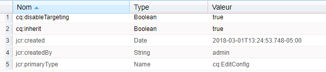

# Extension des fonctionnalités de processus{#extending-workflow-functionality}

Cette rubrique explique comment créer des composants d’étape personnalisée pour des processus et interagir avec eux par programmation.

La création d’une étape personnalisée de processus implique les tâches suivantes :

* Développer le composant de l’étape de processus.
* Mettre en œuvre la fonctionnalité de l’étape sous forme de service OSGi ou de script ECMA.

Vous pouvez également [interagir avec vos processus à partir de vos programmes et scripts](/help/sites-developing/workflows-program-interaction.md).

## Composants d’étape de processus - Notions de base {#workflow-step-components-the-basics}

Un composant d’étape de processus définit l’apparence et le comportement de l’étape lors de la création de modèles de processus :

* Catégorie et nom de l’étape dans le sidekick de processus.
* Aspect de l’étape dans des modèles de processus.
* Boîte de dialogue de modification servant à configurer les propriétés du composant.
* Service ou le script exécuté à l’exécution.

Comme avec [tous les composants](/help/sites-developing/components.md), les composants de l’étape de processus héritent du composant indiqué pour la propriété `sling:resourceSuperType`. Le diagramme suivant présente la hiérarchie des nœuds `cq:component` qui constituent la base de tous les composants des étapes de processus. Le diagramme comprend également les composants **Étape du processus**, **Étape du participant** et **Étape du participant dynamique**, car il s’agit des points de départ les plus courants (et de base) pour le développement de composants d’étape personnalisés.


>[!CAUTION]
>
>Vous ne devez ***rien*** modifier dans le chemin `/libs`.
>
>En effet, le contenu de `/libs` est remplacé dès que vous mettez à niveau votre instance (et risque de l’être si vous appliquez un correctif ou un Feature Pack).
>
>La méthode recommandée pour la configuration et d’autres modifications est la suivante :
>
>1. Recréer l’élément requis (c.-à-d. tel qu’il existe dans `/libs` sous `/apps`
>2. Apportez les modifications désirées dans `/apps`


Le composant `/libs/cq/workflow/components/model/step` est l&#39;ancêtre commun le plus proche de l&#39;**étape du processus**, de l&#39;**étape du participant** et de l&#39;**étape du participant dynamique**, qui tous héritent des éléments suivants :

* `step.jsp`

   Le script `step.jsp` effectue le rendu du titre du composant step lorsqu&#39;il est ajouté à un modèle.

   

* [cq:dialog](/help/sites-developing/developing-components.md#creating-and-configuring-a-dialog)

   Une boîte de dialogue avec les onglets suivants :

   * **Courant** : pour modifier le titre et la description.
   * **Avancé** : pour modifier les propriétés de notification par courrier électronique.

    

   >[!NOTE]
   >
   >Lorsque les onglets de la boîte de dialogue de modification d’un composant d’étape ne correspondent pas à cette apparence par défaut, le composant d’étape a défini des scripts, des propriétés de nœud ou des onglets de dialogue qui remplacent ces onglets hérités.

### Scripts ECMA  {#ecma-scripts}

Les objets suivants sont disponibles (selon le type d’étape) dans les scripts ECMA :

* [WorkItem](https://helpx.adobe.com/experience-manager/6-5/sites/developing/using/reference-materials/javadoc/com/day/cq/workflow/exec/WorkItem.html) workItem
* [WorkflowSession](https://helpx.adobe.com/experience-manager/6-5/sites/developing/using/reference-materials/javadoc/com/day/cq/workflow/WorkflowSession.html) workflowSession
* [WorkflowData](https://helpx.adobe.com/experience-manager/6-5/sites/developing/using/reference-materials/javadoc/com/day/cq/workflow/exec/WorkflowData.html) workflowData
* `args` : matrice contenant les arguments du processus.

* `sling` : pour accéder à d’autres services osgi.
* `jcrSession`

### MetaDataMaps {#metadatamaps}

Vous pouvez utiliser les métadonnées de processus pour conserver les informations requises pendant la durée de vie du processus. De manière générale, avec les étapes de processus, il faut conserver les données pour les utiliser ultérieurement dans le processus ou récupérer les données persistantes.

Il existe trois types d&#39;objets MetaDataMap : pour les objets `Workflow`, `WorkflowData` et `WorkItem`. Ils ont tous le même objectif : stocker les métadonnées.

Un objet WorkItem possède son propre objet MetaDataMap qui peut être utilisé uniquement pendant l’exécution de cet élément de travail (par exemple, l’étape).

Les métadonnées `Workflow` et `WorkflowData` sont partagées sur l’ensemble du flux de travail. Pour ces cas, il est recommandé d’utiliser uniquement l’objet MetaDataMap `WorkflowData`.

## Création de composants d’étape de processus personnalisée {#creating-custom-workflow-step-components}

Les composants d’étape de processus se [créent comme tout autre composant](/help/sites-developing/components.md).

Pour hériter de l’un des composants de l’étape de base (existante), ajoutez la propriété suivante au nœud `cq:Component` :

* Nom : `sling:resourceSuperType`
* Type : `String`
* Valeur : l’un des chemins suivants qui se résout en un composant de base :

   * `cq/workflow/components/model/process`
   * `cq/workflow/components/model/participant`
   * `cq/workflow/components/model/dynamic_participant`

### Spécification du titre et de la description par défaut pour les instances d’étape {#specifying-the-default-title-and-description-for-step-instances}

Utilisez la procédure suivante pour spécifier les valeurs par défaut des champs **Titre** et **Description** dans l’onglet **Courant**.

>[!NOTE]
>
>Les valeurs de champ apparaissent sur l’instance d’étape lorsque les deux conditions suivantes sont remplies :
>
>* La boîte de dialogue de modification de l’étape stocke le titre et la description dans les emplacements suivants : >
>* `./jcr:title`
>* `./jcr:description` emplacements

>
>  
Cette exigence est satisfaite lorsque la boîte de dialogue de modification utilise l&#39;onglet Commun mis en oeuvre par le composant `/libs/cq/flow/components/step/step`.
>
>* Le composant step ou un ancêtre du composant ne remplace pas le script `step.jsp` mis en oeuvre par le composant `/libs/cq/flow/components/step/step`.


1. Sous le noeud `cq:Component`, ajoutez le noeud suivant :

   * Nom : `cq:editConfig`
   * Type : `cq:EditConfig`

   >[!NOTE]
   >
   >Pour plus d’informations sur le noeud cq:editConfig, voir [Configuration du comportement de modification d’un composant](/help/sites-developing/developing-components.md#configuring-the-edit-behavior).

1. Sous le noeud `cq:EditConfig`, ajoutez le noeud suivant :

   * Nom : `cq:formParameters`
   * Type : `nt:unstructured`

1. Ajoutez les propriétés `String` des noms suivants au noeud `cq:formParameters` :

   * `jcr:title` : la valeur remplit le champ **Titre** de l’onglet **Courant**.
   * `jcr:description` : la valeur remplit le champ **Description** de l’onglet **Courant**.

### Enregistrement des valeurs de propriété dans les métadonnées de processus {#saving-property-values-in-workflow-metadata}

>[!NOTE]
>
>Voir [Persistance et accès aux données](#persisting-and-accessing-data). En particulier, pour plus d’informations sur l’accès à la valeur de la propriété lors de l’exécution, reportez-vous à la section [Accès aux valeurs des propriétés de boîte de dialogue au moment de l’exécution](#accessing-dialog-property-values-at-runtime).

La propriété name des éléments `cq:Widget` spécifie le nœud JCR qui stocke la valeur du widget. Lorsque des widgets de la boîte de dialogue des composants de l’étape du processus stockent des valeurs sous le noeud `./metaData`, la valeur est ajoutée au flux de travail `MetaDataMap`.

Par exemple, un champ de texte dans une boîte de dialogue est un nœud `cq:Widget` qui possède les propriétés suivantes :

| Nom | Type | Valeur |
|---|---|---|
| `xtype` | `String` | `textarea` |
| `name` | `String` | `./metaData/subject` |
| `fieldLabel` | `String` | `Email Subject` |

La valeur spécifiée dans ce champ de texte est ajoutée à l&#39;objet ` [MetaDataMap](#metadatamaps)` de l&#39;instance de flux de travail et est associée à la clé `subject`.

>[!NOTE]
>
>Lorsque la clé est `PROCESS_ARGS`, la valeur est immédiatement disponible dans les implémentations de script ECMA via la variable `args`. Dans ce cas, la valeur de la propriété name est `./metaData/PROCESS_ARGS.`

### Remplacement de la mise en œuvre de l’étape {#overriding-the-step-implementation}

Chaque composant d’étape de base permet aux développeurs de modèles de processus de configurer les fonctionnalités clés suivantes au moment de la conception :

* Étape du processus : service ou script ECMA à exécuter au moment de l’exécution.
* Participant : ID de l’utilisateur auquel est affecté l’élément de travail généré.
* Étape choix dynamique de participant : script de service ou ECMA qui sélectionne l’ID de l’utilisateur auquel est affecté l’élément de travail.

Pour utiliser le composant dans un scénario de processus spécifique, configurez la fonctionnalité clé au moment de la conception et empêchez les développeurs de modèles de la modifier.

1. Sous le nœud cq:component, ajoutez le nœud suivant :

   * Nom : `cq:editConfig`
   * Type : `cq:EditConfig`

   Pour plus d’informations sur le nœud cq:editConfig, voir [Configuration du comportement de modification d’un composant](/help/sites-developing/developing-components.md#configuring-the-edit-behavior).

1. Sous le nœud cq:EditConfig, ajoutez le nœud suivant :

   * Nom : `cq:formParameters`
   * Type : `nt:unstructured`

1. Ajoutez une propriété `String` au noeud `cq:formParameters`. Le supertype de composant détermine le nom de la propriété :

   * Étape du processus: `PROCESS`
   * Étape du participant: `PARTICIPANT`
   * Étape choix dynamique de participant: `DYNAMIC_PARTICIPANT`

1. Définissez la valeur de la propriété :

   * `PROCESS` : chemin d’accès au script ECMA ou au PID du service qui implémente le comportement de l’étape.
   * `PARTICIPANT` : ID de l’utilisateur à qui l’élément de travail a été affecté.
   * `DYNAMIC_PARTICIPANT`: Chemin d’accès au script ECMA ou au PID du service qui sélectionne l’utilisateur pour affecter la tâche.

1. Pour empêcher les développeurs de modèles de modifier vos valeurs de propriété, remplacez la boîte de dialogue du supertype de composant.

### Ajout de formulaires et de boîtes de dialogue aux étapes du participant {#adding-forms-and-dialogs-to-participant-steps}

Personnalisez le composant d&#39;étape du participant afin de fournir les fonctionnalités qui se trouvent dans les composants [Form Participant Step](/help/sites-developing/workflows-step-ref.md#form-participant-step) et [Dialog Participant Step](/help/sites-developing/workflows-step-ref.md#dialog-participant-step) :

* Présenter un formulaire à l’utilisateur lorsqu’il ouvre l’élément de travail généré.
* Présenter une boîte de dialogue personnalisée à l’utilisateur lorsqu’il effectue l’élément de travail généré.

Exécutez la procédure suivante sur votre nouveau composant (voir [Création de composants d&#39;étape de flux de travail personnalisés](#creating-custom-workflow-step-components)) :

1. Sous le noeud `cq:Component`, ajoutez le noeud suivant :

   * Nom : `cq:editConfig`
   * Type : `cq:EditConfig`

   Pour plus d’informations sur le noeud cq:editConfig, voir [Configuration du comportement de modification d’un composant](/help/sites-developing/components-basics.md#edit-behavior).

1. Sous le nœud cq:EditConfig, ajoutez le nœud suivant :

   * Nom : `cq:formParameters`
   * Type : `nt:unstructured`

1. Pour présenter un formulaire lorsque l’utilisateur ouvre l’élément de travail, ajoutez la propriété suivante au nœud `cq:formParameters` :

   * Nom : `FORM_PATH`
   * Type : `String`
   * Valeur : chemin d’accès qui résout le formulaire

1. Pour présenter une boîte de dialogue personnalisée lorsque l’utilisateur effectue l’élément de travail, ajoutez la propriété suivante au nœud `cq:formParameters`

   * Nom : `DIALOG_PATH`
   * Type : `String`
   * Valeur : chemin d’accès qui résout la boîte de dialogue

### Configuration du comportement à l’exécution de l’étape de processus  {#configuring-the-workflow-step-runtime-behavior}

Sous le noeud `cq:Component`, ajoutez un noeud `cq:EditConfig`. Ci-dessous, qui ajoutent un noeud `nt:unstructured` (doit être nommé `cq:formParameters`) et à ce noeud, ajoutez les propriétés suivantes :

* Nom : `PROCESS_AUTO_ADVANCE`

   * Type : `Boolean`
   * Valeur:

      * lorsqu&#39;il est défini sur `true`, le processus exécute cette étape et continue. Par défaut, il est également recommandé.
      * si sa valeur est `false`, le processus s’exécute et s’arrête. Ceci nécessite une manipulation supplémentaire, donc la valeur `true` est recommandée

* Nom : `DO_NOTIFY`

   * Type : `Boolean`
   * Valeur : indique si les notifications par e-mail doivent être envoyées pour les étapes de participation de l’utilisateur (et suppose que le serveur de messagerie est correctement configuré)

## Persistance et accès aux données  {#persisting-and-accessing-data}

### Données persistantes pour les étapes de processus suivantes {#persisting-data-for-subsequent-workflow-steps}

Vous pouvez utiliser les métadonnées de processus pour conserver les informations requises pendant la durée de vie du processus et entre les étapes. De manière générale, avec les étapes de processus, il faut rendre les données persistantes pour les utiliser ultérieurement ou récupérer les données persistantes à partir d’étapes précédentes.

Les métadonnées de processus sont stockées dans un objet [`MetaDataMap`](#metadatamaps). L’API Java fournit la méthode [`Workflow.getWorkflowData`](https://helpx.adobe.com/experience-manager/6-5/sites/developing/using/reference-materials/javadoc/com/adobe/granite/workflow/exec/Workflow.html) pour renvoyer un objet [`WorkflowData`](https://helpx.adobe.com/experience-manager/6-5/sites/developing/using/reference-materials/javadoc/com/adobe/granite/workflow/exec/WorkflowData.html) qui fournit l’objet `MetaDataMap` approprié. Cet objet `WorkflowData` `MetaDataMap` est disponible pour le service OSGi ou le script ECMA d&#39;un composant step.

#### Java {#java}

La méthode execute de l’implémentation `WorkflowProcess` est transmise à l’objet `WorkItem`. Utilisez cet objet afin d’obtenir l’objet `WorkflowData` pour l’instance de processus active. L’exemple suivant ajoute un élément à l’objet processus `MetaDataMap`, puis enregistre chaque élément. L’élément (&quot;mykey&quot;, &quot;My Step Value&quot;) est disponible pour les étapes suivantes du processus.

```java
public void execute(WorkItem item, WorkflowSession session, MetaDataMap args) throws WorkflowException {

    MetaDataMap wfd = item.getWorkflow().getWorkflowData().getMetaDataMap();

    wfd.put("mykey", "My Step Value");

    Set<String> keyset = wfd.keySet();
    Iterator<String> i = keyset.iterator();
    while (i.hasNext()){
     Object key = i.next();
     log.info("The workflow medata includes key {} and value {}",key.toString(),wfd.get(key).toString());
    }
}
```

#### Script ECMA  {#ecma-script}

La variable `graniteWorkItem` est la représentation de script ECMA de l’objet Java `WorkItem` actif. Par conséquent, vous pouvez utiliser la variable `graniteWorkItem` pour obtenir les métadonnées de processus. Le script ECMA suivant peut être utilisé pour implémenter un composant **Étape du processus** afin d’ajouter un élément à l’objet de processus `MetaDataMap`, puis consigner chaque élément. Ces éléments sont ensuite disponibles pour les étapes suivantes du processus.

>[!NOTE]
>
>La variable `metaData` immédiatement disponible pour le script de l’étape est la métadonnée de l’étape. Les métadonnées d’étape sont différentes des métadonnées de processus.

```
var currentDateInMillis = new Date().getTime();

graniteWorkItem.getWorkflowData().getMetaDataMap().put("hardcodedKey","theKey");

graniteWorkItem.getWorkflowData().getMetaDataMap().put("currentDateInMillisKey",currentDateInMillis);

var iterator = graniteWorkItem.getWorkflowData().getMetaDataMap().keySet().iterator();
while (iterator.hasNext()){
    var key = iterator.next();
    log.info("Workflow metadata key, value = " + key.toString() + ", " + graniteWorkItem.getWorkflowData().getMetaDataMap().get(key));
}
```

### Accès aux valeurs de propriété de boîte de dialogue au moment de l’exécution  {#accessing-dialog-property-values-at-runtime}

L’objet `MetaDataMap` des instances de processus est utile pour stocker et récupérer des données tout au long de la durée de vie du processus. Dans le cas d’implémentations de composants d’étape de processus, l’objet `MetaDataMap` est particulièrement utile pour récupérer les valeurs de propriété de composant au moment de l’exécution.

>[!NOTE]
>
>Pour plus d’informations sur la configuration de la boîte de dialogue de composant dans le but de stocker les propriétés en tant que métadonnées de processus, voir [Enregistrement des valeurs de propriété dans les métadonnées de processus](#saving-property-values-in-workflow-metadata).

Le processus `MetaDataMap` est disponible pour les implémentations de processus de script Java et ECMA :

* Dans les implémentations Java de l&#39;interface WorkflowProcess, le paramètre `args` est l&#39;objet `MetaDataMap` du flux de travaux.

* Dans les implémentations de script ECMA, la valeur est disponible à l’aide des variables `args` et `metadata`.

### Exemple : récupération des arguments du composant de l’étape de processus {#example-retrieving-the-arguments-of-the-process-step-component}

La boîte de dialogue de modification du composant **Étape du processus** inclut la propriété **Arguments.** La valeur de la propriété **Arguments** est stockée dans les métadonnées du flux de travail et associée à la clé `PROCESS_ARGS`.

Dans le diagramme suivant, la valeur de la propriété **Arguments** est `argument1, argument2` :


#### Java {#java-1}

Le code Java suivant est la méthode `execute` pour une implémentation `WorkflowProcess`. La méthode consigne la valeur dans `args` `MetaDataMap` associée à la clé `PROCESS_ARGS`.

```java
public void execute(WorkItem item, WorkflowSession session, MetaDataMap args) throws WorkflowException {
     if (args.containsKey("PROCESS_ARGS")){
      log.info("workflow metadata for key PROCESS_ARGS and value {}",args.get("PROCESS_ARGS","string").toString());
     }
    }
```

Lorsqu’une étape de processus qui utilise cette implémentation Java s’exécute, le journal contient l’entrée suivante :

```xml
16.02.2018 12:07:39.566 *INFO* [JobHandler: /var/workflow/instances/server0/2018-02-16/model_855140139900189:/content/we-retail/de] com.adobe.example.workflow.impl.process.LogArguments workflow metadata for key PROCESS_ARGS and value argument1, argument2
```

#### Script ECMA  {#ecma-script-1}

Le script ECMA suivant est utilisé comme processus pour **Étape du processus**. Il consigne le nombre d’arguments et les valeurs des arguments :

```
var iterator = graniteWorkItem.getWorkflowData().getMetaDataMap().keySet().iterator();
while (iterator.hasNext()){
    var key = iterator.next();
    log.info("Workflow metadata key, value = " + key.toString() + ", " + graniteWorkItem.getWorkflowData().getMetaDataMap().get(key));
}
log.info("hardcodedKey "+ graniteWorkItem.getWorkflowData().getMetaDataMap().get("hardcodedKey"));
log.info("currentDateInMillisKey "+ graniteWorkItem.getWorkflowData().getMetaDataMap().get("currentDateInMillisKey"));
```

>[!NOTE]
>
>Cette section explique comment utiliser les arguments pour les étapes de processus. L’information s’applique également aux programmes de sélection des participants.

>[!NOTE]
>Pour un autre exemple de stockage des propriétés de composant dans les métadonnées de processus, voir Exemple : Créer une étape de processus de logger. Cet exemple comporte un journal qui associe la valeur des métadonnées à une clé autre que PROCESS_ARGS.

### Scripts et arguments de processus {#scripts-and-process-arguments}

Dans un script pour un composant **Étape du processus**, les arguments sont disponibles via l’objet `args`.

Lors de la création d’un composant d’étape personnalisé, l’objet `metaData` est disponible dans un script. Cet objet est limité à un seul argument de chaîne.

## Développement d’implémentations d’étapes de processus {#developing-process-step-implementations}

Lorsque les étapes de processus sont lancées au cours du traitement d’un processus, les étapes envoient une requête à un service OSGi ou exécutent un script ECMA. Développez le service ou le script ECMA qui effectue les actions requises par votre processus.

>[!NOTE]
>
>Pour plus d’informations sur l’association de votre composant Étape du processus avec le service ou le script, reportez-vous à [Étape du processus](/help/sites-developing/workflows-step-ref.md#process-step) ou [Remplacement de la mise en œuvre de l’étape](#overriding-the-step-implementation).

### Implémentation d’une étape de processus avec une classe Java  {#implementing-a-process-step-with-a-java-class}

Pour définir une étape de processus en tant que composant de service OSGI (bundle Java) :

1. Créez le bundle et déployez-le dans le conteneur OSGI. Reportez-vous à la documentation sur la création d’un lot avec [CRXDE Lite](/help/sites-developing/developing-with-crxde-lite.md) ou [Eclipse](/help/sites-developing/howto-projects-eclipse.md).

   >[!NOTE]
   >
   >Le composant OSGI doit implémenter l&#39;interface `WorkflowProcess` avec sa méthode `execute()`. Voir l’exemple de code ci-dessous.

   >[!NOTE]
   >
   >Le nom du package doit être ajouté à la section `<*Private-Package*>` de la configuration `maven-bundle-plugin`.

1. Ajoutez la propriété SCR `process.label` et définissez la valeur selon vos besoins. Il s’agira du nom de l’étape du processus répertoriée comme lors de l’utilisation du composant générique **Étape du processus**. Voir l’exemple ci-dessous.
1. Dans l’éditeur **Modèles**, ajoutez l’étape du processus au processus à l’aide du composant générique **Étape du processus**.
1. Dans la boîte de dialogue de modification (de l&#39;**Étape du processus**), accédez à l&#39;onglet **Processus** et sélectionnez votre implémentation de processus.
1. Si vous utilisez des arguments dans votre code, définissez **Traiter les arguments**. Par exemple : false.
1. Enregistrez les modifications, à la fois pour l’étape et le modèle de processus (angle supérieur gauche de l’éditeur de modèle).

Les méthodes java, respectivement les classes implémentant la méthode Java exécutable, sont enregistrées en tant que services OSGI, ce qui vous permet d’ajouter des méthodes à tout moment pendant l’exécution.

Le composant OSGI suivant ajoute la propriété `approved` au nœud de contenu de page lorsque la charge est une page :

```java
package com.adobe.example.workflow.impl.process;

import com.adobe.granite.workflow.WorkflowException;
import com.adobe.granite.workflow.WorkflowSession;
import com.adobe.granite.workflow.exec.WorkItem;
import com.adobe.granite.workflow.exec.WorkflowData;
import com.adobe.granite.workflow.exec.WorkflowProcess;
import com.adobe.granite.workflow.metadata.MetaDataMap;

import org.apache.felix.scr.annotations.Component;
import org.apache.felix.scr.annotations.Property;
import org.apache.felix.scr.annotations.Service;

import org.osgi.framework.Constants;

import javax.jcr.Node;
import javax.jcr.RepositoryException;
import javax.jcr.Session;

/**
 * Sample workflow process that sets an <code>approve</code> property to the payload based on the process argument value.
 */
@Component
@Service
public class MyProcess implements WorkflowProcess {

 @Property(value = "An example workflow process implementation.")
 static final String DESCRIPTION = Constants.SERVICE_DESCRIPTION;
 @Property(value = "Adobe")
 static final String VENDOR = Constants.SERVICE_VENDOR;
 @Property(value = "My Sample Workflow Process")
 static final String LABEL="process.label";

 private static final String TYPE_JCR_PATH = "JCR_PATH";

 public void execute(WorkItem item, WorkflowSession session, MetaDataMap args) throws WorkflowException {
  WorkflowData workflowData = item.getWorkflowData();
  if (workflowData.getPayloadType().equals(TYPE_JCR_PATH)) {
   String path = workflowData.getPayload().toString() + "/jcr:content";
   try {
    Session jcrSession = session.adaptTo(Session.class);
    Node node = (Node) jcrSession.getItem(path);
    if (node != null) {
     node.setProperty("approved", readArgument(args));
     jcrSession.save();
    }
   } catch (RepositoryException e) {
    throw new WorkflowException(e.getMessage(), e);
   }
  }
 }

 private boolean readArgument(MetaDataMap args) {
  String argument = args.get("PROCESS_ARGS", "false");
  return argument.equalsIgnoreCase("true");
 }
}
```

>[!NOTE]
>
>Si le processus échoue trois fois de suite, un élément est placé dans la boîte de réception de l’administrateur de processus.

### Utilisation d’ECMAScript  {#using-ecmascript}

Les scripts ECMA permettent aux développeurs de scripts d’implémenter des étapes de processus. Les scripts sont situés dans le référentiel JCR et exécutés à partir de cet endroit.

Le tableau suivant répertorie les variables qui sont immédiatement disponibles pour traiter les scripts, en fournissant l’accès aux objets de l’API Java de processus.

| Classe Java | Nom de la variable de script | Description |
|---|---|---|
| `com.adobe.granite.workflow.exec.WorkItem` | `graniteWorkItem` | Instance de l’étape en cours. |
| `com.adobe.granite.workflow.WorkflowSession` | `graniteWorkflowSession` | Session de flux de travail de l’instance d’étape actuelle. |
| `String[]` (contient les arguments de processus) | `args` | Arguments de l’étape. |
| `com.adobe.granite.workflow.metadata.MetaDataMap` | `metaData` | Métadonnées de l’instance d’étape actuelle. |
| `org.apache.sling.scripting.core.impl.InternalScriptHelper` | `sling` | Permet d’accéder à l’environnement d’exécution Sling. |

L’exemple de script suivant montre comment accéder au nœud JCR qui représente la charge utile du processus. La variable `graniteWorkflowSession` est adaptée à une variable de session JCR, utilisée pour obtenir le nœud à partir du chemin d’accès de la charge utile.

```
var workflowData = graniteWorkItem.getWorkflowData();
if (workflowData.getPayloadType() == "JCR_PATH") {
    var path = workflowData.getPayload().toString();
    var jcrsession = graniteWorkflowSession.adaptTo(Packages.javax.jcr.Session);
    var node = jcrsession.getNode(path);
    if (node.hasProperty("approved")){
     node.setProperty("approved", args[0] == "true" ? true : false);
     node.save();
 }
}
```

Le script suivant vérifie si la charge utile est un fichier image ( `.png`), crée une image en noir et blanc et l’enregistre en tant que noeud frère.

```
var workflowData = graniteWorkItem.getWorkflowData();
if (workflowData.getPayloadType() == "JCR_PATH") {
    var path = workflowData.getPayload().toString();
    var jcrsession = graniteWorkflowSession.adaptTo(Packages.javax.jcr.Session);
    var node = jcrsession.getRootNode().getNode(path.substring(1));
     if (node.isNodeType("nt:file") && node.getProperty("jcr:content/jcr:mimeType").getString().indexOf("image/") == 0) {
        var is = node.getProperty("jcr:content/jcr:data").getStream();
        var layer = new Packages.com.day.image.Layer(is);
        layer.grayscale();
                var parent = node.getParent();
                var gn = parent.addNode("grey" + node.getName(), "nt:file");
        var content = gn.addNode("jcr:content", "nt:resource");
                content.setProperty("jcr:mimeType","image/png");
                var cal = Packages.java.util.Calendar.getInstance();
                content.setProperty("jcr:lastModified",cal);
                var f = Packages.java.io.File.createTempFile("test",".png");
        var tout = new Packages.java.io.FileOutputStream(f);
        layer.write("image/png", 1.0, tout);
        var fis = new Packages.java.io.FileInputStream(f);
                content.setProperty("jcr:data", fis);
                parent.save();
        tout.close();
        fis.close();
        is.close();
        f.deleteOnExit();
    }
}
```

Pour utiliser le script :

1. Créez le script (par exemple avec un CRXDE Lite) et enregistrez-le dans le référentiel ci-dessous `/apps/myapp/workflow/scripts`
1. Pour spécifier un titre qui identifie le script dans la boîte de dialogue de modification **Étape du processus**, ajoutez les propriétés suivantes au nœud `jcr:content` de votre script :

   | Nom | Type | Valeur |
   |---|---|---|
   | `jcr:mixinTypes` | `Name[]` | `mix:title` |
   | `jcr:title` | `String` | Nom à afficher dans la boîte de dialogue de modification. |

1. Modifiez l’instance **Étape du processus** et spécifiez le script à utiliser.

## Développement de programmes de sélection de participants  {#developing-participant-choosers}

Vous pouvez développer des programmes de sélection de participant pour les composants **Étape choix dynamique de participant**.

Lorsqu&#39;un composant **Étape du participant dynamique** est démarré au cours d&#39;un processus, l&#39;étape doit déterminer le participant auquel la tâche générée peut être affectée. Pour ce faire, l’étape :

* envoie une requête à un service OSGi
* exécute un script ECMA pour sélectionner le participant

Vous pouvez développer un service ou un script ECMA qui sélectionne le participant en fonction des exigences de votre processus.

>[!NOTE]
>
>Pour plus d’informations sur l’association de votre composant **Étape choix dynamique de participant** au service ou au script, voir [Étape choix dynamique de participant](/help/sites-developing/workflows-step-ref.md#dynamic-participant-step) ou [Remplacement de la mise en œuvre de l’étape](#persisting-and-accessing-data).

### Développement d’un programme de sélection de participants à l’aide d’une classe Java  {#developing-a-participant-chooser-using-a-java-class}

Pour définir une étape de participant en tant que composant de service OSGI (classe Java) :

1. Le composant OSGI doit implémenter l&#39;interface `ParticipantStepChooser` avec sa méthode `getParticipant()`. Voir l’exemple de code ci-dessous.

   Créez le bundle et déployez-le dans le conteneur OSGI.

1. Ajoutez la propriété SCR `chooser.label` et définissez la valeur comme requis. Il s&#39;agira du nom de la liste de votre participant choisi, à l&#39;aide du composant **Étape du participant dynamique**. Voir l’exemple :

   ```java
   package com.adobe.example.workflow.impl.process;
   
   import com.adobe.granite.workflow.WorkflowException;
   import com.adobe.granite.workflow.WorkflowSession;
   import com.adobe.granite.workflow.exec.ParticipantStepChooser;
   import com.adobe.granite.workflow.exec.WorkItem;
   import com.adobe.granite.workflow.exec.WorkflowData;
   import com.adobe.granite.workflow.metadata.MetaDataMap;
   
   import org.apache.felix.scr.annotations.Component;
   import org.apache.felix.scr.annotations.Property;
   import org.apache.felix.scr.annotations.Service;
   
   import org.osgi.framework.Constants;
   
   /**
    * Sample dynamic participant step that determines the participant based on a path given as argument.
    */
   @Component
   @Service
   
   public class MyDynamicParticipant implements ParticipantStepChooser {
   
    @Property(value = "An example implementation of a dynamic participant chooser.")
    static final String DESCRIPTION = Constants.SERVICE_DESCRIPTION;
       @Property(value = "Adobe")
       static final String VENDOR = Constants.SERVICE_VENDOR;
       @Property(value = "Dynamic Participant Chooser Process")
       static final String LABEL=ParticipantStepChooser.SERVICE_PROPERTY_LABEL;
   
       private static final String TYPE_JCR_PATH = "JCR_PATH";
   
       public String getParticipant(WorkItem workItem, WorkflowSession workflowSession, MetaDataMap args) throws WorkflowException {
           WorkflowData workflowData = workItem.getWorkflowData();
           if (workflowData.getPayloadType().equals(TYPE_JCR_PATH)) {
               String path = workflowData.getPayload().toString();
               String pathFromArgument = args.get("PROCESS_ARGS", String.class);
               if (pathFromArgument != null && path.startsWith(pathFromArgument)) {
                   return "admin";
               }
           }
           return "administrators";
       }
   }
   ```

1. Dans l’éditeur **Modèles**, ajoutez l’étape participant dynamique au processus à l’aide du composant générique **Étape du participant dynamique**.
1. Dans la boîte de dialogue Modifier, sélectionnez l&#39;onglet **Sélecteur de participant** et sélectionnez l&#39;implémentation de votre sélecteur.
1. Si vous utilisez des arguments dans votre code, définissez **Traiter les arguments**. Pour cet exemple : `/content/we-retail/de`.
1. Enregistrez les modifications, à la fois pour l’étape et le modèle de processus.

### Développement d’un programme de sélection de participant à l’aide d’un script ECMA  {#developing-a-participant-chooser-using-an-ecma-script}

Vous pouvez créer un script ECMA qui sélectionne l’utilisateur auquel est affecté l’élément de travail généré par **Étape du participant**. Le script doit inclure une fonction nommée `getParticipant` qui ne requiert aucun argument et renvoie `String` qui contient l&#39;identifiant d&#39;un utilisateur ou d&#39;un groupe.

Les scripts sont situés dans le référentiel JCR et exécutés à partir de cet endroit.

Le tableau suivant répertorie les variables qui fournissent un accès immédiat aux objets Java de processus dans vos scripts.

| Classe Java | Nom de la variable de script |
|---|---|
| `com.adobe.granite.workflow.exec.WorkItem` | `graniteWorkItem` |
| `com.adobe.granite.workflow.WorkflowSession` | `graniteWorkflowSession` |
| `String[]` (contient les arguments de processus) | `args` |
| `com.adobe.granite.workflow.metadata.MetaDataMap` | `metaData` |
| `org.apache.sling.scripting.core.impl.InternalScriptHelper` | `sling` |

```
function getParticipant() {
    var workflowData = graniteWorkItem.getWorkflowData();
    if (workflowData.getPayloadType() == "JCR_PATH") {
        var path = workflowData.getPayload().toString();
        if (path.indexOf("/content/we-retail/de") == 0) {
            return "admin";
        } else {
            return "administrators";
        }
    }
}
```

1. Créez le script (par exemple avec un CRXDE Lite) et enregistrez-le dans le référentiel ci-dessous `/apps/myapp/workflow/scripts`
1. Pour spécifier un titre qui identifie le script dans la boîte de dialogue de modification **Étape du processus**, ajoutez les propriétés suivantes au nœud `jcr:content` de votre script :

   | Nom | Type | Valeur |
   |---|---|---|
   | `jcr:mixinTypes` | `Name[]` | `mix:title` |
   | `jcr:title` | `String` | Nom à afficher dans la boîte de dialogue de modification. |

1. Modifiez l&#39;instance [Dynamic Participant Step](/help/sites-developing/workflows-step-ref.md#dynamic-participant-step) et spécifiez le script à utiliser.

## Gestion des modules de processus {#handling-workflow-packages}

[Les modules de processus](/help/sites-authoring/workflows-applying.md#specifying-workflow-details-in-the-create-workflow-wizard) peuvent être transmis à un processus pour traitement. Les modules de processus contiennent des références à des ressources telles que des pages et des éléments.

>[!NOTE]
>
>Les étapes de traitement de processus suivantes acceptent les modules de processus pour l’activation de page en masse :
>
>* [`com.day.cq.wcm.workflow.process.ActivatePageProcess`](https://helpx.adobe.com/experience-manager/6-5/sites/developing/using/reference-materials/javadoc/com/day/cq/wcm/workflow/process/ActivatePageProcess.html)
>* [`com.day.cq.wcm.workflow.process.DeactivatePageProcess`](https://helpx.adobe.com/experience-manager/6-5/sites/developing/using/reference-materials/javadoc/com/day/cq/wcm/workflow/process/DeactivatePageProcess.html)

>


Vous pouvez développer des étapes de processus qui obtiennent les ressources de module et les traitent. Les membres suivants du module `com.day.cq.workflow.collection` donnent accès aux modules de processus :

* `ResourceCollection`: Classe de package de processus.
* `ResourceCollectionUtil` : permet de récupérer des objets ResourceCollection.
* `ResourceCollectionManager`: Crée et récupère des collections. Une implémentation est déployée en tant que service OSGi.

L’exemple de classe Java suivant montre comment obtenir des ressources de module :

```java
package com.adobe.example;

import java.util.ArrayList;
import java.util.List;

import com.day.cq.workflow.WorkflowException;
import com.day.cq.workflow.WorkflowSession;
import com.day.cq.workflow.collection.ResourceCollection;
import com.day.cq.workflow.collection.ResourceCollectionManager;
import com.day.cq.workflow.collection.ResourceCollectionUtil;
import com.day.cq.workflow.exec.WorkItem;
import com.day.cq.workflow.exec.WorkflowData;
import com.day.cq.workflow.exec.WorkflowProcess;
import com.day.cq.workflow.metadata.MetaDataMap;

import org.apache.felix.scr.annotations.Component;
import org.apache.felix.scr.annotations.Property;
import org.apache.felix.scr.annotations.Service;
import org.apache.felix.scr.annotations.Reference;
import org.osgi.framework.Constants;

import org.slf4j.Logger;
import org.slf4j.LoggerFactory;

import javax.jcr.Node;
import javax.jcr.PathNotFoundException;
import javax.jcr.RepositoryException;
import javax.jcr.Session;

@Component
@Service
public class LaunchBulkActivate implements WorkflowProcess {

 private static final Logger log = LoggerFactory.getLogger(LaunchBulkActivate.class);

 @Property(value="Bulk Activate for Launches")
  static final String PROCESS_NAME ="process.label";
 @Property(value="A sample workflow process step to support Launches bulk activation of pages")
 static final String SERVICE_DESCRIPTION = Constants.SERVICE_DESCRIPTION;

 @Reference
 private ResourceCollectionManager rcManager;
public void execute(WorkItem workItem, WorkflowSession workflowSession) throws Exception {
    Session session = workflowSession.getSession();
    WorkflowData data = workItem.getWorkflowData();
    String path = null;
    String type = data.getPayloadType();
    if (type.equals(TYPE_JCR_PATH) && data.getPayload() != null) {
        String payloadData = (String) data.getPayload();
        if (session.itemExists(payloadData)) {
            path = payloadData;
        }
    } else if (data.getPayload() != null && type.equals(TYPE_JCR_UUID)) {
        Node node = session.getNodeByUUID((String) data.getPayload());
        path = node.getPath();
    }

    // CUSTOMIZED CODE IF REQUIRED....

    if (path != null) {
        // check for resource collection
        ResourceCollection rcCollection = ResourceCollectionUtil.getResourceCollection((Node)session.getItem(path), rcManager);
        // get list of paths to replicate (no resource collection: size == 1
        // otherwise size >= 1
        List<String> paths = getPaths(path, rcCollection);
        for (String aPath: paths) {

            // CUSTOMIZED CODE....

        }
    } else {
        log.warn("Cannot process because path is null for this " + "workitem: " + workItem.toString());
    }
}

/**
 * helper
 */
private List<String> getPaths(String path, ResourceCollection rcCollection) {
    List<String> paths = new ArrayList<String>();
    if (rcCollection == null) {
        paths.add(path);
    } else {
        log.debug("ResourceCollection detected " + rcCollection.getPath());
        // this is a resource collection. the collection itself is not
        // replicated. only its members
        try {
            List<Node> members = rcCollection.list(new String[]{"cq:Page", "dam:Asset"});
            for (Node member: members) {
                String mPath = member.getPath();
                paths.add(mPath);
            }
        } catch(RepositoryException re) {
            log.error("Cannot build path list out of the resource collection " + rcCollection.getPath());
        }
    }
    return paths;
}
}
```

## Exemple : création d’une étape personnalisée  {#example-creating-a-custom-step}

Pour commencer facilement à créer votre propre étape personnalisée, copiez une étape existante à partir de :

`/libs/cq/workflow/components/model`

### Création de l’étape de base {#creating-the-basic-step}

1. Recréez le chemin sous /apps, par exemple :

   `/apps/cq/workflow/components/model`

   Les nouveaux dossiers sont de type `nt:folder` :

   ```xml
   - apps
     - cq
       - workflow (nt:folder)
         - components (nt:folder)
           - model (nt:folder)
   ```

   >[!NOTE]
   >
   >Cette étape ne s’applique pas à l’éditeur de modèle de l’IU classique.

1. Placez ensuite l’étape copiée dans votre dossier /apps, par exemple comme :

   `/apps/cq/workflow/components/model/myCustomStep`

   Voici le résultat de notre exemple d’étape personnalisée :

   

   >[!CAUTION]
   >
   >Puisque dans l’IU standard, seul le titre, et non les détails, est affiché sur la carte, `details.jsp` n’est pas nécessaire (comme c’était le cas avec l’éditeur de l’IU classique).

1. Appliquez les propriétés suivantes au nœud :

   `/apps/cq/workflow/components/model/myCustomStep`

   **Propriétés d’intérêt :**

   * `sling:resourceSuperType`

      Doit hériter d&#39;une étape existante.

      Dans cet exemple, nous héritons de l&#39;étape de base à `cq/workflow/components/model/step`, mais vous pouvez utiliser d&#39;autres super types tels que `participant`, `process`, etc.

   * `jcr:title`

      Le titre est-il affiché lorsque le composant est répertorié dans le navigateur d’étapes (panneau de gauche de l’éditeur de modèle de processus).

   * `cq:icon`

      Utilisé pour spécifier une icône [Coral](https://helpx.adobe.com/fr/experience-manager/6-5/sites/developing/using/reference-materials/coral-ui/coralui3/Coral.Icon.html) pour l’étape.

   * `componentGroup`

      Doit être l’un des éléments suivants :

      * Processus de collaboration
      * Gestion des actifs numériques du processus
      * Processus des formulaires
      * Projets
      * Processus de gestion de contenu web
      * Workflow

   

1. Vous pouvez désormais ouvrir un modèle de processus pour le modifier. Dans le navigateur d’étapes, vous pouvez filtrer pour voir **Mon étape personnalisée** :

   

   Si vous faites glisser **Mon étape personnalisée** sur le modèle, la carte s’affiche :

   

   Si la propriété `cq:icon` n’a pas été définie pour l’étape, une icône par défaut est rendue d’après les deux premières lettres du titre. Par exemple :

   

#### Définition de la boîte de dialogue Configuration de l’étape {#defining-the-step-configure-dialog}

Après avoir suivi la procédure [Création de l’étape de base](#creating-the-basic-step), définissez la boîte de dialogue **Configurer** comme suit :

1. Configurez les propriétés sur le noeud `cq:editConfig` comme suit :

   **Propriétés d’intérêt :**

   * `cq:inherit`

      Lorsqu&#39;il est défini sur `true`, le composant step hérite des propriétés de l&#39;étape que vous avez spécifiée dans `sling:resourceSuperType`.

   * `cq:disableTargeting`

      Définissez les paramètres requis.
   

1. Configurez les propriétés sur le noeud `cq:formsParameter` comme suit :

   **Propriétés d’intérêt :**

   * `jcr:title`

      Définit le titre par défaut sur la carte étape dans la carte modèle et dans le champ **Titre** de la boîte de dialogue de configuration **Mes propriétés d’étape personnalisées**.

   * Vous pouvez également définir vos propres propriétés personnalisées.

   

1. Configurez les propriétés sur le noeud `cq:listeners`.

   Le nœud `cq:listener` et ses propriétés vous permettent de définir des gestionnaires d’événements réagissant aux événements dans l’éditeur de modèles de l’IU tactile, le glisser d’une étape sur une page de modèle ou la modification des propriétés d’une étape.

   **Propriétés d’intérêt :**

   * `afterMove: REFRESH_PAGE`
   * `afterdelete: CQ.workflow.flow.Step.afterDelete`
   * `afteredit: CQ.workflow.flow.Step.afterEdit`
   * `afterinsert: CQ.workflow.flow.Step.afterInsert`

   Cette configuration est essentielle au bon fonctionnement de l’éditeur. Dans la plupart des cas, cette configuration ne doit pas être modifiée.

   Cependant, la définition de `cq:inherit` sur true (sur le noeud `cq:editConfig`, voir ci-dessus) vous permet d&#39;hériter de cette configuration, sans avoir à l&#39;inclure explicitement dans votre définition d&#39;étape. Si aucun héritage n’est en place, vous devez ajouter ce noeud avec les propriétés et valeurs suivantes.

   Dans cet exemple, l’héritage a été activé pour pouvoir supprimer le nœud `cq:listeners` et permettre à l’étape de fonctionner correctement.

   

1. Vous pouvez désormais ajouter une instance de votre étape à un modèle de processus. Lorsque vous **configurez** l’étape vous voyez s’afficher la boîte de dialogue :

    

#### Exemple de balisage utilisé dans ce cas de figure {#sample-markup-used-in-this-example}

Le balisage d’une étape personnalisée est représenté dans la balise `.content.xml` du noeud racine du composant. L&#39;exemple `.content.xml` utilisé pour cet exemple :

`/apps/cq/workflow/components/model/myCustomStep/.content.xml`

```xml
<?xml version="1.0" encoding="UTF-8"?>
<jcr:root xmlns:sling="https://sling.apache.org/jcr/sling/1.0" xmlns:cq="https://www.day.com/jcr/cq/1.0" xmlns:jcr="https://www.jcp.org/jcr/1.0"
    cq:icon="bell"
    jcr:primaryType="cq:Component"
    jcr:title="My Custom Step"
    sling:resourceSuperType="cq/workflow/components/model/process"
    allowedParents="[*/parsys]"
    componentGroup="Workflow"/>
```

L&#39;exemple `_cq_editConfig.xml` utilisé dans cet exemple :

```xml
<?xml version="1.0" encoding="UTF-8"?>
<jcr:root xmlns:cq="https://www.day.com/jcr/cq/1.0" xmlns:jcr="https://www.jcp.org/jcr/1.0" xmlns:nt="https://www.jcp.org/jcr/nt/1.0"
    cq:disableTargeting="{Boolean}true"
    cq:inherit="{Boolean}true"
    jcr:primaryType="cq:EditConfig">
    <cq:formParameters
        jcr:primaryType="nt:unstructured"
        jcr:title="My Custom Step Card"
        SAMPLE_PROPERY="sample value"/>
    <cq:listeners
        jcr:primaryType="cq:EditListenersConfig"
        afterdelete="CQ.workflow.flow.Step.afterDelete"
        afteredit="CQ.workflow.flow.Step.afterEdit"
        afterinsert="CQ.workflow.flow.Step.afterInsert"
        afterMove="REFRESH_PAGE"/>
</jcr:root>
```

L&#39;exemple `_cq_dialog/.content.xml` utilisé dans cet exemple :

```xml
<?xml version="1.0" encoding="UTF-8"?>
<jcr:root xmlns:sling="https://sling.apache.org/jcr/sling/1.0" xmlns:cq="https://www.day.com/jcr/cq/1.0" xmlns:jcr="https://www.jcp.org/jcr/1.0" xmlns:nt="https://www.jcp.org/jcr/nt/1.0"
    jcr:primaryType="nt:unstructured"
    jcr:title="My Custom - Step Properties"
    sling:resourceType="cq/gui/components/authoring/dialog">
    <content
        jcr:primaryType="nt:unstructured"
        sling:resourceType="granite/ui/components/coral/foundation/tabs">
        <items jcr:primaryType="nt:unstructured">
            <common
                cq:hideOnEdit="true"
                jcr:primaryType="nt:unstructured"
                jcr:title="Common"
                sling:resourceType="granite/ui/components/coral/foundation/fixedcolumns"/>
            <process
                cq:hideOnEdit="true"
                jcr:primaryType="nt:unstructured"
                jcr:title="Process"
                sling:resourceType="granite/ui/components/coral/foundation/fixedcolumns"/>
            <mycommon
                jcr:primaryType="nt:unstructured"
                jcr:title="Common"
                sling:resourceType="granite/ui/components/coral/foundation/fixedcolumns">
                <items jcr:primaryType="nt:unstructured">
                    <columns
                        jcr:primaryType="nt:unstructured"
                        sling:resourceType="granite/ui/components/coral/foundation/container">
                        <items jcr:primaryType="nt:unstructured">
                            <title
                                jcr:primaryType="nt:unstructured"
                                sling:resourceType="granite/ui/components/coral/foundation/form/textfield"
                                fieldLabel="Title"
                                name="./jcr:title"/>
                            <description
                                jcr:primaryType="nt:unstructured"
                                sling:resourceType="granite/ui/components/coral/foundation/form/textarea"
                                fieldLabel="Description"
                                name="./jcr:description"/>
                        </items>
                    </columns>
                </items>
            </mycommon>
            <advanced
                jcr:primaryType="nt:unstructured"
                jcr:title="Advanced"
                sling:resourceType="granite/ui/components/coral/foundation/fixedcolumns">
                <items jcr:primaryType="nt:unstructured">
                    <columns
                        jcr:primaryType="nt:unstructured"
                        sling:resourceType="granite/ui/components/coral/foundation/container">
                        <items jcr:primaryType="nt:unstructured">
                            <email
                                jcr:primaryType="nt:unstructured"
                                sling:resourceType="granite/ui/components/coral/foundation/form/checkbox"
                                fieldDescription="Notify user via email."
                                fieldLabel="Email"
                                name="./metaData/PROCESS_AUTO_ADVANCE"
                                text="Notify user via email."
                                value="true"/>
                        </items>
                    </columns>
                </items>
            </advanced>
        </items>
    </content>
</jcr:root>
```

>[!NOTE]
>
>Notez les nœuds communs et de processus dans la définition de la boîte de dialogue. Ils sont hérités de l’étape de processus que nous avons utilisée comme supertype pour notre étape personnalisée :
>
>`sling:resourceSuperType : cq/workflow/components/model/process`

>[!NOTE]
>
>Les boîtes de dialogue classiques de l’éditeur de modèle de l’IU classique continuent de fonctionner avec celui de l’IU standard tactile.
>
>Bien que AEM dispose d&#39;[outils de modernisation](/help/sites-developing/modernization-tools.md) si vous souhaitez mettre à niveau vos boîtes de dialogue d&#39;étape classiques de l&#39;interface utilisateur vers des boîtes de dialogue standard. Une fois la conversion terminée, vous devez apporter quelques améliorations manuelles à la boîte de dialogue pour certains cas.
>
>* Dans les cas où une boîte de dialogue mise à niveau est vide, vous pouvez consulter les boîtes de dialogue de `/libs` qui offrent des fonctionnalités similaires à des exemples de comment fournir une solution. Par exemple :
   >
   >
* `/libs/cq/workflow/components/model`
>* `/libs/cq/workflow/components/workflow`
>* `/libs/dam/components`
>* `/libs/wcm/workflow/components/autoassign`
>* `/libs/cq/projects`

>
>  
Vous ne devez rien modifier dans `/libs`, utilisez-les simplement comme exemples. Si vous souhaitez tirer parti de l&#39;une des étapes existantes, copiez-les dans `/apps` et modifiez-les là.
