# Création de modèles de workflow{#creating-workflow-models}

>[!CAUTION]
>
>Pour utiliser l’interface utilisateur classique, consultez la [documentation AEM 6.3](https://helpx.adobe.com/experience-manager/6-3/help/sites-developing/workflows-models.html).

Vous créez un [modèle de workflow](/help/sites-developing/workflows.md#model) pour définir les étapes exécutées lorsqu’un utilisateur lance le workflow. Vous pouvez également définir des propriétés de modèle pour déterminer, par exemple, si le workflow est transitoire ou s’il utilise plusieurs ressources.

Lorsqu’un utilisateur lance un workflow, une instance est démarrée ; il s’agit du modèle d’exécution correspondant, créé lorsque vous [synchronisez](#sync-your-workflow-generate-a-runtime-model) vos modifications.

## Création d’un workflow {#creating-a-new-workflow}

La première fois que vous créez un modèle de workflow, il se compose des éléments suivants :

* The steps, **Flow Start** and **Flow End**.
Ces étapes représentent le début et la fin du workflow. Elles sont obligatoires et ne peuvent pas être modifiées ni supprimées.
* An example **Participant** step named **Step 1**.
Cette étape est configurée pour affecter un élément de travail à l’initiateur de workflow. Vous pouvez modifier ou supprimer cette étape et y ajouter d’autres étapes suivant les besoins.

Pour créer un workflow avec l’éditeur, procédez comme suit :

1. Open the **Workflow Models** console; via **Tools**, **Workflow**, **Models** or, for example: [https://localhost:4502/aem/workflow](https://localhost:4502/aem/workflow)
1. Sélectionnez **Create** (Créer), puis **Creat Model** (Créer un modèle). 
1. La boîte de dialogue **Add Workflow Model** (Ajouter un modèle de processus) s’ouvre. Saisissez le **Titre** et le **Nom** (facultatif) avant de sélectionner **Terminé**.
1. The new model is listed in the **Workflow Models** console.
1. Sélectionnez votre nouveau workflow, puis utilisez [**Modifier** pour l’ouvrir à des fins de configuration](#editinganexistingworkflow) :
   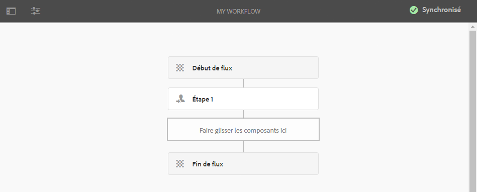

>[!NOTE]
>
>Si vous créez des modèles par programmation (à l’aide d’un module crx), vous pouvez également créer un sous-dossier à l’intérieur de ceux-ci :
>
>`/var/workflow/models`
>
>Par exemple, `/var/workflow/models/prototypes`
>
>Ce dossier peut ensuite être utilisé pour [gérer l’accès aux modèles qu’il contient](/help/sites-administering/workflows-managing.md#create-a-subfolder-in-var-workflow-models-and-apply-the-acl-to-that).

## Modification d’un workflow {#editing-a-workflow}

Vous pouvez modifier un workflow existant pour effectuer les opérations suivantes :

* [Définir des étapes](#addingasteptoamodel-) et leurs [paramètres](#configuring-a-workflow-step)
* Configurer des propriétés de workflow, y compris des [phases](#configuring-workflow-stages-that-show-workflow-progress), [la nature transitoire du workflow](#creatingatransientworkflow-) et/ou [l’utilisation éventuelle de plusieurs ressources](#configuring-a-workflow-for-multi-resource-support)

La modification d’un [**workflow (prêt à l’emploi) par défaut et/ou hérité**](#editing-a-default-or-legacy-workflow-for-the-first-time) comporte une étape supplémentaire pour s’assurer qu’une [copie sécurisée](/help/sites-developing/workflows-best-practices.md#locations-workflow-models) est effectuée avant l’application de vos modifications.

Une fois les mises à jour apportées à votre workflow, vous devez utiliser l’option **Synchronisation** pour **générer un modèle d’exécution**. Pour plus d’informations, voir [Synchronisation de votre workflow](#sync-your-workflow-generate-a-runtime-model).

### Synchronisation de votre workflow – Générer un modèle d’exécution {#sync-your-workflow-generate-a-runtime-model}

L’option **Synchronisation** (à droite dans la barre d’outils de l’éditeur) génère un [modèle d’exécution](/help/sites-developing/workflows.md#runtime-model). Il s’agit du modèle employé lorsqu’un utilisateur lance un flux. Si vous ne **synchronisez** pas vos modifications, elles ne seront pas disponibles au moment de l’exécution.

Lorsque vous (ou un autre utilisateur) apportez des modifications au workflow, vous devez utiliser l’option **Synchronisation** pour générer un modèle d’exécution ; même lorsque des boîtes de dialogue individuelles (pour les étapes, par exemple) comportent leurs propres options d’enregistrement.

Lorsque les modifications sont synchronisées avec le modèle d’exécution (enregistré), la mention **Synchronisé** est affichée à la place.

Certaines étapes s’accompagnent de champs obligatoires et/ou d’une validation intégrée. Si ces conditions ne sont pas remplies, une erreur s’affiche lorsque vous essayez de **synchroniser** le modèle. Par exemple, si aucun participant n’a été défini pour une étape **Participant** :

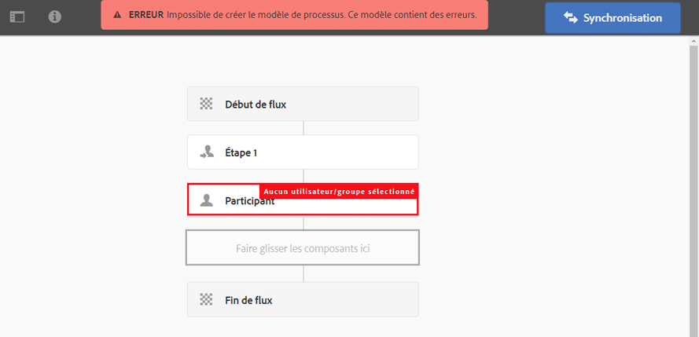

### Première modification d’un workflow par défaut ou hérité {#editing-a-default-or-legacy-workflow-for-the-first-time}

Lorsque vous ouvrez un [modèle par défaut et/ou hérité](/help/sites-developing/workflows.md#workflow-types) en vue de le modifier :

* Le navigateur d’étapes n’est pas disponible (côté gauche).
* Une action **Modifier** est disponible dans la barre d’outils (côté droit).
* Au départ, le modèle et ses propriétés sont présentés en mode lecture seule comme suit :
   * Default workflows are located in `/libs`
   * Legacy workflows are located in `/etc`
Selecting 
**Modifier** :
* take a copy of the workflow into `/conf`
* Le navigateur d’étapes devient accessible.
* Il est possible d’effectuer des modifications.

>[!NOTE]
>
>Pour plus d’informations, voir [Emplacements des modèles de workflow](/help/sites-developing/workflows-best-practices.md#locations-workflow-models).

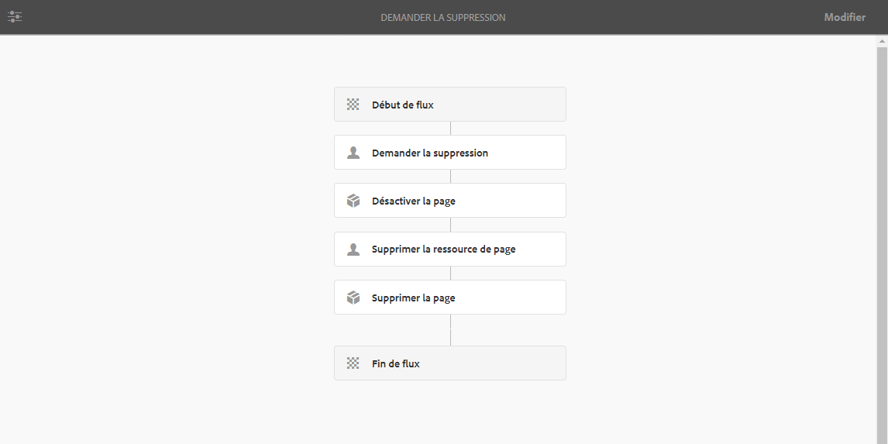

### Ajout d’une étape à un modèle {#adding-a-step-to-a-model}

Vous devez ajouter des étapes à votre modèle pour représenter l’activité à effectuer ; chaque étape exécute une activité bien précise. Une instance AEM standard propose une sélection de composants d’étape.

Lorsque vous modifiez un modèle, les étapes disponibles sont affichées dans les différents groupes du **Navigateur d’étapes**. Par exemple :

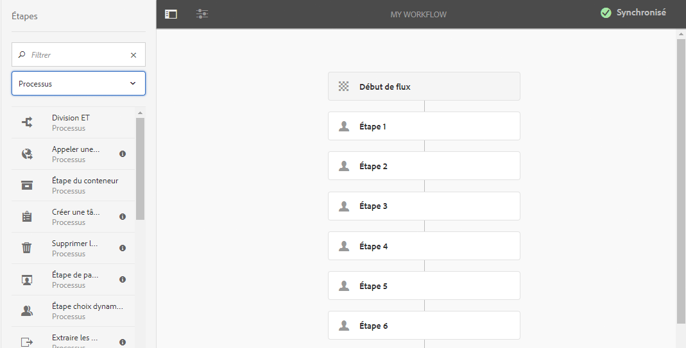

>[!NOTE]
>
>Pour plus d’informations sur les principaux composants d’étape qui sont installés avec AEM, voir [Référence des étapes du workflow](/help/sites-developing/workflows-step-ref.md).

Pour ajouter des étapes à votre modèle de workflow, procédez comme suit :

1. Ouvrez un modèle de workflow existant à modifier. Sélectionnez le modèle souhaité dans la console **Modèle de workflow**, puis cliquez sur **Modifier**.
1. Ouvrez le navigateur d’étapes à l’aide de l’option **Activer/désactiver le panneau latéral** située tout à gauche de la barre d’outils supérieure. Vous pouvez effectuer les opérations suivantes :

   * **Filtrer** des étapes spécifiques.
   * Utiliser le menu déroulant pour limiter la sélection à un groupe d’étapes bien défini.
   * Select the Show Description icon  to show more details about the appropriate step.

   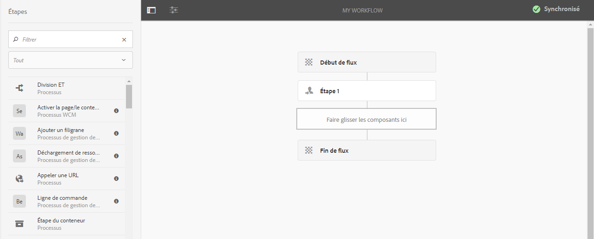

1. Faites glisser la ou les étapes appropriées vers l’emplacement souhaité dans le modèle.

   Par exemple, une **étape de participant**.

   Une fois l’étape ajoutée au flux, vous pouvez [la configurer](#configuring-a-workflow-step).

   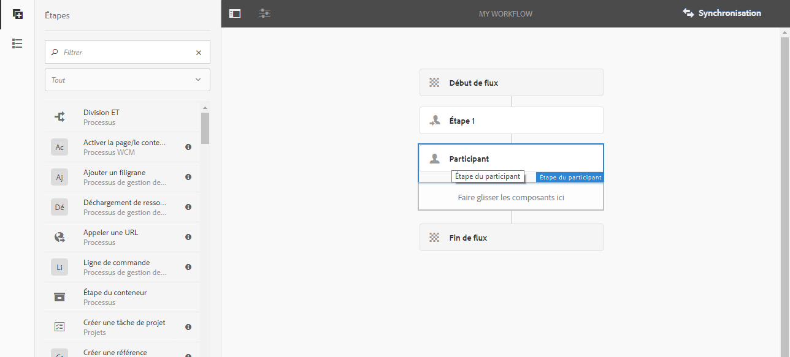

1. Ajoutez autant d’étapes, ou d’autres mises à jour, que nécessaire.

   Les étapes sont exécutées dans l’ordre dans lequel elles apparaissent dans le modèle. Après avoir ajouté des composants d’étape, vous pouvez les faire glisser vers un autre emplacement dans le modèle.

   Vous pouvez également copier, couper, coller, regrouper ou supprimer des étapes existantes, comme avec l’[éditeur de page](/help/sites-authoring/editing-content.md).

   Split steps can also be collapsed/expanded using the toolbar option: 

1. Confirmez les modifications à l’aide de l’option **Synchronisation** (barre d’outils de l’éditeur) afin de générer le modèle d’exécution.

   Pour plus d’informations, voir [Synchronisation de votre workflow](#sync-your-workflow-generate-a-runtime-model).

### Configuration d’une étape de workflow {#configuring-a-workflow-step}

Vous pouvez **configurer** et personnaliser le comportement d’une étape de workflow à l’aide de la boîte de dialogue **Propriétés des étapes**.

1. Pour ouvrir la boîte de dialogue **Propriétés des étapes** pour une étape, deux possibilités s’offrent à vous :

   * Click/tap the* *step in the workflow model and select **Configure** from the component toolbar.

   * Double-cliquez sur l’étape.
   >[!NOTE]
   >
   >Pour plus d’informations sur les principaux composants d’étape qui sont installés avec AEM, voir [Référence des étapes du workflow](/help/sites-developing/workflows-step-ref.md).

1. Configurez les **propriétés des étapes** suivant vos besoins ; les propriétés disponibles dépendent du type d’étape. Plusieurs onglets peuvent également être disponibles. For example, the default **Participant Step**, present in a new workflow as `Step 1`:

   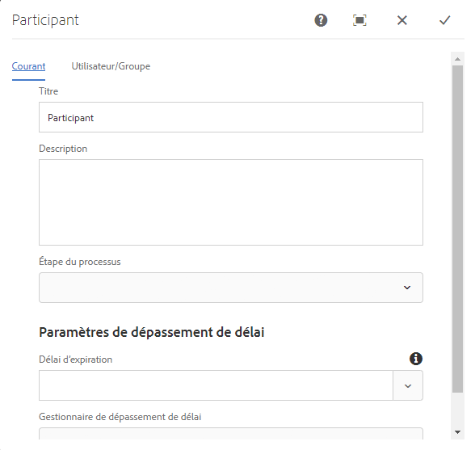

1. Appuyez sur la coche pour confirmer vos mises à jour.
1. Confirmez les modifications à l’aide de l’option **Synchronisation** (barre d’outils de l’éditeur) afin de générer le modèle d’exécution.

   Pour plus d’informations, voir [Synchronisation de votre workflow](#sync-your-workflow-generate-a-runtime-model).

### Création d’un workflow transitoire {#creating-a-transient-workflow}

Vous pouvez créer un modèle de workflow [Transitoire](/help/sites-developing/workflows.md#transient-workflows) lors de la phase de création proprement dite ou en modifiant un modèle existant :

1. Ouvrez le modèle de workflow à [modifier](#editinganexistingworkflow).
1. Sélectionnez **Propriétés du modèle de workflow** dans la barre d’outils.
1. In the dialog activate **Transient Workflow** (or deactivate if required):

   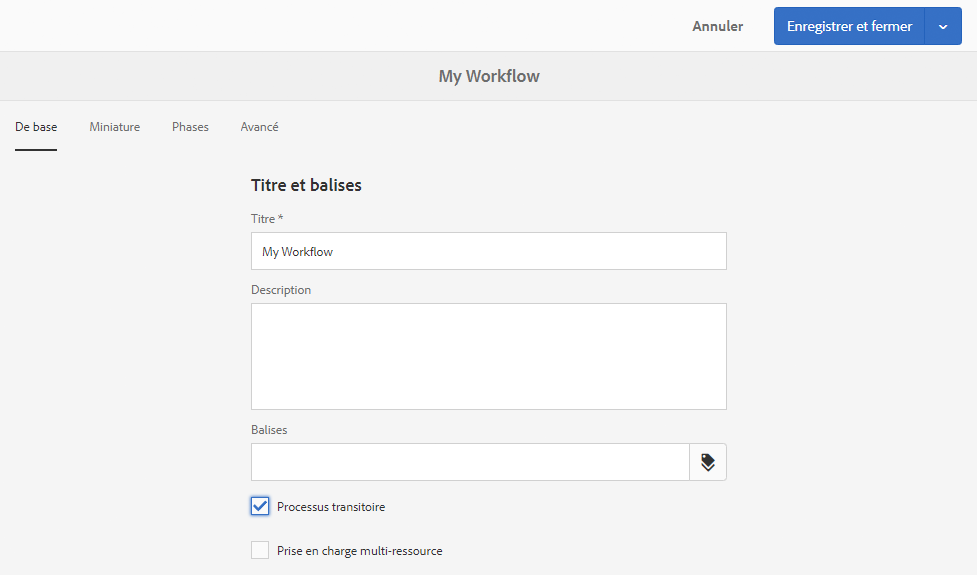

1. Confirmez la modification à l’aide de l’option **Enregistrer et fermer**, suivie de **Synchronisation** (barre d’outils de l’éditeur) pour générer le modèle d’exécution.

   Pour plus d’informations, voir [Synchronisation de votre workflow](#sync-your-workflow-generate-a-runtime-model).

>[!NOTE]
>
>Lorsque vous exécutez un workflow en mode [transitoire](/help/sites-developing/workflows.md#transient-workflows), AEM ne stocke aucun historique de workflow. Par conséquent, [Chronologie](/help/sites-authoring/basic-handling.md#timeline) n’affiche aucune information relative au workflow. [](/help/sites-authoring/basic-handling.md#timeline)

## Mise à disposition des modèles de workflow dans l’interface utilisateur tactile {#classic2touchui}

If a workflow model is present in Classic UI, but missing in the selection popup menu in the **[!UICONTROL Timeline]** rail of Touch UI, then follow the configuration to make it available. Les étapes suivantes illustrent l’utilisation du modèle de processus appelé **[!UICONTROL Demande d’Activation]**.

1. Vérifiez que le modèle n’est pas disponible dans l’interface utilisateur tactile. Access an asset using `/assets.html/content/dam` path. Sélectionnez un fichier. Ouvrez **[!UICONTROL Chronologie]** dans le rail gauche. Cliquez sur Processus **[!UICONTROL de]** Début et vérifiez que le modèle de **[!UICONTROL demande d’Activation]** n’est pas présent dans la liste contextuelle.

1. Accédez à **[!UICONTROL Outils > Général > Balisage]**. Sélectionnez **[!UICONTROL Workflow]**.

1. Select **[!UICONTROL Create > Create Tag]**. Set **[!UICONTROL Title]** as `DAM` and **[!UICONTROL Name]** as `dam`. Sélectionnez **[!UICONTROL Envoyer]**.
   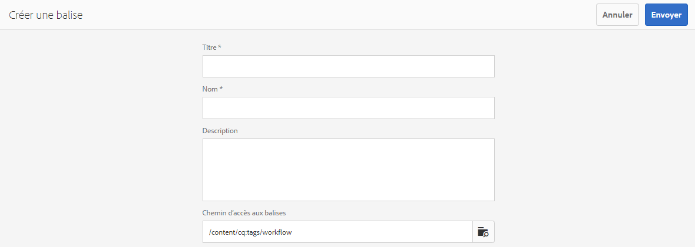

1. Navigate to **[!UICONTROL Tools > Workflow > Models]**. Sélectionnez **[!UICONTROL Demande d’Activation]**, puis **[!UICONTROL Modifier]**.

1. Sélectionnez **[!UICONTROL Modifier]**, ouvrez le menu Informations **[!UICONTROL sur la]** page, puis sélectionnez **[!UICONTROL Ouvrir les propriétés]** et accédez à l’onglet **[!UICONTROL de base (s’il n’est pas déjà ouvert).]**

1. Ajouter `Workflow : DAM` au champ **[!UICONTROL Balises]** . Confirmez la sélection à l’aide de la case à cocher (cochez).

1. Confirmez l’ajout de la balise avec **[!UICONTROL Enregistrer et fermer]**.
   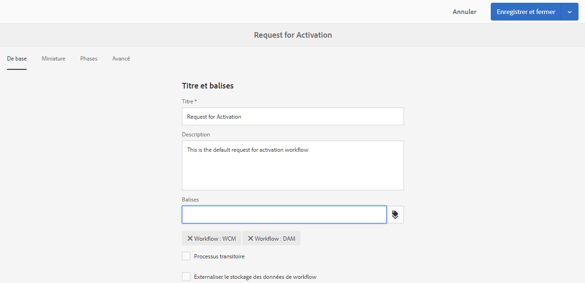

1. Terminez le processus par **[!UICONTROL synchronisation]**. Le processus est désormais disponible dans l’interface utilisateur tactile.

### Configuration d’un workflow pour la prise en charge multi-ressource {#configuring-a-workflow-for-multi-resource-support}

Vous pouvez configurer un modèle de workflow pour la [Prise en charge multi-ressource](/help/sites-developing/workflows.md#multi-resource-support) lors de la création d’un modèle ou en modifiant un modèle existant :

1. Ouvrez le modèle de workflow à [modifier](#editinganexistingworkflow).
1. Sélectionnez **Propriétés du modèle de workflow** dans la barre d’outils.

1. In the dialog activate **Multi Resource Support** (or deactivate if required):

   

1. Confirmez la modification à l’aide de l’option **Enregistrer et fermer**, suivie de **Synchronisation** (barre d’outils de l’éditeur) pour générer le modèle d’exécution.

   Pour plus d’informations, voir [Synchronisation de votre workflow](#sync-your-workflow-generate-a-runtime-model).

### Configuration des phases de workflow (qui affichent la progression du workflow) {#configuring-workflow-stages-that-show-workflow-progress}

Les [phases de workflow](/help/sites-developing/workflows.md#workflow-stages) vous aident à visualiser la progression d’un workflow lors de la gestion de tâches.

>[!CAUTION]
>
>Si les phases de workflow sont définies dans **Propriétés de la page**, mais qu’elles ne sont utilisées pour aucune étape du workflow, aucune progression ne sera affichée dans la barre (quelle que soit l’étape actuelle du workflow).

Les phases qui doivent être disponibles sont définies dans les modèles de workflow ; les modèles de workflow existants peuvent être mis à jour afin d’inclure des définitions de phase. Vous pouvez définir un nombre illimité de phases pour le modèle de workflow.

Pour définir des **Phases** pour votre workflow, procédez comme suit :

1. Ouvrez le modèle de workflow à modifier.
1. Sélectionnez **Propriétés du modèle de workflow** dans la barre d’outils. Ouvrez ensuite l’onglet **Phases**.
1. Ajoutez (et positionnez) les **Phases** requises. Vous pouvez définir un nombre illimité de phases pour le modèle de workflow.

   Par exemple :

   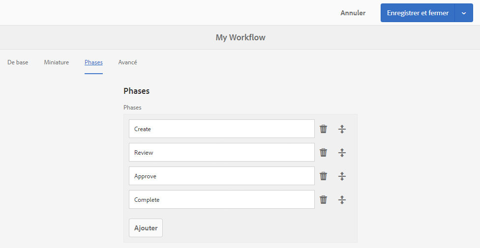

1. Cliquez sur **Enregistrer et fermer** pour enregistrer les propriétés.
1. Affectez une phase à chacune des étapes du modèle de workflow. Par exemple :

   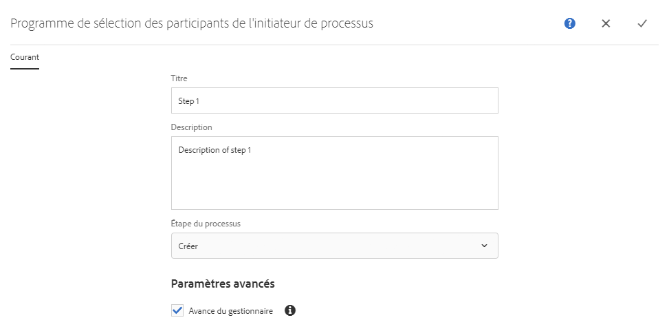

   Une phase peut être affectée à plusieurs étapes. Par exemple :

   | **Étape** | **Évaluation** |
   |---|---|
   | Étape 1 | Créer |
   | Étape 2 | Créer |
   | Étape 3 | Réviser |
   | Étape 4 | Approuver |
   | Étape 5 | Approuver |
   | Étape 6 | Terminer |

1. Confirmez les modifications à l’aide de l’option **Synchronisation** (barre d’outils de l’éditeur) afin de générer le modèle d’exécution.

   Pour plus d’informations, voir [Synchronisation de votre workflow](#sync-your-workflow-generate-a-runtime-model).

## Exportation d’un modèle de workflow dans un module {#exporting-a-workflow-model-in-a-package}

Pour exporter un modèle de workflow dans un module, procédez comme suit :

1. Créez un module à l’aide du [Gestionnaire de modules](/help/sites-administering/package-manager.md#package-manager) :

   1. Accédez au Gestionnaire de modules via **Outils**, **Déploiement**, **Modules**.

   1. Cliquez sur **Créer un package**.
   1. Indiquez le **Nom du package**, ainsi que d’autres détails suivant les besoins.
   1. Cliquez sur **OK**.

1. Cliquez sur **Modifier** dans la barre d’outils de votre nouveau module. 

1. Ouvrez l’onglet **Filtres**.

1. Sélectionnez **Ajouter un filtre** et indiquez le chemin d’accès de la *conception* de votre modèle de workflow :

   `/conf/global/settings/workflow/models/<*your-model-name*>`

   Cliquez sur **Terminé**.

1. Sélectionnez **Ajouter un filtre** et indiquez le chemin d’accès de votre modèle de workflow d’*exécution* :

   `/var/workflow/models/<*your-model-name*>`

   Cliquez sur **Terminé**.

1. Ajoutez des filtres pour tout script personnalisé utilisé par votre modèle.
1. Cliquez sur **Enregistrer** pour confirmer vos définitions de filtre.
1. Sélectionnez **Compilation** dans la barre d’outils de votre définition de module.
1. Sélectionnez **Télécharger** dans la barre d’outils du module.

## Utilisation de workflow pour traiter des envois du formulaire {#using-workflows-to-process-form-submissions}

Vous pouvez configurer un formulaire pour qu’il soit traité par le workflow sélectionné. Lorsque des utilisateurs envoient le formulaire, une instance de workflow est créée avec les données de l’envoi en tant que charge utile.

Pour configurer le workflow afin qu’il soit utilisé avec votre formulaire, procédez comme suit :

1. Créez une page, puis ouvrez-la à des fins d’édition.
1. Ajoutez un composant **Formulaire** à la page.
1. **Configurez** le composant **Début du formulaire** qui s’est affiché dans la page.
1. Use **Start Workflow** to select the desired workflow from those available:

   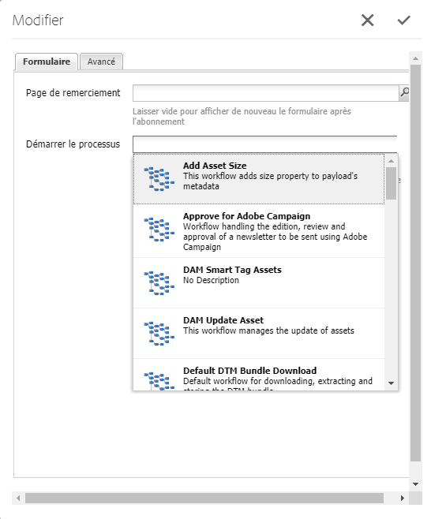

1. Appuyez sur la coche pour confirmer la nouvelle configuration du formulaire.

## Test de workflow {#testing-workflows}

Lorsque vous testez un workflow, il est conseillé d’utiliser divers types de charge utile, y compris des types différents de ceux pour lesquels il a été développé. Par exemple, s’il est prévu que votre workflow traite des ressources, testez-le en définissant une page comme charge utile et assurez-vous qu’il ne génère pas d’erreurs.

Vous pouvez, par exemple, tester votre nouveau workflow comme suit :

1. [Début votre modèle](/help/sites-administering/workflows-starting.md) de processus à partir de la console.
1. Définissez la **Charge utile** et confirmez-la.

1. Prenez les mesures nécessaires au bon déroulement du workflow.
1. Surveillez les fichiers journaux pendant l’exécution du workflow.

Vous pouvez également configurer AEM pour qu’il affiche des messages **DEBUG** dans les fichiers journaux. See [Logging](/help/sites-deploying/configure-logging.md) for further information and when the development is finished, set the **Log Level** back to **Info**.

## Exemples {#examples}

### Exemple : création d’un workflow (simple) pour accepter ou rejeter une demande de publication {#example-creating-a-simple-workflow-to-accept-or-reject-a-request-for-publication}

To illustrate some of the possibilities for creating a workflow, the following example creates a variation of the `Publish Example` workflow.

1. [Créez un modèle de workflow](#creating-a-new-workflow).

   Le nouveau workflow sera composé des éléments suivants :

   * **Début de flux**
   * `Step 1`
   * **Fin de flux**

1. Delete `Step 1` (as it is the wrong step type for this example):

   * Click on the step and select **Delete** from the component toolbar. Confirmez l’action.

1. From the **Workflow** selection of the steps browser, drag a **Participant Step** onto the workflow and position it between **Flow Start** and **Flow End**.
1. Pour ouvrir la boîte de dialogue des propriétés, deux possibilités s’offrent à vous :

   * Click on the participant step and select **Configure** from the component toolbar.
   * Double-cliquez sur l’étape de participant.

1. In the **Common** tab enter `Validate Content` for both the **Title** and **Description**.
1. Ouvrez l’onglet **Utilisateur/Groupe** :

   * Activez **Avertir l’utilisateur par courrier électronique**.
   * Select `Administrator` ( `admin`) for the **User/Group** field.

   >[!NOTE]
   >
   >Pour que les courriers électroniques soient envoyés, [les informations relatives au service de messagerie et au compte utilisateur doivent être configurées](/help/sites-administering/notification.md).

1. Appuyez sur la coche pour confirmer les mises à jour.

   You will be returned to the overview of the workflow model, here the participant step will have been renamed to `Validate Content`.

1. Drag an **Or Split** onto the workflow and position it between `Validate Content` and **Flow End**.
1. Ouvrez la **Division OU** en vue de la configuration.
1. Configurer:

   * **Commun** : spécifiez le nom partagé.
   * **Branche 1** : sélectionnez **Itinéraire par défaut**.

   * **Branche 2** : assurez-vous que l’option **Itinéraire par défaut** n’est pas sélectionnée.

1. Confirmez les mises à jour apportées à la **Division OU**.
1. Faites glisser une **Étape de participant** sur la branche de gauche, ouvrez les propriétés, spécifiez les valeurs suivantes, puis confirmez les modifications :

   * **Titre**: `Reject Publish Request`

   * **Utilisateur/Groupe** : par exemple, `projects-administrators`

   * **Notifier l&#39;utilisateur par courriel**: Activez cette option pour que l’utilisateur soit averti par courrier électronique.

1. Faites glisser une **Étape du processus** sur la branche de droite, ouvrez les propriétés, spécifiez les valeurs suivantes, puis confirmez les modifications :

   * **Titre**: `Publish Page as Requested`

   * **Processus**: sélectionnez `Activate Page`. Ce processus publie la page sélectionnée sur les instances de l’éditeur.

1. Cliquez sur **Synchronisation** (barre d’outils de l’éditeur) afin de générer le modèle d’exécution.

   Pour plus d’informations, voir [Synchronisation de votre workflow](#sync-your-workflow-generate-a-runtime-model).

   Votre nouveau modèle de workflow va se présenter comme suit :

   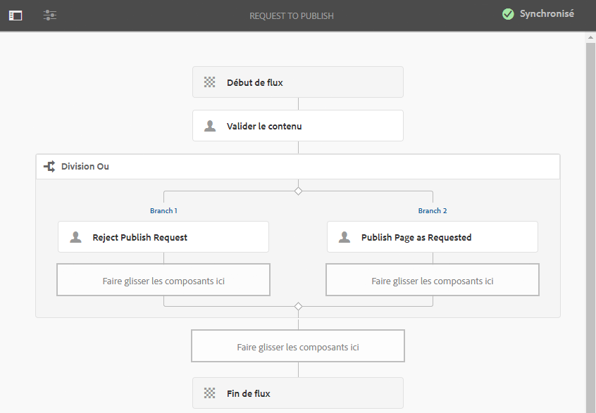

1. Appliquez ce workflow à votre page, de sorte que lorsque l’utilisateur définit l’étape **Valider le contenu** sur **Terminé**, il peut choisir s’il souhaite **Publier la page comme demandé** ou **Rejeter la demande de publication**.

   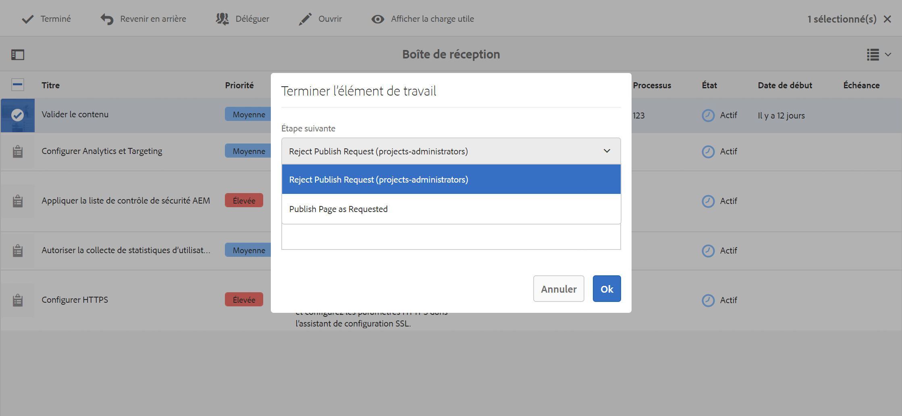

### Exemple : Définition d’une règle pour un script OU fractionné à l’aide d’un script ECMA {#defineruleecmascript}

Les étapes **Division OU** vous permettent d’introduire de nouveaux chemins de traitement dans votre workflow.

Pour définir une règle OU, procédez comme suit :

1. Créez deux scripts et enregistrez-les dans le référentiel, par exemple sous :

   `/apps/myapp/workflow/scripts`

   >[!NOTE]
   >
   >The scripts must have a [function `check()`](#function-check) that returns a boolean.

1. Modifiez le workflow et ajoutez la **Division OU** au modèle.
1. Modifiez les propriétés de la **Branche 1** de la **Division OU** :

   * Define this as the **Default Route** by setting the **Value** to `true`.

   * As **Rule**, set the path to the script. Par exemple :
      `/apps/myapp/workflow/scripts/myscript1.ecma`
   >[!NOTE]
   >
   >Vous pouvez changer l&#39;ordre de la branche si nécessaire.

1. Modifiez les propriétés de la **Branche 2** de la **Division OU**.

   * As **Rule**, set the path to the other script. Par exemple :
      `/apps/myapp/workflow/scripts/myscript2.ecma`

1. Définissez les propriétés des différentes étapes de chaque branche. Make sure the **User/Group** is set.
1. Cliquez sur **Synchronisation** (barre d’outils de l’éditeur) pour conserver vos modifications dans le modèle d’exécution.

   Pour plus d’informations, voir [Synchronisation de votre workflow](#sync-your-workflow-generate-a-runtime-model).

#### Fonction Check() {#function-check}

>[!NOTE]
>
>Voir [Utilisation d’ECMAScript](/help/sites-developing/workflows-customizing-extending.md#using-ecmascript).

The following sample script returns `true` if the node is a `JCR_PATH` located under `/content/we-retail/us/en`:

```
function check() {
    if (workflowData.getPayloadType() == "JCR_PATH") {
      var path = workflowData.getPayload().toString();
      var node = jcrSession.getItem(path);

      if (node.getPath().indexOf("/content/we-retail/us/en") >= 0) {
       return true;
      } else {
       return false;
      }
     } else {
      return false;
     }
}
```

### Exemple : demande d’activation personnalisée {#example-customized-request-for-activation}

Vous pouvez personnaliser n’importe lequel des workflows personnalisés. Pour bénéficier d’un comportement personnalisé, superposez les détails du workflow approprié.

Par exemple, **Demande d’activation**. Ce workflow est utilisé pour publier des pages dans **Sites**. Il se déclenche automatiquement lorsqu’un auteur de contenu ne dispose pas des droits de réplication appropriés. See [Customizing Page Authoring - Customizing the Request for Activation Workflow](/help/sites-developing/customizing-page-authoring-touch.md#customizing-the-request-for-activation-workflow) for further details.
