# Référence sur les étapes de workflow {#workflow-step-reference}

Les modèles de workflow se composent d’une série d’étapes de différents types. En fonction de leur type, ces étapes peuvent être configurées et étendues avec des paramètres et des scripts pour fournir les fonctionnalités et le contrôle dont vous avez besoin.

>[!NOTE]
>
>Cette section présente les étapes de workflow standard.
>
>Pour les étapes spécifiques aux modules, voir également :
>
>* [Référence sur les étapes de workflow d’AEM Forms](/help/forms/using/aem-forms-workflow-step-reference.md)
>* [Traitement des ressources à l’aide des workflows et des gestionnaires de médias](/help/assets/media-handlers.md)

>


## Propriétés des étapes {#step-properties}

Chaque composant d’étape dispose d’une boîte de dialogue **Propriétés des étapes** pour définir et modifier les propriétés requises.

### Propriétés des étapes – onglet Commun  {#step-properties-common-tab}

Une combinaison des propriétés suivantes est disponible pour la plupart des composants d’étape de workflow, sous l’onglet **Commun** de la boîte de dialogue Propriétés :

* **Titre** Titre de l’étape.

* **Description** Description de l’étape.

* **Étape du processus**

   Sélecteur déroulant permettant d’appliquer une [étape](/help/sites-developing/workflows.md#workflow-stages) à l’étape.

* **Délai dépassé**

   Période au terme de laquelle l’étape sera &quot;dépassée de délai&quot;.
Vous pouvez choisir entre : **Désactivé**, **Immédiat**, **1h**, **6h**, **12h**, **24h**.

* **Gestionnaire de dépassement de délai**

   Gestionnaire qui contrôlera le flux de travail lorsque l&#39;étape expire ; par exemple :
   `Auto Advancer`

* **Avance du gestionnaire**

   Sélectionnez cette option pour avancer automatiquement le flux de travail à l’étape suivante après l’exécution. Si cette option n’est pas sélectionnée, le script de mise en œuvre doit gérer l’avancement du workflow.

### Propriétés des étapes – onglet Utilisateur/Groupe {#step-properties-user-group-tab}

Les propriétés suivantes sont disponibles pour de nombreux composants d’étape de workflow, sous l’onglet **Utilisateur/Groupe** de la boîte de dialogue Propriétés :

* **Avertir l’utilisateur par courrier électronique**

   * Vous pouvez avertir le ou les participants en leur envoyant un courrier électronique lorsque le workflow atteint l’étape.
   * Si cette option est activée, un courrier électronique est envoyé à l’utilisateur défini par la propriété **Utilisateur/Groupe** ou à chaque membre du groupe si un groupe est défini.

* **Utilisateur/Groupe**

   * Une boîte de sélection déroulante vous permet de localiser et de sélectionner un utilisateur ou un groupe.
   * Si vous attribuez l’étape à un utilisateur spécifique, seul cet utilisateur peut agir sur l’étape.
   * Si vous affectez l&#39;étape à un groupe entier, lorsque le processus atteint cette étape, tous les utilisateurs de ce groupe auront l&#39;action dans leur **boîte de réception de flux de travail**.
   * Voir [Participation à des workflows](/help/sites-authoring/workflows-participating.md) pour plus d’informations.

## Division ET  {#and-split}

Le **ET fractionné** crée une division dans le flux de travaux, après laquelle les deux branches seront principales. Vous ajoutez des étapes de workflow à chaque branche selon vos besoins. Cette étape vous permet d’ajouter plusieurs chemins de traitement dans le workflow. Par exemple, vous pouvez autoriser l’exécution de certaines étapes de révision en parallèle, ce qui représente un réel gain de temps.

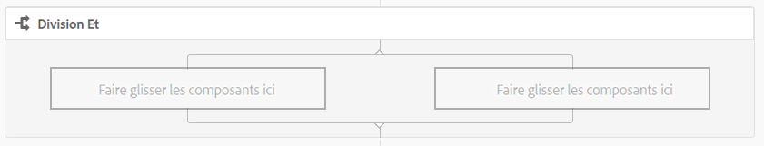

### Division ET – configuration {#and-split-configuration}

Pour configurer la division :

* Modifiez les **propriétés de la division ET** :

   * **Fractionner le nom** : attribuez un nom à des fins d’explication.
   * Sélectionnez le nombre de branches requis : 2, 3, 4 ou 5.

* Ajoutez des étapes de workflow aux branches selon vos besoins.

   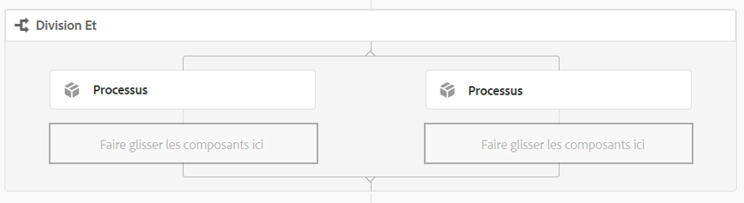

## Étape du conteneur {#container-step}

Une étape du conteneur démarre un autre modèle de workflow qui s’exécute en tant que workflow enfant.

Ce conteneur peut vous permettre de réutiliser des modèles de workflow pour mettre en œuvre des séquences d’étapes courantes. Par exemple, un modèle de workflow de traduction peut être utilisé dans plusieurs workflows de modification.

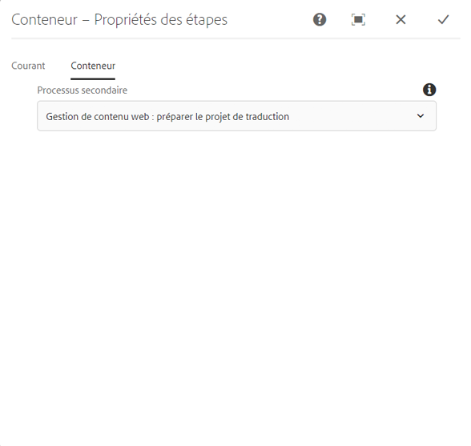

### Étape du conteneur – configuration {#container-step-configuration}

Pour configurer l’étape, modifiez et utilisez les onglets suivants :

* [Courant](#step-properties-common-tab)
* **Conteneur**

   * **Processus secondaire** : sélectionnez le workflow à démarrer.

## Atteindre l’étape  {#goto-step}

L&#39;**Étape d&#39;accès** vous permet de spécifier l&#39;étape suivante à exécuter dans le modèle de processus. Vous pouvez spécifier une définition de règle, un script externe ou un script ECMA comme expression routage pour évaluer l’étape suivante du modèle de flux de travail.

* Si la condition que vous spécifiez est définie sur true, l&#39;**étape d&#39;accès** se termine et le moteur de workflow exécute l&#39;étape spécifiée.
* Si la condition que vous spécifiez ne conserve pas la valeur true, l&#39;**étape d&#39;accès** se termine et la logique de routage normale détermine l&#39;étape suivante à exécuter.

**Atteindre l’étape** vous permet de mettre en œuvre des structures de routage avancées dans vos modèles de workflow. Par exemple, pour implémenter une boucle, l&#39;**étape d&#39;accès** peut être définie pour exécuter une étape précédente du flux de travaux, l&#39;expression d&#39;routage évaluant une condition de boucle.

### Atteindre l’étape – configuration {#goto-step-configuration}

Pour configurer l’étape, modifiez et utilisez les onglets suivants :

* [Courant](#step-properties-common-tab)
* **Processus**

   * **Étape** de la cible : Sélectionnez l’étape à exécuter après avoir évalué la condition de l’expression de routage.
   * **Expression** routage : Sélectionnez Définition de règle, Script externe ou un script ECMA qui détermine si l’étape **de** Cible doit être exécutée.

      * **Définition de règle :** utilisez l’ [éditeur ](/help/forms/using/variable-in-aem-workflows.md#use-expression-editor) d’expression pour définir la règle.
      * **Script externe :** chemin d’accès du script externe.
      * **Script** ECMA : Script qui détermine s’il faut exécuter l’étape **de** transfert.

#### Simulation d’une boucle for {#simulating-a-for-loop}

La simulation d’une boucle for requiert que vous comptiez le nombre d’itérations de boucle qui se sont produites :

* Le compte représente généralement un index des éléments qui ont été suivis d’actions dans le workflow.
* Le nombre est évalué comme critère de sortie de la boucle.

Par exemple, pour mettre en œuvre un workflow qui effectue une action sur plusieurs nœuds JCR, vous pouvez utiliser un compteur de boucles en tant qu’index pour les nœuds. Pour conserver le nombre, stockez une valeur `integer` dans la carte de données de l’instance de flux de travaux. Utilisez le script de l’étape définie dans **Atteindre l’étape** pour incrémenter le nombre, ainsi que pour comparer le nombre au critère de sortie.

```
function check(){
   var count=0;
   var keyname="loopcount"
   try{
      if (workflowData.getMetaDataMap().containsKey(keyname)){
        log.info("goto script: found loopcount key");
        count= parseInt(workflowData.getMetaDataMap().get(keyname))+1;
      }

     workflowData.getMetaDataMap().put(keyname,count);

     }catch(err) {
         log.info(err.message);
         return false;
    }
   if (parseInt(count) <7){
       return true;
   } else {
      return false;
   }
}
```

### Simulation d&#39;une boucle for à l&#39;aide de la définition de règle {#simulateforloop}

Vous pouvez également simuler une boucle for à l’aide de la définition de règle en tant qu’expression d’routage. [Créez un  **** ](/help/forms/using/variable-in-aem-workflows.md#create-a-variable) compte à rebours de type Long. Utilisez **Expression** comme mode de mappage à l’étape **[Définir la variable](/help/sites-developing/using-variables-in-aem-workflows.md#set-a-variable)** pour définir la valeur de la variable **count** sur **count + 1** à chaque exécution de l’étape **Définir la variable**.

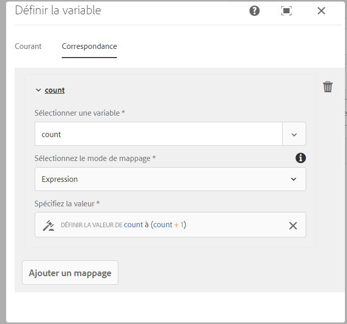

Dans l&#39;**Étape** de l&#39;action Atteindre, utilisez **Définir la variable** comme **Étape de la Cible** et **compter &lt; 5** comme expression de l&#39;routage.

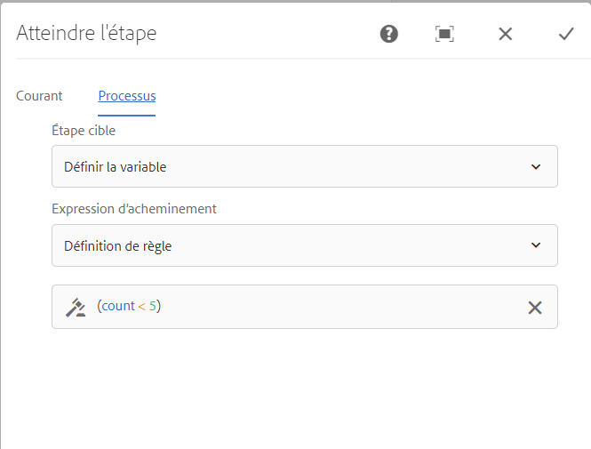

L’étape **Définir la variable** s’exécute à plusieurs reprises en incrémentant la valeur de **count** de 1 pour chaque exécution jusqu’à ce que la valeur atteigne 5.

## Division OU {#or-split}

La **division OU** crée une division dans le workflow, après quoi seule une branche est active. Cette étape vous permet d’ajouter des chemins de traitement conditionnels dans le workflow. Vous ajoutez des étapes de workflow à chaque branche selon vos besoins.

>[!NOTE]
>
>Pour plus d’informations sur la création d’un fractionnement OU, voir : [https://helpx.adobe.com/experience-manager/using/aem64_workflow_servlet.html](https://helpx.adobe.com/experience-manager/using/aem64_workflow_servlet.html)

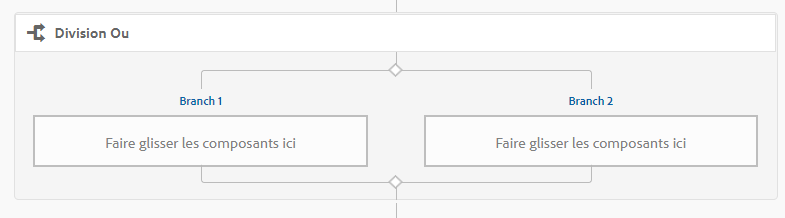

### Division OU – configuration {#or-split-configuration}

Pour configurer la division :

* Modifiez les **propriétés de la division OU** :

   * **Courant**

      * Spécifiez le nom de la division.
   * **Branches (*x)***

      * **Ajouter une branche :** Ajoutez plus de branches à l&#39;étape.
      * **Sélectionnez Expression** de Routage : Sélectionnez l&#39;expression d&#39;routage pour évaluer la branche principale. Les valeurs possibles sont les suivantes : Définition de règle, script externe et script ECMA.
      * **Cliquez pour Ajouter l&#39;Expression** : Ajoutez l&#39;expression pour évaluer la branche principale si vous sélectionnez  **Définition de** règle comme expression de routage.
      * **Chemin** du script : Chemin d’accès à un fichier qui contient le script permettant d’évaluer la branche principale si vous sélectionnez  **Scripts** externes comme expression routage.
      * **Script** : Ajoutez le script dans la zone pour évaluer la branche principale si vous sélectionnez  **ECMA** Scriptas comme expression routage.
      * **Route** par défaut : La branche par défaut est suivie en cas de plusieurs branches. Vous pouvez spécifier uniquement une branche par défaut.

   >[!NOTE]
   >
   >    * Une branche est évaluée à la fois en fonction de l&#39;expression de routage.
   >    * Les branches sont évaluées de haut en bas.
   >    * Le premier script dont la valeur est true est exécuté.
   >    * Si aucune branche n’est évaluée sur true, le flux de travaux n’avance pas.


   >[!NOTE]
   >
   >Voir [Définition d’une règle pour une division OUI](/help/sites-developing/workflows-models.md#defineruleecmascript).

* Ajoutez des étapes de workflow aux branches selon vos besoins.

## Étapes et programmes de sélection des participants  {#participant-steps-and-choosers}

### Étape du participant {#participant-step}

Une **étape du participant** vous permet d’attribuer la possession d’une action particulière. Le workflow s’exécute uniquement lorsque l’utilisateur a manuellement reconnu l’étape. Cela est utile lorsque vous souhaitez que quelqu’un d’autre agisse sur le workflow, par exemple, lors d’une étape de révision.

Bien que ceci ne soit pas directement associé, l’autorisation de l’utilisateur doit être prise en compte lors de l’attribution d’une action ; l’utilisateur doit avoir accès à la page qui est la charge utile du workflow.

#### Étape du participant – configuration  {#participant-step-configuration}

Pour configurer l’étape, modifiez et utilisez les onglets suivants :

* [Courant](#step-properties-common-tab)
* [Utilisateur/Groupe](#step-properties-user-group-tab)

>[!NOTE]
>
>L’initiateur du workflow est toujours averti lorsque :
>
>* le workflow est terminé ;
>* le workflow est interrompu.

>


>[!NOTE]
>
>Certaines propriétés doivent être configurées pour activer les notifications électroniques. Vous pouvez également personnaliser le modèle de courrier électronique ou en ajouter un pour une nouvelle langue. Voir [Configuration de la notification par courrier électronique](/help/sites-administering/notification.md#configuringemailnotification) pour configurer les notifications par courrier électronique dans AEM.

### Étape de participant de la boîte de dialogue {#dialog-participant-step}

Utilisez une **étape de participant de boîte de dialogue** pour collecter des informations provenant de l’utilisateur qui se voit attribuer l’élément de travail. Cette étape est utile pour collecter de petites quantités de données utilisées ultérieurement dans le workflow.

Lors de chaque étape, la boîte de dialogue **Terminer l’élément de travail** contient des champs que vous définissez dans la boîte de dialogue. Les données collectées dans les champs sont stockées dans les nœuds de la charge utile du workflow. Les étapes de workflow suivantes peuvent ensuite lire la valeur à partir du référentiel.

Pour configurer l’étape, vous spécifiez le groupe ou l’utilisateur auquel attribuer l’élément de travail et le chemin de la boîte de dialogue.

#### Étape de participant de boîte de dialogue – configuration  {#dialog-participant-step-configuration}

Pour configurer l’étape, modifiez et utilisez les onglets suivants :

* [Courant](#step-properties-common-tab)
* [Utilisateur/Groupe](#step-properties-user-group-tab)
* **Boîte de dialogue**

   * **Chemin** de la boîte de dialogue : Chemin d’accès au noeud dialog de la  [boîte de dialogue que vous créez](#dialog-participant-step-creating-a-dialog).

#### Étape de participant de boîte de dialogue – création d’une boîte de dialogue {#dialog-participant-step-creating-a-dialog}

Pour créer une boîte de dialogue, vous devez :

* choisir l’endroit où les données résultantes seront [stockées dans la charge utile](#dialog-participant-step-storing-data-in-the-payload) ;
* [définir la boîte de dialogue ; notamment les champs utilisés pour collecter (et enregistrer) les données](#dialog-participant-step-dialog-definition).

#### Étape de participant de boîte de dialogue – stockage des données dans la charge utile {#dialog-participant-step-storing-data-in-the-payload}

Vous pouvez stocker des données de widget dans la charge utile de workflow ou dans les métadonnées d’élément de travail. Le format de la propriété `name` du nœud de widget détermine l’endroit où les données sont stockées.

* **Stockage des données avec la charge utile**

   * Pour stocker les données de widget en tant que propriété de la charge utile du flux de travail, utilisez le format suivant pour la valeur de la propriété name du noeud de widget :
      `./jcr:content/nodename`

   * Les données sont stockées dans la propriété `nodename` du nœud de charge utile. Si le nœud ne contient pas cette propriété, elle est créée.
   * Une fois les données stockées avec la charge utile, les utilisations suivantes de la boîte de dialogue avec la même charge utile remplacent la valeur de la propriété.

* **Stockage des données avec l’élément de travail**

   * Pour stocker les données du widget en tant que propriété des métadonnées de l’élément de travail, utilisez le format suivant pour la valeur de la propriété name :
      `nodename`

   * Les données sont stockées dans la propriété `nodename` de l&#39;élément de travail `metadata`. Les données sont conservées si la boîte de dialogue utilisée ultérieurement présente la même charge utile.

#### Étape de participant de la boîte de dialogue – définition de boîte de dialogue  {#dialog-participant-step-dialog-definition}

1. **Structure de boîte de dialogue**

   Les boîtes de dialogue des étapes de participant de boîte de dialogue sont similaires aux boîtes de dialogue que vous créez pour les composants de création. Elles sont stockées sous :

   `/apps/myapp/workflow/dialogs`

   Les boîtes de dialogue de l’IU standard compatible avec les écrans tactiles présentent la structure de nœud suivante :

   ```xml
   newComponent (cq:Component)
     |- cq:dialog (nt:unstructured)
       |- content
         |- layout
           |- items
             |- column
               |- items
                 |- component0
                 |- component1
                 |- ...
   ```

   >[!NOTE]
   >
   >Pour plus d’informations, voir [Création et configuration d’une boîte de dialogue](/help/sites-developing/developing-components.md#creating-and-configuring-a-dialog).

1. **Propriété Chemin de la boîte de dialogue**

   L&#39;**étape du participant de la boîte de dialogue** possède la propriété **Chemin de la boîte de dialogue** (ainsi que les propriétés d&#39;une [étape du participant](#participant-step)). La valeur de la propriété **Chemin de la boîte de dialogue** est le chemin du nœud `dialog` de la boîte de dialogue.

   Par exemple, la boîte de dialogue se trouve dans un composant nommé `EmailWatch` qui est stocké dans le nœud :

   `/apps/myapp/workflows/dialogs`

   Pour l’IU compatible avec les écrans tactiles, la valeur suivante est utilisée pour la propriété **Chemin de la boîte de dialogue** :

   `/apps/myapp/workflow/dialogs/EmailWatch/cq:dialog`

   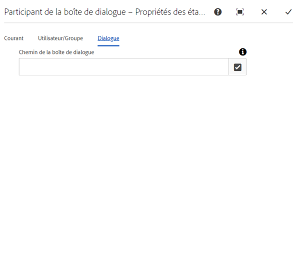

1. **Exemple de définition de boîte de dialogue**

   Le fragment de code XML suivant représente une boîte de dialogue qui stocke une valeur `String` dans le noeud `watchEmail` du contenu de charge utile. Le nœud de titre représente le composant [textfield](https://helpx.adobe.com/experience-manager/6-5/sites/developing/using/reference-materials/granite-ui/api/jcr_root/libs/granite/ui/components/coral/foundation/form/textfield/index.html) :

   ```xml
   jcr:primaryType="nt:unstructured"
       jcr:title="Watcher Email Address Dialog"
       sling:resourceType="cq/gui/components/authoring/dialog">
       <content jcr:primaryType="nt:unstructured"
           sling:resourceType="granite/ui/components/foundation/container">
           <layout jcr:primaryType="nt:unstructured"
               margin="false"
               sling:resourceType="granite/ui/components/foundation/layouts/fixedcolumns"
           />
           <items jcr:primaryType="nt:unstructured">
               <column jcr:primaryType="nt:unstructured"
                   sling:resourceType="granite/ui/components/foundation/container">
                   <items jcr:primaryType="nt:unstructured">
                       <title jcr:primaryType="nt:unstructured"
                           fieldLabel="Notification Email Address"
                           name="./jcr:content/watchEmails"
                           sling:resourceType="granite/ui/components/foundation/form/textfield"
                       />
                   </items>
               </column>
           </items>
       </content>
   </cq:dialog>
   ```

   Dans le cas de l’IU compatible avec les écrans tactiles, cet exemple produit une boîte de dialogue similaire à la suivante :

   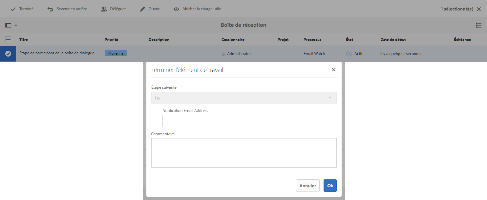

### Étape choix dynamique de participant {#dynamic-participant-step}

Le composant **Étape choix dynamique de participant** est semblable à l’**[étape du participant](#participant-step)** à la différence que le participant est choisi automatiquement à l’exécution.

Pour configurer l’étape, vous sélectionnez un **programme de sélection des participants** qui identifie le participant auquel attribuer l’élément de travail, ainsi qu’une boîte de dialogue.

#### Étape choix dynamique de participant – configuration  {#dynamic-participant-step-configuration}

Pour configurer l’étape, modifiez et utilisez les onglets suivants :

* [Courant](#step-properties-common-tab)
* **Programme de sélection des participants**

   * **Programme de sélection des participants** : nom du [programme de sélection des participants que vous créez](#developingtheparticipantchooser).
   * **Arguments** : tous les arguments requis.
   * **E-mail** : si une notification électronique doit être envoyée à l’utilisateur.

* **Boîte de dialogue**

   * **Chemin de la boîte de dialogue** : chemin du nœud de la [boîte de dialogue que vous créez (avec l’**étape de participant de la boîte de dialogue**)](#dialog-participant-step-creating-a-dialog).

#### Étape choix dynamique de participant – développement du programme de sélection des participants  {#dynamic-participant-step-developing-the-participant-chooser}

Vous créez le programme de sélection des participants. Par conséquent, vous pouvez utiliser toute logique ou tout critère de sélection. Par exemple, le programme de sélection des participants peut sélectionner l’utilisateur (dans un groupe) qui a le moins d’éléments de travail. Vous pouvez créer un nombre illimité de programmes de sélection des participants à utiliser avec des instances différentes du composant **Étape choix dynamique de participant** dans vos modèles de workflow.

Créez un service OSGi ou un ECMAScript qui sélectionne un utilisateur auquel attribuer l’élément de travail.

* **ECMAscript**

   Les scripts doivent inclure une fonction appelée getParticipant qui renvoie un ID utilisateur sous forme de valeur `String`. Stockez vos scripts personnalisés dans, par exemple, le dossier `/apps/myapp/workflow/scripts` ou un sous-dossier.

   Un exemple de script est inclus dans une instance AEM standard :

   `/libs/workflow/scripts/initiator-participant-chooser.ecma`

   >[!CAUTION]
   >
   >Vous ne devez ***rien*** modifier dans le chemin `/libs`.
   >
   >
   >En effet, le contenu de `/libs` est remplacé lors de la prochaine mise à niveau de votre instance (et peut être remplacé lorsque vous appliquez un correctif logiciel ou un pack de fonctionnalités).

   Ce script choisit l’initiateur de workflow en tant que participant :

   ```
   function getParticipant() {
       return workItem.getWorkflow().getInitiator();
   }
   ```

   >[!NOTE]
   >
   >Le composant **Sélecteur de participant de l&#39;initiateur de flux de travail** étend l&#39;**étape du participant dynamique** et utilise ce script comme implémentation de l&#39;étape.

* **Service OSGi**

   Les services doivent implémenter l&#39;interface [com.day.cq.workflow.exec.ParticipantStepChooser](https://helpx.adobe.com/experience-manager/6-5/sites/developing/using/reference-materials/javadoc/com/day/cq/workflow/exec/ParticipantStepChooser.html). L’interface définit les membres suivants :

   * `SERVICE_PROPERTY_LABEL` field : Utilisez ce champ pour spécifier le nom du sélecteur de participants. Le nom s’affiche dans la liste des programmes de sélection des participants disponibles dans les propriétés **Étape choix dynamique de participant**.

   * `getParticipant` méthode : Renvoie l’identifiant principal résolu de manière dynamique sous la forme d’une  `String` valeur.
   >[!CAUTION]
   >
   >La méthode `getParticipant` renvoie l&#39;identifiant principal résolu de manière dynamique. Il peut s’agir d’un ID de groupe ou d’utilisateur.
   >
   >
   >Toutefois, un ID de groupe ne peut être utilisé pour une **étape de participant**, lorsqu’une liste de participants est renvoyée. Pour une **étape du participant dynamique**, une liste vide est renvoyée et ne peut pas être utilisée pour la délégation.

   Pour rendre votre mise en œuvre disponible aux composants **Étape choix dynamique de participant**, ajoutez votre classe Java à un lot OSGi qui exporte le service et déployez le lot vers le serveur AEM.

   >[!NOTE]
   >
   >Le **programme de sélection aléatoire des participants** est un exemple de service qui sélectionne un utilisateur aléatoire ( `com.day.cq.workflow.impl.process.RandomParticipantChooser`). L’exemple de composant d’étape **Programme de sélection aléatoire des participants** étend l’**étape choix dynamique de participant** et utilise ce service comme mise en œuvre de l’étape.

#### Étape choix dynamique de participant – exemple de service Programme de sélection des participants  {#dynamic-participant-step-example-participant-chooser-service}

La classe Java suivante met en œuvre l’interface `ParticipantStepChooser`. La classe renvoie le nom du participant qui a initié le workflow. Le code utilise la même logique que celle utilisée par l’exemple de script (`initiator-participant-chooser.ecma`).

L&#39;annotation `@Property` définit la valeur du champ `SERVICE_PROPERTY_LABEL` sur `Workflow Initiator Participant Chooser`.

```java
package com.adobe.example;

import org.apache.felix.scr.annotations.Component;
import org.apache.felix.scr.annotations.Properties;
import org.apache.felix.scr.annotations.Property;
import org.apache.felix.scr.annotations.Service;
import org.osgi.framework.Constants;
import org.slf4j.Logger;
import org.slf4j.LoggerFactory;

import com.adobe.granite.workflow.WorkflowException;
import com.adobe.granite.workflow.WorkflowSession;
import com.adobe.granite.workflow.exec.ParticipantStepChooser;
import com.adobe.granite.workflow.exec.WorkItem;
import com.adobe.granite.workflow.metadata.MetaDataMap;

@Component
@Service
@Properties({
        @Property(name = Constants.SERVICE_DESCRIPTION, value = "An example implementation of a dynamic participant chooser."),
        @Property(name = ParticipantStepChooser.SERVICE_PROPERTY_LABEL, value = "Workflow Initiator Participant Chooser (service)") })
public class InitiatorParticipantChooser implements ParticipantStepChooser {

 private Logger logger = LoggerFactory.getLogger(this.getClass());

 public String getParticipant(WorkItem arg0, WorkflowSession arg1,
   MetaDataMap arg2) throws WorkflowException {

  String initiator = arg0.getWorkflow().getInitiator();
  logger.info("Assigning Dynamic Participant Step work item to {}",initiator);

  return initiator;
 }
}
```

Dans la boîte de dialogue des propriétés **Étape du participant dynamique**, la liste **Sélecteur de participant** contient l&#39;élément `Workflow Initiator Participant Chooser (script)`, qui représente ce service.

Lorsque le modèle de workflow est démarré, le journal indique l’ID de l’utilisateur qui a initié le workflow et qui se voit attribuer l’élément de travail. Dans cet exemple, l’utilisateur `admin` a commencé le workflow.

`13.09.2015 15:48:53.037 *INFO* [10.176.129.223 [1347565733037] POST /etc/workflow/instances HTTP/1.1] com.adobe.example.InitiatorParticipantChooser Assigning Dynamic Participant Step work item to admin`

### Étape de participant du formulaire {#form-participant-step}

L’**étape de participant du formulaire** présente un formulaire lorsque l’élément de travail est ouvert. Lorsque l’utilisateur remplit et envoie le formulaire, les données de champs sont stockées dans les nœuds de la charge utile du workflow.

Pour configurer l’étape, vous spécifiez le groupe ou l’utilisateur auquel attribuer l’élément de travail et le chemin du formulaire.

>[!CAUTION]
>
>Cette section traite de la [section Formulaires des composants de base pour la création de pages](/help/sites-authoring/default-components-foundation.md#form).

#### Étape de participant du formulaire – configuration {#form-participant-step-configuration}

Pour configurer l’étape, modifiez et utilisez les onglets suivants :

* [Courant](#step-properties-common-tab)
* [Utilisateur/Groupe](#step-properties-user-group-tab)
* **Formulaire**

   * **Chemin** du formulaire : Chemin d’accès au  [formulaire que vous créez](#form-participant-step-creating-the-form).

#### Étape de participant du formulaire – création de formulaire {#form-participant-step-creating-the-form}

Créez un formulaire à utiliser avec une **étape de participant du formulaire** de façon normale. Toutefois, les formulaires d’une étape de participant du formulaire doivent avoir les configurations suivantes :

* Le composant **Début de formulaire** doit avoir la propriété **Type d&#39;action** définie sur `Edit Workflow Controlled Resource(s)`.
* Le composant **Début de formulaire** doit avoir une valeur pour la propriété `Form Identifier`.
* Les composants de formulaire doivent présenter la propriété **Nom de l’élément** définie sur le chemin du nœud dans lequel les données de champs sont stockées. Le chemin d’accès doit localiser un noeud dans le contenu de la charge utile du flux de travail. La valeur utilise le format suivant :

   `./jcr:content/path_to_node`

* Le formulaire doit inclure un composant **Bouton(s) d’envoi de flux de travail**. Vous ne configurez pas de propriétés du composant.

Les exigences de votre workflow indiquent où vous devez stocker les données de champs. Par exemple, les données de champs peuvent être utilisées pour configurer les propriétés du contenu de la page. La valeur suivante d’une propriété **Nom d’élément** stocke les données de champ en tant que valeur de la propriété `redirectTarget` du noeud `jcr:content` :

`./jcr:content/redirectTarget`

Dans l’exemple suivant, les données de champ sont utilisées comme contenu d’un composant **Texte** sur la page de charge utile :

`./jcr:content/par/text_3/text`

Le premier exemple peut être utilisé pour toute page dont le rendu est effectué par le composant `cq:Page`. Le second exemple peut uniquement être utilisé lorsque la page de la charge utile inclut un composant **Texte** possédant l’ID `text_3`.

Le formulaire peut se trouver n’importe où dans le référentiel, toutefois les utilisateurs du workflow doivent être autorisés à lire le formulaire.

### Programme de sélection aléatoire des participants  {#random-participant-chooser}

L’étape **Programme de sélection aléatoire des participants** est un programme de sélection des participants qui attribue l’élément de travail généré à un utilisateur qui est choisi de manière aléatoire à partir d’une liste.

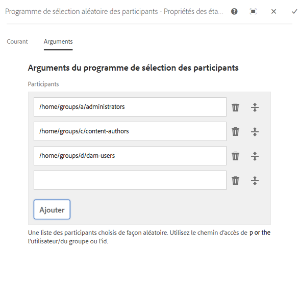

#### Programme de sélection aléatoire des participants – configuration {#random-participant-chooser-configuration}

Pour configurer l’étape, modifiez et utilisez les onglets suivants :

* [Courant](#step-properties-common-tab)
* **Arguments**

   * **Participants** : spécifie la liste des utilisateurs disponibles pour la sélection. Pour ajouter un utilisateur à la liste, cliquez sur **Ajouter un élément**, puis saisissez le chemin du répertoire de base du nœud de l’utilisateur ou l’ID de l’utilisateur. L’ordre des utilisateurs n’affecte pas la probabilité de se voir attribuer un élément de travail.

### Programme de sélection des participants de l’initiateur de workflow  {#workflow-initiator-participant-chooser}

L’étape **Programme de sélection des participants de l’initiateur de workflow** est un programme de sélection des participants qui attribue l’élément de travail généré à l’utilisateur qui a démarré le workflow. Il n’y a aucune propriété à configurer à part les propriétés de l’onglet **Courant**.

#### Programme de sélection des participants de l’initiateur de workflow – configuration  {#workflow-initiator-participant-chooser-configuration}

Pour configurer l’étape, modifiez-la à l’aide des onglets suivants :

* [Courant](#step-properties-common-tab)

## Étape du processus  {#process-step}

Une **étape du processus** exécute un ECMAScript ou appelle un service OSGi pour effectuer un traitement automatique.

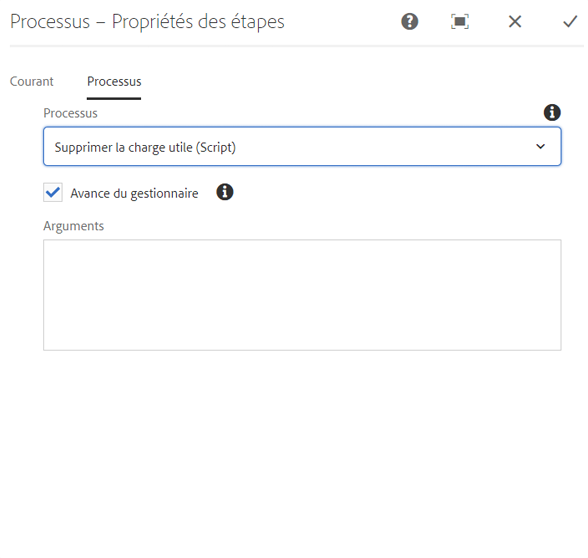

### Étape du processus – configuration {#process-step-configuration}

Pour configurer l’étape, modifiez et utilisez les onglets suivants :

* [Courant](#step-properties-common-tab)
* **Processus**

   * **Processus** : mise en œuvre de processus à exécuter. Utilisez le menu déroulant pour sélectionner le service ECMAScript ou OSGi. Pour obtenir des informations sur :

      * les ECMAScripts et les services OSGi standard, voir [Processus intégrés pour les étapes du processus](/help/sites-developing/workflows-process-ref.md) ;
      * la création d’ECMAScripts pour une étape du processus, voir [Mise en œuvre d’une étape du processus avec un ECMAScript](/help/sites-developing/workflows-customizing-extending.md#using-ecmascript) ;
      * la création de services OSGi pour une étape du processus, voir [Mise en œuvre d’une étape du processus avec une classe Java](/help/sites-developing/workflows-customizing-extending.md#implementing-a-process-step-with-a-java-class).
   * **Avance du gestionnaire** : sélectionnez cette option pour avancer automatiquement le workflow à l’étape suivante après l’exécution. Si cette option n’est pas sélectionnée, le script de mise en œuvre doit gérer l’avancement du workflow.
   * **Arguments** : arguments à transmettre au processus.


## Définir la variable {#set-variable}

L’étape Définir la variable vous permet de définir la valeur d’une variable et de définir l’ordre dans lequel les valeurs sont définies. La variable est définie dans l’ordre dans lequel les mappages de variables sont répertoriés à l’étape Définir la variable.

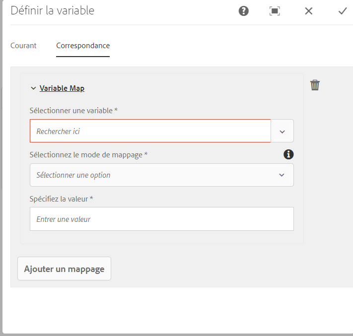

### Set Variable - Configuration {#setvariable}

Pour configurer l’étape, modifiez et utilisez les onglets suivants :

* [Courant](/help/sites-developing/workflows-step-ref.md#step-properties-common-tab)
* **Correspondance**

   * **Sélectionnez Variable :** utilisez cette option pour sélectionner une variable afin de définir sa valeur.
   * **Sélectionnez Mode de mappage :** sélectionnez un mode de mappage pour définir la valeur de la variable. En fonction du type de données de la variable, vous pouvez utiliser les options suivantes pour définir la valeur d’une variable :

      * **Littéral :** utilisez cette option lorsque vous connaissez la valeur exacte à spécifier.
      * **Expression :** utilisez l’option lorsque la valeur à utiliser est calculée en fonction d’une expression. L’expression est créée dans l’éditeur d’expressions fourni.
      * **Notation de point JSON :** utilisez l’option pour récupérer une valeur d’une variable de type JSON ou FDM.
      * **XPATH :** utilisez l’option pour récupérer une valeur d’une variable de type XML.
      * **Relatif à la charge :** utilisez l’option lorsque la valeur à enregistrer dans la variable est disponible à un chemin relatif à la charge utile.
      * **Chemin absolu :** utilisez l’option lorsque la valeur à enregistrer dans la variable est disponible à un chemin absolu.
   * **Spécifier la valeur :** indiquez la valeur à mapper à la variable. La valeur que vous spécifiez dans ce champ dépend du mode de mappage.
   * **Mappage des Ajoutes :** utilisez cette option pour ajouter d’autres mappages afin de définir une valeur pour la variable.
