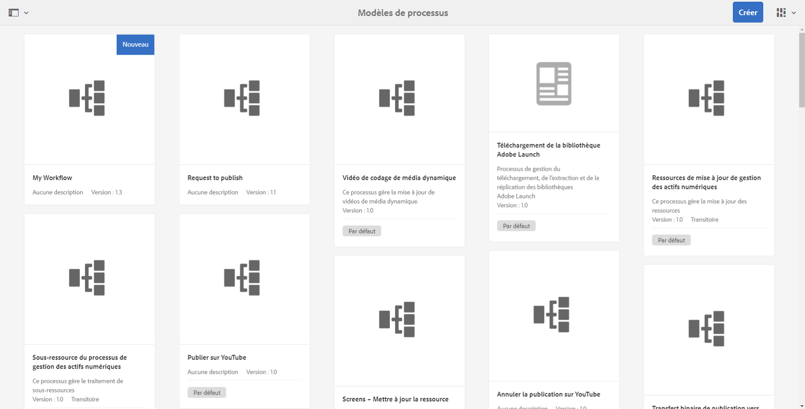

# Développement et extension des workflows{#developing-and-extending-workflows}

AEM fournit plusieurs outils et ressources pour créer des modèles de workflow, développer des étapes de workflow et interagir par programme avec les workflows.

Les workflows permettent d’automatiser les processus de gestion des ressources et de publication de contenu dans votre environnement AEM. Les workflows se composent d’une série d’étapes, chacune d’elles exécutant une tâche discrète. Vous pouvez utiliser la logique et les données d’exécution pour décider quand un processus peut continuer et sélectionner l’étape suivante à partir de l’une des nombreuses étapes possibles.

Par exemple, les processus d’entreprise pour la création et la publication de pages web incluent les tâches d’approbation et de signature par différents participantes et participants. Ces processus peuvent être modélisés à l’aide des workflows AEM et appliqués à un contenu spécifique.

Les principaux aspects sont abordés ci-dessous, tandis que les pages suivantes abordent d’autres détails :

* [Création de modèles de workflow](/help/sites-developing/workflows-models.md)
* [Extension des fonctionnalités de workflows](/help/sites-developing/workflows-customizing-extending.md)
* [Interaction avec les workflows par programmation](/help/sites-developing/workflows-program-interaction.md)
* [Référence sur les étapes de workflow](/help/sites-developing/workflows-step-ref.md)
* [Référence sur les processus de workflow](/help/sites-developing/workflows-process-ref.md)
* [Bonnes pratiques en matière de workflow](/help/sites-developing/workflows-best-practices.md)

>[!NOTE]
>
>Pour obtenir des informations sur :
>
>* la participation aux workflows, consultez [Utilisation des workflows](/help/sites-authoring/workflows.md) ;
>* l’administration des processus et des instances de processus, consultez [Administration des workflows](/help/sites-administering/workflows.md).
>* Pour un article complet de la communauté, consultez [Modification des ressources numériques à l’aide des workflows d’Adobe Experience Manager.](https://experienceleague.adobe.com/docs/experience-manager-65/assets/using/assets-workflow.html?lang=fr)
>* Consultez le [webinaire Demandez aux experts d’AEM relatif aux workflows](https://communities.adobeconnect.com/p5s33iburd54/) (en anglais).
>* les modifications apportées aux emplacements des informations, consultez [Restructuration de référentiel dans AEM 6.5](/help/sites-deploying/repository-restructuring.md) et [Bonnes pratiques relatives aux workflows – Emplacements](/help/sites-developing/workflows-best-practices.md#locations).
>

## Modèle {#model}

Un `WorkflowModel` représente une définition (un modèle) d’un workflow. Il est composé de `WorkflowNodes` et de `WorkflowTransitions`. Les transitions se connectent aux nœuds et définissent le *flux*. Le modèle dispose toujours d’un nœud de début et d’un nœud de fin.

### Modèle d’exécution {#runtime-model}

Les modèles de workflow bénéficient du contrôle de versions. Lorsque vous exécutez une instance de workflow, elle utilise et conserve le modèle d’exécution du workflow tel qu’il est disponible au moment du démarrage du workflow.

Un modèle d’exécution est [généré lorsque la **Synchronisation** est déclenchée dans l’éditeur de modèles de workflow](/help/sites-developing/workflows-models.md#sync-your-workflow-generate-a-runtime-model).

Les modifications apportées au modèle de workflow ou aux modèles d’exécution générés, ou les deux, *après* le démarrage de l’instance spécifique, ne sont pas appliquées à cette instance.

>[!CAUTION]
>
>Les étapes effectuées sont définies par la fonction [modèle d’exécution](/help/sites-developing/workflows-models.md#sync-your-workflow-generate-a-runtime-model), générée au moment où l’action de **Synchronisation** est déclenchée dans l’éditeur de modèles de workflow.
>
>Si le modèle de workflow est modifié après ce moment (sans que la **Synchronisation** soit déclenchée), l’instance d’exécution ne prend pas en compte ces modifications. Seuls les modèles d’exécution générés après la mise à jour prennent en compte les modifications. Les exceptions sont les scripts ECMA sous-jacents, qui ne sont conservés qu’une seule fois afin que ces modifications soient prises en compte.

### Étape {#step}

Chaque étape exécute une tâche discrète. Il existe différents types d’étapes de workflow :

* Participant (utilisateur/groupe) : ces étapes génèrent un élément de travail et l’attribuent à un utilisateur ou une utilisatrice ou à un groupe. Un utilisateur doit terminer l’élément de travail pour progresser dans le workflow.
* Processus (script, appel de méthode Java™) : ces étapes sont exécutées automatiquement par le système. Un script ECMA ou une classe Java™ implémente l’étape. Les services peuvent être développés pour écouter les événements de workflow spéciaux et exécuter des tâches en fonction de la logique commerciale.
* Conteneur (sous-workflow) : ce type d’étape lance un autre modèle de workflow.
* Division/jointure OU : utilisez la logique pour décider quelle étape exécuter ensuite dans le workflow.
* Division/jointure ET : permet l’exécution simultanée de plusieurs étapes.

Toutes les étapes partagent les propriétés suivantes : alertes `Autoadvance` et `Timeout` (scriptable).

### Transition {#transition}

`WorkflowTransition` représente une transition entre deux `WorkflowNodes` d’un `WorkflowModel`.

* Elle définit le lien entre deux étapes consécutives.
* Il est possible d’appliquer des règles.

### Élément de travail {#workitem}

Un `WorkItem` est l’unité qui est transmise par l’intermédiaire d’une instance de `Workflow` d’un `WorkflowModel`. Il contient les `WorkflowData` sur lesquelles agit l’instance, ainsi qu’une référence au `WorkflowNode` qui décrit l’étape de workflow sous-jacente.

* Il est utilisé pour identifier la tâche et placé dans la boîte de réception correspondante.
* Une instance de workflow peut contenir un ou plusieurs `WorkItems` en même temps (selon le modèle de workflow).
* Le `WorkItem` référence l’instance de workflow.
* Dans le référentiel, le `WorkItem` est stocké sous l’instance de workflow.

### Payload {#payload}

Fait référence à la ressource qui doit être avancée par le biais d’un workflow.

L’implémentation de la payload fait référence une ressource dans le référentiel (par chemin, UUID ou URL) ou par un objet Java™ sérialisé. Le référencement d’une ressource dans le référentiel est flexible et, avec Sling, productif. Par exemple, le nœud référencé peut être rendu sous la forme d’un formulaire.

### Cycle de vie {#lifecycle}

Il est créé lors du démarrage d’un nouveau workflow (en choisissant le modèle de workflow correspondant et en définissant la payload) et se termine lorsque le nœud de fin est traité.

Les actions suivantes sont possibles sur une instance de workflow :

* Terminer
* Suspendre
* Reprendre
* Redémarrer

Les instances finalisées et terminées sont archivées.

### Boîte de réception {#inbox}

Chaque compte d’utilisateur possède sa propre boîte de réception de workflow dans laquelle les `WorkItems` attribués sont accessibles.

Les `WorkItems` sont attribués au compte d’utilisateur directement ou au groupe auquel ils appartiennent.

### Types de workflow {#workflow-types}

Il existe différents types de workflows, comme indiqué dans la console Modèles de workflows :

* **Par défaut**

  Ces types sont des workflows prêts à l’emploi inclus dans une instance standard d’AEM.

* Workflows personnalisés (aucun indicateur dans la console)

  Ces workflows ont été créés à partir de zéro ou à partir de workflows prêts à l’emploi auxquels ont été ajoutées des personnalisations.

* **Hérité**

  Il s’agit des workflows créés dans une version antérieure d’AEM. Ces workflows peuvent être conservés pendant une mise à niveau ou exportés sous la forme d’un package de workflow à partir de la version précédente, puis importés dans la nouvelle version.

### Workflows transitoires {#transient-workflows}

Les workflows standard enregistrent les informations d’exécution (historique) lors de leur exécution. Vous pouvez également définir un modèle de workflow comme **transitoire** pour éviter la persistance d’un tel historique. Ce workflow est utilisé pour l’optimisation des performances, car il permet de gagner du temps et des ressources lors de la conservation des informations.

Les workflows transitoires peuvent être utilisés pour tous les workflows qui :

* sont exécutées fréquemment ;
* n’ont pas besoin de l’historique des workflows.

Les workflows transitoires ont été introduits pour charger de nombreuses ressources, où les informations sur les ressources sont importantes, mais pas l’historique d’exécution des workflows.

>[!NOTE]
>
>Voir [Création d’un workflow transitoire](/help/sites-developing/workflows-models.md#creating-a-transient-workflow) pour plus de détails.

>[!CAUTION]
>
>Lorsqu’un modèle de workflow est marqué comme transitoire, il existe quelques scénarios où les informations d’exécution doivent toujours être conservées :
>
>* Le type de payload (vidéo, par exemple) nécessite des étapes externes pour le traitement ; dans ce cas, l’historique d’exécution est nécessaire pour la confirmation du statut.
>* Le workflow entre dans une **Division ET**. Dans ce cas, l’historique d’exécution est nécessaire pour la confirmation du statut.
>* Lorsque le workflow transitoire entre dans une étape de participant, il change de mode, au moment de l’exécution, et passe à non transitoire. Lorsque la tâche est transmise à une personne, l’historique doit être conservé.
>

>[!CAUTION]
>
>Dans un workflow transitoire, vous ne devez pas utiliser une **étape Goto**.
>
>En effet, l’**étape Goto** crée une tâche Sling pour continuer le workflow au point `goto`. Cela va à l’encontre de l’objectif consistant à rendre le workflow transitoire et génère une erreur dans le fichier journal.
>
>Utilisez la **Division OU** pour effectuer des choix au sein d’un workflow transitoire.

>[!NOTE]
>
>Voir [Bonnes pratiques pour Assets](/help/assets/performance-tuning-guidelines.md#transient-workflows) pour plus d’informations sur l’impact des workflows transitoires sur les performances des ressources.

### Prise en charge multi-ressource {#multi-resource-support}

L’activation de la **prise en charge multi-ressource** pour votre modèle de workflow permet de lancer une seule instance de workflow même lorsque vous sélectionnez plusieurs ressources. Chacune est jointe sous la forme d’un package.

Si la **prise en charge multi-ressource** n’est pas activée pour votre modèle de workflow et que plusieurs ressources sont sélectionnées, une instance de workflow individuelle est lancée pour chaque ressource.

>[!NOTE]
>
>Pour plus d’informations, consultez la section [Configuration d’un workflow pour la prise en charge multi-ressource](/help/sites-developing/workflows-models.md#configuring-a-workflow-for-multi-resource-support).

### Phases de workflow {#workflow-stages}

Les phases de workflow permettent de visualiser la progression d’un workflow lors de la gestion des tâches. Elles peuvent être utilisées pour fournir une vue d’ensemble de l’avancement du traitement du workflow. Lorsque le workflow s’exécute, l’utilisateur ou l’utilisatrice peut afficher la progression décrite par **Phase** (contrairement à une étape individuelle).

Les noms des étapes pouvant être spécifiques et techniques, les noms des phases peuvent être définis pour fournir une vue conceptuelle de la progression du workflow.

Par exemple, pour un workflow comportant six étapes et quatre phases :

1. Vous pouvez [configurer les phases de workflow (qui affichent la progression du workflow), puis attribuer la phase appropriée à chaque étape de votre workflow.](/help/sites-developing/workflows-models.md#configuring-workflow-stages-that-show-workflow-progress) :

   * Plusieurs noms de phase peuvent être créés.
   * Un nom de phase individuel est ensuite attribué à chaque étape (un nom de phase peut être attribué à une ou plusieurs étapes).

   | **Nom de l’étape** | **Phase (affectée à l’étape)** |
   |---|---|
   | Étape 1 | Création |
   | Étape 2 | Création |
   | Étape 3 | Révision |
   | Étape 4 | Approuver |
   | Étape 5 | Terminé |
   | Étape 6 | Terminé |

1. Lorsque le workflow est exécuté, l’utilisateur peut afficher la progression en fonction des noms des phases (au lieu des noms des étapes). La progression du workflow est affichée dans [l’onglet Informations sur le workflow de la fenêtre Détails de la tâche de l’élément de workflow](/help/sites-authoring/workflows-participating.md#opening-a-workflow-item-to-view-details-and-take-actions) répertorié dans la [boîte de réception](/help/sites-authoring/inbox.md).

### Workflows et formulaires {#workflows-and-forms}

En règle générale, les workflows sont utilisés pour traiter les envois de formulaire dans AEM. Cela peut être effectué avec les [composants de formulaires des composants principaux](https://experienceleague.adobe.com/docs/experience-manager-core-components/using/wcm-components/forms/form-container.html?lang=fr) disponibles dans une instance standard d’AEM, ou avec la [solution AEM Forms](/help/forms/using/aem-forms-workflow.md).

Lors de la création d’un formulaire, l’envoi du formulaire peut facilement être associé à un modèle de workflow. Par exemple, pour stocker le contenu à un emplacement particulier du référentiel ou pour informer un utilisateur ou une utilisatrice de l’envoi du formulaire et de son contenu.

### Workflows et traduction {#workflows-and-translation}

Les workflows font également partie intégrante du processus de [traduction](/help/sites-administering/translation.md).
